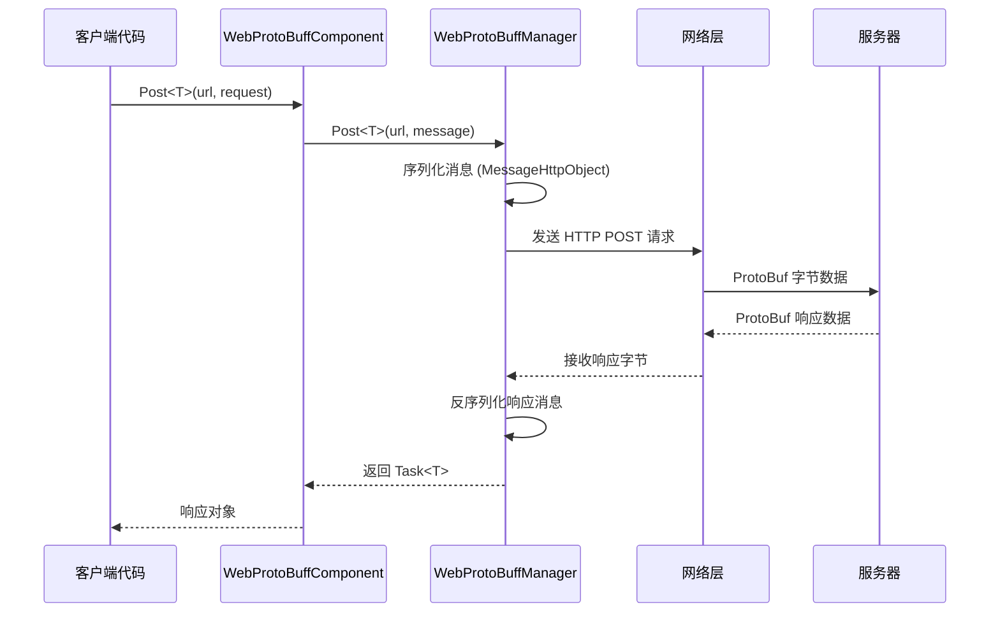

# 基本例

本节提供 Web ProtoBuff プラグイン的基本使用例，帮助開発者快速上手并理解コア用法。

## 概要

Web ProtoBuff コンポーネント是基于 GameFrameX フレームワーク的网络请求モジュール，专门用于処理基于 Protocol Buffer フォーマット的 HTTP POST 请求。该コンポーネント提供以下コア機能：

- **ProtoBuf シリアライズ**：自动将メッセージ对象シリアライズ为字节数据进行发送
- **异步请求**：基于 Task<T> 的异步 API，サポート async/await モード
- **跨プラットフォームサポート**：兼容 Unity WebGL 及原生プラットフォーム
- **超时控制**：可設定请求超时时间

## 快速フロー

以下フロー图表示了使用 WebProtoBuffComponent 发送请求的基本フロー：



## メッセージ定義例

在使用 Web ProtoBuff 之前，〜する必要があります定義请求和响应的 ProtoBuf メッセージタイプ。

### 请求メッセージ定義

```csharp
using ProtoBuf;
using GameFrameX.Network.Runtime;

[ProtoContract]
public class LoginRequest : MessageObject
{
    [ProtoMember(1)]
    public string Username { get; set; }
    
    [ProtoMember(2)]
    public string Password { get; set; }
}
```
> Source: [README.md](https://github.com/GameFrameX/com.gameframex.unity.web.protobuff/blob/main/README.md#L65-L77)

### 响应メッセージ定義

```csharp
using ProtoBuf;
using GameFrameX.Network.Runtime;

[ProtoContract]
public class LoginResponse : MessageObject, IResponseMessage
{
    [ProtoMember(1)]
    public bool Success { get; set; }
    
    [ProtoMember(2)]
    public string Token { get; set; }
}
```
> Source: [README.md](https://github.com/GameFrameX/com.gameframex.unity.web.protobuff/blob/main/README.md#L79-L88)

**关键要点：**
- 使用 `[ProtoContract]` プロパティ标记类为 ProtoBuf 契约
- 使用 `[ProtoMember(N)]` プロパティ标记〜する必要がありますシリアライズ的プロパティ
- 请求メッセージ只需継承 `MessageObject`
- 响应メッセージ〜する必要があります継承 `MessageObject` 并実装 `IResponseMessage` インターフェース

## 发送请求例

### 完全な使用例

以下是在 Unity 脚本中使用 WebProtoBuffComponent 发送登录请求的完全な例：

```csharp
using UnityEngine;
using GameFrameX.Web.ProtoBuff.Runtime;

public class LoginController : MonoBehaviour
{
    public WebProtoBuffComponent WebComponent;

    private async void Start()
    {
        var request = new LoginRequest 
        { 
            Username = "user", 
            Password = "password" 
        };
        
        string url = "http://api.example.com/login";

        try
        {
            // 发送请求并等待结果
            LoginResponse response = await WebComponent.Post<LoginResponse>(url, request);
            
            if (response != null)
            {
                Debug.Log($"Login Result: {response.Success}, Token: {response.Token}");
            }
        }
        catch (System.Exception e)
        {
            Debug.LogError($"Request Failed: {e.Message}");
        }
    }
}
```
> Source: [README.md](https://github.com/GameFrameX/com.gameframex.unity.web.protobuff/blob/main/README.md#L94-L128)

### 取得コンポーネントインスタンス

在 Unity シーン中，WebProtoBuffComponent 作为游戏フレームワークコンポーネント使用。通常通过以下方法取得：

```csharp
// 方式1：通过场景中的组件引用（需要在 Inspector 中配置）
public WebProtoBuffComponent webProtoBuffComponent;

// 方式2：通过框架获取
var webComponent = UnityGameFramework.Runtime.GameEntry.GetComponent<WebProtoBuffComponent>();
```

### 超时設定

〜できます通过コンポーネント的 Timeout プロパティ設定请求超时时间（单位：秒）：

```csharp
// 设置超时为 10 秒
webProtoBuffComponent.Timeout = 10f;
```
> Source: [WebProtoBuffComponent.cs](https://github.com/GameFrameX/com.gameframex.unity.web.protobuff/blob/main/Runtime/Web/WebProtoBuffComponent.cs#L67-L71)

## 启用機能

### コンパイル宏定義

使用 ProtoBuff 网络機能〜する必要があります在 Unity 中启用コンパイル宏。打开 **Edit > Project Settings > Player**，在 **Scripting Define Symbols** 中追加：

```
ENABLE_GAME_FRAME_X_WEB_PROTOBUF_NETWORK
```

> **注意**：此宏定義是可选的。もし未追加宏定義，Post<T> メソッド将被禁用，コンポーネント仅保留基本機能。

该宏定義也〜できます通过アセンブリ定義ファイル自动定義，当プロジェクト依赖 `com.gameframex.unity.network` パッケージ时会自动启用。

## 数据フォーマット説明

### 请求数据フォーマット

发送的请求数据采用 `MessageHttpObject` パッケージ装フォーマット：

```csharp
MessageHttpObject messageHttpObject = new MessageHttpObject
{
    Id = messageId,           // 消息类型标识
    UniqueId = uniqueId,      // 唯一请求标识
    Body = serializedBody    // 序列化后的消息体
};
```
> Source: [WebProtoBuffManager.ProtoBuf.cs](https://github.com/GameFrameX/com.gameframex.unity.web.protobuff/blob/main/Runtime/Web/WebProtoBuffManager.ProtoBuf.cs#L214-L221)

### HTTP 请求头

- **Content-Type**: `application/x-protobuf`
- **请求メソッド**: POST
- **超时控制**: 通过 RequestTimeout プロパティ設定

## エラー処理

在实际应用中，应当処理以下常见エラー：

```csharp
try
{
    var response = await WebComponent.Post<LoginResponse>(url, request);
    
    if (response == null)
    {
        Debug.LogWarning("Response is null - server may be unreachable");
        return;
    }
    
    // 处理业务逻辑
}
catch (TimeoutException e)
{
    Debug.LogError($"Request timeout: {e.Message}");
}
catch (WebException e)
{
    Debug.LogError($"Network error: {e.Status} - {e.Message}");
}
catch (System.Exception e)
{
    Debug.LogError($"Unexpected error: {e.Message}");
}
```

## デバッグログ

プラグインサポート发送和受信メッセージ的デバッグログ，便于开发デバッグ：

- **发送ログ**：启用 `ENABLE_GAMEFRAMEX_WEB_SEND_LOG` 宏定義
- **受信ログ**：启用 `ENABLE_GAMEFRAMEX_WEB_RECEIVE_LOG` 宏定義

ログ输出フォーマット例：
```
发送消息 ID:[1001,uuid123,LoginRequest] 消息内容:{...}
接收消息 ID:[1001,uuid123,LoginResponse] 消息内容:{...}
```
> Source: [WebProtoBuffManager.ProtoBuf.cs](https://github.com/GameFrameX/com.gameframex.unity.web.protobuff/blob/main/Runtime/Web/WebProtoBuffManager.ProtoBuf.cs#L227-L241)

## 関連リンク

- [快速入门](../3-getting-started.quick-start) - 理解する快速开始ステップ
- [コンポーネントアーキテクチャ](../4-core-concepts.architecture) - 深入理解するアーキテクチャ設計
- [メッセージ定義](../4-core-concepts.message-definition) - ProtoBuf メッセージ详解
- [API リファレンス - WebProtoBuffComponent](../5-api-reference.webprotobuffcomponent) - 完全な API ドキュメント
- [コンパイル宏定義](../6-configuration.compile-defines) - 設定コンパイルオプション
