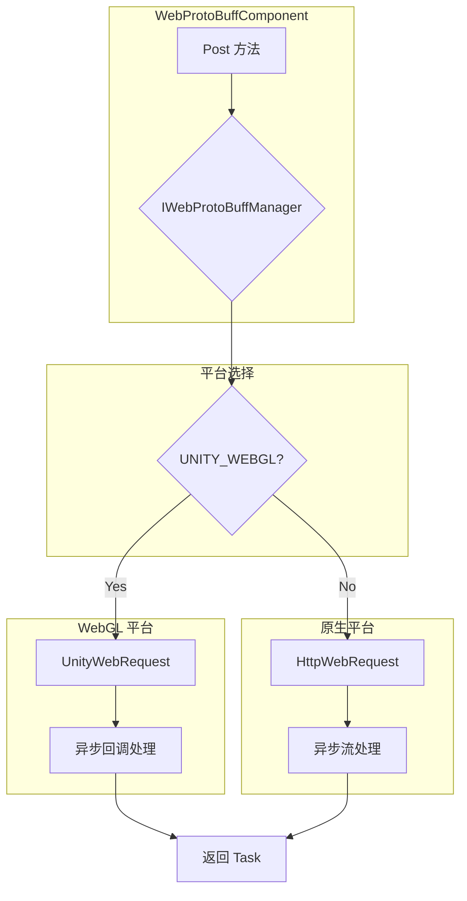

# プラットフォーム説明

このドキュメント詳細介绍 GameFrameX Web ProtoBuff コンポーネント在不同 Unity プラットフォーム上的サポート情况、プラットフォーム特定的実装差异および各プラットフォーム的設定要求。

## 概要

GameFrameX Web ProtoBuff コンポーネントは跨プラットフォーム的 HTTP 网络请求コンポーネント，专门用于処理基于 Protocol Buffer フォーマット的网络通信。该コンポーネント設計为在多个 Unity プラットフォーム上无缝运行，根据目标プラットフォーム自动选择最合适的网络请求実装方法。

コンポーネント的コア設計理念是提供統一された的 API インターフェース，同時に利用各プラットフォーム原生的网络能力，以获得最佳的性能和兼容性。

## サポート的プラットフォーム

该コンポーネントサポート以下 Unity プラットフォーム：

| プラットフォーム | サポートステータス | 网络実装方法 | 説明 |
|------|---------|-------------|------|
| **WebGL** | ✅ 完全サポート | UnityWebRequest | 浏览器環境专用実装 |
| **Windows** | ✅ 完全サポート | HttpWebRequest | .NET 標準 HTTP 客户端 |
| **macOS** | ✅ 完全サポート | HttpWebRequest | .NET 標準 HTTP 客户端 |
| **Linux** | ✅ 完全サポート | HttpWebRequest | .NET 標準 HTTP 客户端 |
| **Android** | ✅ 完全サポート | HttpWebRequest | .NET 標準 HTTP 客户端 |
| **iOS** | ✅ 完全サポート | HttpWebRequest | .NET 標準 HTTP 客户端 |
| **Switch** | ✅ 完全サポート | HttpWebRequest | .NET 標準 HTTP 客户端 |
| **PS4/PS5** | ✅ 完全サポート | HttpWebRequest | .NET 標準 HTTP 客户端 |
| **Xbox** | ✅ 完全サポート | HttpWebRequest | .NET 標準 HTTP 客户端 |

## プラットフォームアーキテクチャ

该コンポーネント采用条件コンパイル的方法実装跨プラットフォームサポート，通过检测 `UNITY_WEBGL` 宏来区分 WebGL プラットフォーム和其他プラットフォーム。



### プラットフォーム选择逻辑説明

コンポーネント在ランタイム通过コンパイル期的条件コンパイル指令选择合适的网络実装：

- **WebGL プラットフォーム**：使用 `UnityEngine.Networking.UnityWebRequest`，这是 Unity 官方提供的 WebGL 環境网络请求 API
- **其他所有プラットフォーム**：使用 `System.Net.HttpWebRequest`，这是 .NET 標準的 HTTP 请求実装

## プラットフォーム特定実装差异

### WebGL プラットフォーム実装

WebGL プラットフォーム的実装位于 `Runtime/Web/WebProtoBuffManager.ProtoBuf.cs` ファイル的第 87-116 行。该実装使用 Unity 提供的 `UnityWebRequest` 类，这是 WebGL プラットフォーム上唯一可用的 HTTP 请求方法。

```csharp
#if UNITY_WEBGL
    UnityEngine.Networking.UnityWebRequest unityWebRequest;
    if (webData.IsGet)
    {
        unityWebRequest = UnityEngine.Networking.UnityWebRequest.Get(webData.URL);
    }
    else
    {
        unityWebRequest = UnityEngine.Networking.UnityWebRequest.Post(webData.URL, string.Empty);
    }

    unityWebRequest.timeout = (int)RequestTimeout.TotalSeconds;
    {
        unityWebRequest.SetRequestHeader("Content-Type", ProtoBufContentType);
        byte[] postData = webData.SendData;
        unityWebRequest.uploadHandler = new UnityEngine.Networking.UploadHandlerRaw(postData);
    }

    var asyncOperation = unityWebRequest.SendWebRequest();
    asyncOperation.completed += (asyncOperation2) =>
    {
        m_SendingProtoBufList.Remove(webData);
        if (unityWebRequest.isNetworkError || unityWebRequest.isHttpError || unityWebRequest.error != null)
        {
            webData.Task.TrySetException(new Exception(unityWebRequest.error));
            return;
        }

        webData.Task.SetResult(new WebBufferResult(webData.UserData, unityWebRequest.downloadHandler.data));
    };
#endif
```
> Source: [WebProtoBuffManager.ProtoBuf.cs](https://github.com/GameFrameX/com.gameframex.unity.web.protobuff/blob/main/Runtime/Web/WebProtoBuffManager.ProtoBuf.cs#L87-L116)

**WebGL 実装特点：**
- 使用コールバック函数処理异步完成イベント
- 通过 `SendWebRequest()` メソッド发送请求
- エラー检测使用 `isNetworkError`、`isHttpError` 和 `error` プロパティ
- 内容タイプ設定为 `application/x-protobuf`

### 原生プラットフォーム実装

原生プラットフォーム的実装位于同一ファイル的第 117-165 行，使用 .NET 的 `HttpWebRequest` 类：

```csharp
#else
    try
    {
        HttpWebRequest request = WebRequest.CreateHttp(webData.URL);
        request.Method = webData.IsGet ? WebRequestMethods.Http.Get : WebRequestMethods.Http.Post;
        request.Timeout = (int)RequestTimeout.TotalMilliseconds;
        request.ContentType = ProtoBufContentType;
        byte[] postData = webData.SendData;
        request.ContentLength = postData.Length;
        using (Stream requestStream = request.GetRequestStream())
        {
            await requestStream.WriteAsync(postData, 0, postData.Length);
        }

        using (HttpWebResponse response = (HttpWebResponse)await request.GetResponseAsync())
        {
            using (Stream responseStream = response.GetResponseStream())
            {
                m_MemoryStream.SetLength(response.ContentLength);
                m_MemoryStream.Position = 0;
                await responseStream.CopyToAsync(m_MemoryStream);
                webData.Task.SetResult(new WebBufferResult(webData.UserData, m_MemoryStream.ToArray()));
            }
        }
    }
    catch (WebException e)
    {
        if (e.Status == WebExceptionStatus.Timeout)
        {
            webData.Task.SetException(new TimeoutException(e.Message));
            return;
        }
        webData.Task.SetException(e);
    }
    // ... 更多异常处理
#endif
```
> Source: [WebProtoBuffManager.ProtoBuf.cs](https://github.com/GameFrameX/com.gameframex.unity.web.protobuff/blob/main/Runtime/Web/WebProtoBuffManager.ProtoBuf.cs#L117-L165)

**原生プラットフォーム実装特点：**
- 使用 async/await モード処理异步操作
- サポート完全な的 .NET 例外処理机制
- パッケージ含超时例外（TimeoutException）的专门処理
- 使用内存流処理响应数据

## 内容タイプ

无论在哪个プラットフォーム上运行，コンポーネント都使用相同的内容タイプ `application/x-protobuf`：

```csharp
private const string ProtoBufContentType = "application/x-protobuf";
```
> Source: [WebProtoBuffManager.ProtoBuf.cs](https://github.com/GameFrameX/com.gameframex.unity.web.protobuff/blob/main/Runtime/Web/WebProtoBuffManager.ProtoBuf.cs#L32)

这个内容タイプ是 Protocol Buffer 標準的 HTTP 传输タイプ，確認してください服务器能够正确识别和処理 ProtoBuf フォーマット的请求和响应数据。

## コンパイル宏定義

コンポーネント通过 `versionDefines` 自动管理コンパイル宏，无需手动設定：

```json
{
  "versionDefines": [
    {
      "name": "com.gameframex.unity.network",
      "expression": "",
      "define": "ENABLE_GAME_FRAME_X_WEB_PROTOBUF_NETWORK"
    }
  ]
}
```
> Source: [GameFrameX.Web.ProtoBuff.Runtime.asmdef](https://github.com/GameFrameX/com.gameframex.unity.web.protobuff/blob/main/Runtime/GameFrameX.Web.ProtoBuff.Runtime.asmdef#L17-L23)

当プロジェクトインストール `com.gameframex.unity.network` パッケージ后，系统会自动定義 `ENABLE_GAME_FRAME_X_WEB_PROTOBUF_NETWORK` 宏，从而启用 ProtoBuff 网络機能。

## プラットフォーム特定注意事项

### WebGL プラットフォーム

1. **浏览器限制**：WebGL 运行在浏览器環境中，受到浏览器的同源策略 (Same-Origin Policy) 限制
2. **异步モード**：WebGL 不サポート多线程，コンポーネント使用コールバック函数モード処理异步完成イベント
3. **超时行为**：UnityWebRequest 的超时設定在 WebGL プラットフォーム上〜の可能性があります受到浏览器実装的限制
4. **HTTPS サポート**：WebGL 完全サポート HTTPS 协议，但〜する必要があります服务器設定有效的 SSL 证书

### 原生プラットフォーム

1. **线程安全**：原生プラットフォームサポート完全な的多线程操作，使用 async/await モード
2. **超时処理**：サポート更精确的超时控制，含みます连接超时和读取超时
3. **代理サポート**：サポート通过系统代理进行网络请求
4. **SSL/TLS**：サポート完全な的 SSL/TLS 协议栈

## 依赖项

各プラットフォーム共享以下コア依赖：

| 依赖パッケージ | バージョン | 説明 |
|--------|------|------|
| com.gameframex.unity | 1.1.1 | コアフレームワーク |
| com.gameframex.unity.web | 1.0.0 | Web 基本コンポーネント |
| com.gameframex.unity.network | 1.0.0 | 网络モジュール（启用 ProtoBuff 機能） |
| com.gameframex.unity.google.protobuf | 1.0.0 | Google Protobuf シリアライズ库 |

> 詳細依赖情報请参见 [依赖项](./2-installation.dependencies) ドキュメント。

## プラットフォーム选择お勧め

根据プロジェクト需求选择合适的目标プラットフォーム：

| シーン | 推奨プラットフォーム | 理由 |
|------|---------|------|
| **Web Web ゲーム** | WebGL | 直接在浏览器中运行，无需プラグイン |
| **移动端游戏** | Android/iOS | 性能最优，完全な的网络機能 |
| **PC 客户端** | Windows/macOS/Linux | 开发デバッグ方便 |
| **主机游戏** | PS4/PS5/Xbox/Switch | 商业主机プラットフォームサポート |

## 関連リンク

- [コンポーネント設定](./6-configuration.component-config)
- [コンパイル宏定義](./6-configuration.compile-defines)
- [快速入门](./3-getting-started.quick-start)
- [API リファレンス - WebProtoBuffComponent](./5-api-reference.webprotobuffcomponent)
- [API リファレンス - IWebProtoBuffManager](./5-api-reference.iwebprotobuffmanager)
- [GitHub リポジトリ](https://github.com/GameFrameX/com.gameframex.unity.web.protobuff.git)
