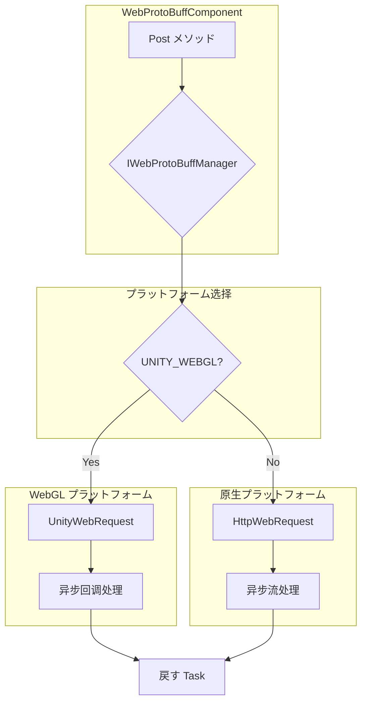

# プラットフォーム

ドキュメント GameFrameX Web ProtoBuff コンポーネントに Unity プラットフォームのサポート、プラットフォームのプラットフォームの。

## 

GameFrameX Web ProtoBuff コンポーネントはプラットフォームの HTTP ネットワークリクエストコンポーネント，ににづく Protocol Buffer のネットワーク。コンポーネントに Unity プラットフォーム，プラットフォームのネットワークリクエスト。

コンポーネントのコアはの API インターフェース，プラットフォームのネットワーク，のと。

## サポートのプラットフォーム

コンポーネントサポート Unity プラットフォーム：

| プラットフォーム | サポート | ネットワーク |  |
|------|---------|-------------|------|
| **WebGL** | ✅ サポート | UnityWebRequest |  |
| **Windows** | ✅ サポート | HttpWebRequest | .NET  HTTP  |
| **macOS** | ✅ サポート | HttpWebRequest | .NET  HTTP  |
| **Linux** | ✅ サポート | HttpWebRequest | .NET  HTTP  |
| **Android** | ✅ サポート | HttpWebRequest | .NET  HTTP  |
| **iOS** | ✅ サポート | HttpWebRequest | .NET  HTTP  |
| **Switch** | ✅ サポート | HttpWebRequest | .NET  HTTP  |
| **PS4/PS5** | ✅ サポート | HttpWebRequest | .NET  HTTP  |
| **Xbox** | ✅ サポート | HttpWebRequest | .NET  HTTP  |

## プラットフォームアーキテクチャ

コンポーネントコンパイルのプラットフォームサポート，をじて `UNITY_WEBGL`  WebGL プラットフォームとプラットフォーム。



### プラットフォーム

コンポーネントにをじてコンパイルのコンパイルのネットワーク：

- **WebGL プラットフォーム**： `UnityEngine.Networking.UnityWebRequest`，は Unity の WebGL ネットワークリクエスト API
- **プラットフォーム**： `System.Net.HttpWebRequest`，は .NET の HTTP リクエスト

## プラットフォーム

### WebGL プラットフォーム

WebGL プラットフォームの `Runtime/Web/WebProtoBuffManager.ProtoBuf.cs` ファイルの 87-116 。 Unity の `UnityWebRequest` クラス，は WebGL プラットフォームの HTTP リクエスト。

```csharp
#if UNITY_WEBGL
    UnityEngine.Networking.UnityWebRequest unityWebRequest;
    if (webData.IsGet)
    {
        unityWebRequest = UnityEngine.Networking.UnityWebRequest.Get(webData.URL);
    }
    else
    {
        unityWebRequest = UnityEngine.Networking.UnityWebRequest.Post(webData.URL, string.Empty);
    }

    unityWebRequest.timeout = (int)RequestTimeout.TotalSeconds;
    {
        unityWebRequest.SetRequestHeader("Content-Type", ProtoBufContentType);
        byte[] postData = webData.SendData;
        unityWebRequest.uploadHandler = new UnityEngine.Networking.UploadHandlerRaw(postData);
    }

    var asyncOperation = unityWebRequest.SendWebRequest();
    asyncOperation.completed += (asyncOperation2) =>
    {
        m_SendingProtoBufList.Remove(webData);
        if (unityWebRequest.isNetworkError || unityWebRequest.isHttpError || unityWebRequest.error != null)
        {
            webData.Task.TrySetException(new Exception(unityWebRequest.error));
            return;
        }

        webData.Task.SetResult(new WebBufferResult(webData.UserData, unityWebRequest.downloadHandler.data));
    };
#endif
```
> Source: [WebProtoBuffManager.ProtoBuf.cs](https://github.com/GameFrameX/com.gameframex.unity.web.protobuff/blob/main/Runtime/Web/WebProtoBuffManager.ProtoBuf.cs#L87-L116)

**WebGL ：**
- たイベント
- をじて `SendWebRequest()` メソッドリクエスト
- エラー `isNetworkError`、`isHttpError` と `error` プロパティ
- タイプ `application/x-protobuf`

### プラットフォーム

プラットフォームのファイルの 117-165 ， .NET の `HttpWebRequest` クラス：

```csharp
#else
    try
    {
        HttpWebRequest request = WebRequest.CreateHttp(webData.URL);
        request.Method = webData.IsGet ? WebRequestMethods.Http.Get : WebRequestMethods.Http.Post;
        request.Timeout = (int)RequestTimeout.TotalMilliseconds;
        request.ContentType = ProtoBufContentType;
        byte[] postData = webData.SendData;
        request.ContentLength = postData.Length;
        using (Stream requestStream = request.GetRequestStream())
        {
            await requestStream.WriteAsync(postData, 0, postData.Length);
        }

        using (HttpWebResponse response = (HttpWebResponse)await request.GetResponseAsync())
        {
            using (Stream responseStream = response.GetResponseStream())
            {
                m_MemoryStream.SetLength(response.ContentLength);
                m_MemoryStream.Position = 0;
                await responseStream.CopyToAsync(m_MemoryStream);
                webData.Task.SetResult(new WebBufferResult(webData.UserData, m_MemoryStream.ToArray()));
            }
        }
    }
    catch (WebException e)
    {
        if (e.Status == WebExceptionStatus.Timeout)
        {
            webData.Task.SetException(new TimeoutException(e.Message));
            return;
        }
        webData.Task.SetException(e);
    }
    // ... 更多例外处理
#endif
```
> Source: [WebProtoBuffManager.ProtoBuf.cs](https://github.com/GameFrameX/com.gameframex.unity.web.protobuff/blob/main/Runtime/Web/WebProtoBuffManager.ProtoBuf.cs#L117-L165)

**プラットフォーム：**
-  async/await 
- サポートの .NET 
- む（TimeoutException）の
- レスポンスデータ

## タイプ

にプラットフォーム，コンポーネントのタイプ `application/x-protobuf`：

```csharp
private const string ProtoBufContentType = "application/x-protobuf";
```
> Source: [WebProtoBuffManager.ProtoBuf.cs](https://github.com/GameFrameX/com.gameframex.unity.web.protobuff/blob/main/Runtime/Web/WebProtoBuffManager.ProtoBuf.cs#L32)

タイプは Protocol Buffer の HTTP タイプ，と ProtoBuf のリクエストとレスポンスデータ。

## コンパイル

コンポーネントをじて `versionDefines` コンパイル，：

```json
{
  "versionDefines": [
    {
      "name": "com.gameframex.unity.network",
      "expression": "",
      "define": "ENABLE_GAME_FRAME_X_WEB_PROTOBUF_NETWORK"
    }
  ]
}
```
> Source: [GameFrameX.Web.ProtoBuff.Runtime.asmdef](https://github.com/GameFrameX/com.gameframex.unity.web.protobuff/blob/main/Runtime/GameFrameX.Web.ProtoBuff.Runtime.asmdef#L17-L23)

プロジェクトインストール `com.gameframex.unity.network` ， `ENABLE_GAME_FRAME_X_WEB_PROTOBUF_NETWORK` ， ProtoBuff ネットワーク。

## プラットフォーム

### WebGL プラットフォーム

1. ****：WebGL に，の (Same-Origin Policy) 
2. ****：WebGL サポート，コンポーネントたイベント
3. ****：UnityWebRequest のに WebGL プラットフォームの
4. **HTTPS サポート**：WebGL サポート HTTPS プロトコル，の SSL 

### プラットフォーム

1. ****：プラットフォームサポートの， async/await 
2. ****：サポートの，と
3. **サポート**：サポートをじてネットワークリクエスト
4. **SSL/TLS**：サポートの SSL/TLS プロトコル

## 

プラットフォームコア：

|  | バージョン |  |
|--------|------|------|
| com.gameframex.unity | 1.1.1 | コアフレームワーク |
| com.gameframex.unity.web | 1.0.0 | Web コンポーネント |
| com.gameframex.unity.network | 1.0.0 | ネットワークモジュール（ ProtoBuff ） |
| com.gameframex.unity.google.protobuf | 1.0.0 | Google Protobuf  |

>  [](./2-installation.dependencies) ドキュメント。

## プラットフォーム

プロジェクトのプラットフォーム：

|  | プラットフォーム |  |
|------|---------|------|
| **Web ゲーム** | WebGL | に， |
| **ゲーム** | Android/iOS | ，のネットワーク |
| **PC ** | Windows/macOS/Linux | デバッグ |
| **ゲーム** | PS4/PS5/Xbox/Switch | プラットフォームサポート |

## リンク

- [コンポーネント](./6-configuration.component-config)
- [コンパイル](./6-configuration.compile-defines)
- [クイックスタート](./3-getting-started.quick-start)
- [API リファレンス - WebProtoBuffComponent](./5-api-reference.webprotobuffcomponent)
- [API リファレンス - IWebProtoBuffManager](./5-api-reference.iwebprotobuffmanager)
- [GitHub リポジトリ](https://github.com/GameFrameX/com.gameframex.unity.web.protobuff.git)
