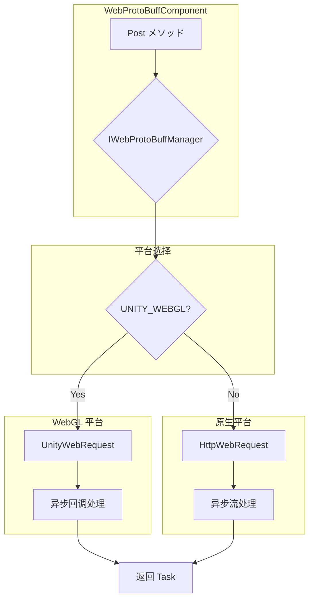

# 平台説明

本文档详细介绍 GameFrameX Web ProtoBuff コンポーネント在不同 Unity 平台上的サポート情况、平台特定的実装差异以及各平台的配置要求。

## 概要

GameFrameX Web ProtoBuff コンポーネントは跨平台的 HTTP 网络お願いします求コンポーネント，专门に使用处理基づく Protocol Buffer 格式的网络通信。该コンポーネント设计为在多个 Unity 平台上无缝运行，に基づいて目标平台自动选择最合适的网络お願いします求実装方法。

コンポーネント的コア设计理念是提供统一的 API インターフェース，同时利用各平台原生的网络能力，以获得最佳的性能和兼容性。

## サポート的平台

该コンポーネントサポート以下 Unity 平台：

| 平台 | サポートステータス | 网络実装方法 | 説明 |
|------|---------|-------------|------|
| **WebGL** | ✅ 完全サポート | UnityWebRequest | 浏览器环境专用実装 |
| **Windows** | ✅ 完全サポート | HttpWebRequest | .NET 标准 HTTP 客户端 |
| **macOS** | ✅ 完全サポート | HttpWebRequest | .NET 标准 HTTP 客户端 |
| **Linux** | ✅ 完全サポート | HttpWebRequest | .NET 标准 HTTP 客户端 |
| **Android** | ✅ 完全サポート | HttpWebRequest | .NET 标准 HTTP 客户端 |
| **iOS** | ✅ 完全サポート | HttpWebRequest | .NET 标准 HTTP 客户端 |
| **Switch** | ✅ 完全サポート | HttpWebRequest | .NET 标准 HTTP 客户端 |
| **PS4/PS5** | ✅ 完全サポート | HttpWebRequest | .NET 标准 HTTP 客户端 |
| **Xbox** | ✅ 完全サポート | HttpWebRequest | .NET 标准 HTTP 客户端 |

## 平台架构

该コンポーネント采用条件编译的方法実装跨平台サポート，を通じて检测 `UNITY_WEBGL` 宏来区分 WebGL 平台和其他平台。



### 平台选择逻辑説明

コンポーネント在运行时を通じて编译期的条件编译指令选择合适的网络実装：

- **WebGL 平台**：使用 `UnityEngine.Networking.UnityWebRequest`，这是 Unity 官方提供的 WebGL 环境网络お願いします求 API
- **其他所有平台**：使用 `System.Net.HttpWebRequest`，这是 .NET 标准的 HTTP お願いします求実装

## 平台特定実装差异

### WebGL 平台実装

WebGL 平台的実装位于 `Runtime/Web/WebProtoBuffManager.ProtoBuf.cs` ファイル的第 87-116 行。该実装使用 Unity 提供的 `UnityWebRequest` クラス，这是 WebGL 平台上唯一可用的 HTTP お願いします求方法。

```csharp
#if UNITY_WEBGL
    UnityEngine.Networking.UnityWebRequest unityWebRequest;
    if (webData.IsGet)
    {
        unityWebRequest = UnityEngine.Networking.UnityWebRequest.Get(webData.URL);
    }
    else
    {
        unityWebRequest = UnityEngine.Networking.UnityWebRequest.Post(webData.URL, string.Empty);
    }

    unityWebRequest.timeout = (int)RequestTimeout.TotalSeconds;
    {
        unityWebRequest.SetRequestHeader("Content-Type", ProtoBufContentType);
        byte[] postData = webData.SendData;
        unityWebRequest.uploadHandler = new UnityEngine.Networking.UploadHandlerRaw(postData);
    }

    var asyncOperation = unityWebRequest.SendWebRequest();
    asyncOperation.completed += (asyncOperation2) =>
    {
        m_SendingProtoBufList.Remove(webData);
        if (unityWebRequest.isNetworkError || unityWebRequest.isHttpError || unityWebRequest.error != null)
        {
            webData.Task.TrySetException(new Exception(unityWebRequest.error));
            return;
        }

        webData.Task.SetResult(new WebBufferResult(webData.UserData, unityWebRequest.downloadHandler.data));
    };
#endif
```
> Source: [WebProtoBuffManager.ProtoBuf.cs](https://github.com/GameFrameX/com.gameframex.unity.web.protobuff/blob/main/Runtime/Web/WebProtoBuffManager.ProtoBuf.cs#L87-L116)

**WebGL 実装特点：**
- 使用回调函数处理异步完成イベント
- を通じて `SendWebRequest()` メソッド发送お願いします求
- 错误检测使用 `isNetworkError`、`isHttpError` 和 `error` プロパティ
- 内容クラス型設定为 `application/x-protobuf`

### 原生平台実装

原生平台的実装位于同一ファイル的第 117-165 行，使用 .NET 的 `HttpWebRequest` クラス：

```csharp
#else
    try
    {
        HttpWebRequest request = WebRequest.CreateHttp(webData.URL);
        request.Method = webData.IsGet ? WebRequestMethods.Http.Get : WebRequestMethods.Http.Post;
        request.Timeout = (int)RequestTimeout.TotalMilliseconds;
        request.ContentType = ProtoBufContentType;
        byte[] postData = webData.SendData;
        request.ContentLength = postData.Length;
        using (Stream requestStream = request.GetRequestStream())
        {
            await requestStream.WriteAsync(postData, 0, postData.Length);
        }

        using (HttpWebResponse response = (HttpWebResponse)await request.GetResponseAsync())
        {
            using (Stream responseStream = response.GetResponseStream())
            {
                m_MemoryStream.SetLength(response.ContentLength);
                m_MemoryStream.Position = 0;
                await responseStream.CopyToAsync(m_MemoryStream);
                webData.Task.SetResult(new WebBufferResult(webData.UserData, m_MemoryStream.ToArray()));
            }
        }
    }
    catch (WebException e)
    {
        if (e.Status == WebExceptionStatus.Timeout)
        {
            webData.Task.SetException(new TimeoutException(e.Message));
            return;
        }
        webData.Task.SetException(e);
    }
    // ... 更多異常处理
#endif
```
> Source: [WebProtoBuffManager.ProtoBuf.cs](https://github.com/GameFrameX/com.gameframex.unity.web.protobuff/blob/main/Runtime/Web/WebProtoBuffManager.ProtoBuf.cs#L117-L165)

**原生平台実装特点：**
- 使用 async/await 模式处理异步操作
- サポート完整的 .NET 異常处理机制
- 包含超时異常（TimeoutException）的专门处理
- 使用内存流处理响应数据

## 内容クラス型

无论在哪个平台上运行，コンポーネント都使用相同的内容クラス型 `application/x-protobuf`：

```csharp
private const string ProtoBufContentType = "application/x-protobuf";
```
> Source: [WebProtoBuffManager.ProtoBuf.cs](https://github.com/GameFrameX/com.gameframex.unity.web.protobuff/blob/main/Runtime/Web/WebProtoBuffManager.ProtoBuf.cs#L32)

这个内容クラス型是 Protocol Buffer 标准的 HTTP 传输クラス型，确保服务器能够正确识别和处理 ProtoBuf 格式的お願いします求和响应数据。

## 编译宏定义

コンポーネントを通じて `versionDefines` 自动管理编译宏，无需手动配置：

```json
{
  "versionDefines": [
    {
      "name": "com.gameframex.unity.network",
      "expression": "",
      "define": "ENABLE_GAME_FRAME_X_WEB_PROTOBUF_NETWORK"
    }
  ]
}
```
> Source: [GameFrameX.Web.ProtoBuff.Runtime.asmdef](https://github.com/GameFrameX/com.gameframex.unity.web.protobuff/blob/main/Runtime/GameFrameX.Web.ProtoBuff.Runtime.asmdef#L17-L23)

当プロジェクト安装 `com.gameframex.unity.network` 包后，系统会自动定义 `ENABLE_GAME_FRAME_X_WEB_PROTOBUF_NETWORK` 宏，从而启用 ProtoBuff 网络機能。

## 平台特定注意事项

### WebGL 平台

1. **浏览器限制**：WebGL 运行在浏览器环境中，受到浏览器的同源策略 (Same-Origin Policy) 限制
2. **异步模式**：WebGL 不サポート多线程，コンポーネント使用回调函数模式处理异步完成イベント
3. **超时行为**：UnityWebRequest 的超时設定在 WebGL 平台上可能受到浏览器実装的限制
4. **HTTPS サポート**：WebGL 完全サポート HTTPS 协议，但必要服务器配置有效的 SSL 证书

### 原生平台

1. **线程安全**：原生平台サポート完整的多线程操作，使用 async/await 模式
2. **超时处理**：サポート更精确的超时控制，包括连接超时和读取超时
3. **代理サポート**：サポートを通じて系统代理进行网络お願いします求
4. **SSL/TLS**：サポート完整的 SSL/TLS 协议栈

## 依赖项

各平台共享以下コア依赖：

| 依赖包 | 版本 | 説明 |
|--------|------|------|
| com.gameframex.unity | 1.1.1 | コアフレームワーク |
| com.gameframex.unity.web | 1.0.0 | Web 基础コンポーネント |
| com.gameframex.unity.network | 1.0.0 | 网络模块（启用 ProtoBuff 機能） |
| com.gameframex.unity.google.protobuf | 1.0.0 | Google Protobuf 序列化库 |

> 详细依赖信息お願いします参见 [依赖项](./2-installation.dependencies) 文档。

## 平台选择建议

に基づいてプロジェクト需求选择合适的目标平台：

| シーン | 推荐平台 | 理由 |
|------|---------|------|
| **Web 网页ゲーム** | WebGL | 直接在浏览器中运行，无需插件 |
| **移动端ゲーム** | Android/iOS | 性能最优，完整的网络機能 |
| **PC 客户端** | Windows/macOS/Linux | 开发调试方便 |
| **主机ゲーム** | PS4/PS5/Xbox/Switch | 商业主机平台サポート |

## 関連リンク

- [コンポーネント配置](./6-configuration.component-config)
- [编译宏定义](./6-configuration.compile-defines)
- [快速入门](./3-getting-started.quick-start)
- [API 参考 - WebProtoBuffComponent](./5-api-reference.webprotobuffcomponent)
- [API 参考 - IWebProtoBuffManager](./5-api-reference.iwebprotobuffmanager)
- [GitHub 仓库](https://github.com/GameFrameX/com.gameframex.unity.web.protobuff.git)
