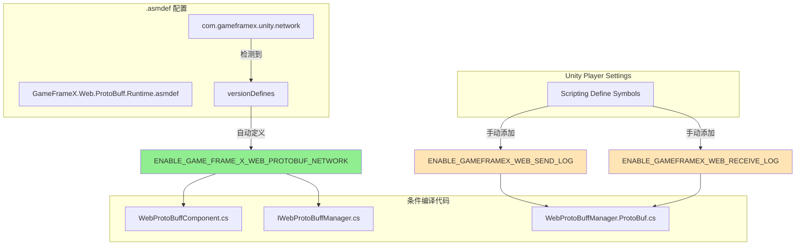

# コンパイル宏定義

コンパイル宏定義（Compile Defines）是用于控制コードコンパイル行为的重要な机制，通过预処理器指令実装コード的条件コンパイル。このドキュメント詳細介绍 Web ProtoBuff コンポーネント中使用的所有コンパイル宏定義及其設定メソッド。

## 概要

Web ProtoBuff コンポーネント使用コンパイル宏定義来控制機能モジュール的启用与禁用，这种設計具有以下优势：

- **条件コンパイル**：根据不同的コンパイル環境启用或禁用特定機能
- **依赖管理**：通过バージョン定義（versionDefines）自动管理機能依赖
- **デバッグサポート**：提供独立的デバッグログ开关，不影响正式リリースバージョン

## コンパイル宏定義详解

### ENABLE_GAME_FRAME_X_WEB_PROTOBUF_NETWORK

**機能説明**

这是 Web ProtoBuff コンポーネント的コアコンパイル宏定義，用于控制 Protocol Buffer 网络请求機能的可用性。当启用此宏时，コンポーネント将暴露 `Post<T>` メソッド，允许開発者发送和受信 Protocol Buffer フォーマット的メッセージ。

> 此宏定義在 `Runtime/GameFrameX.Web.ProtoBuff.Runtime.asmdef` ファイル中通过バージョン定義（versionDefines）自动管理：
> Source: [GameFrameX.Web.ProtoBuff.Runtime.asmdef](https://github.com/GameFrameX/com.gameframex.unity.web.protobuff/blob/main/Runtime/GameFrameX.Web.ProtoBuff.Runtime.asmdef#L17-L22)

**依赖条件**

该宏的启用依赖于 `com.gameframex.unity.network` パッケージ的存在。当プロジェクト中参照了 GameFrameX Network ランタイムパッケージ时，asmdef 会自动定義此宏：

```json
"versionDefines": [
    {
      "name": "com.gameframex.unity.network",
      "expression": "",
      "define": "ENABLE_GAME_FRAME_X_WEB_PROTOBUF_NETWORK"
    }
]
```

**受影响的コード**

以下コード片段表示了条件コンパイル的使用方法：

```csharp
// WebProtoBuffComponent.cs
#if ENABLE_GAME_FRAME_X_WEB_PROTOBUF_NETWORK
        /// <summary>
        /// 发送Post请求，用于发送和接收Protocol Buffer消息。
        /// 此方法仅在启用ENABLE_GAME_FRAME_X_WEB_PROTOBUF_NETWORK宏定义时可用。
        /// </summary>
        public Task<T> Post<T>(string url, GameFrameX.Network.Runtime.MessageObject message) 
            where T : GameFrameX.Network.Runtime.MessageObject, GameFrameX.Network.Runtime.IResponseMessage
        {
            return m_WebProtoBuffManager.Post<T>(url, message);
        }
#endif
```
> Source: [WebProtoBuffComponent.cs](https://github.com/GameFrameX/com.gameframex.unity.web.protobuff/blob/main/Runtime/Web/WebProtoBuffComponent.cs#L92-L109)

```csharp
// IWebProtoBuffManager.cs
#if ENABLE_GAME_FRAME_X_WEB_PROTOBUF_NETWORK
        /// <summary>
        /// 发送Protobuf消息的Post请求，并接收指定类型的响应
        /// </summary>
        Task<T> Post<T>(string url, GameFrameX.Network.Runtime.MessageObject message) 
            where T : GameFrameX.Network.Runtime.MessageObject, GameFrameX.Network.Runtime.IResponseMessage;
#endif
```
> Source: [IWebProtoBuffManager.cs](https://github.com/GameFrameX/com.gameframex.unity.web.protobuff/blob/main/Runtime/Web/IWebProtoBuffManager.cs#L11-L24)

### ENABLE_GAMEFRAMEX_WEB_RECEIVE_LOG

**機能説明**

デバッグログ宏，用于在ランタイム输出受信到的 Protocol Buffer メッセージログ。启用后，当コンポーネント受信到服务器响应时，会自动记录メッセージ的 ID、唯一标识符、タイプ名称およびメッセージ内容。

**使用メソッド**

在 Unity 的 **Player Settings** → **Scripting Define Symbols** 中追加此宏定義つまり可启用受信ログ機能：

```
ENABLE_GAMEFRAMEX_WEB_RECEIVE_LOG
```

**コード実装**

```csharp
private void DebugReceiveLog(MessageObject messageObject)
{
#if ENABLE_GAMEFRAMEX_WEB_RECEIVE_LOG
            var messageId = ProtoMessageIdHandler.GetReqMessageIdByType(messageObject.GetType());
            Log.Debug($"接收消息 ID:[{messageId},{messageObject.UniqueId},{messageObject.GetType().Name}] 消息内容:{GameFrameX.Runtime.Utility.Json.ToJson(messageObject)}");
#endif
}
```
> Source: [WebProtoBuffManager.ProtoBuf.cs](https://github.com/GameFrameX/com.gameframex.unity.web.protobuff/blob/main/Runtime/Web/WebProtoBuffManager.ProtoBuf.cs#L227-L233)

### ENABLE_GAMEFRAMEX_WEB_SEND_LOG

**機能説明**

デバッグログ宏，用于在ランタイム输出发送的 Protocol Buffer メッセージログ。启用后，当コンポーネント发送请求时，会自动记录メッセージ的 ID、唯一标识符、タイプ名称およびメッセージ内容。

**使用メソッド**

在 Unity 的 **Player Settings** → **Scripting Define Symbols** 中追加此宏定義つまり可启用发送ログ機能：

```
ENABLE_GAMEFRAMEX_WEB_SEND_LOG
```

**コード実装**

```csharp
private void DebugSendLog(MessageObject messageObject)
{
#if ENABLE_GAMEFRAMEX_WEB_SEND_LOG
            var messageId = ProtoMessageIdHandler.GetReqMessageIdByType(messageObject.GetType());
            Log.Debug($"发送消息 ID:[{messageId},{messageObject.UniqueId},{messageObject.GetType().Name}] 消息内容:{GameFrameX.Runtime.Utility.Json.ToJson(messageObject)}");
#endif
}
```
> Source: [WebProtoBuffManager.ProtoBuf.cs](https://github.com/GameFrameX/com.gameframex.unity.web.protobuff/blob/main/Runtime/Web/WebProtoBuffManager.ProtoBuf.cs#L235-L241)

## コンパイル宏定義アーキテクチャ

以下 Mermaid 图表表示了コンパイル宏定義与コードモジュール之间的关系：



## 設定ガイド

### 自动管理宏定義

コア機能宏 `ENABLE_GAME_FRAME_X_WEB_PROTOBUF_NETWORK` 由 asmdef 自动管理，只需確認してくださいプロジェクト中已正确インストール `com.gameframex.unity.network` パッケージつまり可。

インストールステップ：
1. 在 `manifest.json` 的 `dependencies` 中追加：
   ```json
   "com.gameframex.unity.network": "https://github.com/GameFrameX/com.gameframex.unity.network.git"
   ```
2. 等待 Unity Package Manager 完成インストール
3. コンパイルプロジェクト，宏定義将自动生效

### 手动追加宏定義

对于デバッグログ宏，〜する必要があります手动在 Unity 中設定：

1. 打开 Unity エディタ
2. メニュー栏选择 **Edit** → **Project Settings** → **Player**
3. 在 **Player Settings** ウィンドウ中，选择 **Other Settings** オプション卡
4. 找到 **Scripting Define Symbols** フィールド
5. 追加所需的宏定義（多个宏用分号分隔）

```text
ENABLE_GAMEFRAMEX_WEB_SEND_LOG;ENABLE_GAMEFRAMEX_WEB_RECEIVE_LOG
```

### 推奨的宏定義設定

| ビルドタイプ | 推奨的宏定義 |
|----------|-------------|
| 开发デバッグ | `ENABLE_GAMEFRAMEX_WEB_SEND_LOG;ENABLE_GAMEFRAMEX_WEB_RECEIVE_LOG` |
| テストリリース | （仅コア宏，由 asmdef 自动管理） |
| 正式リリース | （无额外宏定義） |

## コンパイル宏定義汇总表

| 宏定義名称 | 作用范围 | 管理方法 | 用途 |
|------------|----------|----------|------|
| `ENABLE_GAME_FRAME_X_WEB_PROTOBUF_NETWORK` | コア機能 | asmdef 自动管理 | 启用 Protocol Buffer 网络请求機能 |
| `ENABLE_GAMEFRAMEX_WEB_SEND_LOG` | デバッグ機能 | 手动設定 | 启用发送メッセージログ |
| `ENABLE_GAMEFRAMEX_WEB_RECEIVE_LOG` | デバッグ機能 | 手动設定 | 启用受信メッセージログ |
| `UNITY_WEBGL` | プラットフォーム特定 | Unity 自动定義 | WebGL プラットフォーム专用コード |

## よくある問題

### Q: 追加宏定義后コード没有生效？

**解決策**：
1. 確認してください在正确的プラットフォーム（Platform）下追加宏定義
2. 追加后〜する必要があります重新コンパイルプロジェクト（メニュー：**Build Settings** → **Build** 或 **Compile**）
3. 確認是否有多层嵌套的 `#if` 条件，〜の可能性があります被外层条件阻止

### Q: デバッグログ没有输出？

**解決策**：
1. 確認已在 Player Settings 中正确追加 `ENABLE_GAMEFRAMEX_WEB_SEND_LOG` 或 `ENABLE_GAMEFRAMEX_WEB_RECEIVE_LOG`
2. 確認 Unity 的 Log 级别設定，確認してください Debug ログ可见
3. 確認网络请求确实在发送/受信中

### Q: Post<T> メソッド不可用？

**解決策**：
1. 確認 `com.gameframex.unity.network` パッケージ已正确インストール
2. 確認是否启用了 `ENABLE_GAME_FRAME_X_WEB_PROTOBUF_NETWORK` 宏
3. 確認してください WebProtoBuffComponent コンポーネント已正确追加到シーン中

## 関連リンク

- [コンポーネント設定](./6-configuration.component-config)
- [プラットフォーム説明](./7-platforms.platform-info)
- [プラグイン介绍](./1-overview.introduction)
- [快速入门](./3-getting-started.quick-start)
