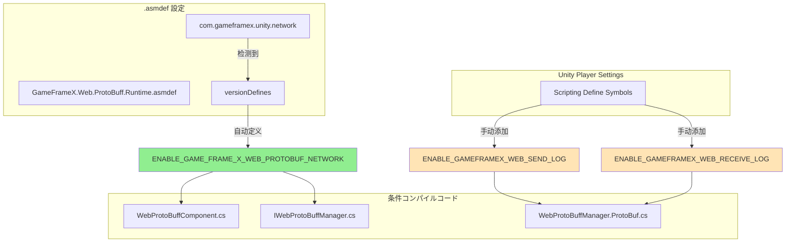

# コンパイル

コンパイル（Compile Defines）はにコードコンパイルの，をじてコードのコンパイル。ドキュメント Web ProtoBuff コンポーネントのコンパイルメソッド。

## 

Web ProtoBuff コンポーネントコンパイルモジュールのと，：

- **コンパイル**：のコンパイル
- ****：をじてバージョン（versionDefines）
- **デバッグサポート**：のデバッグログ，バージョン

## コンパイル

### ENABLE_GAME_FRAME_X_WEB_PROTOBUF_NETWORK

****

は Web ProtoBuff コンポーネントのコアコンパイル，に Protocol Buffer ネットワークリクエストの。，コンポーネント `Post<T>` メソッド，と Protocol Buffer の。

> に `Runtime/GameFrameX.Web.ProtoBuff.Runtime.asmdef` ファイルをじてバージョン（versionDefines）：
> Source: [GameFrameX.Web.ProtoBuff.Runtime.asmdef](https://github.com/GameFrameX/com.gameframex.unity.web.protobuff/blob/main/Runtime/GameFrameX.Web.ProtoBuff.Runtime.asmdef#L17-L22)

****

の `com.gameframex.unity.network` のに。プロジェクトた GameFrameX Network ，asmdef ：

```json
"versionDefines": [
    {
      "name": "com.gameframex.unity.network",
      "expression": "",
      "define": "ENABLE_GAME_FRAME_X_WEB_PROTOBUF_NETWORK"
    }
]
```

**のコード**

コードたコンパイルの：

```csharp
// WebProtoBuffComponent.cs
#if ENABLE_GAME_FRAME_X_WEB_PROTOBUF_NETWORK
        /// <summary>
        /// 发送Postリクエスト，に使用发送と接收Protocol Buffer消息。
        /// 此メソッド仅に启用ENABLE_GAME_FRAME_X_WEB_PROTOBUF_NETWORK宏定义时可用。
        /// </summary>
        public Task<T> Post<T>(string url, GameFrameX.Network.Runtime.MessageObject message) 
            where T : GameFrameX.Network.Runtime.MessageObject, GameFrameX.Network.Runtime.IResponseMessage
        {
            return m_WebProtoBuffManager.Post<T>(url, message);
        }
#endif
```
> Source: [WebProtoBuffComponent.cs](https://github.com/GameFrameX/com.gameframex.unity.web.protobuff/blob/main/Runtime/Web/WebProtoBuffComponent.cs#L92-L109)

```csharp
// IWebProtoBuffManager.cs
#if ENABLE_GAME_FRAME_X_WEB_PROTOBUF_NETWORK
        /// <summary>
        /// 发送Protobuf消息のPostリクエスト，并接收指定タイプのレスポンス
        /// </summary>
        Task<T> Post<T>(string url, GameFrameX.Network.Runtime.MessageObject message) 
            where T : GameFrameX.Network.Runtime.MessageObject, GameFrameX.Network.Runtime.IResponseMessage;
#endif
```
> Source: [IWebProtoBuffManager.cs](https://github.com/GameFrameX/com.gameframex.unity.web.protobuff/blob/main/Runtime/Web/IWebProtoBuffManager.cs#L11-L24)

### ENABLE_GAMEFRAMEX_WEB_RECEIVE_LOG

****

デバッグログ，ににの Protocol Buffer ログ。，コンポーネントレスポンス，の ID、、タイプ。

**メソッド**

に Unity の **Player Settings** → **Scripting Define Symbols** ログ：

```
ENABLE_GAMEFRAMEX_WEB_RECEIVE_LOG
```

**コード**

```csharp
private void DebugReceiveLog(MessageObject messageObject)
{
#if ENABLE_GAMEFRAMEX_WEB_RECEIVE_LOG
            var messageId = ProtoMessageIdHandler.GetReqMessageIdByType(messageObject.GetType());
            Log.Debug($"接收消息 ID:[{messageId},{messageObject.UniqueId},{messageObject.GetType().Name}] 消息内容:{GameFrameX.Runtime.Utility.Json.ToJson(messageObject)}");
#endif
}
```
> Source: [WebProtoBuffManager.ProtoBuf.cs](https://github.com/GameFrameX/com.gameframex.unity.web.protobuff/blob/main/Runtime/Web/WebProtoBuffManager.ProtoBuf.cs#L227-L233)

### ENABLE_GAMEFRAMEX_WEB_SEND_LOG

****

デバッグログ，ににの Protocol Buffer ログ。，コンポーネントリクエスト，の ID、、タイプ。

**メソッド**

に Unity の **Player Settings** → **Scripting Define Symbols** ログ：

```
ENABLE_GAMEFRAMEX_WEB_SEND_LOG
```

**コード**

```csharp
private void DebugSendLog(MessageObject messageObject)
{
#if ENABLE_GAMEFRAMEX_WEB_SEND_LOG
            var messageId = ProtoMessageIdHandler.GetReqMessageIdByType(messageObject.GetType());
            Log.Debug($"发送消息 ID:[{messageId},{messageObject.UniqueId},{messageObject.GetType().Name}] 消息内容:{GameFrameX.Runtime.Utility.Json.ToJson(messageObject)}");
#endif
}
```
> Source: [WebProtoBuffManager.ProtoBuf.cs](https://github.com/GameFrameX/com.gameframex.unity.web.protobuff/blob/main/Runtime/Web/WebProtoBuffManager.ProtoBuf.cs#L235-L241)

## コンパイルアーキテクチャ

 Mermaid たコンパイルとコードモジュールの：



## ガイド

### 

コア `ENABLE_GAME_FRAME_X_WEB_PROTOBUF_NETWORK`  asmdef ，プロジェクトインストール `com.gameframex.unity.network` 。

インストールステップ：
1. に `manifest.json` の `dependencies` ：
   ```json
   "com.gameframex.unity.network": "https://github.com/GameFrameX/com.gameframex.unity.network.git"
   ```
2.  Unity Package Manager たインストール
3. コンパイルプロジェクト，

### 

デバッグログ，に Unity ：

1.  Unity エディター
2.  **Edit** → **Project Settings** → **Player**
3. に **Player Settings** ， **Other Settings** オプション
4.  **Scripting Define Symbols** 
5. の（）

```text
ENABLE_GAMEFRAMEX_WEB_SEND_LOG;ENABLE_GAMEFRAMEX_WEB_RECEIVE_LOG
```

### の

| ビルドタイプ | の |
|----------|-------------|
| デバッグ | `ENABLE_GAMEFRAMEX_WEB_SEND_LOG;ENABLE_GAMEFRAMEX_WEB_RECEIVE_LOG` |
| テスト | （コア， asmdef ） |
|  | （） |

## コンパイル

|  |  |  |  |
|------------|----------|----------|------|
| `ENABLE_GAME_FRAME_X_WEB_PROTOBUF_NETWORK` | コア | asmdef  |  Protocol Buffer ネットワークリクエスト |
| `ENABLE_GAMEFRAMEX_WEB_SEND_LOG` | デバッグ |  | ログ |
| `ENABLE_GAMEFRAMEX_WEB_RECEIVE_LOG` | デバッグ |  | ログ |
| `UNITY_WEBGL` | プラットフォーム | Unity  | WebGL プラットフォームコード |

## よくある

### Q: コード？

****：
1. にのプラットフォーム（Platform）
2. コンパイルプロジェクト（：**Build Settings** → **Build**  **Compile**）
3. はの `#if` ，

### Q: デバッグログ？

****：
1. に Player Settings  `ENABLE_GAMEFRAMEX_WEB_SEND_LOG`  `ENABLE_GAMEFRAMEX_WEB_RECEIVE_LOG`
2.  Unity の Log ， Debug ログ
3. ネットワークリクエストに/

### Q: `Post<T>` メソッド？

****：
1.  `com.gameframex.unity.network` インストール
2. はた `ENABLE_GAME_FRAME_X_WEB_PROTOBUF_NETWORK` 
3.  WebProtoBuffComponent コンポーネント

## リンク

- [コンポーネント](./6-configuration.component-config)
- [プラットフォーム](./7-platforms.platform-info)
- [](./1-overview.introduction)
- [クイックスタート](./3-getting-started.quick-start)
