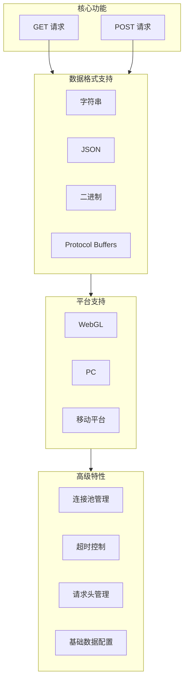
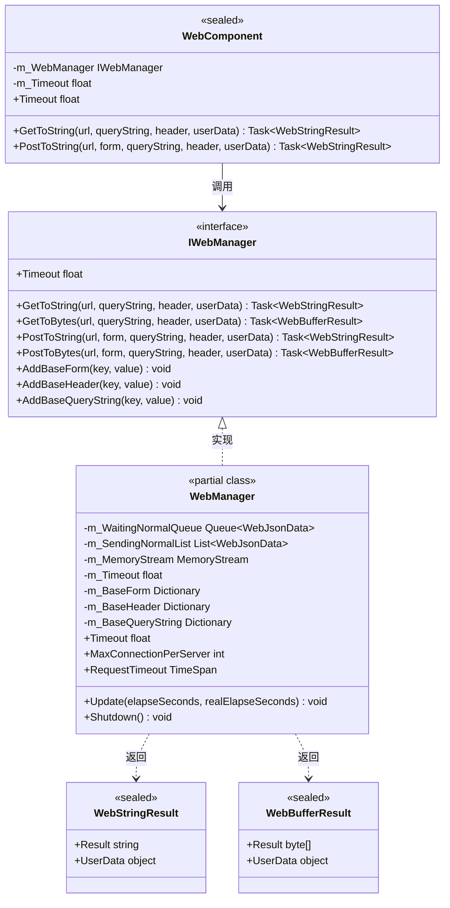
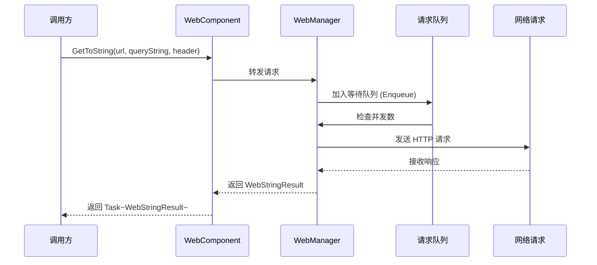

# プラグイン介绍

GameFrameX Web コンポーネントは高性能的 Unity HTTP 网络请求库，提供シンプル易用的 API 来処理各种网络请求シーン。サポート GET、POST 请求，可処理字符串、JSON、二进制数据等多种フォーマット。

## 概要

GameFrameX Web 是 GameFrameX 游戏フレームワーク体系中的网络機能モジュール，专为 Unity 游戏開発者設計。该プラグイン提供します一套完全な的 HTTP 客户端解決策，帮助開発者快速実装客户端与服务器之间的通信需求。

作为 GameFrameX フレームワーク的コアコンポーネント之一，Web コンポーネント与其他モジュール（如 Network、Data、Procedure 等）紧密配合，共同ビルド完全な的游戏后端通信体系。无论是シンプル的数据取得还是複雑的二进制ファイル上传，Web コンポーネント都能提供稳定、効率的的网络请求服务。

### 設計目标

GameFrameX Web コンポーネント的設計遵循以下コア理念：

1. **シンプル易用**：提供清晰的 API インターフェース，開発者无需关心底层実装细节
2. **高性能**：基于 C# Task 异步モード，充分利用多线程优势
3. **跨プラットフォーム**：統一されたインターフェース适配不同运行プラットフォーム（WebGL、PC、移动端）
4. **可拡張**：モジュール化設計，サポート自定義数据シリアライズ和请求処理

## コア特性

GameFrameX Web コンポーネント提供します丰富的機能特性，满足各种网络请求シーン的需求：



### 异步処理

基于现代 C# 异步编程モード（async/await），開発者〜できます编写清晰、シンプル的异步コード，避免传统コールバック地狱問題：

```csharp
// 异步获取字符串数据
string result = await webManager.GetToString("https://api.example.com/data");
Debug.Log("Response: " + result);
```

> Source: [README.md](https://github.com/GameFrameX/com.gameframex.unity.web/blob/main/README.md#L66-L68)

### 多数据フォーマットサポート

サポート多种数据フォーマット的请求和响应処理：

- **字符串フォーマット**：適していますシンプル的文本数据交换
- **JSON フォーマット**：广泛用于前后端数据交互，自动シリアライズ/反シリアライズ
- **二进制フォーマット**：適していますファイル下载、图片ロード等シーン
- **Protocol Buffers**：効率的二进制シリアライズ，适合高性能シーン

### 连接池管理

内置智能连接复用机制，通过 `MaxConnectionPerServer` プロパティ控制单个服务器的最大并发连接数，避免过多连接导致服务器压力或性能問題。デフォルト值为 8 个并发连接。

## アーキテクチャ設計

GameFrameX Web コンポーネント采用分层アーキテクチャ設計，確認してくださいコード的モジュール化和可维护性：



### コアコンポーネント説明

| コンポーネント | タイプ | 职责 |
|------|------|------|
| **IWebManager** | インターフェース | 定義 Web 请求的抽象インターフェース，統一された管理所有 HTTP 请求操作 |
| **WebManager** | 类 | コア実装类，継承 `GameFrameworkModule`，実装完全な的请求逻辑 |
| **WebComponent** | Unity コンポーネント | `IWebManager` 的 Unity コンポーネントカプセル化，方便在シーン对象上使用 |
| **WebStringResult** | 結果类 | カプセル化字符串タイプ的请求結果 |
| **WebBufferResult** | 結果类 | カプセル化字节数组タイプ的请求結果 |

### 请求処理フロー



## プラットフォームサポート

GameFrameX Web コンポーネント针对不同 Unity プラットフォーム提供します差异化的実装，確認してください在各种运行環境下都能正常工作：

| プラットフォーム | 実装方法 | 特殊説明 |
|------|----------|----------|
| **WebGL** | UnityWebRequest | 不サポート多线程，所有请求在主线程処理 |
| **PC** | HttpWebRequest | 使用 .NET 原生网络库 |
| **Android** | HttpWebRequest | 使用 .NET 原生网络库 |
| **iOS** | HttpWebRequest | 使用 .NET 原生网络库 |

### プラットフォーム差异処理

コンポーネント内部通过条件コンパイル指令 `#if UNITY_WEBGL` 自动选择合适的网络実装：

```csharp
#if UNITY_WEBGL
using UnityEngine.Networking;
// WebGL 平台使用 UnityWebRequest
UnityWebRequest unityWebRequest = UnityWebRequest.Get(webJsonData.URL);
#else
// 其他平台使用 HttpWebRequest
HttpWebRequest request = WebRequest.CreateHttp(webJsonData.URL);
#endif
```

> Source: [WebManager.cs](https://github.com/GameFrameX/com.gameframex.unity.web/blob/main/Runtime/Web/WebManager.cs#L213-L260)

## クイックスタート

### インストール

通过 Git URL インストール（推奨）：

1. 在 Unity エディタ中打开 Package Manager
2. 点击 "+" ボタン选择 "Add package from git URL"
3. 输入以下 URL：
   ```
   https://github.com/gameframex/com.gameframex.unity.web.git
   ```

### 基本用法

```csharp
using GameFrameX.Web.Runtime;
using System.Threading.Tasks;
using System.Collections.Generic;

public class WebExample : MonoBehaviour
{
    private IWebManager webManager;
    
    private async void Start()
    {
        // 获取 Web 管理器实例
        webManager = GameFrameworkEntry.GetModule<IWebManager>();
        
        // 发送 GET 请求获取字符串
        string result = await webManager.GetToString("https://api.example.com/data");
        Debug.Log("GET Response: " + result);
        
        // 发送 POST 请求带表单数据
        var formData = new Dictionary<string, string>
        {
            { "username", "testuser" },
            { "password", "testpass" }
        };
        
        string postResult = await webManager.PostToString("https://api.example.com/login", formData);
        Debug.Log("POST Response: " + postResult);
    }
}
```

> Source: [README.md](https://github.com/GameFrameX/com.gameframex.unity.web/blob/main/README.md#L52-L81)

### 使用 WebComponent

推奨使用 `WebComponent` 方法，它は Unity コンポーネント，〜できます直接追加到游戏对象上：

```csharp
using GameFrameX.Web.Runtime;
using System.Threading.Tasks;
using System.Collections.Generic;

public class MyWebService : MonoBehaviour
{
    private WebComponent webComponent;
    
    private void Awake()
    {
        webComponent = gameObject.GetOrOrAddComponent<WebComponent>();
    }
    
    public async Task<string> GetUserDataAsync(string userId)
    {
        var queryParams = new Dictionary<string, string>
        {
            { "userId", userId }
        };
        
        var headers = new Dictionary<string, string>
        {
            { "Authorization", "Bearer your-token-here" }
        };
        
        return await webComponent.GetToString(
            "https://api.example.com/users", 
            queryParams, 
            headers
        );
    }
}
```

> Source: [README.md](https://github.com/GameFrameX/com.gameframex.unity.web/blob/main/README.md#L90-L123)

## 設定オプション

GameFrameX Web コンポーネント提供多种設定オプション：

| 設定项 | タイプ | デフォルト值 | 説明 |
|--------|------|--------|------|
| `Timeout` | float | 5.0 秒 | 请求超时时间 |
| `MaxConnectionPerServer` | int | 8 | 每个服务器的最大并发连接数 |
| `RequestTimeout` | TimeSpan | 5 秒 | 请求超时时间（TimeSpan タイプ） |

### コード設定例

```csharp
private void ConfigureWebManager()
{
    var webManager = GameFrameworkEntry.GetModule<IWebManager>();
    
    // 设置请求超时为 60 秒
    webManager.Timeout = 60f;
    
    // 设置最大并发连接数为 16
    webManager.MaxConnectionPerServer = 16;
}
```

> Source: [README.md](https://github.com/GameFrameX/com.gameframex.unity.web/blob/main/README.md#L292-L306)

## バージョン情報

- **当前バージョン**: 1.3.3
- **Unity バージョン要求**: 2019.4+
- **许可证**: MIT / Apache License 2.0 双许可证

## 関連リンク

- [インストール方法](./02.installation)
- [基本用法](./03.getting-started)
- [使用 WebComponent](./08.web-component)
- [WebManager アーキテクチャ](./05.web-manager)
- [请求結果タイプ](./06.result-types)
- [IWebManager インターフェース](./04.iwebmanager-interface)
- [WebComponent コンポーネント](./08.web-component)
- [超时設定](./10.timeout-settings)
- [基本数据設定](./07.base-data)
- [プラットフォーム差异説明](./09.platform-differences)
- [常见問題](./11.troubleshooting)
