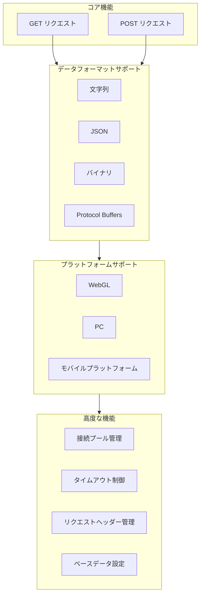
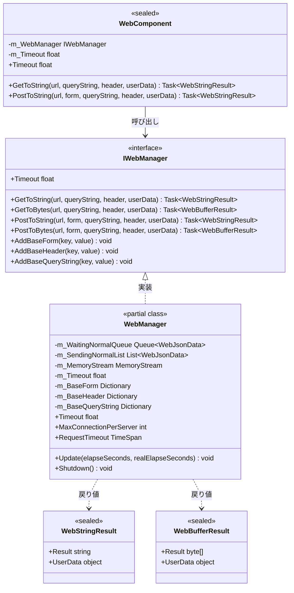
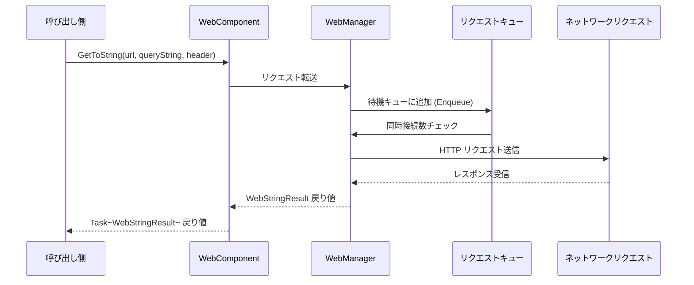

# プラグイン紹介

GameFrameX Web コンポーネントは、高性能な Unity HTTP ネットワークリクエストライブラリです。シンプルで使いやすい API を提供し、GET、POST リクエスト、文字列、JSON、バイナリデータ等多种なフォーマットを扱うことができます。

## 概要

GameFrameX Web は、GameFrameX ゲームフレームワーク体系中におけるネットワーク機能モジュールであり、Unity ゲーム開発者向けに設計されています。このプラグインは完全な HTTP クライアント解决方案を提供し、開発者がクライアントとサーバー間の通信要件を急速に実装することを支援します。

GameFrameX フレームワークのコアコンポーネントの一つとして、Web コンポーネントは他のモジュール（Network、Data、Procedure など）と密接に連携し、完全なゲームバックエンド通信体系を構築します。シンプルなデータ取得から複雑なバイナリファイルアップロードまで、Web コンポーネントは安定かつ効率的なネットワークリクエストサービスを提供できます。

### 設計目標

GameFrameX Web コンポーネントの設計は以下のコア理念に従っています：

1. **シンプル而易用**：明確な API インターフェースを提供し、開発者は下位層の実装詳細を気にする必要がありません
2. **高性能**：C# Task 非同期モードに基づき、マルチスレッドの利点を十分に活用
3. **クロスプラットフォーム**：統一インターフェースで異なる実行プラットフォーム（WebGL、PC、モバイル）を適応
4. **拡張可能**：モジュラーデザインで、カスタムデータシリアライズとリクエスト処理をサポート

## コア機能

GameFrameX Web コンポーネントは豊富な機能特性を提供し、様々なネットワークリクエストシーンの要件を満たします：



### 非同期処理

 현대 C# 非同期プログラミングモード（async/await）に基づき、開発者は明確でシンプルな非同期コードを記述でき、従来のコールバック地獄の問題を回避できます：

```csharp
// 非同期で文字列データを取得
string result = await webManager.GetToString("https://api.example.com/data");
Debug.Log("Response: " + result);
```

> Source: [README.md](https://github.com/GameFrameX/com.gameframex.unity.web/blob/main/README.md#L66-L68)

### 複数のデータフォーマットサポート

 다양한 데이터フォーマットのリクエストとレスポンス処理をサポート：

- **文字列フォーマット**：シンプルなテキストデータ交換に適合
- **JSON フォーマット**：フロントエンド・バックエンド間のデータ交互に広く使用され、自動シリアライズ/デシリアライズ
- **バイナリフォーマット**：ファイルダウンロード、画像ロード等のシーンに適合
- **Protocol Buffers**：高效なバイナリシリアライズで、高性能シーンに適合

### 接続プール管理

 内蔵のスマート接続再利用メカニズムを通じて、`MaxConnectionPerServer` プロパティで単一サーバーの最大同時接続数を制御し、過多な接続によるサーバー負荷やパフォーマンス問題を回避します。デフォルト値は 8 つの同時接続です。

## アーキテクチャ設計

GameFrameX Web コンポーネントは階層化アーキテクチャ設計を採用し、コードのモジュール化と保守性を確保します：



### コアコンポーネント説明

| コンポーネント | タイプ | 責務 |
|------|------|------|
| **IWebManager** | インターフェース | Web リクエストの抽象インターフェースを定義し、すべての HTTP リクエスト操作を一元管理 |
| **WebManager** | クラス | コア実装クラス、`GameFrameworkModule` を継承し、完全なリクエストロジックを実装 |
| **WebComponent** | Unity コンポーネント | `IWebManager` の Unity コンポーネントラッパー、シーンオブジェクトでの使用に便利 |
| **WebStringResult** | 結果クラス | 文字列タイプのリクエスト結果をラップ |
| **WebBufferResult** | 結果クラス | バイト配列タイプのリクエスト結果をラップ |

### リクエスト処理フロー



## プラットフォームサポート

GameFrameX Web コンポーネントは、異なる Unity プラットフォーム向けに差別化された実装を提供し、様々な実行環境でも正常に動作することを確保します：

| プラットフォーム | 実装方式 | 特殊説明 |
|------|----------|----------|
| **WebGL** | UnityWebRequest | マルチスレッド不支持、すべてのリクエストはメインスレッドで処理 |
| **PC** | HttpWebRequest | .NET ネイティブネットワークライブラリを使用 |
| **Android** | HttpWebRequest | .NET ネイティブネットワークライブラリを使用 |
| **iOS** | HttpWebRequest | .NET ネイティブネットワークライブラリを使用 |

### プラットフォーム差異処理

コンポーネント内部では条件付きコンパイル指令 `#if UNITY_WEBGL` で適切なネットワーク実装を自動選択：

```csharp
#if UNITY_WEBGL
using UnityEngine.Networking;
// WebGL プラットフォームでは UnityWebRequest を使用
UnityWebRequest unityWebRequest = UnityWebRequest.Get(webJsonData.URL);
#else
// 他のプラットフォームでは HttpWebRequest を使用
HttpWebRequest request = WebRequest.CreateHttp(webJsonData.URL);
#endif
```

> Source: [WebManager.cs](https://github.com/GameFrameX/com.gameframex.unity.web/blob/main/Runtime/Web/WebManager.cs#L213-L260)

## クイックスタート

### インストール

Git URL からインストール（推奨）：

1. Unity エディターで Package Manager を開く
2. "+" ボタンをクリックして "Add package from git URL" を選択
3. 以下の URL を入力：
   ```
   https://github.com/gameframex/com.gameframex.unity.web.git
   ```

### 基本使用法

```csharp
using GameFrameX.Web.Runtime;
using System.Threading.Tasks;
using System.Collections.Generic;

public class WebExample : MonoBehaviour
{
    private IWebManager webManager;
    
    private async void Start()
    {
        // Web マネージャーインスタンスを取得
        webManager = GameFrameworkEntry.GetModule<IWebManager>();
        
        // GET リクエストを送信して文字列を取得
        string result = await webManager.GetToString("https://api.example.com/data");
        Debug.Log("GET Response: " + result);
        
        // POST リクエストをフォームデータ付きで送信
        var formData = new Dictionary<string, string>
        {
            { "username", "testuser" },
            { "password", "testpass" }
        };
        
        string postResult = await webManager.PostToString("https://api.example.com/login", formData);
        Debug.Log("POST Response: " + postResult);
    }
}
```

> Source: [README.md](https://github.com/GameFrameX/com.gameframex.unity.web/blob/main/README.md#L52-L81)

### WebComponent の使用

`WebComponent` 方式の使用を推奨、これは Unity コンポーネントであり、ゲームオブジェクトに直接追加できます：

```csharp
using GameFrameX.Web.Runtime;
using System.Threading.Tasks;
using System.Collections.Generic;

public class MyWebService : MonoBehaviour
{
    private WebComponent webComponent;
    
    private void Awake()
    {
        webComponent = gameObject.GetOrOrAddComponent<WebComponent>();
    }
    
    public async Task<string> GetUserDataAsync(string userId)
    {
        var queryParams = new Dictionary<string, string>
        {
            { "userId", userId }
        };
        
        var headers = new Dictionary<string, string>
        {
            { "Authorization", "Bearer your-token-here" }
        };
        
        return await webComponent.GetToString(
            "https://api.example.com/users", 
            queryParams, 
            headers
        );
    }
}
```

> Source: [README.md](https://github.com/GameFrameX/com.gameframex.unity.web/blob/main/README.md#L90-L123)

## 設定オプション

GameFrameX Web コンポーネントは多様な設定オプションを提供します：

| 設定項目 | タイプ | デフォルト値 | 説明 |
|--------|------|--------|------|
| `Timeout` | float | 5.0 秒 | リクエストタイムアウト時間 |
| `MaxConnectionPerServer` | int | 8 | 各サーバーの最大同時接続数 |
| `RequestTimeout` | TimeSpan | 5 秒 | リクエストタイムアウト時間（TimeSpan タイプ） |

### コード設定示例

```csharp
private void ConfigureWebManager()
{
    var webManager = GameFrameworkEntry.GetModule<IWebManager>();
    
    // リクエストタイムアウトを 60 秒に設定
    webManager.Timeout = 60f;
    
    // 最大同時接続数を 16 に設定
    webManager.MaxConnectionPerServer = 16;
}
```

> Source: [README.md](https://github.com/GameFrameX/com.gameframex.unity.web/blob/main/README.md#L292-L306)

## バージョン情報

- **現行バージョン**: 1.3.3
- **Unity バージョン要件**: 2019.4+
- **ライセンス**: MIT / Apache License 2.0 デュアルライセンス

## 関連リンク

- [インストール方法](./02.installation)
- [基本使用法](./03.getting-started)
- [WebComponent の使用](./08.web-component)
- [WebManager アーキテクチャ](./05.web-manager)
- [リクエスト結果タイプ](./06.result-types)
- [IWebManager インターフェース](./04.iwebmanager-interface)
- [WebComponent コンポーネント](./08.web-component)
- [タイムアウト設定](./10.timeout-settings)
- [ベースデータ設定](./07.base-data)
- [プラットフォーム差異説明](./09.platform-differences)
- [よくある質問](./11.troubleshooting)
