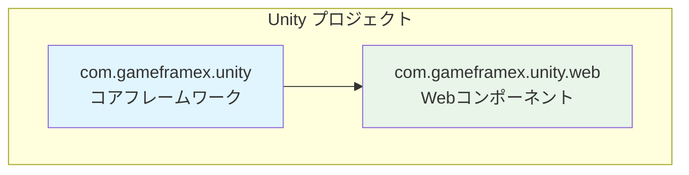
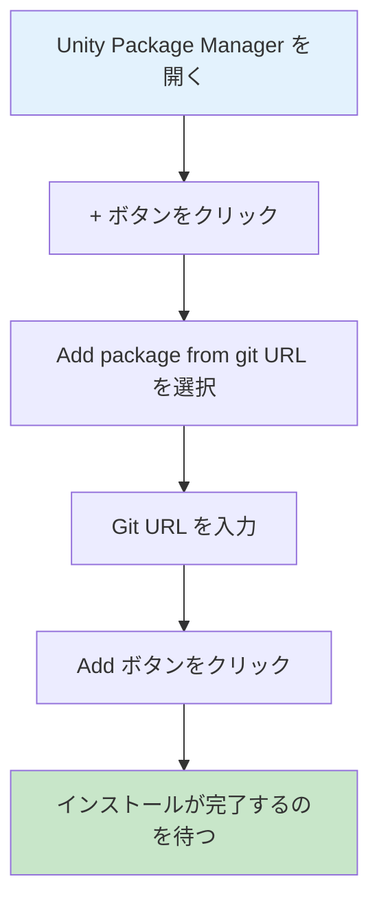
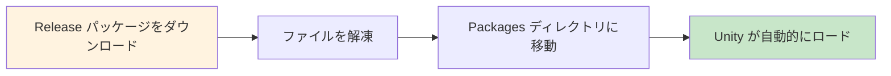

# インストール方法

GameFrameX Web コンポーネントは多様なインストール方法に対応し、異なるプロジェクトの要件とワークフローに適応します。本稿では3種類の推奨インストール方法を詳しく説明します。

## 概要

GameFrameX Web は高性能な Unity HTTP ネットワークリクエストライブラリであり、C# Task 非同期モードに基づいて構築され、GET、POST リクエストをサポートし、文字列、JSON、バイナリデータ等多种なフォーマットを扱うことができます。このコンポーネントは GameFrameX コアフレームワーク（com.gameframex.unity）に依存するため、インストール時にプロジェクトがコアフレームワークを正しく設定していることを確認してください。



## インストール前の準備

GameFrameX Web コンポーネントをインストールする前に、開発環境が以下の要件を満たしていることを確認してください：

| 要件 | 最小バージョン | 説明 |
|------|---------|------|
| Unity エディター | 2019.4+ | LTS バージョン推奨 |
| .NET Standard | 2.0+ | スクリプトレUNTIMEバージョン |
| Git | 任意バージョン | クローンまたは Git URL 追加用 |

> **ヒント**：最適な互換性のために、Unity 2020.3 LTS またはそれ以降のバージョンの使用を推奨します。

## インストール方法

### 方法一：Git URL からインストール（推奨）

これが最も推奨されるインストール方法であり、最新バージョンの取得とアップデートが容易です。

**操作手順：**

1. Unity エディターで **Package Manager** ウィンドウを開く
2. 左上隅の **"+"** ボタンをクリック
3. ドロップダウンメニューから **"Add package from git URL..."** を選択
4. 入力ボックスに以下の URL を貼り付け：
   ```
   https://github.com/gameframex/com.gameframex.unity.web.git
   ```
5. **"Add"** ボタンをクリックしてインストールが完了するのを待つ



> **Source**: [README.md](https://github.com/GameFrameX/com.gameframex.unity.web/blob/main/README.md#L20-L27)

**利点：**
- アップストリームの更新を自動的に追踪
- シンプルで迅速、一括インストール
- バージョン管理が容易

### 方法二：manifest.json からインストール

依存バージョンの精密な制御が必要な場合、または複数の GameFrameX コンポーネントを同時にインストールする必要がある場合に適用します。

**操作手順：**

1. プロジェクトの `Packages/manifest.json` ファイルを見つけて開く
2. `dependencies` ノードに以下の内容を追加：

```json
{
  "dependencies": {
    "com.gameframex.unity.web": "https://github.com/gameframex/com.gameframex.unity.web.git",
    "com.gameframex.unity": "https://github.com/gameframex/com.gameframex.unity.git"
  }
}
```

> **Source**: [README.md](https://github.com/GameFrameX/com.gameframex.unity.web/blob/main/README.md#L29-L40)

**説明：**
- `com.gameframex.unity` をコア依存として同時に追加する必要があります
- 具体的なバージョン番号を指定可能、例：`"com.gameframex.unity.web": "1.3.0"`
- manifest.json を修正後、Unity は自動的に依存関係を解析してインストール

**バージョン形式の説明：**

| バージョン形式 | 示例 | 説明 |
|---------|------|------|
| 最新メジャーバージョン | `1.3.3` | 精密バージョン |
| Git URL | `https://github.com/...git` | 常に最新を取得 |
| ブランチ | `#develop` | 指定ブランチを取得 |

### 方法三：手動インストール

ネットワークにアクセスできない場合、またはオフラインで使用する必要がある場合に適用します。

**操作手順：**

1. GitHub releases ページにアクセスして、最新バージョンのリリースパッケージをダウンロード：
   - [Releases ページ](https://github.com/GameFrameX/com.gameframex.unity.web/releases)
2. ダウンロードしたリリースパッケージを解凍
3. 解凍したフォルダーをプロジェクトの `Packages` ディレクトリに移動
4. Unity は自動的にパッケージを識別してロード



> **Source**: [README.md](https://github.com/GameFrameX/com.gameframex.unity.web/blob/main/README.md#L42-L46)

**注意事項：**
- 手動インストールのパッケージは自動的に更新を受け取らない
- 新バージョンを手動でダウンロードして置換する必要がある
- フォルダー名がパッケージ名と一致することを確認（com.gameframex.unity.web）

## インストール後の検証

インストール完了後、以下の方法で正常にインストールされたことを確認できます：

### Package Manager の確認

Unity で **Window > Package Manager** を開き、`GameFrameX Web` がリストに表示され、状態が **"In Project"** と表示されていることを確認します。

### アセンブリ参照の確認

シンプルなテストスクリプトを作成して、名前空間を正常に参照できることを確認：

```csharp
using GameFrameX.Web.Runtime;

public class VerifyInstall : MonoBehaviour
{
    private IWebManager webManager;
    
    void Start()
    {
        // Web マネージャーインスタンスを取得 시도
        webManager = GameFrameworkEntry.GetModule<IWebManager>();
        
        if (webManager != null)
        {
            Debug.Log("GameFrameX Web インストール成功！");
        }
    }
}
```

### 依存項目の確認

以下の依存項目が正しくインストールされていることを確認：

| 依存パッケージ | 必須 | 説明 |
|--------|------|------|
| com.gameframex.unity | ✅ 必須 | コアフレームワーク |
| GameFrameX.Network.Runtime | ✅ 必須 | ネットワーク基礎ライブラリ |
| ProtoBuffer.Runtime | ✅ 必須 | Protobuf サポート |

## アンインストール方法

GameFrameX Web コンポーネントをアンインストールする必要がある場合、インストール方法に応じて対応するアンインストール方法を選択してください。

### Package Manager からのアンインストール

1. **Window > Package Manager** を開く
2. リスト内で **Game Frame X Web** を見つける
3. 右側の **"Remove"** ボタンをクリック

### manifest.json からのアンインストール

`Packages/manifest.json` の `dependencies` から対応する行を削除：

```json
{
  "dependencies": {
    "com.gameframex.unity.web": "https://github.com/gameframex/com.gameframex.unity.web.git"
    // 上記の行を削除
  }
}
```

### 手動アンインストール

`Packages/com.gameframex.unity.web` フォルダーを直接削除すれば完了です。

## よくある質問

### Q1: インストール後に依存関係が不足しているというプロンプトが表示された場合？

これはコアフレームワークが正しくインストールされていないためです。まず `com.gameframex.unity` をインストールしてください：

```
https://github.com/gameframex/com.gameframex.unity.git
```

### Q2: Git URL インストールが失敗した場合の解決方法は？

1. ネットワーク接続が正常かどうか確認
2. プロキシまたは VPN を使用してみる
3. Git が正しくインストールされ、システム PATH にあることを確認

### Q3: 特定のバージョンをインストールする方法は？

manifest.json でバージョン番号を指定：

```json
{
  "dependencies": {
    "com.gameframex.unity.web": "1.3.3"
  }
}
```

## 関連リンク

- [プラグイン紹介](./01.overview)
- [クイックスタート - 基本使用法](./03.getting-started)
- [クイックスタート - WebComponent の使用](./08.web-component)
- [GitHub リポジトリ](https://github.com/GameFrameX/com.gameframex.unity.web.git)
- [公式ドキュメント](https://gameframex.doc.alianblank.com)
- [問題報告](https://github.com/GameFrameX/com.gameframex.unity.web/issues)
