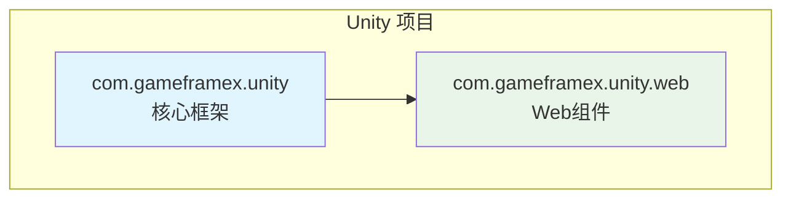
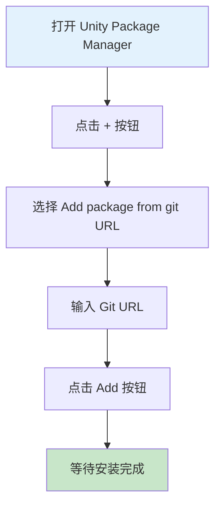
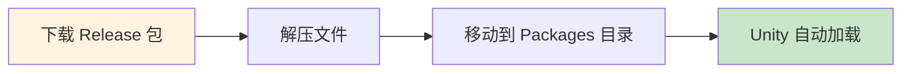

# インストールメソッド

GameFrameX Web コンポーネントサポート多种インストール方法，以适应不同的プロジェクト需求和工作フロー。本文将詳細介绍三种推奨的インストールメソッド。

## 概要

GameFrameX Web は高性能的 Unity HTTP 网络请求库，基于 C# Task 异步モードビルド，サポート GET、POST 请求，可処理字符串、JSON、二进制数据等多种フォーマット。该コンポーネント依赖 GameFrameX コアフレームワーク（com.gameframex.unity），インストール时〜する必要があります確認してくださいプロジェクト已正确設定コアフレームワーク。



## インストール前准备

在インストール GameFrameX Web コンポーネント之前，请確認してください您的开发環境满足以下要求：

| 要求 | 最低バージョン | 説明 |
|------|---------|------|
| Unity エディタ | 2019.4+ | LTS バージョン推奨 |
| .NET Standard | 2.0+ | 脚本ランタイムバージョン |
| Git | 任意バージョン | 用于克隆或追加 Git URL |

> **ヒント**：お勧め使用 Unity 2020.3 LTS 或更高バージョン以获得最佳兼容性。

## インストールメソッド

### 方法一：通过 Git URL インストール（推奨）

这是最推奨的インストール方法，〜できます轻松取得最新バージョン和アップデート。

**操作ステップ：**

1. 在 Unity エディタ中打开 **Package Manager** ウィンドウ
2. 点击左上角的 **"+"** ボタン
3. 在下拉メニュー中选择 **"Add package from git URL..."**
4. 在输入框中粘贴以下 URL：
   ```
   https://github.com/gameframex/com.gameframex.unity.web.git
   ```
5. 点击 **"Add"** ボタン等待インストール完成



> **Source**: [README.md](https://github.com/GameFrameX/com.gameframex.unity.web/blob/main/README.md#L20-L27)

**优势：**
- 自动跟踪上游アップデート
- シンプル快捷，一键インストール
- 便于バージョン管理

### 方法二：通过 manifest.json インストール

適しています〜する必要があります精确控制依赖バージョン或〜する必要があります同時にインストール多个 GameFrameX コンポーネント的シーン。

**操作ステップ：**

1. 找到并打开プロジェクト中的 `Packages/manifest.json` ファイル
2. 在 `dependencies` 节点中追加以下内容：

```json
{
  "dependencies": {
    "com.gameframex.unity.web": "https://github.com/gameframex/com.gameframex.unity.web.git",
    "com.gameframex.unity": "https://github.com/gameframex/com.gameframex.unity.git"
  }
}
```

> **Source**: [README.md](https://github.com/GameFrameX/com.gameframex.unity.web/blob/main/README.md#L29-L40)

**説明：**
- 〜しなければなりません同時に追加 `com.gameframex.unity` 作为コア依赖
- 〜できます指定具体バージョン号，例えば：`"com.gameframex.unity.web": "1.3.0"`
- 変更 manifest.json 后，Unity 会自动解析并インストール依赖

**バージョンフォーマット説明：**

| バージョンフォーマット | 例 | 説明 |
|---------|------|------|
| 最新主バージョン | `1.3.3` | 精确バージョン |
| Git URL | `https://github.com/...git` | 始终取得最新 |
| ブランチ | `#develop` | 取得指定ブランチ |

### 方法三：手动インストール

適しています无法访问网络或〜する必要があります离线使用的シーン。

**操作ステップ：**

1. 访问 GitHub releases 页面下载最新バージョン的リリースパッケージ：
   - [Releases 页面](https://github.com/GameFrameX/com.gameframex.unity.web/releases)
2. 解压下载的リリースパッケージ
3. 将解压后的ファイル夹移动到プロジェクト的 `Packages` ディレクトリ下
4. Unity 会自动识别并ロードパッケージ



> **Source**: [README.md](https://github.com/GameFrameX/com.gameframex.unity.web/blob/main/README.md#L42-L46)

**注意事项：**
- 手动インストール的パッケージ不会自动受信アップデート
- 〜する必要があります手动下载新バージョン并置換
- 確認してくださいファイル夹名称与パッケージ名匹配（com.gameframex.unity.web）

## インストール后検証

インストール完成后，〜できます通过以下方法検証是否成功：

### 確認 Package Manager

在 Unity 中打开 **Window > Package Manager**，確認 `GameFrameX Web` 已出现在列表中，ステータス显示为 **"In Project"**。

### 確認アセンブリ参照

作成一个シンプル的テスト脚本，確認名前空間〜できます正常参照：

```csharp
using GameFrameX.Web.Runtime;

public class VerifyInstall : MonoBehaviour
{
    private IWebManager webManager;
    
    void Start()
    {
        // 尝试获取 Web 管理器实例
        webManager = GameFrameworkEntry.GetModule<IWebManager>();
        
        if (webManager != null)
        {
            Debug.Log("GameFrameX Web 安装成功！");
        }
    }
}
```

### 確認依赖项

確認以下依赖项已正确インストール：

| 依赖パッケージ | 必需 | 説明 |
|--------|------|------|
| com.gameframex.unity | ✅ 必需 | コアフレームワーク |
| GameFrameX.Network.Runtime | ✅ 必需 | 网络基本库 |
| ProtoBuffer.Runtime | ✅ 必需 | Protobuf サポート |

## アンロード方法

如需アンロード GameFrameX Web コンポーネント，请根据インストール方法选择对应的アンロードメソッド：

### 通过 Package Manager アンロード

1. 打开 **Window > Package Manager**
2. 在列表中找到 **Game Frame X Web**
3. 点击右侧的 **"Remove"** ボタン

### 通过 manifest.json アンロード

在 `Packages/manifest.json` 的 `dependencies` 中移除对应行：

```json
{
  "dependencies": {
    "com.gameframex.unity.web": "https://github.com/gameframex/com.gameframex.unity.web.git"
    // 移除上面这一行
  }
}
```

### 手动アンロード

直接削除 `Packages/com.gameframex.unity.web` ファイル夹つまり可。

## よくある問題

### Q1: インストール后ヒント缺少依赖怎么办？

这是因为コアフレームワーク未正确インストール。请先インストール `com.gameframex.unity`：

```
https://github.com/gameframex/com.gameframex.unity.git
```

### Q2: Git URL インストール失敗怎么解决？

1. 確認网络连接是否正常
2. 尝试使用代理或 VPN
3. 確認 Git 已正确インストール且在系统 PATH 中

### Q3: 如何インストール特定バージョン？

在 manifest.json 中指定バージョン号：

```json
{
  "dependencies": {
    "com.gameframex.unity.web": "1.3.3"
  }
}
```

## 関連リンク

- [プラグイン介绍](./01.overview)
- [快速开始 - 基本用法](./03.getting-started)
- [快速开始 - 使用 WebComponent](./08.web-component)
- [GitHub リポジトリ](https://github.com/GameFrameX/com.gameframex.unity.web.git)
- [官方ドキュメント](https://gameframex.doc.alianblank.com)
- [問題反馈](https://github.com/GameFrameX/com.gameframex.unity.web/issues)
