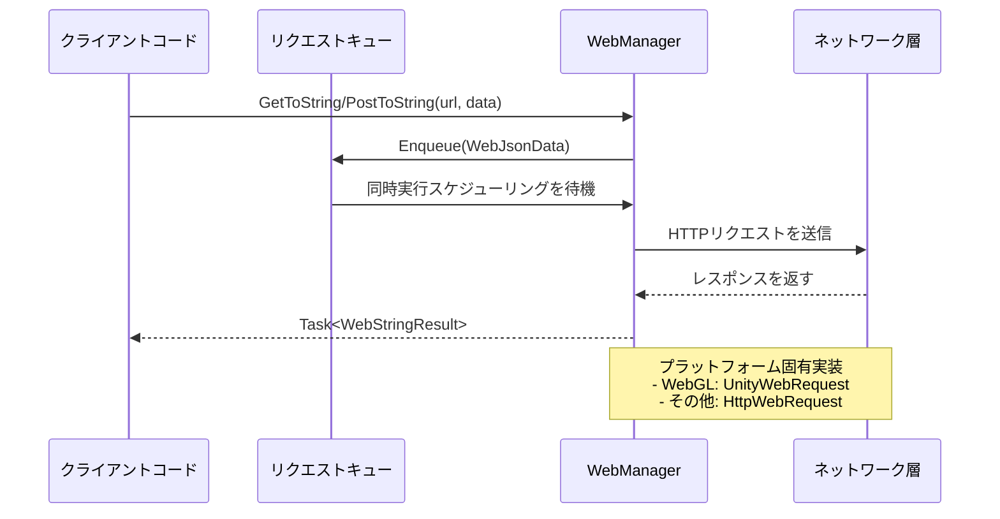

# 基本使用法

本ドキュメントでは、GameFrameX Web コンポーネントの基本的な使用方法について説明します。開発者が HTTP ネットワークリクエスト開発に迅速に入門できるよう支援します。

## 概要

GameFrameX Web コンポーネントは、シンプルで使いやすい HTTP リクエスト機能を提供します。GET、POST リクエストをサポートし、文字列、JSON、バイナリデータ等多种なフォーマットを扱うことができます。このコンポーネントは C# Task 非同期モードに基づいて開発され、async/await 構文をサポートし、高性能な非ブロッキングリクエスト処理を提供します。

使用を開始する前に、Web コンポーネントが正しくインストールされ設定されていることを確認してください。詳細については [インストール方法](./02.installation) を参照してください。

## WebManager インスタンスの取得

Web コンポーネントを使用する第一步は、`IWebManager` インスタンスを取得することです。取得方法は2種類あります：

### 方法一：GameFrameworkEntry を通じて取得（推奨）

GameFramework フレームワークのエントリーポイントを通じて Web マネージャーインスタンスを取得します。これは最も一般的な方法です：

```csharp
using GameFrameX.Web.Runtime;
using GameFrameX.Runtime;
using System.Threading.Tasks;

public class WebExample : MonoBehaviour
{
    private IWebManager webManager;

    private async void Start()
    {
        // Web マネージャーインスタンスを取得
        webManager = GameFrameworkEntry.GetModule<IWebManager>();
        
        // GET リクエストを送信
        var result = await webManager.GetToString("https://api.example.com/data");
        Debug.Log("Response: " + result.Result);
    }
}
```

> Source: [README.md](https://github.com/GameFrameX/com.gameframex.unity.web/blob/main/README.md#L52-L81)

### 方法二：WebComponent コンポーネントを通じて取得

Unity シーン内で WebComponent コンポーネントを作成し、コンポーネント方式で使用します：

```csharp
using GameFrameX.Web.Runtime;
using System.Threading.Tasks;
using System.Collections.Generic;

public class MyWebService : MonoBehaviour
{
    private WebComponent webComponent;
    
    private void Awake()
    {
        // WebComponent コンポーネントを取得または追加
        webComponent = gameObject.GetOrAddComponent<WebComponent>();
    }
    
    public async Task<string> GetUserDataAsync(string userId)
    {
        var queryParams = new Dictionary<string, string>
        {
            { "userId", userId }
        };
        
        var headers = new Dictionary<string, string>
        {
            { "Authorization", "Bearer your-token-here" }
        };
        
        var result = await webComponent.GetToString(
            "https://api.example.com/users", 
            queryParams, 
            headers
        );
        
        return result.Result;
    }
}
```

> Source: [README.md](https://github.com/GameFrameX/com.gameframex.unity.web/blob/main/README.md#L83-L123)

## GET リクエストの送信

GET リクエストはサーバーからデータを取得に使用されます。WebManager は複数のオーバーロードメソッドを提供し、異なるシーン要件を満たします。

### シンプル GET リクエスト

最も基本的な GET リクエストは、URL のみを提供する必要があります：

```csharp
// 文字列レスポンスを取得
var stringResult = await webManager.GetToString("https://api.example.com/data");
Debug.Log("Response: " + stringResult.Result);

// バイト配列レスポンスを取得（画像ダウンロード、ファイル等のバイナリデータに使用）
var bufferResult = await webManager.GetToBytes("https://api.example.com/image.png");
byte[] imageData = bufferResult.Result;
```

> Source: [IWebManager.cs](https://github.com/GameFrameX/com.gameframex.unity.web/blob/main/Runtime/Web/IWebManager.cs#L18-L26)

### クエリパラメータ付き GET リクエスト

Dictionary を通じて URL クエリパラメータを渡します：

```csharp
var queryParams = new Dictionary<string, string>
{
    { "page", "1" },
    { "pageSize", "20" },
    { "category", "book" }
};

var result = await webManager.GetToString(
    "https://api.example.com/products",
    queryParams
);
```

> Source: [IWebManager.cs](https://github.com/GameFrameX/com.gameframex.unity.web/blob/main/Runtime/Web/IWebManager.cs#L35-L45)

### リクエストヘッダー付き GET リクエスト

認証や特殊ヘッダー情報が必要なシーンで使用します：

```csharp
var queryParams = new Dictionary<string, string>
{
    { "id", "12345" }
};

var headers = new Dictionary<string, string>
{
    { "Authorization", "Bearer your-access-token" },
    { "Accept", "application/json" },
    { "Language", "ja-JP" }
};

var result = await webManager.GetToString(
    "https://api.example.com/user/profile",
    queryParams,
    headers
);
```

> Source: [IWebManager.cs](https://github.com/GameFrameX/com.gameframex.unity.web/blob/main/Runtime/Web/IWebManager.cs#L56-L67)

## POST リクエストの送信

POST リクエストはサーバーにデータを送信に使用されます。フォームデータと JSON フォーマットをサポート。

### シンプル POST リクエスト

最も基本的な POST フォームリクエスト：

```csharp
var formData = new Dictionary<string, object>
{
    { "username", "testuser" },
    { "password", "testpass" }
};

var result = await webManager.PostToString(
    "https://api.example.com/login",
    formData
);

Debug.Log("Login result: " + result.Result);
```

> Source: [IWebManager.cs](https://github.com/GameFrameX/com.gameframex.unity.web/blob/main/Runtime/Web/IWebManager.cs#L77-L87)

### クエリパラメータ付き POST リクエスト

URL クエリパラメータとフォームデータを同時に使用します：

```csharp
var formData = new Dictionary<string, object>
{
    { "title", "My Article" },
    { "content", "Article content here..." },
    { "author", "John Doe" }
};

var queryParams = new Dictionary<string, string>
{
    { "draft", "true" }  // URL クエリパラメータ
};

var result = await webManager.PostToString(
    "https://api.example.com/articles",
    formData,
    queryParams
);
```

> Source: [IWebManager.cs](https://github.com/GameFrameX/com.gameframex.unity.web/blob/main/Runtime/Web/IWebManager.cs#L87-L97)

### リクエストヘッダー付き POST リクエスト

完全なリクエストヘダー情報付きで POST リクエストを送信します：

```csharp
var formData = new Dictionary<string, object>
{
    { "data", "some value" }
};

var queryParams = new Dictionary<string, string>
{
    { "action", "update" }
};

var headers = new Dictionary<string, string>
{
    { "Authorization", "Bearer your-token" },
    { "Content-Type", "application/json" },
    { "X-Request-ID", Guid.NewGuid().ToString() }
};

var result = await webManager.PostToString(
    "https://api.example.com/data",
    formData,
    queryParams,
    headers
);
```

> Source: [IWebManager.cs](https://github.com/GameFrameX/com.gameframex.unity.web/blob/main/Runtime/Web/IWebManager.cs#L98)

### バイナリデータアップロード

バイト配列（ファイル、バイナリストリーム等）をアップロード：

```csharp
public async Task UploadBinaryDataAsync(byte[] fileData, string fileName)
{
    var queryParams = new Dictionary<string, string>
    {
        { "fileName", fileName }
    };
    
    var headers = new Dictionary<string, string>
    {
        { "Content-Type", "application/octet-stream" },
        { "Authorization", "Bearer your-token" }
    };
    
    var result = await webManager.PostToBytes(
        "https://api.example.com/upload", 
        fileData, 
        queryParams, 
        headers
    );
    
    if (result.Result != null && result.Result.Length > 0)
    {
        Debug.Log("Upload successful!");
    }
}
```

> Source: [README.md](https://github.com/GameFrameX/com.gameframex.unity.web/blob/main/README.md#L188-L217)

## リクエスト結果の処理

WebManager のリクエストメソッドは2種類の結果タイプを返します：`WebStringResult` と `WebBufferResult`。

### WebStringResult（文字列結果）

テキストレスポンスの処理に使用。JSON 文字列、HTML 等：

```csharp
var result = await webManager.GetToString("https://api.example.com/data");

// レスポンスコンテンツを取得
string responseText = result.Result;

// リクエスト時に渡されたカスタムデータを取得
object userData = result.UserData;

// 結果を出力
Debug.Log($"Response: {result}");
```

> Source: [WebStringResult.cs](https://github.com/GameFrameX/com.gameframex.unity.web/blob/main/Runtime/Web/WebStringResult.cs#L15-L38)

### WebBufferResult（バイト配列結果）

バイナリレスポンスの処理に使用。画像、オーディオ、ファイル等：

```csharp
var result = await webManager.GetToBytes("https://api.example.com/image.png");

// バイナリデータを取得
byte[] data = result.Result;

// リクエスト時に渡されたカスタムデータを取得
object userData = result.UserData;

// データがあるかどうか確認
if (data != null && data.Length > 0)
{
    Debug.Log($"Downloaded {data.Length} bytes");
}
```

> Source: [WebBufferResult.cs](https://github.com/GameFrameX/com.gameframex.unity.web/blob/main/Runtime/Web/WebBufferResult.cs#L1-L21)

### UserData によるコンテキストの传递

リクエスト時にカスタムデータを渡し、結果で取得できます。リクエストソースの識別やコンテキストの传递に使用：

```csharp
// リクエスト時にコンテキストデータを渡す
var requestContext = new { requestId = Guid.NewGuid(), source = "ProfileScreen" };

var result = await webManager.GetToString(
    "https://api.example.com/user/123",
    requestContext  // カスタムデータを渡す
);

// 結果処理時にコンテキストを取得
Debug.Log($"Request ID: {result.UserData}");
```

## エラー処理

完全なエラー処理はネットワークリクエスト開発において重要な环节です。WebManager は異なるタイプの例外をスローしてエラータイプを示します。

### 基本エラー処理

```csharp
public async Task<string> SafeWebRequestAsync(string url)
{
    try
    {
        var result = await webManager.GetToString(url);
        return result.Result;
    }
    catch (Exception ex)
    {
        Debug.LogError($"Request failed: {ex.Message}");
        return null;
    }
}
```

### 特定の例外タイプに対する処理

```csharp
public async Task<string> HandleErrorsAsync(string url)
{
    try
    {
        return await webManager.GetToString(url);
    }
    catch (TimeoutException ex)
    {
        // リクエストタイムアウト
        Debug.LogError($"リクエストタイムアウト: {ex.Message}");
        return null;
    }
    catch (WebException ex)
    {
        switch (ex.Status)
        {
            case WebExceptionStatus.Timeout:
                Debug.LogError("リクエストタイムアウト");
                break;
            case WebExceptionStatus.ConnectFailure:
                Debug.LogError("接続失敗");
                break;
            case WebExceptionStatus.ProtocolError:
                Debug.LogError($"プロトコルエラー: {ex.Message}");
                break;
            default:
                Debug.LogError($"ネットワークエラー: {ex.Message}");
                break;
        }
        return null;
    }
    catch (IOException ex)
    {
        Debug.LogError($"IOエラー: {ex.Message}");
        return null;
    }
    catch (Exception ex)
    {
        Debug.LogError($"不明なエラー: {ex.Message}");
        return null;
    }
}
```

> Source: [WebManager.cs](https://github.com/GameFrameX/com.gameframex.unity.web/blob/main/Runtime/Web/WebManager.cs#L298-L324)

### UnityWebRequest エラー（WebGL プラットフォーム）

WebGL プラットフォームでは、エラーは UnityWebRequest を通じて返されます：

```csharp
// WebGL プラットフォームのエラー処理示例
// UnityWebRequest は isNetworkError または isHttpError を返す
```

> Source: [WebManager.cs](https://github.com/GameFrameX/com.gameframex.unity.web/blob/main/Runtime/Web/WebManager.cs#L246-L252)

## ベースデータ管理

WebManager はベースデータ（Base Data）の設定をサポートしています。これらのデータはすべてのリクエストに自動的に追加され、認証情報、バージョン番号等を一律携带する必要があるシーンに適合します。

### ベースフォームデータの追加

```csharp
// ベースフォームデータを追加、すべての POST リクエストが自動的にこれらのデータを携带
webManager.AddBaseForm("appVersion", "1.0.0");
webManager.AddBaseForm("platform", "iOS");

// リクエストを送信時、ベースフォームデータは自動的にマージ
var formData = new Dictionary<string, object>
{
    { "username", "testuser" }
};

// 実際に送信されるフォーム: { "appVersion": "1.0.0", "platform": "iOS", "username": "testuser" }
var result = await webManager.PostToString("https://api.example.com/login", formData);
```

> Source: [WebManager.cs](https://github.com/GameFrameX/com.gameframex.unity.web/blob/main/Runtime/Web/WebManager.cs#L591-L594)

### ベースリクエストヘッダーの追加

```csharp
// ベースリクエストヘッダーを追加
webManager.AddBaseHeader("Authorization", "Bearer your-default-token");
webManager.AddBaseHeader("X-App-ID", "com.example.myapp");
webManager.AddBaseHeader("Accept", "application/json");

// リクエストを送信時、ベースリクエストヘッダーは自動的にすべてのリクエストにマージ
var result = await webManager.GetToString("https://api.example.com/data");
```

> Source: [WebManager.cs](https://github.com/GameFrameX/com.gameframex.unity.web/blob/main/Runtime/Web/WebManager.cs#L621-L624)

### ベースクエリパラメータの追加

```csharp
// ベースクエリパラメータを追加
webManager.AddBaseQueryString("lang", "ja-JP");
webManager.AddBaseQueryString("v", "1.0.0");

// リクエストを送信時、ベースクエリパラメータは自動的に URL に附加
var result = await webManager.GetToString("https://api.example.com/products");

// 実際のリクエスト URL: https://api.example.com/products?lang=ja-JP&v=1.0.0
```

> Source: [WebManager.cs](https://github.com/GameFrameX/com.gameframex.unity.web/blob/main/Runtime/Web/WebManager.cs#L651-L654)

### ベースデータ管理

```csharp
// 指定のベースデータを移除
webManager.RemoveBaseForm("appVersion");
webManager.RemoveBaseHeader("Authorization");
webManager.RemoveBaseQueryString("lang");

// すべてのベースデータをクリア
webManager.ClearBaseForm();
webManager.ClearBaseHeader();
webManager.ClearBaseQueryString();
```

> Source: [WebManager.cs](https://github.com/GameFrameX/com.gameframex.unity.web/blob/main/Runtime/Web/WebManager.cs#L600-L674)

## リクエストフロー概述

WebManager 内部はキュー机制を使用してリクエストを管理し、同時制御をサポート。以下はリクエスト処理の基本フローです：



## 関連リンク

- [プラグイン紹介](./01.overview) - Web コンポーネントの全体アーキテクチャと特性を理解
- [インストール方法](./02.installation) - 詳細なインストール手順
- [WebComponent の使用](./08.web-component) - WebComponent コンポーネントの詳細な理解
- [WebManager アーキテクチャ](./05.web-manager) - WebManager 内部アーキテクチャの深い理解
- [リクエスト結果タイプ](./06.result-types) - 結果タイプ定義の詳細な理解
- [IWebManager インターフェース](./04.iwebmanager-interface) - 完全な API インターフェースドキュメント
- [WebComponent コンポーネント](./08.web-component) - WebComponent コンポーネントの詳細ドキュメント
- [タイムアウト設定](./10.timeout-settings) - リクエストタイムアウトの設定
- [ベースデータ設定](./07.base-data) - ベースデータ管理の詳細
- [プラットフォーム差異説明](./09.platform-differences) - 異なるプラットフォームの差異説明
- [よくある質問](./11.troubleshooting) - よくある質問と回答
