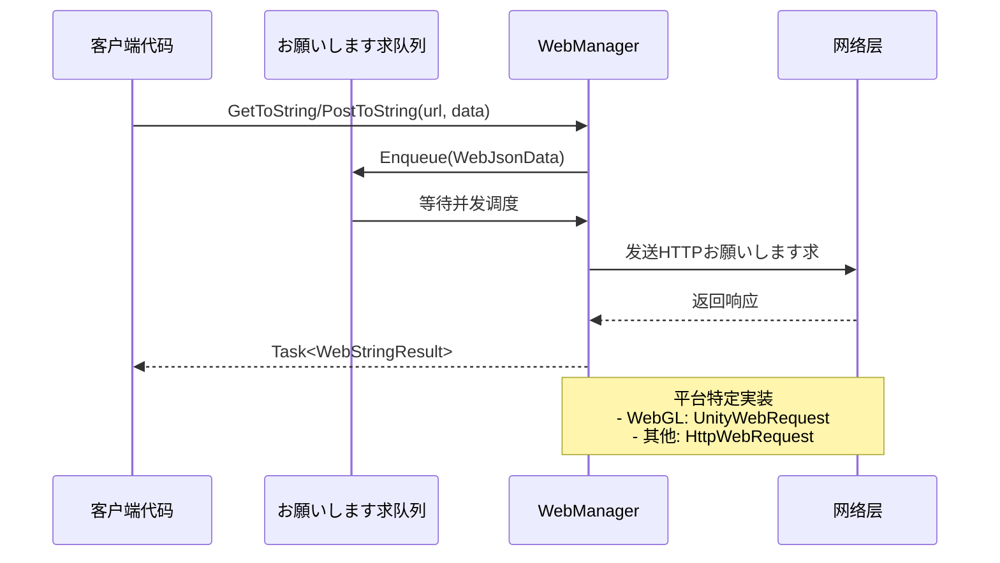

# 基础用法

本文档介绍 GameFrameX Web コンポーネント的基本使用メソッド，帮助開発者快速上手进行 HTTP 网络お願いします求开发。

## 概要

GameFrameX Web コンポーネント提供します简洁易用的 HTTP お願いします求機能，サポート GET、POST お願いします求，可处理字符串、JSON、二进制数据等多种格式。该コンポーネント基づく C# Task 异步模式开发，サポート async/await 语法，提供高性能的非阻塞お願いします求处理。

在开始使用之前，必ず已经正确安装并配置了 Web コンポーネント，详情お願いします参阅 [安装方法](./02.installation)。

## 取得 WebManager インスタンス

使用 Web コンポーネント的第一步是取得 `IWebManager` インスタンス。有两种主要方法取得：

### メソッド一：を通じて GameFrameworkEntry 取得（推荐）

を通じて GameFramework フレームワーク的エントリーポイント取得 Web 管理器インスタンス，这是最常用的方法：

```csharp
using GameFrameX.Web.Runtime;
using GameFrameX.Runtime;
using System.Threading.Tasks;

public class WebExample : MonoBehaviour
{
    private IWebManager webManager;

    private async void Start()
    {
        // 取得 Web 管理器インスタンス
        webManager = GameFrameworkEntry.GetModule<IWebManager>();
        
        // 发送 GET お願いします求
        var result = await webManager.GetToString("https://api.example.com/data");
        Debug.Log("Response: " + result.Result);
    }
}
```

> Source: [README.md](https://github.com/GameFrameX/com.gameframex.unity.web/blob/main/README.md#L52-L81)

### メソッド二：を通じて WebComponent コンポーネント取得

在 Unity シーン中作成 WebComponent コンポーネント，を通じてコンポーネント方法使用：

```csharp
using GameFrameX.Web.Runtime;
using System.Threading.Tasks;
using System.Collections.Generic;

public class MyWebService : MonoBehaviour
{
    private WebComponent webComponent;
    
    private void Awake()
    {
        // 取得或添加 WebComponent コンポーネント
        webComponent = gameObject.GetOrAddComponent<WebComponent>();
    }
    
    public async Task<string> GetUserDataAsync(string userId)
    {
        var queryParams = new Dictionary<string, string>
        {
            { "userId", userId }
        };
        
        var headers = new Dictionary<string, string>
        {
            { "Authorization", "Bearer your-token-here" }
        };
        
        var result = await webComponent.GetToString(
            "https://api.example.com/users", 
            queryParams, 
            headers
        );
        
        return result.Result;
    }
}
```

> Source: [README.md](https://github.com/GameFrameX/com.gameframex.unity.web/blob/main/README.md#L83-L123)

## 发送 GET お願いします求

GET お願いします求に使用从服务器取得数据，WebManager 提供します多种重载メソッド满足不同シーン需求。

### 简单 GET お願いします求

最基本的 GET お願いします求，仅必要提供 URL：

```csharp
// 取得字符串响应
var stringResult = await webManager.GetToString("https://api.example.com/data");
Debug.Log("Response: " + stringResult.Result);

// 取得字节数组响应（适に使用ダウンロード图片、ファイル等二进制数据）
var bufferResult = await webManager.GetToBytes("https://api.example.com/image.png");
byte[] imageData = bufferResult.Result;
```

> Source: [IWebManager.cs](https://github.com/GameFrameX/com.gameframex.unity.web/blob/main/Runtime/Web/IWebManager.cs#L18-L26)

### 带查询参数的 GET お願いします求

を通じて Dictionary 传递 URL 查询参数：

```csharp
var queryParams = new Dictionary<string, string>
{
    { "page", "1" },
    { "pageSize", "20" },
    { "category", "book" }
};

var result = await webManager.GetToString(
    "https://api.example.com/products",
    queryParams
);
```

> Source: [IWebManager.cs](https://github.com/GameFrameX/com.gameframex.unity.web/blob/main/Runtime/Web/IWebManager.cs#L35-L45)

### 带お願いします求头的 GET お願いします求

在必要认证或特殊头部信息的シーン下使用：

```csharp
var queryParams = new Dictionary<string, string>
{
    { "id", "12345" }
};

var headers = new Dictionary<string, string>
{
    { "Authorization", "Bearer your-access-token" },
    { "Accept", "application/json" },
    { "Language", "zh-CN" }
};

var result = await webManager.GetToString(
    "https://api.example.com/user/profile",
    queryParams,
    headers
);
```

> Source: [IWebManager.cs](https://github.com/GameFrameX/com.gameframex.unity.web/blob/main/Runtime/Web/IWebManager.cs#L56-L67)

## 发送 POST お願いします求

POST お願いします求に使用向服务器提交数据，サポート表单数据和 JSON 格式。

### 简单 POST お願いします求

最基本的 POST 表单お願いします求：

```csharp
var formData = new Dictionary<string, object>
{
    { "username", "testuser" },
    { "password", "testpass" }
};

var result = await webManager.PostToString(
    "https://api.example.com/login",
    formData
);

Debug.Log("Login result: " + result.Result);
```

> Source: [IWebManager.cs](https://github.com/GameFrameX/com.gameframex.unity.web/blob/main/Runtime/Web/IWebManager.cs#L77-L87)

### 带查询参数的 POST お願いします求

同时使用 URL 查询参数和表单数据：

```csharp
var formData = new Dictionary<string, object>
{
    { "title", "My Article" },
    { "content", "Article content here..." },
    { "author", "John Doe" }
};

var queryParams = new Dictionary<string, string>
{
    { "draft", "true" }  // URL 查询参数
};

var result = await webManager.PostToString(
    "https://api.example.com/articles",
    formData,
    queryParams
);
```

> Source: [IWebManager.cs](https://github.com/GameFrameX/com.gameframex.unity.web/blob/main/Runtime/Web/IWebManager.cs#L87-L97)

### 带お願いします求头的 POST お願いします求

发送带有完整お願いします求头信息的 POST お願いします求：

```csharp
var formData = new Dictionary<string, object>
{
    { "data", "some value" }
};

var queryParams = new Dictionary<string, string>
{
    { "action", "update" }
};

var headers = new Dictionary<string, string>
{
    { "Authorization", "Bearer your-token" },
    { "Content-Type", "application/json" },
    { "X-Request-ID", Guid.NewGuid().ToString() }
};

var result = await webManager.PostToString(
    "https://api.example.com/data",
    formData,
    queryParams,
    headers
);
```

> Source: [IWebManager.cs](https://github.com/GameFrameX/com.gameframex.unity.web/blob/main/Runtime/Web/IWebManager.cs#L98)

### 二进制数据上传

上传字节数组（如ファイル、二进制流）：

```csharp
public async Task UploadBinaryDataAsync(byte[] fileData, string fileName)
{
    var queryParams = new Dictionary<string, string>
    {
        { "fileName", fileName }
    };
    
    var headers = new Dictionary<string, string>
    {
        { "Content-Type", "application/octet-stream" },
        { "Authorization", "Bearer your-token" }
    };
    
    var result = await webManager.PostToBytes(
        "https://api.example.com/upload", 
        fileData, 
        queryParams, 
        headers
    );
    
    if (result.Result != null && result.Result.Length > 0)
    {
        Debug.Log("Upload successful!");
    }
}
```

> Source: [README.md](https://github.com/GameFrameX/com.gameframex.unity.web/blob/main/README.md#L188-L217)

## 处理お願いします求结果

WebManager 的お願いします求メソッド返回两种结果クラス型：`WebStringResult` 和 `WebBufferResult`。

### WebStringResult（字符串结果）

に使用处理文本响应，如 JSON 字符串、HTML 等：

```csharp
var result = await webManager.GetToString("https://api.example.com/data");

// 取得响应内容
string responseText = result.Result;

// 取得お願いします求时传入的自定义数据
object userData = result.UserData;

// 输出结果
Debug.Log($"Response: {result}");
```

> Source: [WebStringResult.cs](https://github.com/GameFrameX/com.gameframex.unity.web/blob/main/Runtime/Web/WebStringResult.cs#L15-L38)

### WebBufferResult（字节数组结果）

に使用处理二进制响应，如图片、音频、ファイル等：

```csharp
var result = await webManager.GetToBytes("https://api.example.com/image.png");

// 取得二进制数据
byte[] data = result.Result;

// 取得お願いします求时传入的自定义数据
object userData = result.UserData;

// 检查是否有数据
if (data != null && data.Length > 0)
{
    Debug.Log($"Downloaded {data.Length} bytes");
}
```

> Source: [WebBufferResult.cs](https://github.com/GameFrameX/com.gameframex.unity.web/blob/main/Runtime/Web/WebBufferResult.cs#L1-L21)

### 使用 UserData 传递上下文

在发起お願いします求时传入自定义数据，可能在结果中取得，に使用标识お願いします求来源或传递上下文：

```csharp
// 发起お願いします求时传入上下文数据
var requestContext = new { requestId = Guid.NewGuid(), source = "ProfileScreen" };

var result = await webManager.GetToString(
    "https://api.example.com/user/123",
    requestContext  // 传入自定义数据
);

// 在处理结果时取得上下文
Debug.Log($"Request ID: {result.UserData}");
```

## 错误处理

完善的错误处理是网络お願いします求开发的重要环节。WebManager 会抛出不同クラス型的異常来指示错误クラス型。

### 基础错误处理

```csharp
public async Task<string> SafeWebRequestAsync(string url)
{
    try
    {
        var result = await webManager.GetToString(url);
        return result.Result;
    }
    catch (Exception ex)
    {
        Debug.LogError($"Request failed: {ex.Message}");
        return null;
    }
}
```

### 针对特定異常クラス型的处理

```csharp
public async Task<string> HandleErrorsAsync(string url)
{
    try
    {
        return await webManager.GetToString(url);
    }
    catch (TimeoutException ex)
    {
        // お願いします求超时
        Debug.LogError($"お願いします求超时: {ex.Message}");
        return null;
    }
    catch (WebException ex)
    {
        switch (ex.Status)
        {
            case WebExceptionStatus.Timeout:
                Debug.LogError("お願いします求超时");
                break;
            case WebExceptionStatus.ConnectFailure:
                Debug.LogError("连接失败");
                break;
            case WebExceptionStatus.ProtocolError:
                Debug.LogError($"协议错误: {ex.Message}");
                break;
            default:
                Debug.LogError($"网络错误: {ex.Message}");
                break;
        }
        return null;
    }
    catch (IOException ex)
    {
        Debug.LogError($"IO错误: {ex.Message}");
        return null;
    }
    catch (Exception ex)
    {
        Debug.LogError($"未知错误: {ex.Message}");
        return null;
    }
}
```

> Source: [WebManager.cs](https://github.com/GameFrameX/com.gameframex.unity.web/blob/main/Runtime/Web/WebManager.cs#L298-L324)

### 使用 UnityWebRequest 错误（WebGL 平台）

在 WebGL 平台上，错误を通じて UnityWebRequest 返回：

```csharp
// WebGL 平台的错误处理示例
// UnityWebRequest 会返回 isNetworkError 或 isHttpError
```

> Source: [WebManager.cs](https://github.com/GameFrameX/com.gameframex.unity.web/blob/main/Runtime/Web/WebManager.cs#L246-L252)

## 基础数据管理

WebManager サポート設定基础数据（Base Data），这些数据会自动添加到所有お願いします求中，适に使用必要统一携带认证信息、版本号等シーン。

### 添加基础表单数据

```csharp
// 添加基础表单数据，所有 POST お願いします求都会自动携带这些数据
webManager.AddBaseForm("appVersion", "1.0.0");
webManager.AddBaseForm("platform", "iOS");

// 发送お願いします求时，基础表单数据会自动合并
var formData = new Dictionary<string, object>
{
    { "username", "testuser" }
};

// 实际发送的表单会是: { "appVersion": "1.0.0", "platform": "iOS", "username": "testuser" }
var result = await webManager.PostToString("https://api.example.com/login", formData);
```

> Source: [WebManager.cs](https://github.com/GameFrameX/com.gameframex.unity.web/blob/main/Runtime/Web/WebManager.cs#L591-L594)

### 添加基础お願いします求头

```csharp
// 添加基础お願いします求头
webManager.AddBaseHeader("Authorization", "Bearer your-default-token");
webManager.AddBaseHeader("X-App-ID", "com.example.myapp");
webManager.AddBaseHeader("Accept", "application/json");

// 发送お願いします求时，基础お願いします求头会自动合并到所有お願いします求中
var result = await webManager.GetToString("https://api.example.com/data");
```

> Source: [WebManager.cs](https://github.com/GameFrameX/com.gameframex.unity.web/blob/main/Runtime/Web/WebManager.cs#L621-L624)

### 添加基础查询参数

```csharp
// 添加基础查询参数
webManager.AddBaseQueryString("lang", "zh-CN");
webManager.AddBaseQueryString("v", "1.0.0");

// 发送お願いします求时，基础查询参数会自动附加到 URL
var result = await webManager.GetToString("https://api.example.com/products");

// 实际お願いします求的 URL 会是: https://api.example.com/products?lang=zh-CN&v=1.0.0
```

> Source: [WebManager.cs](https://github.com/GameFrameX/com.gameframex.unity.web/blob/main/Runtime/Web/WebManager.cs#L651-L654)

### 管理基础数据

```csharp
// 移除指定的基础数据
webManager.RemoveBaseForm("appVersion");
webManager.RemoveBaseHeader("Authorization");
webManager.RemoveBaseQueryString("lang");

// 清空所有基础数据
webManager.ClearBaseForm();
webManager.ClearBaseHeader();
webManager.ClearBaseQueryString();
```

> Source: [WebManager.cs](https://github.com/GameFrameX/com.gameframex.unity.web/blob/main/Runtime/Web/WebManager.cs#L600-L674)

## お願いします求フロー概述

WebManager 内部采用队列机制管理お願いします求，サポート并发控制。以下是お願いします求处理的基本フロー：



## 関連リンク

- [插件介绍](./01.overview) - 了解 Web コンポーネント的整体架构和特性
- [安装方法](./02.installation) - 详细安装手順
- [使用 WebComponent](./08.web-component) - 深入了解 WebComponent コンポーネント
- [WebManager 架构](./05.web-manager) - 深入理解 WebManager 内部架构
- [お願いします求结果クラス型](./06.result-types) - 详细了解结果クラス型定义
- [IWebManager インターフェース](./04.iwebmanager-interface) - 完整的 API インターフェース文档
- [WebComponent コンポーネント](./08.web-component) - WebComponent コンポーネント详细文档
- [超时配置](./10.timeout-settings) - 配置お願いします求超时
- [基础数据配置](./07.base-data) - 基础数据管理详解
- [平台差异説明](./09.platform-differences) - 不同平台的差异説明
- [常见问题](./11.troubleshooting) - 常见问题解答
