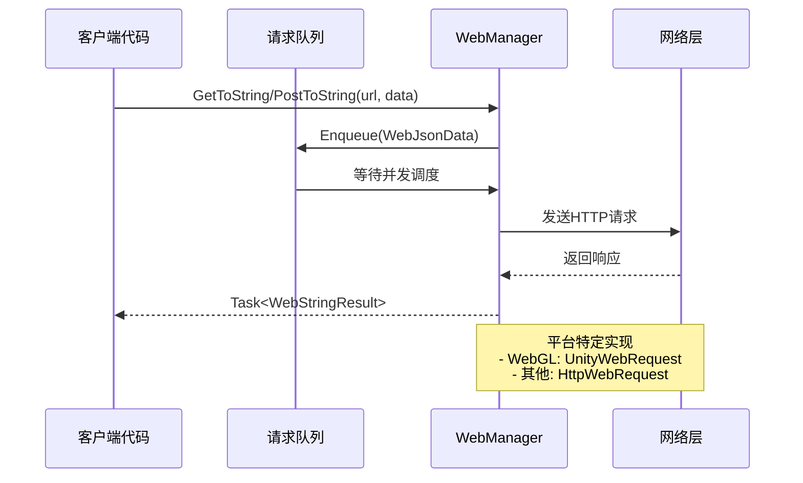

# 基本用法

このドキュメント介绍 GameFrameX Web コンポーネント的基本使用メソッド，帮助開発者快速上手进行 HTTP 网络请求开发。

## 概要

GameFrameX Web コンポーネント提供しますシンプル易用的 HTTP 请求機能，サポート GET、POST 请求，可処理字符串、JSON、二进制数据等多种フォーマット。该コンポーネント基于 C# Task 异步モード开发，サポート async/await 语法，提供高性能的非阻塞请求処理。

在开始使用之前，请確認してくださいすでに正确インストール并設定了 Web コンポーネント，详情请参照 [インストール方法](./02.installation)。

## 取得 WebManager インスタンス

使用 Web コンポーネント的第1步是取得 `IWebManager` インスタンス。有两种主な方法取得：

### 方法一：通过 GameFrameworkEntry 取得（推奨）

通过 GameFramework フレームワーク的入口取得 Web マネージャーインスタンス，这是最常用的方法：

```csharp
using GameFrameX.Web.Runtime;
using GameFrameX.Runtime;
using System.Threading.Tasks;

public class WebExample : MonoBehaviour
{
    private IWebManager webManager;

    private async void Start()
    {
        // 获取 Web 管理器实例
        webManager = GameFrameworkEntry.GetModule<IWebManager>();
        
        // 发送 GET 请求
        var result = await webManager.GetToString("https://api.example.com/data");
        Debug.Log("Response: " + result.Result);
    }
}
```

> Source: [README.md](https://github.com/GameFrameX/com.gameframex.unity.web/blob/main/README.md#L52-L81)

### 方法二：通过 WebComponent コンポーネント取得

在 Unity シーン中作成 WebComponent コンポーネント，通过コンポーネント方法使用：

```csharp
using GameFrameX.Web.Runtime;
using System.Threading.Tasks;
using System.Collections.Generic;

public class MyWebService : MonoBehaviour
{
    private WebComponent webComponent;
    
    private void Awake()
    {
        // 获取或添加 WebComponent 组件
        webComponent = gameObject.GetOrAddComponent<WebComponent>();
    }
    
    public async Task<string> GetUserDataAsync(string userId)
    {
        var queryParams = new Dictionary<string, string>
        {
            { "userId", userId }
        };
        
        var headers = new Dictionary<string, string>
        {
            { "Authorization", "Bearer your-token-here" }
        };
        
        var result = await webComponent.GetToString(
            "https://api.example.com/users", 
            queryParams, 
            headers
        );
        
        return result.Result;
    }
}
```

> Source: [README.md](https://github.com/GameFrameX/com.gameframex.unity.web/blob/main/README.md#L83-L123)

## 发送 GET 请求

GET 请求用于从服务器取得数据，WebManager 提供します多种オーバーロードメソッド满足不同シーン需求。

### シンプル GET 请求

最基本的 GET 请求，仅〜する必要があります提供 URL：

```csharp
// 获取字符串响应
var stringResult = await webManager.GetToString("https://api.example.com/data");
Debug.Log("Response: " + stringResult.Result);

// 获取字节数组响应（适用于下载图片、文件等二进制数据）
var bufferResult = await webManager.GetToBytes("https://api.example.com/image.png");
byte[] imageData = bufferResult.Result;
```

> Source: [IWebManager.cs](https://github.com/GameFrameX/com.gameframex.unity.web/blob/main/Runtime/Web/IWebManager.cs#L18-L26)

### 带查询パラメータ的 GET 请求

通过 Dictionary 传递 URL 查询パラメータ：

```csharp
var queryParams = new Dictionary<string, string>
{
    { "page", "1" },
    { "pageSize", "20" },
    { "category", "book" }
};

var result = await webManager.GetToString(
    "https://api.example.com/products",
    queryParams
);
```

> Source: [IWebManager.cs](https://github.com/GameFrameX/com.gameframex.unity.web/blob/main/Runtime/Web/IWebManager.cs#L35-L45)

### 带请求头的 GET 请求

在〜する必要があります认证或特殊头部情報的シーン下使用：

```csharp
var queryParams = new Dictionary<string, string>
{
    { "id", "12345" }
};

var headers = new Dictionary<string, string>
{
    { "Authorization", "Bearer your-access-token" },
    { "Accept", "application/json" },
    { "Language", "zh-CN" }
};

var result = await webManager.GetToString(
    "https://api.example.com/user/profile",
    queryParams,
    headers
);
```

> Source: [IWebManager.cs](https://github.com/GameFrameX/com.gameframex.unity.web/blob/main/Runtime/Web/IWebManager.cs#L56-L67)

## 发送 POST 请求

POST 请求用于向服务器提交数据，サポート表单数据和 JSON フォーマット。

### シンプル POST 请求

最基本的 POST 表单请求：

```csharp
var formData = new Dictionary<string, object>
{
    { "username", "testuser" },
    { "password", "testpass" }
};

var result = await webManager.PostToString(
    "https://api.example.com/login",
    formData
);

Debug.Log("Login result: " + result.Result);
```

> Source: [IWebManager.cs](https://github.com/GameFrameX/com.gameframex.unity.web/blob/main/Runtime/Web/IWebManager.cs#L77-L87)

### 带查询パラメータ的 POST 请求

同時に使用 URL 查询パラメータ和表单数据：

```csharp
var formData = new Dictionary<string, object>
{
    { "title", "My Article" },
    { "content", "Article content here..." },
    { "author", "John Doe" }
};

var queryParams = new Dictionary<string, string>
{
    { "draft", "true" }  // URL 查询参数
};

var result = await webManager.PostToString(
    "https://api.example.com/articles",
    formData,
    queryParams
);
```

> Source: [IWebManager.cs](https://github.com/GameFrameX/com.gameframex.unity.web/blob/main/Runtime/Web/IWebManager.cs#L87-L97)

### 带请求头的 POST 请求

发送带有完全な请求头情報的 POST 请求：

```csharp
var formData = new Dictionary<string, object>
{
    { "data", "some value" }
};

var queryParams = new Dictionary<string, string>
{
    { "action", "update" }
};

var headers = new Dictionary<string, string>
{
    { "Authorization", "Bearer your-token" },
    { "Content-Type", "application/json" },
    { "X-Request-ID", Guid.NewGuid().ToString() }
};

var result = await webManager.PostToString(
    "https://api.example.com/data",
    formData,
    queryParams,
    headers
);
```

> Source: [IWebManager.cs](https://github.com/GameFrameX/com.gameframex.unity.web/blob/main/Runtime/Web/IWebManager.cs#L98)

### 二进制数据上传

上传字节数组（如ファイル、二进制流）：

```csharp
public async Task UploadBinaryDataAsync(byte[] fileData, string fileName)
{
    var queryParams = new Dictionary<string, string>
    {
        { "fileName", fileName }
    };
    
    var headers = new Dictionary<string, string>
    {
        { "Content-Type", "application/octet-stream" },
        { "Authorization", "Bearer your-token" }
    };
    
    var result = await webManager.PostToBytes(
        "https://api.example.com/upload", 
        fileData, 
        queryParams, 
        headers
    );
    
    if (result.Result != null && result.Result.Length > 0)
    {
        Debug.Log("Upload successful!");
    }
}
```

> Source: [README.md](https://github.com/GameFrameX/com.gameframex.unity.web/blob/main/README.md#L188-L217)

## 処理请求結果

WebManager 的请求メソッド返す两种結果タイプ：`WebStringResult` 和 `WebBufferResult`。

### WebStringResult（字符串結果）

用于処理文本响应，如 JSON 字符串、HTML 等：

```csharp
var result = await webManager.GetToString("https://api.example.com/data");

// 获取响应内容
string responseText = result.Result;

// 获取请求时传入的自定义数据
object userData = result.UserData;

// 输出结果
Debug.Log($"Response: {result}");
```

> Source: [WebStringResult.cs](https://github.com/GameFrameX/com.gameframex.unity.web/blob/main/Runtime/Web/WebStringResult.cs#L15-L38)

### WebBufferResult（字节数组結果）

用于処理二进制响应，如图片、音频、ファイル等：

```csharp
var result = await webManager.GetToBytes("https://api.example.com/image.png");

// 获取二进制数据
byte[] data = result.Result;

// 获取请求时传入的自定义数据
object userData = result.UserData;

// 检查是否有数据
if (data != null && data.Length > 0)
{
    Debug.Log($"Downloaded {data.Length} bytes");
}
```

> Source: [WebBufferResult.cs](https://github.com/GameFrameX/com.gameframex.unity.web/blob/main/Runtime/Web/WebBufferResult.cs#L1-L21)

### 使用 UserData 传递上下文

在发起请求时传入自定義数据，〜できます在結果中取得，用于标识请求来源或传递上下文：

```csharp
// 发起请求时传入上下文数据
var requestContext = new { requestId = Guid.NewGuid(), source = "ProfileScreen" };

var result = await webManager.GetToString(
    "https://api.example.com/user/123",
    requestContext  // 传入自定义数据
);

// 在处理结果时获取上下文
Debug.Log($"Request ID: {result.UserData}");
```

## エラー処理

完善的エラー処理是网络请求开发的重要な环节。WebManager 会抛出不同タイプ的例外来指示エラータイプ。

### 基本エラー処理

```csharp
public async Task<string> SafeWebRequestAsync(string url)
{
    try
    {
        var result = await webManager.GetToString(url);
        return result.Result;
    }
    catch (Exception ex)
    {
        Debug.LogError($"Request failed: {ex.Message}");
        return null;
    }
}
```

### 针对特定例外タイプ的処理

```csharp
public async Task<string> HandleErrorsAsync(string url)
{
    try
    {
        return await webManager.GetToString(url);
    }
    catch (TimeoutException ex)
    {
        // 请求超时
        Debug.LogError($"请求超时: {ex.Message}");
        return null;
    }
    catch (WebException ex)
    {
        switch (ex.Status)
        {
            case WebExceptionStatus.Timeout:
                Debug.LogError("请求超时");
                break;
            case WebExceptionStatus.ConnectFailure:
                Debug.LogError("连接失败");
                break;
            case WebExceptionStatus.ProtocolError:
                Debug.LogError($"协议错误: {ex.Message}");
                break;
            default:
                Debug.LogError($"网络错误: {ex.Message}");
                break;
        }
        return null;
    }
    catch (IOException ex)
    {
        Debug.LogError($"IO错误: {ex.Message}");
        return null;
    }
    catch (Exception ex)
    {
        Debug.LogError($"未知错误: {ex.Message}");
        return null;
    }
}
```

> Source: [WebManager.cs](https://github.com/GameFrameX/com.gameframex.unity.web/blob/main/Runtime/Web/WebManager.cs#L298-L324)

### 使用 UnityWebRequest エラー（WebGL プラットフォーム）

在 WebGL プラットフォーム上，エラー通过 UnityWebRequest 返す：

```csharp
// WebGL 平台的错误处理示例
// UnityWebRequest 会返回 isNetworkError 或 isHttpError
```

> Source: [WebManager.cs](https://github.com/GameFrameX/com.gameframex.unity.web/blob/main/Runtime/Web/WebManager.cs#L246-L252)

## 基本数据管理

WebManager サポート設定基本数据（Base Data），这些数据会自动追加到所有请求中，適しています〜する必要があります統一された携带认证情報、バージョン号等シーン。

### 追加基本表单数据

```csharp
// 添加基础表单数据，所有 POST 请求都会自动携带这些数据
webManager.AddBaseForm("appVersion", "1.0.0");
webManager.AddBaseForm("platform", "iOS");

// 发送请求时，基础表单数据会自动合并
var formData = new Dictionary<string, object>
{
    { "username", "testuser" }
};

// 实际发送的表单会是: { "appVersion": "1.0.0", "platform": "iOS", "username": "testuser" }
var result = await webManager.PostToString("https://api.example.com/login", formData);
```

> Source: [WebManager.cs](https://github.com/GameFrameX/com.gameframex.unity.web/blob/main/Runtime/Web/WebManager.cs#L591-L594)

### 追加基本请求头

```csharp
// 添加基础请求头
webManager.AddBaseHeader("Authorization", "Bearer your-default-token");
webManager.AddBaseHeader("X-App-ID", "com.example.myapp");
webManager.AddBaseHeader("Accept", "application/json");

// 发送请求时，基础请求头会自动合并到所有请求中
var result = await webManager.GetToString("https://api.example.com/data");
```

> Source: [WebManager.cs](https://github.com/GameFrameX/com.gameframex.unity.web/blob/main/Runtime/Web/WebManager.cs#L621-L624)

### 追加基本查询パラメータ

```csharp
// 添加基础查询参数
webManager.AddBaseQueryString("lang", "zh-CN");
webManager.AddBaseQueryString("v", "1.0.0");

// 发送请求时，基础查询参数会自动附加到 URL
var result = await webManager.GetToString("https://api.example.com/products");

// 实际请求的 URL 会是: https://api.example.com/products?lang=zh-CN&v=1.0.0
```

> Source: [WebManager.cs](https://github.com/GameFrameX/com.gameframex.unity.web/blob/main/Runtime/Web/WebManager.cs#L651-L654)

### 管理基本数据

```csharp
// 移除指定的基础数据
webManager.RemoveBaseForm("appVersion");
webManager.RemoveBaseHeader("Authorization");
webManager.RemoveBaseQueryString("lang");

// 清空所有基础数据
webManager.ClearBaseForm();
webManager.ClearBaseHeader();
webManager.ClearBaseQueryString();
```

> Source: [WebManager.cs](https://github.com/GameFrameX/com.gameframex.unity.web/blob/main/Runtime/Web/WebManager.cs#L600-L674)

## 请求フロー概要

WebManager 内部采用队列机制管理请求，サポート并发控制。以下是请求処理的基本フロー：



## 関連リンク

- [プラグイン介绍](./01.overview) - 理解する Web コンポーネント的整体アーキテクチャ和特性
- [インストール方法](./02.installation) - 詳細インストールステップ
- [使用 WebComponent](./08.web-component) - 深入理解する WebComponent コンポーネント
- [WebManager アーキテクチャ](./05.web-manager) - 深入理解 WebManager 内部アーキテクチャ
- [请求結果タイプ](./06.result-types) - 詳細理解する結果タイプ定義
- [IWebManager インターフェース](./04.iwebmanager-interface) - 完全な的 API インターフェースドキュメント
- [WebComponent コンポーネント](./08.web-component) - WebComponent コンポーネント詳細ドキュメント
- [超时設定](./10.timeout-settings) - 設定请求超时
- [基本数据設定](./07.base-data) - 基本数据管理详解
- [プラットフォーム差异説明](./09.platform-differences) - 不同プラットフォーム的差异説明
- [常见問題](./11.troubleshooting) - 常见問題解答
