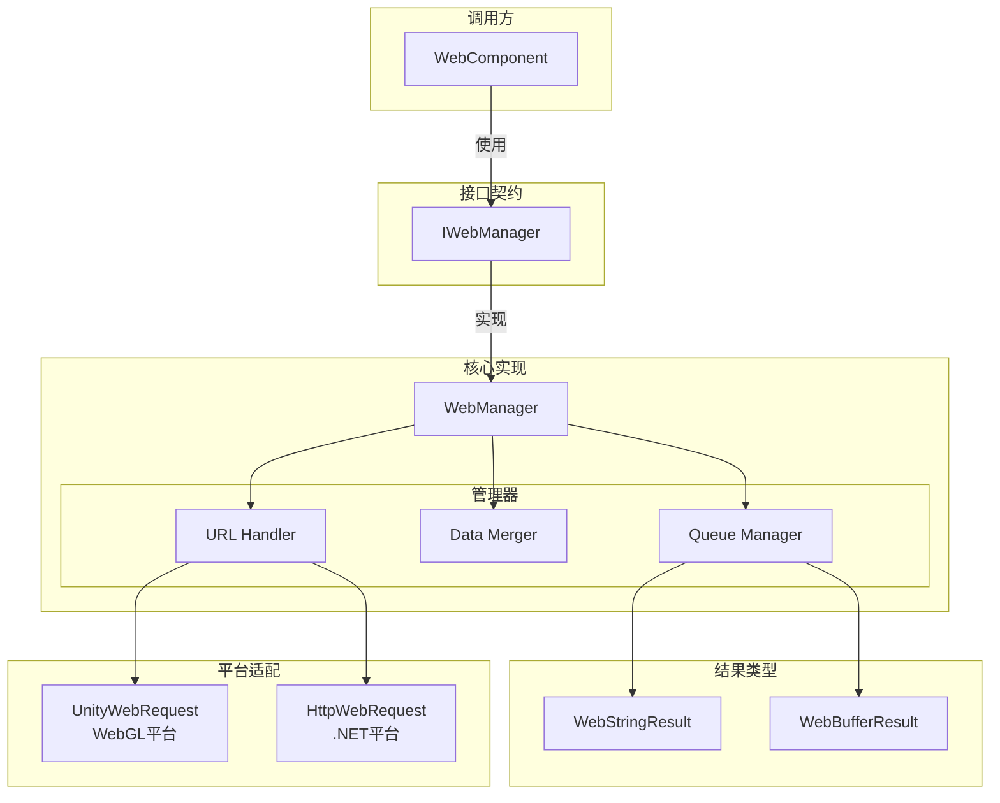
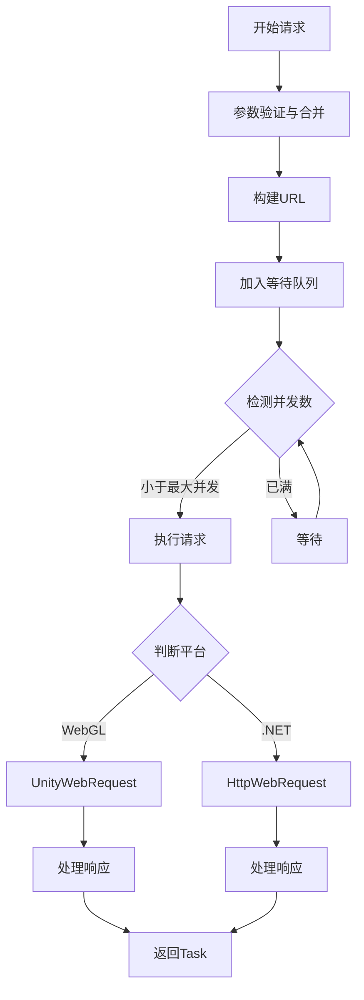

# IWebManager インターフェース

IWebManager 是 GameFrameX Web プラグイン的コアインターフェース，提供します統一された的 HTTP GET 和 POST 请求機能。该インターフェースカプセル化了底层网络请求的実装细节，サポート多种请求パラメータ组合，并提供します基本数据管理機能。

## 概要

IWebManager インターフェース定義了 Web 请求マネージャー的契约规范，主な承担以下职责：

1. **HTTP 请求処理**：提供 GET 和 POST 两种 HTTP メソッド的异步请求サポート
2. **响应タイプサポート**：サポート字符串和字节数组两种响应フォーマット
3. **请求パラメータ管理**：サポート查询パラメータ、HTTP 请求头和表单数据的柔軟组合
4. **基本数据复用**：提供全局基本数据設定，每次请求自动合并基本数据
5. **超时控制**：提供可設定的超时时间設定

该インターフェース的デフォルト実装为 `WebManager` 类，它継承自 `GameFrameworkModule`，是 GameFrameX フレームワーク的コアモジュール之一。

> **設計意图**：IWebManager 采用队列式的请求管理机制，通过等待队列和发送列表実装请求的缓冲与并发控制。デフォルト最大并发数为 8 个连接，可根据服务器承载能力调整。

## アーキテクチャ設計

### コアコンポーネント关系



### 请求処理フロー



## API リファレンス

### 请求メソッド

#### GET 请求

##### `GetToString(url: string, userData?: object): Task<WebStringResult>`

发送シンプル的 GET 请求，返す字符串フォーマット的响应結果。

**パラメータ：**
- `url` (string): 请求的目标 URL 地址
- `userData` (object, 可选): ユーザー自定義数据，会在响应結果中原样返す

**返す：** `Task<WebStringResult>` - パッケージ含字符串結果的异步任务

**例：**
```csharp
var webManager = GameFrameworkEntry.GetModule<IWebManager>();
var result = await webManager.GetToString("https://api.example.com/data");
Debug.Log(result.Result);
```
> Source: [IWebManager.cs](https://github.com/GameFrameX/com.gameframex.unity.web/blob/main/Runtime/Web/IWebManager.cs#L18)

---

##### `GetToString(url: string, queryString: Dictionary<string, string>, userData?: object): Task<WebStringResult>`

发送带查询パラメータ的 GET 请求，返す字符串フォーマット的响应結果。

**パラメータ：**
- `url` (string): 请求的目标 URL 地址
- `queryString` (Dictionary<string, string>): URL 查询パラメータ字典
- `userData` (object, 可选): ユーザー自定義数据

**返す：** `Task<WebStringResult>`

---

##### `GetToString(url: string, queryString: Dictionary<string, string>, header: Dictionary<string, string>, userData?: object): Task<WebStringResult>`

发送带查询パラメータ和请求头的 GET 请求，返す字符串フォーマット的响应結果。

**パラメータ：**
- `url` (string): 请求的目标 URL 地址
- `queryString` (Dictionary<string, string>): URL 查询パラメータ字典
- `header` (Dictionary<string, string>): HTTP 请求头字典
- `userData` (object, 可选): ユーザー自定義数据

**返す：** `Task<WebStringResult>`

---

##### `GetToBytes(url: string, userData?: object): Task<WebBufferResult>`

发送シンプル的 GET 请求，返す字节数组フォーマット的响应結果。適しています下载二进制数据如图片、音频等。

**パラメータ：**
- `url` (string): 请求的目标 URL 地址
- `userData` (object, 可选): ユーザー自定義数据

**返す：** `Task<WebBufferResult>` - パッケージ含字节数组的异步任务

**例：**
```csharp
var webManager = GameFrameworkEntry.GetModule<IWebManager>();
var result = await webManager.GetToBytes("https://api.example.com/image.png");
byte[] imageData = result.Result;
```
> Source: [IWebManager.cs](https://github.com/GameFrameX/com.gameframex.unity.web/blob/main/Runtime/Web/IWebManager.cs#L26)

---

##### `GetToBytes(url: string, queryString: Dictionary<string, string>, userData?: object): Task<WebBufferResult>`

发送带查询パラメータ的 GET 请求，返す字节数组フォーマット的响应結果。

---

##### `GetToBytes(url: string, queryString: Dictionary<string, string>, header: Dictionary<string, string>, userData?: object): Task<WebBufferResult>`

发送带查询パラメータ和请求头的 GET 请求，返す字节数组フォーマット的响应結果。

---

#### POST 请求

##### `PostToString(url: string, from?: Dictionary<string, object>, userData?: object): Task<WebStringResult>`

发送シンプル的 POST 请求，返す字符串フォーマット的响应結果。表单数据将以 JSON フォーマット发送。

**パラメータ：**
- `url` (string): 请求的目标 URL 地址
- `from` (Dictionary<string, object>, 可选): 表单数据字典
- `userData` (object, 可选): ユーザー自定義数据

**返す：** `Task<WebStringResult>`

**例：**
```csharp
var webManager = GameFrameworkEntry.GetModule<IWebManager>();
var formData = new Dictionary<string, object>
{
    { "username", "testuser" },
    { "password", "password123" }
};
var result = await webManager.PostToString("https://api.example.com/login", formData);
```
> Source: [IWebManager.cs](https://github.com/GameFrameX/com.gameframex.unity.web/blob/main/Runtime/Web/IWebManager.cs#L77)

---

##### `PostToString(url: string, from: Dictionary<string, object>, queryString: Dictionary<string, string>, userData?: object): Task<WebStringResult>`

发送带查询パラメータ的 POST 请求，返す字符串フォーマット的响应結果。

---

##### `PostToString(url: string, from: Dictionary<string, object>, queryString: Dictionary<string, string>, header: Dictionary<string, string>, userData?: object): Task<WebStringResult>`

发送带查询パラメータ和请求头的 POST 请求，返す字符串フォーマット的响应結果。这是機能最完全な的 POST 字符串请求オーバーロード。

**パラメータ：**
- `url` (string): 请求的目标 URL 地址
- `from` (Dictionary<string, object>): 表单数据字典
- `queryString` (Dictionary<string, string>): URL 查询パラメータ字典
- `header` (Dictionary<string, string>): HTTP 请求头字典
- `userData` (object, 可选): ユーザー自定義数据

**返す：** `Task<WebStringResult>`

---

##### `PostToBytes(url: string, from: Dictionary<string, object>, userData?: object): Task<WebBufferResult>`

发送シンプル的 POST 请求，返す字节数组フォーマット的响应結果。適しています処理二进制数据的上传下载シーン。

**パラメータ：**
- `url` (string): 请求的目标 URL 地址
- `from` (Dictionary<string, object>): 表单数据字典
- `userData` (object, 可选): ユーザー自定義数据

**返す：** `Task<WebBufferResult>`

---

##### `PostToBytes(url: string, from: Dictionary<string, object>, queryString: Dictionary<string, string>, userData?: object): Task<WebBufferResult>`

发送带查询パラメータ的 POST 请求，返す字节数组フォーマット的响应結果。

---

##### `PostToBytes(url: string, from: Dictionary<string, object>, queryString: Dictionary<string, string>, header: Dictionary<string, string>, userData?: object): Task<WebBufferResult>`

发送带查询パラメータ和请求头的 POST 请求，返す字节数组フォーマット的响应結果。

---

##### `PostToBytes(url: string, from: byte[], queryString: Dictionary<string, string>, header: Dictionary<string, string>, userData?: object): Task<WebBufferResult>`

发送原始字节数组的 POST 请求，返す字节数组フォーマット的响应結果。適しています ProtoBuf 等二进制协议通信。

**パラメータ：**
- `url` (string): 请求的目标 URL 地址
- `from` (byte[]): 要发送的原始字节数组数据
- `queryString` (Dictionary<string, string>): URL 查询パラメータ字典
- `header` (Dictionary<string, string>): HTTP 请求头字典
- `userData` (object, 可选): ユーザー自定義数据

**返す：** `Task<WebBufferResult>`

> **設計意图**：此メソッド专门用于发送二进制数据请求，如 ProtoBuf シリアライズ的请求体，Content-Type 設定为 `application/octet-stream`。

---

### 設定プロパティ

#### `Timeout: float`

取得或設定请求超时时间（单位：秒）。

**タイプ：** `float`

**デフォルト值：** `5.0`

**例：**
```csharp
var webManager = GameFrameworkEntry.GetModule<IWebManager>();
webManager.Timeout = 10f; // 设置超时时间为10秒
```
> Source: [IWebManager.cs](https://github.com/GameFrameX/com.gameframex.unity.web/blob/main/Runtime/Web/IWebManager.cs#L144)

---

### 基本数据管理

基本数据管理機能允许設定全局的表单数据、请求头和查询パラメータ，这些数据会在每次请求时自动与请求パラメータ合并。这对于〜する必要があります携带身份検証令牌、设备情報等汎用数据的シーン非常有用。

#### 表单数据管理

##### `AddBaseForm(key: string, value: object): void`

追加基本表单数据，该数据会在每次 POST 请求时自动合并到请求体中。

**パラメータ：**
- `key` (string): 表单键名
- `value` (object): 表单值

**例：**
```csharp
var webManager = GameFrameworkEntry.GetModule<IWebManager>();
// 添加全局应用信息
webManager.AddBaseForm("app_version", "1.0.0");
webManager.AddBaseForm("device_id", "ABC123");
```
> Source: [IWebManager.cs](https://github.com/GameFrameX/com.gameframex.unity.web/blob/main/Runtime/Web/IWebManager.cs#L151)

---

##### `RemoveBaseForm(key: string): void`

移除指定的基本表单数据。

---

##### `ClearBaseForm(): void`

清空所有基本表单数据。

---

#### 请求头管理

##### `AddBaseHeader(key: string, value: string): void`

追加基本请求头数据，该数据会在每次 HTTP 请求时自动合并到请求头中。

**パラメータ：**
- `key` (string): 请求头键名
- `value` (string): 请求头值

**例：**
```csharp
var webManager = GameFrameworkEntry.GetModule<IWebManager>();
webManager.AddBaseHeader("Authorization", "Bearer token123");
webManager.AddBaseHeader("Accept-Language", "zh-CN");
```
> Source: [IWebManager.cs](https://github.com/GameFrameX/com.gameframex.unity.web/blob/main/Runtime/Web/IWebManager.cs#L169)

---

##### `RemoveBaseHeader(key: string): void`

移除指定的基本请求头数据。

---

##### `ClearBaseHeader(): void`

清空所有基本请求头数据。

---

#### 查询パラメータ管理

##### `AddBaseQueryString(key: string, value: string): void`

追加基本查询パラメータ数据，该パラメータ会自动附加到每个请求的 URL 后面。

**パラメータ：**
- `key` (string): 查询パラメータ键名
- `value` (string): 查询パラメータ值

**例：**
```csharp
var webManager = GameFrameworkEntry.GetModule<IWebManager>();
webManager.AddBaseQueryString("platform", "android");
webManager.AddBaseQueryString("channel", "official");
```
> Source: [IWebManager.cs](https://github.com/GameFrameX/com.gameframex.unity.web/blob/main/Runtime/Web/IWebManager.cs#L187)

---

##### `RemoveBaseQueryString(key: string): void`

移除指定的基本查询パラメータ数据。

---

##### `ClearBaseQueryString(): void`

清空所有基本查询パラメータ数据。

---

## 响应結果タイプ

### WebStringResult

字符串响应結果タイプ，用于 GetToString 和 PostToString メソッド的戻り値。

**プロパティ：**
| プロパティ | タイプ | 説明 |
|------|------|------|
| Result | string | 服务器返す的字符串内容 |
| UserData | object | 请求时传入的ユーザー自定義数据 |

**例：**
```csharp
var result = await webManager.GetToString("https://api.example.com/data");
// 访问响应内容
string content = result.Result;
// 访问请求时传递的自定义数据
object userData = result.UserData;
```
> Source: [WebStringResult.cs](https://github.com/GameFrameX/com.gameframex.unity.web/blob/main/Runtime/Web/WebStringResult.cs#L1-L39)

---

### WebBufferResult

字节数组响应結果タイプ，用于 GetToBytes 和 PostToBytes メソッド的戻り値。

**プロパティ：**
| プロパティ | タイプ | 説明 |
|------|------|------|
| Result | byte[] | 服务器返す的字节数组内容 |
| UserData | object | 请求时传入的ユーザー自定義数据 |

**例：**
```csharp
var result = await webManager.GetToBytes("https://api.example.com/file");
// 访问响应字节数组
byte[] data = result.Result;
```
> Source: [WebBufferResult.cs](https://github.com/GameFrameX/com.gameframex.unity.web/blob/main/Runtime/Web/WebBufferResult.cs#L1-L21)

---

## エラー処理

WebManager 在请求过程中〜の可能性があります抛出以下例外：

| 例外タイプ | トリガー条件 |
|----------|----------|
| TimeoutException | 请求超时（WebExceptionStatus.Timeout） |
| WebException | 网络エラー或 HTTP エラー |
| IOException | I/O 操作エラー |
| Exception | 其他未知エラー |

**例 - エラー処理：**
```csharp
try
{
    var result = await webManager.GetToString("https://api.example.com/data");
    Debug.Log(result.Result);
}
catch (TimeoutException ex)
{
    Debug.LogError($"请求超时: {ex.Message}");
}
catch (WebException ex)
{
    Debug.LogError($"网络错误: {ex.Message}");
}
catch (Exception ex)
{
    Debug.LogError($"未知错误: {ex.Message}");
}
```
> Source: [WebManager.cs](https://github.com/GameFrameX/com.gameframex.unity.web/blob/main/Runtime/Web/WebManager.cs#L298-L324)

---

## プラットフォーム差异

IWebManager インターフェース在不同プラットフォーム上有不同的底层実装：

| プラットフォーム | 底层実装 | 证书処理 |
|------|----------|----------|
| WebGL | UnityWebRequest | デフォルト跳过证书検証 (DefaultBypassCertificate) |
| 其他プラットフォーム (.NET) | HttpWebRequest | 使用系统デフォルト证书 |

> **注意**：在 WebGL プラットフォーム上，证书検証デフォルト被跳过以方便开发デバッグ。本番環境如需启用证书検証，请リファレンス [プラットフォーム差异説明](./09.platform-differences) ドキュメント。

---

## 関連リンク

- [WebComponent コンポーネント](./08.web-component) - Unity コンポーネントカプセル化
- [WebManager アーキテクチャ](./05.web-manager) - コアアーキテクチャ详解
- [请求結果タイプ](./06.result-types) - 結果タイプ详解
- [超时設定](./10.timeout-settings) - 超时設定详解
- [基本数据設定](./07.base-data) - 基本数据設定详解
- [プラットフォーム差异説明](./09.platform-differences) - プラットフォーム差异详解
