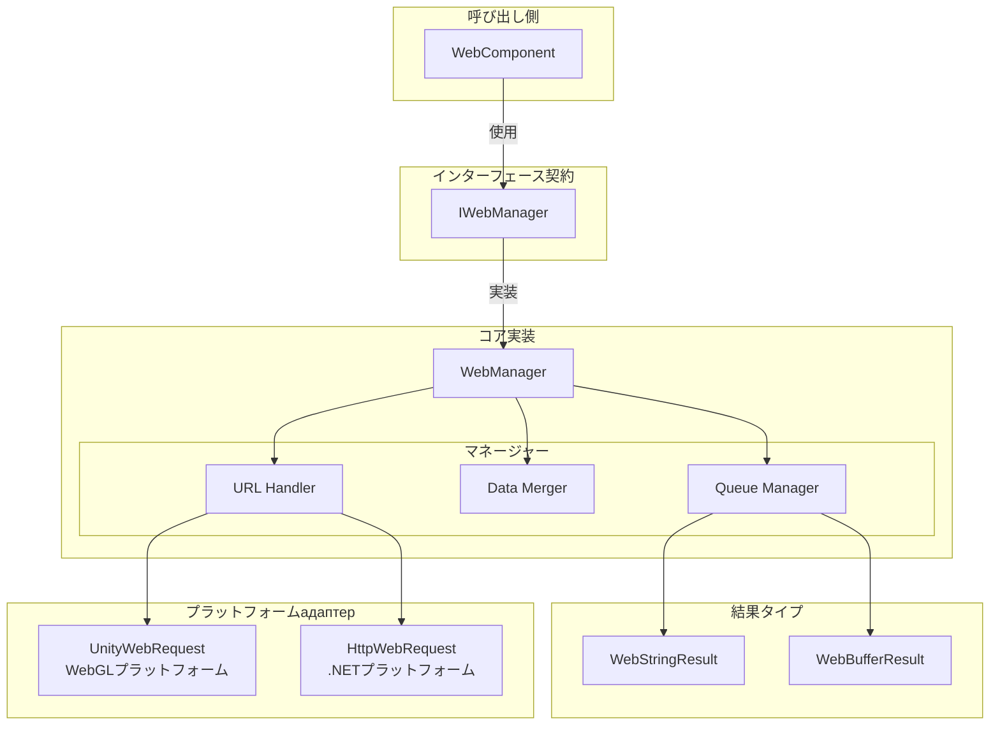
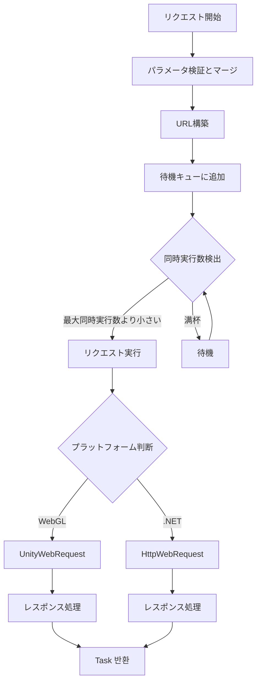

# IWebManager インターフェース

IWebManager は GameFrameX Web プラグインのコアインターフェースであり、統一された HTTP GET と POST リクエスト機能を提供します。このインターフェースは下位層のネットワークリクエスト実装の詳細をラップし、複数のリクエストパラメータ组合，支持し、ベースデータ管理機能を提供します。

## 概要

IWebManager インターフェースは Web リクエストマネージャーの契約仕様を定義し、主に以下の責務を担います：

1. **HTTP リクエスト処理**：GET と POST の2種類の HTTP メソッドの非同期リクエストサポートを提供
2. **レスポンスタイプサポート**：文字列とバイト配列の2種類のレスポンスフォーマットをサポート
3. **リクエストパラメータ管理**：クエリパラメータ、HTTP リクエストヘッダー、フォームデータの柔軟な组合，支持
4. **ベースデータ再利用**：グローバルベースデータ設定を提供し、每次リクエストでベースデータを自動的にマージ
5. **タイムアウト制御**：設定可能なタイムアウト時間の設定を提供

このインターフェースのデフォルト実装は `WebManager` クラスであり、`GameFrameworkModule` を継承し、GameFrameX フレームワークのコアモジュールの1つです。

> **設計意図**：IWebManager はキュー式のリクエスト管理メカニズムを採用し、待機キューと送信リストによってリクエストのバッファリングと同時制御を実装。デフォルトの最大同時実行数は 8 接続であり、サーバーの承载能力に基づいて調整可能。

## アーキテクチャ設計

### コアコンポーネント関係



### リクエスト処理フロー



## API リファレンス

### リクエストメソッド

#### GET リクエスト

##### `GetToString(url: string, userData?: object): Task<WebStringResult>`

シンプルな GET リクエストを送信し、文字列フォーマットのレスポンス結果を返します。

**パラメータ：**
- `url` (string): リクエストのターゲット URL アドレス
- `userData` (object, 任意): ユーザーカスタムデータ、レスポンス結果にそのままず返回

**返回：** `Task<WebStringResult>` - 文字列結果を含む非同期タスク

**示例：**
```csharp
var webManager = GameFrameworkEntry.GetModule<IWebManager>();
var result = await webManager.GetToString("https://api.example.com/data");
Debug.Log(result.Result);
```
> Source: [IWebManager.cs](https://github.com/GameFrameX/com.gameframex.unity.web/blob/main/Runtime/Web/IWebManager.cs#L18)

---

##### `GetToString(url: string, queryString: Dictionary<string, string>, userData?: object): Task<WebStringResult>`

クエリパラメータ付き GET リクエストを送信し、文字列フォーマットのレスポンス結果を返します。

**パラメータ：**
- `url` (string): リクエストのターゲット URL アドレス
- `queryString` (Dictionary<string, string>): URL クエリ参数字典
- `userData` (object, 任意): ユーザーカスタムデータ

**返回：** `Task<WebStringResult>`

---

##### `GetToString(url: string, queryString: Dictionary<string, string>, header: Dictionary<string, string>, userData?: object): Task<WebStringResult>`

クエリパラメータとリクエストヘッダー付き GET リクエストを送信し、文字列フォーマットのレスポンス結果を返します。

**パラメータ：**
- `url` (string): リクエストのターゲット URL アドレス
- `queryString` (Dictionary<string, string>): URL クエリ参数字典
- `header` (Dictionary<string, string>): HTTP リクエストヘッダー辞書
- `userData` (object, 任意): ユーザーカスタムデータ

**返回：** `Task<WebStringResult>`

---

##### `GetToBytes(url: string, userData?: object): Task<WebBufferResult>`

シンプルな GET リクエストを送信し、バイト配列フォーマットのレスポンス結果を返します。バイナリデータのダウンロード（画像、オーディオ等）に適合。

**パラメータ：**
- `url` (string): リクエストのターゲット URL アドレス
- `userData` (object, 任意): ユーザーカスタムデータ

**返回：** `Task<WebBufferResult>` - バイト配列を含む非同期タスク

**示例：**
```csharp
var webManager = GameFrameworkEntry.GetModule<IWebManager>();
var result = await webManager.GetToBytes("https://api.example.com/image.png");
byte[] imageData = result.Result;
```
> Source: [IWebManager.cs](https://github.com/GameFrameX/com.gameframex.unity.web/blob/main/Runtime/Web/IWebManager.cs#L26)

---

##### `GetToBytes(url: string, queryString: Dictionary<string, string>, userData?: object): Task<WebBufferResult>`

クエリパラメータ付き GET リクエストを送信し、バイト配列フォーマットのレスポンス結果を返します。

---

##### `GetToBytes(url: string, queryString: Dictionary<string, string>, header: Dictionary<string, string>, userData?: object): Task<WebBufferResult>`

クエリパラメータとリクエストヘッダー付き GET リクエストを送信し、バイト配列フォーマットのレスポンス結果を返します。

---

#### POST リクエスト

##### `PostToString(url: string, from?: Dictionary<string, object>, userData?: object): Task<WebStringResult>`

シンプルな POST リクエストを送信し、文字列フォーマットのレスポンス結果を返します。フォームデータは JSON フォーマットで送信されます。

**パラメータ：**
- `url` (string): リクエストのターゲット URL アドレス
- `from` (Dictionary<string, object>, 任意): フォームデータ辞書
- `userData` (object, 任意): ユーザーカスタムデータ

**返回：** `Task<WebStringResult>`

**示例：**
```csharp
var webManager = GameFrameworkEntry.GetModule<IWebManager>();
var formData = new Dictionary<string, object>
{
    { "username", "testuser" },
    { "password", "password123" }
};
var result = await webManager.PostToString("https://api.example.com/login", formData);
```
> Source: [IWebManager.cs](https://github.com/GameFrameX/com.gameframex.unity.web/blob/main/Runtime/Web/IWebManager.cs#L77)

---

##### `PostToString(url: string, from: Dictionary<string, object>, queryString: Dictionary<string, string>, userData?: object): Task<WebStringResult>`

クエリパラメータ付き POST リクエストを送信し、文字列フォーマットのレスポンス結果を返します。

---

##### `PostToString(url: string, from: Dictionary<string, object>, queryString: Dictionary<string, string>, header: Dictionary<string, string>, userData?: object): Task<WebStringResult>`

クエリパラメータとリクエストヘッダー付き POST リクエストを送信し、文字列フォーマットのレスポンス結果を返します。これは機能的に最も完全な POST 文字列リクエストのオーバーロードです。

**パラメータ：**
- `url` (string): リクエストのターゲット URL アドレス
- `from` (Dictionary<string, object>): フォームデータ辞書
- `queryString` (Dictionary<string, string>): URL クエリ参数字典
- `header` (Dictionary<string, string>): HTTP リクエストヘッダー辞書
- `userData` (object, 任意): ユーザーカスタムデータ

**返回：** `Task<WebStringResult>`

---

##### `PostToBytes(url: string, from: Dictionary<string, object>, userData?: object): Task<WebBufferResult>`

シンプルな POST リクエストを送信し、バイト配列フォーマットのレスポンス結果を返します。バイナリデータアップロード-download シーンの処理に適合。

**パラメータ：**
- `url` (string): リクエストのターゲット URL アドレス
- `from` (Dictionary<string, object>): フォームデータ辞書
- `userData` (object, 任意): ユーザーカスタムデータ

**返回：** `Task<WebBufferResult>`

---

##### `PostToBytes(url: string, from: Dictionary<string, object>, queryString: Dictionary<string, string>, userData?: object): Task<WebBufferResult>`

クエリパラメータ付き POST リクエストを送信し、バイト配列フォーマットのレスポンス結果を返します。

---

##### `PostToBytes(url: string, from: Dictionary<string, object>, queryString: Dictionary<string, string>, header: Dictionary<string, string>, userData?: object): Task<WebBufferResult>`

クエリパラメータとリクエストヘッダー付き POST リクエストを送信し、バイト配列フォーマットのレスポンス結果を返します。

---

##### `PostToBytes(url: string, from: byte[], queryString: Dictionary<string, string>, header: Dictionary<string, string>, userData?: object): Task<WebBufferResult>`

生バイト配列の POST リクエストを送信し、バイト配列フォーマットのレスポンス結果を返します。ProtoBuf 等のバイナリプロトコル通信に適合。

**パラメータ：**
- `url` (string): リクエストのターゲット URL アドレス
- `from` (byte[]): 送信する生バイト配列データ
- `queryString` (Dictionary<string, string>): URL クエリ参数字典
- `header` (Dictionary<string, string>): HTTP リクエストヘッダー辞書
- `userData` (object, 任意): ユーザーカスタムデータ

**返回：** `Task<WebBufferResult>`

> **設計意図**：このメソッドはバイナリデータリクエストの送信专用であり、ProtoBuf シリアライズされたリクエストボディ等、Content-Type を `application/octet-stream` に設定。

---

### 設定プロパティ

#### `Timeout: float`

リクエストタイムアウト時間（単位：秒）を取得または設定します。

**タイプ：** `float`

**デフォルト値：** `5.0`

**示例：**
```csharp
var webManager = GameFrameworkEntry.GetModule<IWebManager>();
webManager.Timeout = 10f; // タイムアウト時間を10秒に設定
```
> Source: [IWebManager.cs](https://github.com/GameFrameX/com.gameframex.unity.web/blob/main/Runtime/Web/IWebManager.cs#L144)

---

### ベースデータ管理

ベースデータ管理機能はグローバルなフォームデータ、リクエストヘッダー、クエリパラメータの設定を許可します。これらのデータは每次リクエスト時に自動的にリクエストパラメータとマージされます。これは認証トークン、デバイス情報等の共通データを携带する必要があるシーンに非常に有用です。

#### フォームデータ管理

##### `AddBaseForm(key: string, value: object): void`

ベースフォームデータを追加します。このデータは每次 POST リクエスト時に自動的にリクエストボディにマージされます。

**パラメータ：**
- `key` (string): フォームキー名
- `value` (object): フォーム値

**示例：**
```csharp
var webManager = GameFrameworkEntry.GetModule<IWebManager>();
// グローバルアプリ情報を追加
webManager.AddBaseForm("app_version", "1.0.0");
webManager.AddBaseForm("device_id", "ABC123");
```
> Source: [IWebManager.cs](https://github.com/GameFrameX/com.gameframex.unity.web/blob/main/Runtime/Web/IWebManager.cs#L151)

---

##### `RemoveBaseForm(key: string): void`

指定のベースフォームデータを移除。

---

##### `ClearBaseForm(): void`

すべてのベースフォームデータをクリア。

---

#### リクエストヘッダー管理

##### `AddBaseHeader(key: string, value: string): void`

ベースリクエストヘッダーデータを追加します。このデータは每次 HTTP リクエスト時に自動的にリクエストヘッダーにマージされます。

**パラメータ：**
- `key` (string): リクエストヘッダーキー名
- `value` (string): リクエストヘッダー値

**示例：**
```csharp
var webManager = GameFrameworkEntry.GetModule<IWebManager>();
webManager.AddBaseHeader("Authorization", "Bearer token123");
webManager.AddBaseHeader("Accept-Language", "ja-JP");
```
> Source: [IWebManager.cs](https://github.com/GameFrameX/com.gameframex.unity.web/blob/main/Runtime/Web/IWebManager.cs#L169)

---

##### `RemoveBaseHeader(key: string): void`

指定のベースリクエストヘッダーデータを移除。

---

##### `ClearBaseHeader(): void`

すべてのベースリクエストヘッダーデータをクリア。

---

#### クエリパラメータ管理

##### `AddBaseQueryString(key: string, value: string): void`

ベースクエリパラメータデータを追加します。このパラメータは自動的に各リクエストの URL の後ろに附加されます。

**パラメータ：**
- `key` (string): クエリパラメータキー名
- `value` (string): クエリパラメータ値

**示例：**
```csharp
var webManager = GameFrameworkEntry.GetModule<IWebManager>();
webManager.AddBaseQueryString("platform", "android");
webManager.AddBaseQueryString("channel", "official");
```
> Source: [IWebManager.cs](https://github.com/GameFrameX/com.gameframex.unity.web/blob/main/Runtime/Web/IWebManager.cs#L187)

---

##### `RemoveBaseQueryString(key: string): void`

指定のベースクエリパラメータデータを移除。

---

##### `ClearBaseQueryString(): void`

すべてのベースクエリパラメータデータをクリア。

---

## レスポンス結果タイプ

### WebStringResult

文字列レスポンス結果タイプ。GetToString と PostToString メソッドの戻り値に使用。

**プロパティ：**
| プロパティ | タイプ | 説明 |
|------|------|------|
| Result | string | サーバーから返された文字列コンテンツ |
| UserData | object | リクエスト時に渡されたユーザーカスタムデータ |

**示例：**
```csharp
var result = await webManager.GetToString("https://api.example.com/data");
// レスポンスコンテンツにアクセス
string content = result.Result;
// リクエスト時に传递されたカスタムデータにアクセス
object userData = result.UserData;
```
> Source: [WebStringResult.cs](https://github.com/GameFrameX/com.gameframex.unity.web/blob/main/Runtime/Web/WebStringResult.cs#L1-L39)

---

### WebBufferResult

バイト配列レスポンス結果タイプ。GetToBytes と PostToBytes メソッドの戻り値に使用。

**プロパティ：**
| プロパティ | タイプ | 説明 |
|------|------|------|
| Result | byte[] | サーバーから返されたバイト配列コンテンツ |
| UserData | object | リクエスト時に渡されたユーザーカスタムデータ |

**示例：**
```csharp
var result = await webManager.GetToBytes("https://api.example.com/file");
// レスポンスバイト配列にアクセス
byte[] data = result.Result;
```
> Source: [WebBufferResult.cs](https://github.com/GameFrameX/com.gameframex.unity.web/blob/main/Runtime/Web/WebBufferResult.cs#L1-L21)

---

## エラー処理

WebManager はリクエスト過程で以下の例外をスローする可能性があります：

| 例外タイプ | トリガー条件 |
|----------|----------|
| TimeoutException | リクエストタイムアウト（WebExceptionStatus.Timeout） |
| WebException | ネットワークエラーまたは HTTP エラー |
| IOException | I/O 操作エラー |
| Exception | その他の不明なエラー |

**示例 - エラー処理：**
```csharp
try
{
    var result = await webManager.GetToString("https://api.example.com/data");
    Debug.Log(result.Result);
}
catch (TimeoutException ex)
{
    Debug.LogError($"リクエストタイムアウト: {ex.Message}");
}
catch (WebException ex)
{
    Debug.LogError($"ネットワークエラー: {ex.Message}");
}
catch (Exception ex)
{
    Debug.LogError($"不明なエラー: {ex.Message}");
}
```
> Source: [WebManager.cs](https://github.com/GameFrameX/com.gameframex.unity.web/blob/main/Runtime/Web/WebManager.cs#L298-L324)

---

## プラットフォーム差異

IWebManager インターフェースは異なるプラットフォームで異なる下位層実装を持っています：

| プラットフォーム | 下位層実装 | 証明書処理 |
|------|----------|----------|
| WebGL | UnityWebRequest | デフォルトで証明書検証をスキップ (DefaultBypassCertificate) |
| その他のプラットフォーム (.NET) | HttpWebRequest | システムデフォルト証明書を使用 |

> **注意**：WebGL プラットフォームでは、開発デバッグを容易にするために証明書検証がデフォルトでスキップされます。本番環境で証明書検証を有効にする必要がある場合は、[プラットフォーム差異説明](./09.platform-differences) ドキュメントを参照してください。

---

## 関連リンク

- [WebComponent コンポーネント](./08.web-component) - Unity コンポーネントラッパー
- [WebManager アーキテクチャ](./05.web-manager) - コアアーキテクチャ詳細
- [リクエスト結果タイプ](./06.result-types) - 結果タイプ詳細
- [タイムアウト設定](./10.timeout-settings) - タイムアウト設定詳細
- [ベースデータ設定](./07.base-data) - ベースデータ設定詳細
- [プラットフォーム差異説明](./09.platform-differences) - プラットフォーム差異詳細
