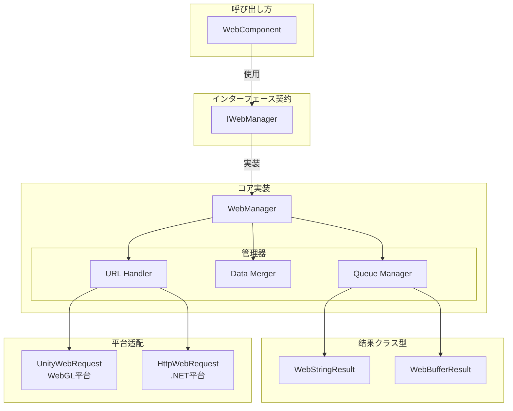
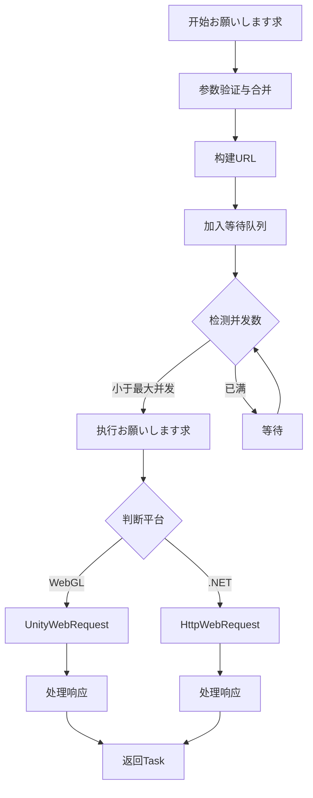

# IWebManager インターフェース

IWebManager 是 GameFrameX Web 插件的コアインターフェース，提供します统一的 HTTP GET 和 POST お願いします求機能。该インターフェース封装了底层网络お願いします求的実装细节，サポート多种お願いします求参数组合，并提供します基础数据管理機能。

## 概要

IWebManager インターフェース定义了 Web お願いします求管理器的契约规范，主要承担以下职责：

1. **HTTP お願いします求处理**：提供 GET 和 POST 两种 HTTP メソッド的异步お願いします求サポート
2. **响应クラス型サポート**：サポート字符串和字节数组两种响应格式
3. **お願いします求参数管理**：サポート查询参数、HTTP お願いします求头和表单数据的灵活组合
4. **基础数据复用**：提供全局基础数据配置，每次お願いします求自动合并基础数据
5. **超时控制**：提供可配置的超时时间設定

该インターフェース的默认実装为 `WebManager` クラス，它を継承 `GameFrameworkModule`，是 GameFrameX フレームワーク的コア模块之一。

> **设计意图**：IWebManager 采用队列式的お願いします求管理机制，を通じて等待队列和发送列表実装お願いします求的缓冲与并发控制。默认最大并发数为 8 个连接，可に基づいて服务器承载能力调整。

## アーキテクチャ設計

### コアコンポーネント关系



### お願いします求处理フロー



## API 参考

### お願いします求メソッド

#### GET お願いします求

##### `GetToString(url: string, userData?: object): Task<WebStringResult>`

发送简单的 GET お願いします求，返回字符串格式的响应结果。

**参数：**
- `url` (string): お願いします求的目标 URL 地址
- `userData` (object, 可选): 用户自定义数据，会在响应结果中原样返回

**返回：** `Task<WebStringResult>` - 包含字符串结果的异步任务

**示例：**
```csharp
var webManager = GameFrameworkEntry.GetModule<IWebManager>();
var result = await webManager.GetToString("https://api.example.com/data");
Debug.Log(result.Result);
```
> Source: [IWebManager.cs](https://github.com/GameFrameX/com.gameframex.unity.web/blob/main/Runtime/Web/IWebManager.cs#L18)

---

##### `GetToString(url: string, queryString: Dictionary<string, string>, userData?: object): Task<WebStringResult>`

发送带查询参数的 GET お願いします求，返回字符串格式的响应结果。

**参数：**
- `url` (string): お願いします求的目标 URL 地址
- `queryString` (Dictionary<string, string>): URL 查询参数字典
- `userData` (object, 可选): 用户自定义数据

**返回：** `Task<WebStringResult>`

---

##### `GetToString(url: string, queryString: Dictionary<string, string>, header: Dictionary<string, string>, userData?: object): Task<WebStringResult>`

发送带查询参数和お願いします求头的 GET お願いします求，返回字符串格式的响应结果。

**参数：**
- `url` (string): お願いします求的目标 URL 地址
- `queryString` (Dictionary<string, string>): URL 查询参数字典
- `header` (Dictionary<string, string>): HTTP お願いします求头字典
- `userData` (object, 可选): 用户自定义数据

**返回：** `Task<WebStringResult>`

---

##### `GetToBytes(url: string, userData?: object): Task<WebBufferResult>`

发送简单的 GET お願いします求，返回字节数组格式的响应结果。适に使用ダウンロード二进制数据如图片、音频等。

**参数：**
- `url` (string): お願いします求的目标 URL 地址
- `userData` (object, 可选): 用户自定义数据

**返回：** `Task<WebBufferResult>` - 包含字节数组的异步任务

**示例：**
```csharp
var webManager = GameFrameworkEntry.GetModule<IWebManager>();
var result = await webManager.GetToBytes("https://api.example.com/image.png");
byte[] imageData = result.Result;
```
> Source: [IWebManager.cs](https://github.com/GameFrameX/com.gameframex.unity.web/blob/main/Runtime/Web/IWebManager.cs#L26)

---

##### `GetToBytes(url: string, queryString: Dictionary<string, string>, userData?: object): Task<WebBufferResult>`

发送带查询参数的 GET お願いします求，返回字节数组格式的响应结果。

---

##### `GetToBytes(url: string, queryString: Dictionary<string, string>, header: Dictionary<string, string>, userData?: object): Task<WebBufferResult>`

发送带查询参数和お願いします求头的 GET お願いします求，返回字节数组格式的响应结果。

---

#### POST お願いします求

##### `PostToString(url: string, from?: Dictionary<string, object>, userData?: object): Task<WebStringResult>`

发送简单的 POST お願いします求，返回字符串格式的响应结果。表单数据将以 JSON 格式发送。

**参数：**
- `url` (string): お願いします求的目标 URL 地址
- `from` (Dictionary<string, object>, 可选): 表单数据字典
- `userData` (object, 可选): 用户自定义数据

**返回：** `Task<WebStringResult>`

**示例：**
```csharp
var webManager = GameFrameworkEntry.GetModule<IWebManager>();
var formData = new Dictionary<string, object>
{
    { "username", "testuser" },
    { "password", "password123" }
};
var result = await webManager.PostToString("https://api.example.com/login", formData);
```
> Source: [IWebManager.cs](https://github.com/GameFrameX/com.gameframex.unity.web/blob/main/Runtime/Web/IWebManager.cs#L77)

---

##### `PostToString(url: string, from: Dictionary<string, object>, queryString: Dictionary<string, string>, userData?: object): Task<WebStringResult>`

发送带查询参数的 POST お願いします求，返回字符串格式的响应结果。

---

##### `PostToString(url: string, from: Dictionary<string, object>, queryString: Dictionary<string, string>, header: Dictionary<string, string>, userData?: object): Task<WebStringResult>`

发送带查询参数和お願いします求头的 POST お願いします求，返回字符串格式的响应结果。这是機能最完整的 POST 字符串お願いします求重载。

**参数：**
- `url` (string): お願いします求的目标 URL 地址
- `from` (Dictionary<string, object>): 表单数据字典
- `queryString` (Dictionary<string, string>): URL 查询参数字典
- `header` (Dictionary<string, string>): HTTP お願いします求头字典
- `userData` (object, 可选): 用户自定义数据

**返回：** `Task<WebStringResult>`

---

##### `PostToBytes(url: string, from: Dictionary<string, object>, userData?: object): Task<WebBufferResult>`

发送简单的 POST お願いします求，返回字节数组格式的响应结果。适に使用处理二进制数据的上传ダウンロードシーン。

**参数：**
- `url` (string): お願いします求的目标 URL 地址
- `from` (Dictionary<string, object>): 表单数据字典
- `userData` (object, 可选): 用户自定义数据

**返回：** `Task<WebBufferResult>`

---

##### `PostToBytes(url: string, from: Dictionary<string, object>, queryString: Dictionary<string, string>, userData?: object): Task<WebBufferResult>`

发送带查询参数的 POST お願いします求，返回字节数组格式的响应结果。

---

##### `PostToBytes(url: string, from: Dictionary<string, object>, queryString: Dictionary<string, string>, header: Dictionary<string, string>, userData?: object): Task<WebBufferResult>`

发送带查询参数和お願いします求头的 POST お願いします求，返回字节数组格式的响应结果。

---

##### `PostToBytes(url: string, from: byte[], queryString: Dictionary<string, string>, header: Dictionary<string, string>, userData?: object): Task<WebBufferResult>`

发送原始字节数组的 POST お願いします求，返回字节数组格式的响应结果。适に使用 ProtoBuf 等二进制协议通信。

**参数：**
- `url` (string): お願いします求的目标 URL 地址
- `from` (byte[]): 要发送的原始字节数组数据
- `queryString` (Dictionary<string, string>): URL 查询参数字典
- `header` (Dictionary<string, string>): HTTP お願いします求头字典
- `userData` (object, 可选): 用户自定义数据

**返回：** `Task<WebBufferResult>`

> **设计意图**：此メソッド专门に使用发送二进制数据お願いします求，如 ProtoBuf 序列化的お願いします求体，Content-Type 設定为 `application/octet-stream`。

---

### 設定プロパティ

#### `Timeout: float`

取得或設定お願いします求超时时间（单位：秒）。

**クラス型：** `float`

**默认值：** `5.0`

**示例：**
```csharp
var webManager = GameFrameworkEntry.GetModule<IWebManager>();
webManager.Timeout = 10f; // 設定超时时间为10秒
```
> Source: [IWebManager.cs](https://github.com/GameFrameX/com.gameframex.unity.web/blob/main/Runtime/Web/IWebManager.cs#L144)

---

### 基础数据管理

基础数据管理機能允许配置全局的表单数据、お願いします求头和查询参数，这些数据会在每次お願いします求时自动与お願いします求参数合并。这对于必要携带身份验证令牌、设备信息等通用数据的シーン非常有用。

#### 表单数据管理

##### `AddBaseForm(key: string, value: object): void`

添加基础表单数据，该数据会在每次 POST お願いします求时自动合并到お願いします求体中。

**参数：**
- `key` (string): 表单键名
- `value` (object): 表单值

**示例：**
```csharp
var webManager = GameFrameworkEntry.GetModule<IWebManager>();
// 添加全局应用信息
webManager.AddBaseForm("app_version", "1.0.0");
webManager.AddBaseForm("device_id", "ABC123");
```
> Source: [IWebManager.cs](https://github.com/GameFrameX/com.gameframex.unity.web/blob/main/Runtime/Web/IWebManager.cs#L151)

---

##### `RemoveBaseForm(key: string): void`

移除指定的基础表单数据。

---

##### `ClearBaseForm(): void`

清空所有基础表单数据。

---

#### お願いします求头管理

##### `AddBaseHeader(key: string, value: string): void`

添加基础お願いします求头数据，该数据会在每次 HTTP お願いします求时自动合并到お願いします求头中。

**参数：**
- `key` (string): お願いします求头键名
- `value` (string): お願いします求头值

**示例：**
```csharp
var webManager = GameFrameworkEntry.GetModule<IWebManager>();
webManager.AddBaseHeader("Authorization", "Bearer token123");
webManager.AddBaseHeader("Accept-Language", "zh-CN");
```
> Source: [IWebManager.cs](https://github.com/GameFrameX/com.gameframex.unity.web/blob/main/Runtime/Web/IWebManager.cs#L169)

---

##### `RemoveBaseHeader(key: string): void`

移除指定的基础お願いします求头数据。

---

##### `ClearBaseHeader(): void`

清空所有基础お願いします求头数据。

---

#### 查询参数管理

##### `AddBaseQueryString(key: string, value: string): void`

添加基础查询参数数据，该参数会自动附加到每个お願いします求的 URL 后面。

**参数：**
- `key` (string): 查询参数键名
- `value` (string): 查询参数值

**示例：**
```csharp
var webManager = GameFrameworkEntry.GetModule<IWebManager>();
webManager.AddBaseQueryString("platform", "android");
webManager.AddBaseQueryString("channel", "official");
```
> Source: [IWebManager.cs](https://github.com/GameFrameX/com.gameframex.unity.web/blob/main/Runtime/Web/IWebManager.cs#L187)

---

##### `RemoveBaseQueryString(key: string): void`

移除指定的基础查询参数数据。

---

##### `ClearBaseQueryString(): void`

清空所有基础查询参数数据。

---

## 响应结果クラス型

### WebStringResult

字符串响应结果クラス型，に使用 GetToString 和 PostToString メソッド的返回值。

**プロパティ：**
| プロパティ | クラス型 | 説明 |
|------|------|------|
| Result | string | 服务器返回的字符串内容 |
| UserData | object | お願いします求时传入的用户自定义数据 |

**示例：**
```csharp
var result = await webManager.GetToString("https://api.example.com/data");
// 访问响应内容
string content = result.Result;
// 访问お願いします求时传递的自定义数据
object userData = result.UserData;
```
> Source: [WebStringResult.cs](https://github.com/GameFrameX/com.gameframex.unity.web/blob/main/Runtime/Web/WebStringResult.cs#L1-L39)

---

### WebBufferResult

字节数组响应结果クラス型，に使用 GetToBytes 和 PostToBytes メソッド的返回值。

**プロパティ：**
| プロパティ | クラス型 | 説明 |
|------|------|------|
| Result | byte[] | 服务器返回的字节数组内容 |
| UserData | object | お願いします求时传入的用户自定义数据 |

**示例：**
```csharp
var result = await webManager.GetToBytes("https://api.example.com/file");
// 访问响应字节数组
byte[] data = result.Result;
```
> Source: [WebBufferResult.cs](https://github.com/GameFrameX/com.gameframex.unity.web/blob/main/Runtime/Web/WebBufferResult.cs#L1-L21)

---

## 错误处理

WebManager 在お願いします求过程中可能抛出以下異常：

| 異常クラス型 | 触发条件 |
|----------|----------|
| TimeoutException | お願いします求超时（WebExceptionStatus.Timeout） |
| WebException | 网络错误或 HTTP 错误 |
| IOException | I/O 操作错误 |
| Exception | 其他未知错误 |

**示例 - 错误处理：**
```csharp
try
{
    var result = await webManager.GetToString("https://api.example.com/data");
    Debug.Log(result.Result);
}
catch (TimeoutException ex)
{
    Debug.LogError($"お願いします求超时: {ex.Message}");
}
catch (WebException ex)
{
    Debug.LogError($"网络错误: {ex.Message}");
}
catch (Exception ex)
{
    Debug.LogError($"未知错误: {ex.Message}");
}
```
> Source: [WebManager.cs](https://github.com/GameFrameX/com.gameframex.unity.web/blob/main/Runtime/Web/WebManager.cs#L298-L324)

---

## 平台差异

IWebManager インターフェース在不同平台上有不同的底层実装：

| 平台 | 底层実装 | 证书处理 |
|------|----------|----------|
| WebGL | UnityWebRequest | 默认跳过证书验证 (DefaultBypassCertificate) |
| 其他平台 (.NET) | HttpWebRequest | 使用系统默认证书 |

> **注意**：在 WebGL 平台上，证书验证默认被跳过以方便开发调试。生产环境如需启用证书验证，お願いします参考 [平台差异説明](./09.platform-differences) 文档。

---

## 関連リンク

- [WebComponent コンポーネント](./08.web-component) - Unity コンポーネント封装
- [WebManager 架构](./05.web-manager) - コア架构详解
- [お願いします求结果クラス型](./06.result-types) - 结果クラス型详解
- [超时配置](./10.timeout-settings) - 超时配置详解
- [基础数据配置](./07.base-data) - 基础数据配置详解
- [平台差异説明](./09.platform-differences) - 平台差异详解
