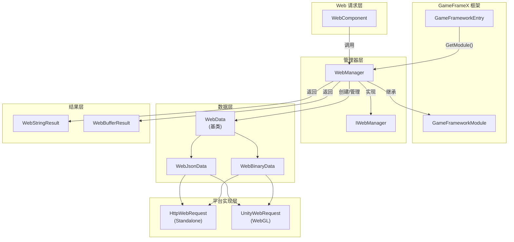
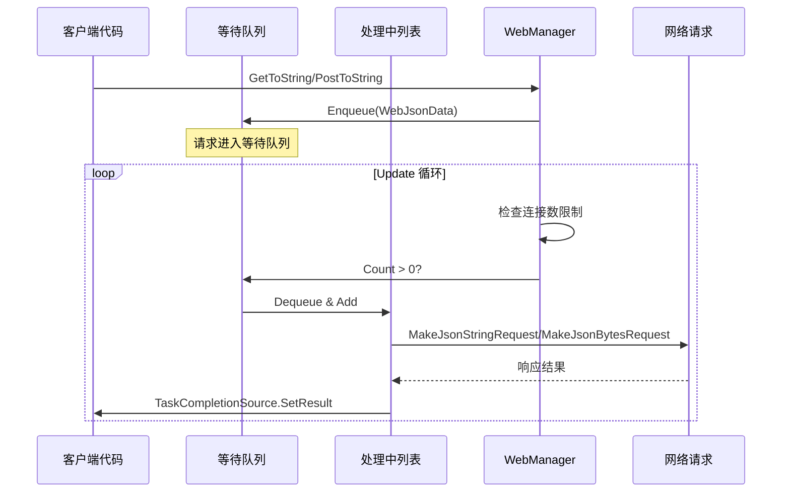
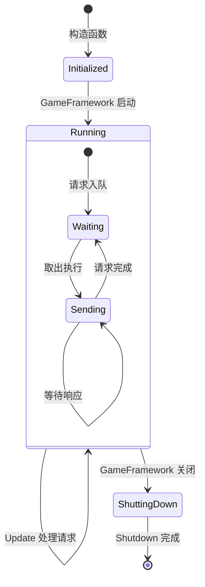
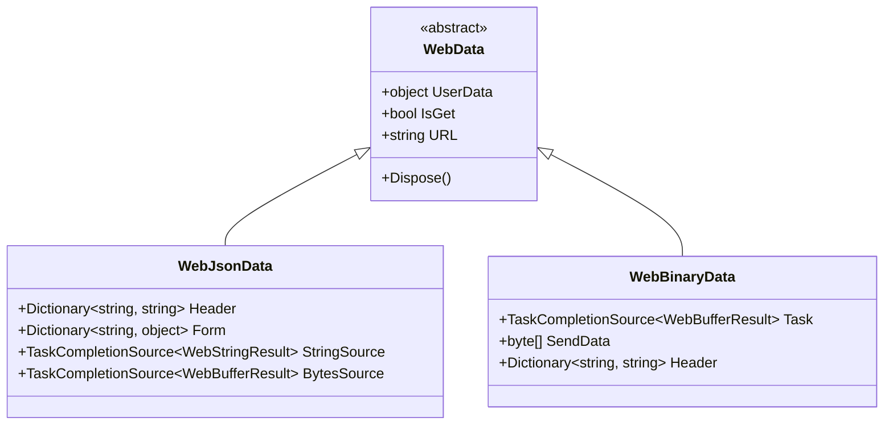

# WebManager アーキテクチャ

WebManager 是 GameFrameX フレームワーク中的 Web 请求管理モジュール，负责処理所有 HTTP GET 和 POST 请求。它采用队列式的请求処理机制，サポート连接数限制，并提供します跨プラットフォームサポート（Standalone 和 WebGL）。

## 概要

WebManager 作为 GameFrameX フレームワーク的コアモジュール之一，カプセル化了底层的 HTTP 请求実装，为游戏应用提供します統一された的网络请求入口。其設計目标含みます：

- **統一されたインターフェース**：提供一致的 GET/POST 请求メソッド
- **异步処理**：基于 Task 的异步编程模型
- **连接管理**：サポート每个服务器最大连接数限制
- **跨プラットフォーム**：兼容 Standalone 和 WebGL プラットフォーム
- **基本数据**：サポート全局请求头、查询パラメータ和表单数据

WebManager 継承自 `GameFrameworkModule`，是 GameFrameX フレームワークライフサイクル管理的一部分，能够在游戏初期化时自动作成，在游戏閉じる时自动清理リソース。

## アーキテクチャ設計

### 整体アーキテクチャ图



### コアコンポーネント

#### IWebManager インターフェース

`IWebManager` インターフェース定義了 Web 请求マネージャー的所有公共メソッド，是 WebManager 的抽象契约。インターフェース提供します多种オーバーロードメソッド，サポート不同的请求シーン：

> 詳細インターフェース定義请参见 [IWebManager インターフェース](./04.iwebmanager-interface)

#### WebManager 実装类

`WebManager` 是 `IWebManager` インターフェース的具体実装，継承自 `GameFrameworkModule`。它采用部分类（partial class）的方法组织コード，将不同機能モジュール拆分到多个ファイル中：

| ファイル | 职责 |
|------|------|
| WebManager.cs | 主実装：队列管理、请求処理、基本数据合并 |
| WebManager.WebData.cs | WebData 基底クラス定義 |
| WebManager.WebJsonData.cs | JSON 请求数据类 |
| WebManager.WebBinary.cs | Binary/ProtoBuf 请求処理 |

```csharp
public partial class WebManager : GameFrameworkModule, IWebManager
{
    // 等待处理的普通请求队列
    private readonly Queue<WebJsonData> m_WaitingNormalQueue = new Queue<WebJsonData>(256);

    // 正在处理的普通请求列表
    private readonly List<WebJsonData> m_SendingNormalList = new List<WebJsonData>(16);

    // 每个服务器的最大连接数
    public int MaxConnectionPerServer { get; set; }
}
```
> Source: [WebManager.cs](https://github.com/GameFrameX/com.gameframex.unity.web/blob/main/Runtime/Web/WebManager.cs#L20-L29)

#### WebComponent コンポーネント

`WebComponent` 是 Unity コンポーネントカプセル化，提供与 `IWebManager` 相同的メソッド签名，但通过 Unity コンポーネント的方法暴露给游戏逻辑层。它在 `Awake` フェーズ取得 `WebManager` インスタンス：

```csharp
protected override void Awake()
{
    ImplementationComponentType = Utility.Assembly.GetType(componentType);
    InterfaceComponentType = typeof(IWebManager);
    base.Awake();
    m_WebManager = GameFrameworkEntry.GetModule<IWebManager>();
}
```
> Source: [WebComponent.cs](https://github.com/GameFrameX/com.gameframex.unity.web/blob/main/Runtime/Web/WebComponent.cs#L76-L89)

## 请求処理フロー

### 请求队列机制

WebManager 采用本番者-消费者モード処理请求：



### 请求処理 Update 循环

WebManager 在每一帧的 `Update` メソッド中確認并処理等待中的请求：

```csharp
protected override void Update(float elapseSeconds, float realElapseSeconds)
{
    lock (m_StringBuilder)
    {
        // 检查是否达到最大连接数
        if (m_SendingNormalList.Count < MaxConnectionPerServer)
        {
            // 从等待队列中取出请求
            if (m_WaitingNormalQueue.Count > 0)
            {
                var webJsonData = m_WaitingNormalQueue.Dequeue();

                // 根据返回类型选择处理方法
                if (webJsonData.UniTaskCompletionStringSource != null)
                {
                    MakeJsonStringRequest(webJsonData);
                }
                else
                {
                    MakeJsonBytesRequest(webJsonData);
                }

                // 移动到处理中列表
                m_SendingNormalList.Add(webJsonData);
            }
        }

        // 同时处理 Binary 请求
        UpdateBinary(elapseSeconds, realElapseSeconds);
    }
}
```
> Source: [WebManager.cs](https://github.com/GameFrameX/com.gameframex.unity.web/blob/main/Runtime/Web/WebManager.cs#L81-L107)

### 连接数限制机制

通过 `MaxConnectionPerServer` プロパティ控制同時に向同一服务器发送的请求数量：

- **デフォルト值**：8 个连接
- **設計目的**：防止请求过多导致服务器压力过大或客户端リソース耗尽
- **工作方法**：只有当 `m_SendingNormalList.Count < MaxConnectionPerServer` 时，才会从等待队列取出新请求

### 数据合并机制

WebManager 提供します基本数据（Base Data）機能，允许設定全局请求パラメータ：

```csharp
// 基础表单数据 - 所有请求都会携带
private readonly Dictionary<string, object> m_BaseForm = new Dictionary<string, object>(64);

// 基础请求头 - 所有请求都会携带
private readonly Dictionary<string, string> m_BaseHeader = new Dictionary<string, string>(64);

// 基础查询参数 - 所有请求都会携带
private readonly Dictionary<string, string> m_BaseQueryString = new Dictionary<string, string>(64);
```

在发起请求时，会自动合并基本数据和请求特定的数据：

```csharp
private Dictionary<string, object> MergeForm(Dictionary<string, object> form)
{
    if (m_BaseForm.Count == 0)
    {
        return form;
    }

    // 复制基础数据
    var result = new Dictionary<string, object>(m_BaseForm);

    // 覆盖/添加外部数据
    if (form != null)
    {
        foreach (var kv in form)
        {
            result[kv.Key] = kv.Value;
        }
    }

    return result;
}
```
> Source: [WebManager.cs](https://github.com/GameFrameX/com.gameframex.unity.web/blob/main/Runtime/Web/WebManager.cs#L685-L705)

## プラットフォーム差异処理

### WebGL プラットフォーム

在 WebGL プラットフォーム上，WebManager 使用 Unity 的 `UnityWebRequest` API：

```csharp
#if UNITY_WEBGL
using UnityEngine.Networking;

UnityWebRequest unityWebRequest;
if (webJsonData.IsGet)
{
    unityWebRequest = UnityWebRequest.Get(webJsonData.URL);
}
else
{
    unityWebRequest = UnityWebRequest.Post(webJsonData.URL, string.Empty);
}

unityWebRequest.certificateHandler = new DefaultBypassCertificate();
unityWebRequest.timeout = (int)RequestTimeout.TotalSeconds;
```

### Standalone プラットフォーム

在 Standalone プラットフォーム上，使用 .NET 的 `HttpWebRequest` API：

```csharp
HttpWebRequest request = WebRequest.CreateHttp(webJsonData.URL);
request.Method = webJsonData.IsGet ? WebRequestMethods.Http.Get : WebRequestMethods.Http.Post;
request.Timeout = (int)RequestTimeout.TotalMilliseconds;
```

### SSL 证书処理

WebGL プラットフォーム使用 `DefaultBypassCertificate` 类绕过 SSL 证书検証：

```csharp
public sealed class DefaultBypassCertificate : CertificateHandler
{
    protected override bool ValidateCertificate(byte[] certificateData)
    {
        return true;
    }
}
```
> Source: [DefaultBypassCertificate.cs](https://github.com/GameFrameX/com.gameframex.unity.web/blob/main/Runtime/Web/DefaultBypassCertificate.cs#L39-L45)

> ⚠️ **注意**：在本番環境中使用自签名证书时，请谨慎処理 SSL 検証。

## リソース管理

### ライフサイクル

WebManager 的リソース管理分为三个フェーズ：



### リソース清理

在 `Shutdown` メソッド中，系统会清理所有等待和処理中的请求：

```csharp
protected override void Shutdown()
{
    // 清理等待队列
    while (m_WaitingNormalQueue.Count > 0)
    {
        var webData = m_WaitingNormalQueue.Dequeue();
        webData.Dispose();
    }

    // 清理处理中列表
    while (m_SendingNormalList.Count > 0)
    {
        var webData = m_SendingNormalList[0];
        m_SendingNormalList.RemoveAt(0);
        webData.Dispose();
    }

    // 清理内存流
    m_MemoryStream.Dispose();
}
```
> Source: [WebManager.cs](https://github.com/GameFrameX/com.gameframex.unity.web/blob/main/Runtime/Web/WebManager.cs#L112-L131)

## 请求数据タイプ

WebManager 使用分层的数据类结构来カプセル化请求情報：



- **WebData**：基底クラス，パッケージ含汎用プロパティ（UserData、IsGet、URL）
- **WebJsonData**：JSON フォーマット请求，パッケージ含表单数据和请求头
- **WebBinaryData**：二进制/ProtoBuf フォーマット请求

## 関連リンク

- [IWebManager インターフェース](./04.iwebmanager-interface)
- [WebComponent コンポーネント](./08.web-component)
- [请求結果タイプ](./06.result-types)
- [超时設定](./10.timeout-settings)
- [基本数据設定](./07.base-data)
- [プラットフォーム差异説明](./09.platform-differences)
