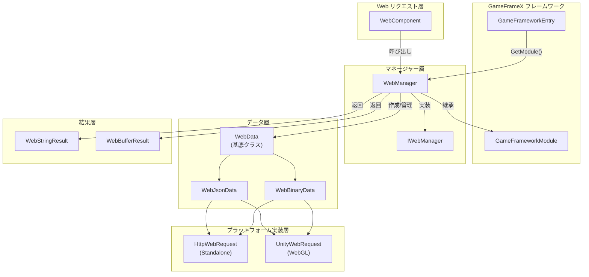
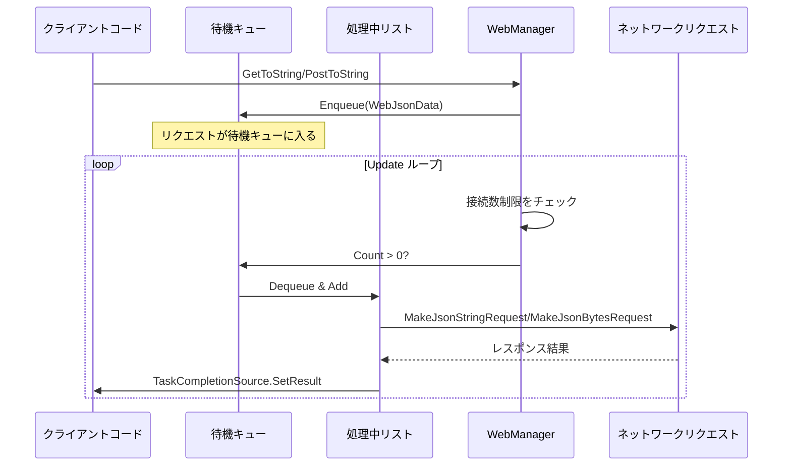
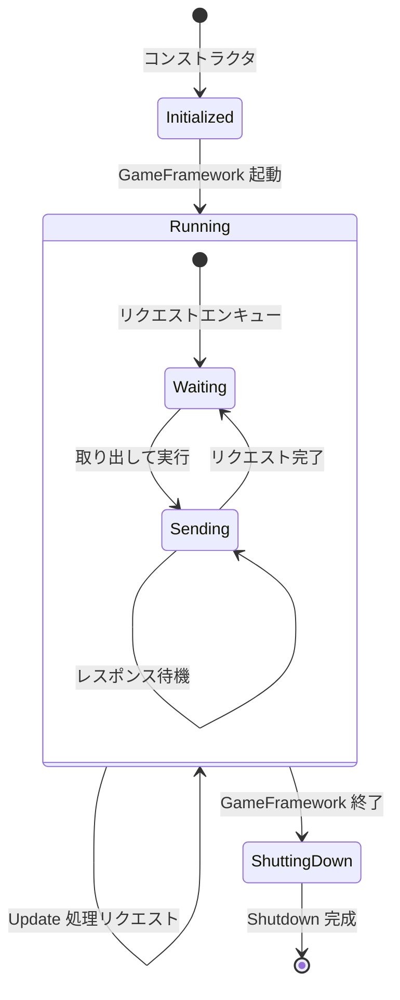
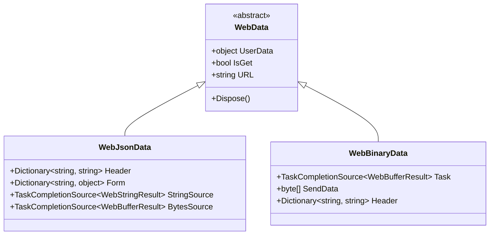

# WebManager アーキテクチャ

WebManager は GameFrameX フレームワークにおける Web リクエスト管理モジュールであり、すべての HTTP GET と POST リクエストを処理します。キュー式のリクエスト処理メカニズムを採用し、接続数制限をサポートし、クロスプラットフォームサポート（Standalone と WebGL）を提供します。

## 概要

WebManager は GameFrameX フレームワークのコアモジュールの1つであり、下位層の HTTP リクエスト実装をラップし、ゲームアプリケーションに統一されたネットワークリクエストエントリーポイントを提供します。その設計目標は次のとおりです：

- **統一インターフェース**：一貫した GET/POST リクエストメソッドを提供
- **非同期処理**：Task ベースの非同期プログラミングモデルに基づく
- **接続管理**：各サーバーの最大接続数制限をサポート
- **クロスプラットフォーム**：Standalone と WebGL プラットフォームと互換性あり
- **ベースデータ**：グローバルリクエストヘッダー、クエリパラメータ、フォームデータをサポート

WebManager は `GameFrameworkModule` を継承し、GameFrameX フレームワークのライフサイクル管理の一部であり、ゲームの初期化時に自動的に作成され、ゲームの終了時に自動的にリソースをクリーンアップできます。

## アーキテクチャ設計

### 全体アーキテクチャ図



### コアコンポーネント

#### IWebManager インターフェース

`IWebManager` インターフェースは Web リクエストマネージャーのすべての公共メソッドを定義し、WebManager の抽象契約です。インターフェースは複数のオーバーロードメソッドを提供し、異なるリクエストシーンをサポート：

> 詳細なインターフェース定義については [IWebManager インターフェース](./04.iwebmanager-interface) を参照してください。

#### WebManager 実装クラス

`WebManager` は `IWebManager` インターフェースの具体的な実装であり、`GameFrameworkModule` を継承します。部分クラス（partial class）の方式を採用してコードを組織し、異なる機能モジュールを複数のファイルに分割します：

| ファイル | 責務 |
|------|------|
| WebManager.cs | メイン実装：キューマネージャー、リクエスト処理、ベースデータマージ |
| WebManager.WebData.cs | WebData 基底クラス定義 |
| WebManager.WebJsonData.cs | JSON リクエストデータクラス |
| WebManager.WebBinary.cs | Binary/ProtoBuf リクエスト処理 |

```csharp
public partial class WebManager : GameFrameworkModule, IWebManager
{
    // 処理待機中の通常リクエストキュー
    private readonly Queue<WebJsonData> m_WaitingNormalQueue = new Queue<WebJsonData>(256);

    // 処理中の通常リクエストリスト
    private readonly List<WebJsonData> m_SendingNormalList = new List<WebJsonData>(16);

    // 各サーバーの最大接続数
    public int MaxConnectionPerServer { get; set; }
}
```
> Source: [WebManager.cs](https://github.com/GameFrameX/com.gameframex.unity.web/blob/main/Runtime/Web/WebManager.cs#L20-L29)

#### WebComponent コンポーネント

`WebComponent` は Unity コンポーネントラッパーであり、`IWebManager` と同じメソッドシグネチャを提供しますが、Unity コンポーネントの方式でゲームロジック層に公開します。`Awake` 段階で `WebManager` インスタンスを取得します：

```csharp
protected override void Awake()
{
    ImplementationComponentType = Utility.Assembly.GetType(componentType);
    InterfaceComponentType = typeof(IWebManager);
    base.Awake();
    m_WebManager = GameFrameworkEntry.GetModule<IWebManager>();
}
```
> Source: [WebComponent.cs](https://github.com/GameFrameX/com.gameframex.unity.web/blob/main/Runtime/Web/WebComponent.cs#L76-L89)

## リクエスト処理フロー

### リクエストキューメカニズム

WebManager はプロデューサー・コンシューマーパターンを採用してリクエストを処理：



### リクエスト処理 Update ループ

WebManager は各フレームの `Update` メソッドで待機中のリクエストをチェックして処理：

```csharp
protected override void Update(float elapseSeconds, float realElapseSeconds)
{
    lock (m_StringBuilder)
    {
        // 最大接続数に達したかどうかチェック
        if (m_SendingNormalList.Count < MaxConnectionPerServer)
        {
            // 待機キューからリクエストを取り出す
            if (m_WaitingNormalQueue.Count > 0)
            {
                var webJsonData = m_WaitingNormalQueue.Dequeue();

                // 戻り値タイプに応じて処理方法を選択
                if (webJsonData.UniTaskCompletionStringSource != null)
                {
                    MakeJsonStringRequest(webJsonData);
                }
                else
                {
                    MakeJsonBytesRequest(webJsonData);
                }

                // 処理中リストに移動
                m_SendingNormalList.Add(webJsonData);
            }
        }

        // 同時的に Binary リクエストを処理
        UpdateBinary(elapseSeconds, realElapseSeconds);
    }
}
```
> Source: [WebManager.cs](https://github.com/GameFrameX/com.gameframex.unity.web/blob/main/Runtime/Web/WebManager.cs#L81-L107)

### 接続数制限メカニズム

`MaxConnectionPerServer` プロパティを通じて、同時に同一サーバーに送信されるリクエスト数を制御：

- **デフォルト値**：8 接続
- **設計目的**：リクエスト过多によるサーバー负荷过大또는クライアントリソース枯渴を防止
- **動作方式**：`m_SendingNormalList.Count < MaxConnectionPerServer` の場合のみ、待機キューから新しいリクエストを取り出す

### データマージメカニズム

WebManager はベースデータ（Base Data）機能を提供し、グローバルリクエストパラメータの設定を許可：

```csharp
// ベースフォームデータ - すべてのリクエストが携带
private readonly Dictionary<string, object> m_BaseForm = new Dictionary<string, object>(64);

// ベースリクエストヘッダー - すべてのリクエストが携带
private readonly Dictionary<string, string> m_BaseHeader = new Dictionary<string, string>(64);

// ベースクエリパラメータ - すべてのリクエストが携带
private readonly Dictionary<string, string> m_BaseQueryString = new Dictionary<string, string>(64);
```

リクエスト发起時に、ベースデータとリクエスト固有のデータを自動的にマージ：

```csharp
private Dictionary<string, object> MergeForm(Dictionary<string, object> form)
{
    if (m_BaseForm.Count == 0)
    {
        return form;
    }

    // ベースデータをコピー
    var result = new Dictionary<string, object>(m_BaseForm);

    // 外部データを上書き/追加
    if (form != null)
    {
        foreach (var kv in form)
        {
            result[kv.Key] = kv.Value;
        }
    }

    return result;
}
```
> Source: [WebManager.cs](https://github.com/GameFrameX/com.gameframex.unity.web/blob/main/Runtime/Web/WebManager.cs#L685-L705)

## プラットフォーム差異処理

### WebGL プラットフォーム

WebGL プラットフォームでは、WebManager は Unity の `UnityWebRequest` API を使用：

```csharp
#if UNITY_WEBGL
using UnityEngine.Networking;

UnityWebRequest unityWebRequest;
if (webJsonData.IsGet)
{
    unityWebRequest = UnityWebRequest.Get(webJsonData.URL);
}
else
{
    unityWebRequest = UnityWebRequest.Post(webJsonData.URL, string.Empty);
}

unityWebRequest.certificateHandler = new DefaultBypassCertificate();
unityWebRequest.timeout = (int)RequestTimeout.TotalSeconds;
```

### Standalone プラットフォーム

Standalone プラットフォームでは、.NET の `HttpWebRequest` API を使用：

```csharp
HttpWebRequest request = WebRequest.CreateHttp(webJsonData.URL);
request.Method = webJsonData.IsGet ? WebRequestMethods.Http.Get : WebRequestMethods.Http.Post;
request.Timeout = (int)RequestTimeout.TotalMilliseconds;
```

### SSL 証明書処理

WebGL プラットフォームは `DefaultBypassCertificate` クラスを使用して SSL 証明書検証をバイパス：

```csharp
public sealed class DefaultBypassCertificate : CertificateHandler
{
    protected override bool ValidateCertificate(byte[] certificateData)
    {
        return true;
    }
}
```
> Source: [DefaultBypassCertificate.cs](https://github.com/GameFrameX/com.gameframex.unity.web/blob/main/Runtime/Web/DefaultBypassCertificate.cs#L39-L45)

> ⚠️ **注意**：本番環境で自己署名証明書を使用する際は、SSL 検証の処理に注意が必要です。

## リソース管理

### ライフサイクル

WebManager のリソース管理は3つの段階に分けられます：



### リソースクリーンアップ

`Shutdown` メソッドでは、待機中と処理中のすべてのリクエストをクリーンアップします：

```csharp
protected override void Shutdown()
{
    // 待機キューをクリーンアップ
    while (m_WaitingNormalQueue.Count > 0)
    {
        var webData = m_WaitingNormalQueue.Dequeue();
        webData.Dispose();
    }

    // 処理中リストをクリーンアップ
    while (m_SendingNormalList.Count > 0)
    {
        var webData = m_SendingNormalList[0];
        m_SendingNormalList.RemoveAt(0);
        webData.Dispose();
    }

    // メモリストリームをクリーンアップ
    m_MemoryStream.Dispose();
}
```
> Source: [WebManager.cs](https://github.com/GameFrameX/com.gameframex.unity.web/blob/main/Runtime/Web/WebManager.cs#L112-L131)

## リクエストデータタイプ

WebManager は階層化されたデータクラス構造を使用してリクエスト情報をラップします：



- **WebData**：基底クラス、共通プロパティ（UserData、IsGet、URL）を含む
- **WebJsonData**：JSON フォーマットリクエスト、フォームデータとリクエストヘッダーを含む
- **WebBinaryData**：バイナリ/ProtoBuf フォーマットリクエスト

## 関連リンク

- [IWebManager インターフェース](./04.iwebmanager-interface)
- [WebComponent コンポーネント](./08.web-component)
- [リクエスト結果タイプ](./06.result-types)
- [タイムアウト設定](./10.timeout-settings)
- [ベースデータ設定](./07.base-data)
- [プラットフォーム差異説明](./09.platform-differences)
