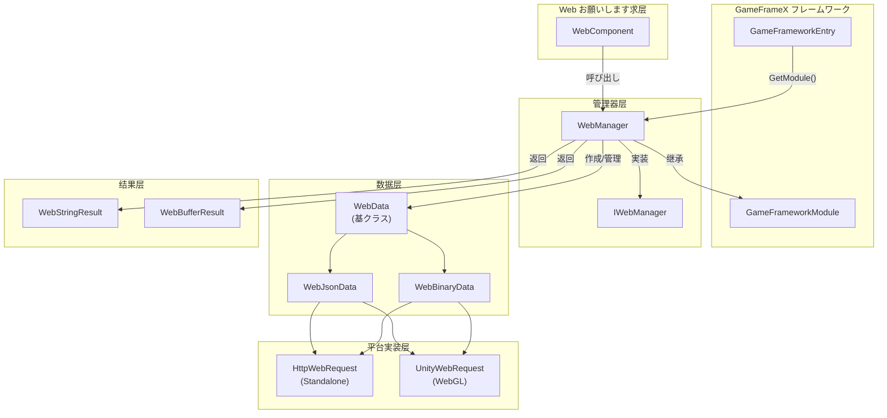
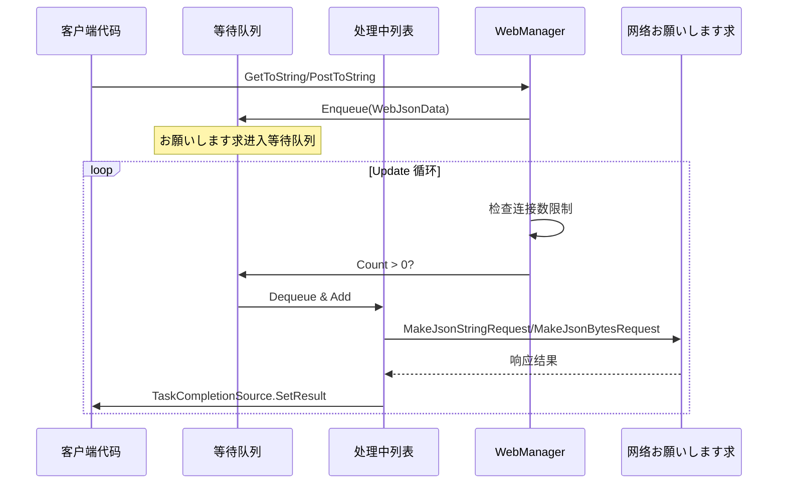
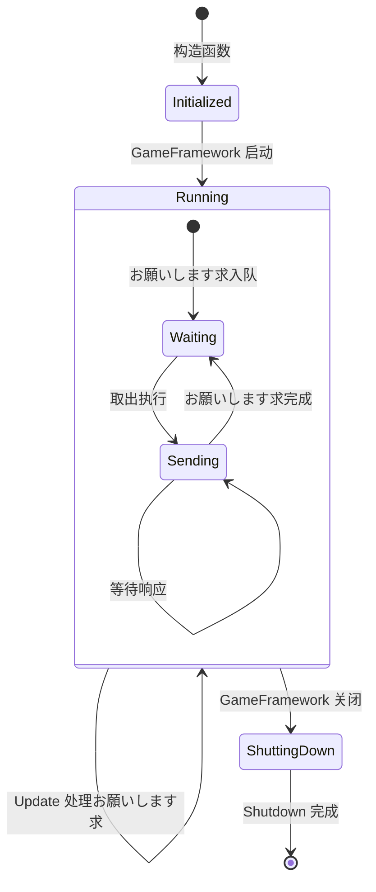
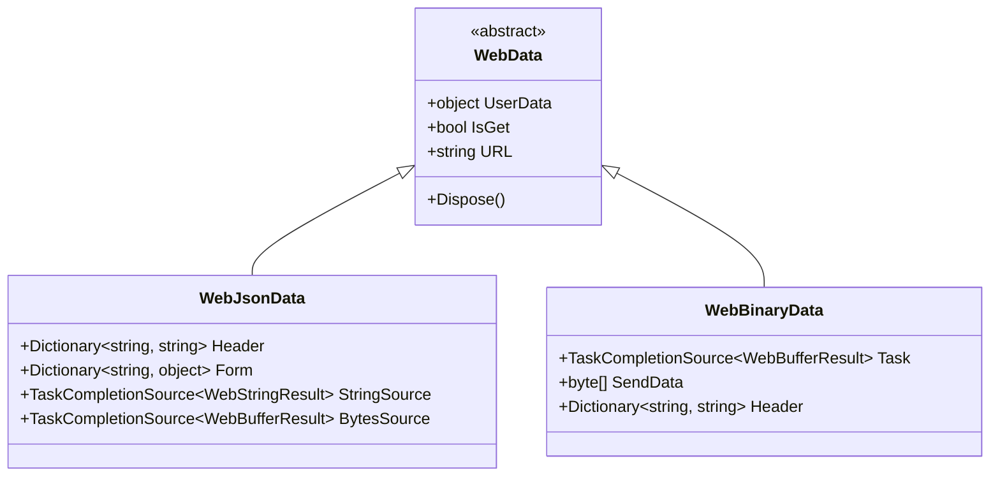

# WebManager 架构

WebManager 是 GameFrameX フレームワーク中的 Web お願いします求管理模块，负责处理所有 HTTP GET 和 POST お願いします求。它采用队列式的お願いします求处理机制，サポート连接数限制，并提供します跨平台サポート（Standalone 和 WebGL）。

## 概要

WebManager 作为 GameFrameX フレームワーク的コア模块之一，封装了底层的 HTTP お願いします求実装，为ゲーム应用提供します统一的网络お願いします求エントリーポイント。其设计目标包括：

- **统一インターフェース**：提供一致的 GET/POST お願いします求メソッド
- **异步处理**：基づく Task 的异步编程模型
- **连接管理**：サポート每个服务器最大连接数限制
- **跨平台**：兼容 Standalone 和 WebGL 平台
- **基础数据**：サポート全局お願いします求头、查询参数和表单数据

WebManager を継承 `GameFrameworkModule`，是 GameFrameX フレームワーク生命周期管理的一部分，能够在ゲーム初期化时自动作成，在ゲーム关闭时自动清理リソース。

## アーキテクチャ設計

### 整体架构图



### コアコンポーネント

#### IWebManager インターフェース

`IWebManager` インターフェース定义了 Web お願いします求管理器的所有公共メソッド，是 WebManager 的抽象契约。インターフェース提供します多种重载メソッド，サポート不同的お願いします求シーン：

> 详细インターフェース定义お願いします参见 [IWebManager インターフェース](./04.iwebmanager-interface)

#### WebManager 実装クラス

`WebManager` 是 `IWebManager` インターフェース的具体実装，を継承 `GameFrameworkModule`。它采用部分クラス（partial class）的方法组织代码，将不同機能模块拆分到多个ファイル中：

| ファイル | 职责 |
|------|------|
| WebManager.cs | 主実装：队列管理、お願いします求处理、基础数据合并 |
| WebManager.WebData.cs | WebData 基クラス定义 |
| WebManager.WebJsonData.cs | JSON お願いします求数据クラス |
| WebManager.WebBinary.cs | Binary/ProtoBuf お願いします求处理 |

```csharp
public partial class WebManager : GameFrameworkModule, IWebManager
{
    // 等待处理的普通お願いします求队列
    private readonly Queue<WebJsonData> m_WaitingNormalQueue = new Queue<WebJsonData>(256);

    // 正在处理的普通お願いします求列表
    private readonly List<WebJsonData> m_SendingNormalList = new List<WebJsonData>(16);

    // 每个服务器的最大连接数
    public int MaxConnectionPerServer { get; set; }
}
```
> Source: [WebManager.cs](https://github.com/GameFrameX/com.gameframex.unity.web/blob/main/Runtime/Web/WebManager.cs#L20-L29)

#### WebComponent コンポーネント

`WebComponent` 是 Unity コンポーネント封装，提供与 `IWebManager` 相同的メソッド签名，但を通じて Unity コンポーネント的方法暴露给ゲーム逻辑层。它在 `Awake` 阶段取得 `WebManager` インスタンス：

```csharp
protected override void Awake()
{
    ImplementationComponentType = Utility.Assembly.GetType(componentType);
    InterfaceComponentType = typeof(IWebManager);
    base.Awake();
    m_WebManager = GameFrameworkEntry.GetModule<IWebManager>();
}
```
> Source: [WebComponent.cs](https://github.com/GameFrameX/com.gameframex.unity.web/blob/main/Runtime/Web/WebComponent.cs#L76-L89)

## お願いします求处理フロー

### お願いします求队列机制

WebManager 采用生产者-消费者模式处理お願いします求：



### お願いします求处理 Update 循环

WebManager 在每一帧的 `Update` メソッド中检查并处理等待中的お願いします求：

```csharp
protected override void Update(float elapseSeconds, float realElapseSeconds)
{
    lock (m_StringBuilder)
    {
        // 检查是否达到最大连接数
        if (m_SendingNormalList.Count < MaxConnectionPerServer)
        {
            // 从等待队列中取出お願いします求
            if (m_WaitingNormalQueue.Count > 0)
            {
                var webJsonData = m_WaitingNormalQueue.Dequeue();

                // に基づいて返回クラス型选择处理メソッド
                if (webJsonData.UniTaskCompletionStringSource != null)
                {
                    MakeJsonStringRequest(webJsonData);
                }
                else
                {
                    MakeJsonBytesRequest(webJsonData);
                }

                // 移动到处理中列表
                m_SendingNormalList.Add(webJsonData);
            }
        }

        // 同时处理 Binary お願いします求
        UpdateBinary(elapseSeconds, realElapseSeconds);
    }
}
```
> Source: [WebManager.cs](https://github.com/GameFrameX/com.gameframex.unity.web/blob/main/Runtime/Web/WebManager.cs#L81-L107)

### 连接数限制机制

を通じて `MaxConnectionPerServer` プロパティ控制同时向同一服务器发送的お願いします求数量：

- **默认值**：8 个连接
- **设计目的**：防止お願いします求过多导致服务器压力过大或客户端リソース耗尽
- **工作方法**：只有当 `m_SendingNormalList.Count < MaxConnectionPerServer` 时，才会从等待队列取出新お願いします求

### 数据合并机制

WebManager 提供します基础数据（Base Data）機能，允许設定全局お願いします求参数：

```csharp
// 基础表单数据 - 所有お願いします求都会携带
private readonly Dictionary<string, object> m_BaseForm = new Dictionary<string, object>(64);

// 基础お願いします求头 - 所有お願いします求都会携带
private readonly Dictionary<string, string> m_BaseHeader = new Dictionary<string, string>(64);

// 基础查询参数 - 所有お願いします求都会携带
private readonly Dictionary<string, string> m_BaseQueryString = new Dictionary<string, string>(64);
```

在发起お願いします求时，会自动合并基础数据和お願いします求特定的数据：

```csharp
private Dictionary<string, object> MergeForm(Dictionary<string, object> form)
{
    if (m_BaseForm.Count == 0)
    {
        return form;
    }

    // 复制基础数据
    var result = new Dictionary<string, object>(m_BaseForm);

    // 覆盖/添加外部数据
    if (form != null)
    {
        foreach (var kv in form)
        {
            result[kv.Key] = kv.Value;
        }
    }

    return result;
}
```
> Source: [WebManager.cs](https://github.com/GameFrameX/com.gameframex.unity.web/blob/main/Runtime/Web/WebManager.cs#L685-L705)

## 平台差异处理

### WebGL 平台

在 WebGL 平台上，WebManager 使用 Unity 的 `UnityWebRequest` API：

```csharp
#if UNITY_WEBGL
using UnityEngine.Networking;

UnityWebRequest unityWebRequest;
if (webJsonData.IsGet)
{
    unityWebRequest = UnityWebRequest.Get(webJsonData.URL);
}
else
{
    unityWebRequest = UnityWebRequest.Post(webJsonData.URL, string.Empty);
}

unityWebRequest.certificateHandler = new DefaultBypassCertificate();
unityWebRequest.timeout = (int)RequestTimeout.TotalSeconds;
```

### Standalone 平台

在 Standalone 平台上，使用 .NET 的 `HttpWebRequest` API：

```csharp
HttpWebRequest request = WebRequest.CreateHttp(webJsonData.URL);
request.Method = webJsonData.IsGet ? WebRequestMethods.Http.Get : WebRequestMethods.Http.Post;
request.Timeout = (int)RequestTimeout.TotalMilliseconds;
```

### SSL 证书处理

WebGL 平台使用 `DefaultBypassCertificate` クラス绕过 SSL 证书验证：

```csharp
public sealed class DefaultBypassCertificate : CertificateHandler
{
    protected override bool ValidateCertificate(byte[] certificateData)
    {
        return true;
    }
}
```
> Source: [DefaultBypassCertificate.cs](https://github.com/GameFrameX/com.gameframex.unity.web/blob/main/Runtime/Web/DefaultBypassCertificate.cs#L39-L45)

> ⚠️ **注意**：在生产环境中使用自签名证书时，お願いします谨慎处理 SSL 验证。

## リソース管理

### 生命周期

WebManager 的リソース管理分为三个阶段：



### リソース清理

在 `Shutdown` メソッド中，系统会清理所有等待和处理中的お願いします求：

```csharp
protected override void Shutdown()
{
    // 清理等待队列
    while (m_WaitingNormalQueue.Count > 0)
    {
        var webData = m_WaitingNormalQueue.Dequeue();
        webData.Dispose();
    }

    // 清理处理中列表
    while (m_SendingNormalList.Count > 0)
    {
        var webData = m_SendingNormalList[0];
        m_SendingNormalList.RemoveAt(0);
        webData.Dispose();
    }

    // 清理内存流
    m_MemoryStream.Dispose();
}
```
> Source: [WebManager.cs](https://github.com/GameFrameX/com.gameframex.unity.web/blob/main/Runtime/Web/WebManager.cs#L112-L131)

## お願いします求数据クラス型

WebManager 使用分层的数据クラス结构来封装お願いします求信息：



- **WebData**：基クラス，包含通用プロパティ（UserData、IsGet、URL）
- **WebJsonData**：JSON 格式お願いします求，包含表单数据和お願いします求头
- **WebBinaryData**：二进制/ProtoBuf 格式お願いします求

## 関連リンク

- [IWebManager インターフェース](./04.iwebmanager-interface)
- [WebComponent コンポーネント](./08.web-component)
- [お願いします求结果クラス型](./06.result-types)
- [超时配置](./10.timeout-settings)
- [基础数据配置](./07.base-data)
- [平台差异説明](./09.platform-differences)
