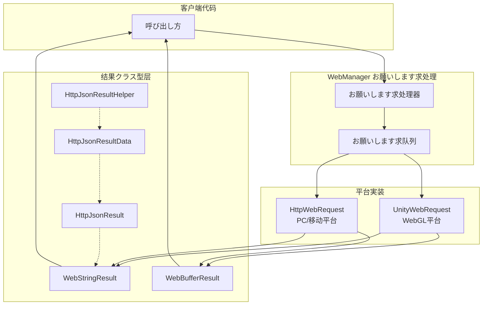

# お願いします求结果クラス型

GameFrameX Web コンポーネント提供します多种お願いします求结果クラス型，に使用封装不同格式的 HTTP 响应数据。这些结果クラス型设计简洁，遵循统一的 API 设计模式，方便開発者に基づいてビジネス要件选择合适的返回クラス型。

## 概要

在 GameFrameX Web コンポーネント中，所有 HTTP お願いします求メソッド都返回特定的结果クラス型。に基づいてお願いします求方法和数据格式的不同，開発者可能选择取得字符串结果、字节数组结果或经过解析的 JSON 数据结构。

お願いします求结果クラス型的设计遵循以下原则：
- **单一职责**：每种结果クラス型只负责封装一种特定格式的数据
- **用户数据传递**：サポートを通じて `UserData` プロパティ在お願いします求和响应之间传递上下文数据
- **異常处理**：お願いします求失败时を通じて異常机制传递错误信息，而非返回错误码

## アーキテクチャ設計

お願いします求结果クラス型在整体架构中扮演着数据封装层的角色，负责将底层 HTTP 响应转换为业务层可直接使用的对象。



### 各コンポーネント职责

| コンポーネント | 职责 |
|------|------|
| **WebStringResult** | 封装字符串格式的响应数据 |
| **WebBufferResult** | 封装二进制字节数组响应数据 |
| **HttpJsonResult** | 定义标准 JSON 响应结构（Code/Message/Data） |
| **HttpJsonResultData<T>** | 泛型结果包装器，带成功标志 |
| **HttpJsonResultHelper** | 提供 JSON 字符串到结果对象的转换メソッド |

## コア结果クラス型

### WebStringResult - 字符串结果

`WebStringResult` に使用封装返回字符串内容的 HTTP 响应，适に使用处理纯文本、HTML 或非结构化文本数据的シーン。

```csharp
namespace GameFrameX.Web.Runtime
{
    [UnityEngine.Scripting.Preserve]
    public sealed class WebStringResult
    {
        [UnityEngine.Scripting.Preserve]
        public WebStringResult(object userData, string result)
        {
            UserData = userData;
            Result = result;
        }

        /// <summary>
        /// 取得お願いします求返回的字符串结果
        /// </summary>
        public string Result { get; }

        /// <summary>
        /// 取得用户自定义数据，在お願いします求时传入的数据会原样返回
        /// </summary>
        public object UserData { get; }

        public override string ToString()
        {
            return $"[Result]:{Result}";
        }
    }
}
```

> Source: [WebStringResult.cs](https://github.com/GameFrameX/com.gameframex.unity.web/blob/main/Runtime/Web/WebStringResult.cs#L1-L40)

**プロパティ説明：**

| プロパティ | クラス型 | 説明 |
|------|------|------|
| `Result` | string | HTTP 响应返回的字符串内容 |
| `UserData` | object | 发起お願いします求时传入的自定义数据，に使用在回调中识别お願いします求上下文 |

### WebBufferResult - 二进制结果

`WebBufferResult` に使用封装返回字节数组的 HTTP 响应，适に使用处理二进制数据，如图片、ファイル、Protocol Buffers 等シーン。

```csharp
namespace GameFrameX.Web.Runtime
{
    public sealed class WebBufferResult
    {
        public WebBufferResult(object userData, byte[] result)
        {
            UserData = userData;
            Result = result;
        }

        /// <summary>
        /// お願いします求结果
        /// </summary>
        public byte[] Result { get; }

        /// <summary>
        /// 用户自定义数据
        /// </summary>
        public object UserData { get; }
    }
}
```

> Source: [WebBufferResult.cs](https://github.com/GameFrameX/com.gameframex.unity.web/blob/main/Runtime/Web/WebBufferResult.cs#L1-L21)

**プロパティ説明：**

| プロパティ | クラス型 | 説明 |
|------|------|------|
| `Result` | byte[] | HTTP 响应返回的字节数组，可に使用ファイルダウンロード、图片加载等シーン |
| `UserData` | object | 发起お願いします求时传入的自定义数据 |

### HttpJsonResult - JSON 响应结构

`HttpJsonResult` 定义了标准的 JSON 响应结构，适に使用必要解析服务端统一返回格式的シーン。很多后端 API 会返回统一的 JSON 格式，如 `{ "code": 0, "message": "success", "data": {...} }`。

```csharp
using Newtonsoft.Json;

namespace GameFrameX.Web.Runtime
{
    [UnityEngine.Scripting.Preserve]
    public sealed class HttpJsonResult
    {
        /// <summary>
        /// 响应码0 为成功
        /// </summary>
        [JsonProperty(PropertyName = "code")]
        public int Code { get; set; }

        /// <summary>
        /// 响应消息
        /// </summary>
        [JsonProperty(PropertyName = "message")]
        public string Message { get; set; }

        /// <summary>
        /// 响应数据.
        /// </summary>
        [JsonProperty(PropertyName = "data")]
        public string Data { get; set; }

        public override string ToString()
        {
            return JsonConvert.SerializeObject(this);
        }
    }
}
```

> Source: [HttpJsonResult.cs](https://github.com/GameFrameX/com.gameframex.unity.web/blob/main/Runtime/Extensions/HttpJsonResult.cs#L1-L34)

**プロパティ説明：**

| プロパティ | クラス型 | JSON 字段 | 説明 |
|------|------|-----------|------|
| `Code` | int | code | 响应ステータス码，0 表示成功，其他值表示不同错误 |
| `Message` | string | message | 响应説明信息，通常に使用错误ヒント |
| `Data` | string | data | 响应数据内容，为 JSON 字符串格式 |

### HttpJsonResultData<T> - 泛型结果包装器

`HttpJsonResultData<T>` 是泛型结果クラス型，它在 `HttpJsonResult` 的基础上增加了成功标志和クラス型化的数据プロパティ，方便直接取得强クラス型的结果数据。

```csharp
namespace GameFrameX.Web.Runtime
{
    public sealed class HttpJsonResultData<T>
    {
        /// <summary>
        /// 是否成功
        /// 表示お願いします求是否成功执行，成功为true，失败为false。
        /// </summary>
        public bool IsSuccess { get; set; } = false;

        /// <summary>
        /// 响应码
        /// 表示お願いします求的处理结果，为0表示成功，其他值表示不同的错误クラス型。
        /// </summary>
        public int Code { get; set; }

        /// <summary>
        /// 数据对象
        /// 包含お願いします求成功时返回的数据，クラス型为T。
        /// 如果お願いします求失败，可能为默认值或null。
        /// </summary>
        public T Data { get; set; }
    }
}
```

> Source: [HttpJsonResultData.cs](https://github.com/GameFrameX/com.gameframex.unity.web/blob/main/Runtime/Extensions/HttpJsonResultData.cs#L1-L29)

**プロパティ説明：**

| プロパティ | クラス型 | 説明 |
|------|------|------|
| `IsSuccess` | bool | お願いします求是否成功完成的标志 |
| `Code` | int | 响应ステータス码，与 HttpJsonResult.Code 一致 |
| `Data` | T | 泛型数据对象，已完成 JSON 反序列化 |

### HttpJsonResultHelper - JSON 解析辅助クラス

`HttpJsonResultHelper` 提供します将 JSON 字符串转换为强クラス型 `HttpJsonResultData<T>` 对象的扩展メソッド，简化了从原始响应到业务对象的转换过程。

```csharp
using System;
using GameFrameX.Runtime;
using Newtonsoft.Json;

namespace GameFrameX.Web.Runtime
{
    public static class HttpJsonResultHelper
    {
        /// <summary>
        /// 将JSON字符串转换为HttpJsonResultData&lt;T&gt;对象。
        /// 该メソッド尝试反序列化给定的JSON字符串，并に基づいてHTTP响应的ステータス码設定IsSuccessプロパティ。
        /// 如果响应成功，Dataプロパティ将包含反序列化后的数据对象；否则，Data将为默认值。
        /// </summary>
        /// <typeparam name="T">要反序列化为的对象クラス型，必須是クラス并具有无参数构造函数。</typeparam>
        /// <param name="jsonResult">包含HTTP响应的JSON字符串。</param>
        /// <returns>HttpJsonResultData&lt;T&gt;对象，表示反序列化的结果。</returns>
        public static HttpJsonResultData<T> ToHttpJsonResultData<T>(this string jsonResult) where T : class, new()
        {
            HttpJsonResultData<T> resultData = new HttpJsonResultData<T>
            {
                IsSuccess = false,
            };
            try
            {
                var httpJsonResult = JsonConvert.DeserializeObject<HttpJsonResult>(jsonResult);
                if (httpJsonResult.Code != 0)
                {
                    resultData.Code = httpJsonResult.Code;
                    return resultData;
                }

                resultData.IsSuccess = true;
                resultData.Data = string.IsNullOrEmpty(httpJsonResult.Data) ? new T() : JsonConvert.DeserializeObject<T>(httpJsonResult.Data);
            }
            catch (Exception e)
            {
                Log.Error(e);
            }

            return resultData;
        }
    }
}
```

> Source: [HttpJsonResultHelper.cs](https://github.com/GameFrameX/com.gameframex.unity.web/blob/main/Runtime/Extensions/HttpJsonResultHelper.cs#L1-L50)

## お願いします求フロー与结果处理

当呼び出し IWebManager 的お願いします求メソッド时，整个お願いします求到结果的フロー如下：

```mermaid
sequenceDiagram
    participant Client as 客户端代码
    participant QM as WebManager
    participant Queue as お願いします求队列
    participant Platform as 平台层<br/>(UnityWebRequest/HttpWebRequest)
    participant Result as 结果クラス型

    Client->>QM: GetToString(url, userData)
    QM->>Queue: Enqueue(WebJsonData)
    Queue->>Platform: Process Request
    
    alt お願いします求成功
        Platform->>Result: new WebStringResult(userData, content)
        Result-->>Client: Task&lt;WebStringResult&gt; 完成
    else お願いします求失败
        Platform->>Client: SetException(Exception)
    end
```

### 结果クラス型选择指南

| シーン | 推荐结果クラス型 | 説明 |
|------|-------------|------|
| 取得纯文本响应 | `Task<WebStringResult>` | 适に使用 HTML、纯文本等非结构化数据 |
| ダウンロードファイル/图片 | `Task<WebBufferResult>` | 适に使用二进制数据处理 |
| 统一 JSON API | `WebStringResult` + `HttpJsonResultHelper` | 适に使用标准 JSON 响应格式 |
| 强クラス型 JSON 数据 | `WebStringResult` + `HttpJsonResultData<T>` | 适に使用必要クラス型安全的シーン |

## 使用例

### 基本字符串お願いします求

```csharp
using GameFrameX.Web.Runtime;
using GameFrameX.Runtime;
using System.Threading.Tasks;

public async Task<string> GetStringResult()
{
    IWebManager webManager = GameFrameworkEntry.GetModule<IWebManager>();
    
    // 发送 GET お願いします求
    var result = await webManager.GetToString("https://api.example.com/text");
    
    // 取得字符串结果
    string content = result.Result;
    
    // 取得お願いします求时传入的自定义数据
    object userData = result.UserData;
    
    return content;
}
```

> Source: [WebManager.cs](https://github.com/GameFrameX/com.gameframex.unity.web/blob/main/Runtime/Web/WebManager.cs#L140-L143)

### 二进制数据お願いします求

```csharp
using GameFrameX.Web.Runtime;
using GameFrameX.Runtime;
using System.Threading.Tasks;

public async Task<byte[]> DownloadFile()
{
    IWebManager webManager = GameFrameworkEntry.GetModule<IWebManager>();
    
    // 发送 GET お願いします求取得字节数组
    var result = await webManager.GetToBytes("https://api.example.com/file/image.png");
    
    // 取得二进制数据
    byte[] data = result.Result;
    
    return data;
}
```

> Source: [WebManager.cs](https://github.com/GameFrameX/com.gameframex.unity.web/blob/main/Runtime/Web/WebManager.cs#L152-L155)

### JSON 响应解析

```csharp
using GameFrameX.Web.Runtime;
using GameFrameX.Runtime;
using Newtonsoft.Json;
using System.Threading.Tasks;

// 定义响应数据クラス型
public class UserInfo
{
    [JsonProperty("id")]
    public int Id { get; set; }
    
    [JsonProperty("name")]
    public string Name { get; set; }
    
    [JsonProperty("email")]
    public string Email { get; set; }
}

public async Task<UserInfo> GetUserInfo()
{
    IWebManager webManager = GameFrameworkEntry.GetModule<IWebManager>();
    
    // 取得原始 JSON 字符串
    var result = await webManager.GetToString("https://api.example.com/user/1");
    string jsonResponse = result.Result;
    
    // 使用辅助クラス转换为强クラス型结果
    var jsonResult = jsonResponse.ToHttpJsonResultData<UserInfo>();
    
    // 检查お願いします求是否成功
    if (jsonResult.IsSuccess)
    {
        return jsonResult.Data;
    }
    else
    {
        Log.Error($"お願いします求失败，错误码：{jsonResult.Code}");
        return null;
    }
}
```

> Source: [HttpJsonResultHelper.cs](https://github.com/GameFrameX/com.gameframex.unity.web/blob/main/Runtime/Extensions/HttpJsonResultHelper.cs#L20-L48)

### 带用户数据的お願いします求追踪

```csharp
using GameFrameX.Web.Runtime;
using GameFrameX.Runtime;
using System.Threading.Tasks;
using System.Collections.Generic;

public class RequestContext
{
    public string RequestId { get; set; }
    public string RequestType { get; set; }
}

public async Task TrackRequestWithUserData()
{
    IWebManager webManager = GameFrameworkEntry.GetModule<IWebManager>();
    
    // 作成お願いします求上下文
    var context = new RequestContext 
    { 
        RequestId = System.Guid.NewGuid().ToString(),
        RequestType = "UserInfo" 
    };
    
    // 将上下文作为 userData 传入
    var result = await webManager.GetToString(
        "https://api.example.com/user/1", 
        context  // 传入自定义数据
    );
    
    // 在回调中取得上下文信息
    var returnedContext = result.UserData as RequestContext;
    if (returnedContext != null)
    {
        Log.Info($"お願いします求 {returnedContext.RequestId} 完成");
    }
}
```

### 错误处理

お願いします求失败时，異常会を通じて Task 的異常机制传播。必要在呼び出し处进行 try-catch 处理：

```csharp
using GameFrameX.Web.Runtime;
using GameFrameX.Runtime;
using System;
using System.IO;
using System.Net;
using System.Threading.Tasks;

public async Task<string> SafeRequest(string url)
{
    IWebManager webManager = GameFrameworkEntry.GetModule<IWebManager>();
    
    try
    {
        var result = await webManager.GetToString(url);
        return result.Result;
    }
    catch (WebException ex) when (ex.Status == WebExceptionStatus.Timeout)
    {
        Log.Error($"お願いします求超时：{url} - {ex.Message}");
        throw;
    }
    catch (IOException ex)
    {
        Log.Error($"网络IO错误：{url} - {ex.Message}");
        throw;
    }
    catch (Exception ex)
    {
        Log.Error($"お願いします求失败：{url} - {ex.Message}");
        throw;
    }
}
```

> Source: [WebManager.cs](https://github.com/GameFrameX/com.gameframex.unity.web/blob/main/Runtime/Web/WebManager.cs#L298-L324)

## API 参考

### WebStringResult

```csharp
namespace GameFrameX.Web.Runtime
{
    public sealed class WebStringResult
    {
        public WebStringResult(object userData, string result);
        
        // プロパティ
        public string Result { get; }
        public object UserData { get; }
        
        public override string ToString();
    }
}
```

### WebBufferResult

```csharp
namespace GameFrameX.Web.Runtime
{
    public sealed class WebBufferResult
    {
        public WebBufferResult(object userData, byte[] result);
        
        // プロパティ
        public byte[] Result { get; }
        public object UserData { get; }
    }
}
```

### HttpJsonResult

```csharp
namespace GameFrameX.Web.Runtime
{
    public sealed class HttpJsonResult
    {
        [JsonProperty("code")]
        public int Code { get; set; }
        
        [JsonProperty("message")]
        public string Message { get; set; }
        
        [JsonProperty("data")]
        public string Data { get; set; }
    }
}
```

### HttpJsonResultData<T>

```csharp
namespace GameFrameX.Web.Runtime
{
    public sealed class HttpJsonResultData<T>
    {
        public bool IsSuccess { get; set; }
        public int Code { get; set; }
        public T Data { get; set; }
    }
}
```

### HttpJsonResultHelper

```csharp
namespace GameFrameX.Web.Runtime
{
    public static class HttpJsonResultHelper
    {
        public static HttpJsonResultData<T> ToHttpJsonResultData<T>(
            this string jsonResult
        ) where T : class, new();
    }
}
```

## 関連リンク

- [WebManager 架构](./05.web-manager) - 了解 WebManager 的完整架构和お願いします求处理フロー
- [IWebManager インターフェース](./04.iwebmanager-interface) - 查看所有 HTTP お願いします求メソッド的详细 API
- [WebComponent コンポーネント](./08.web-component) - 使用 WebComponent 的便捷封装
- [超时配置](./10.timeout-settings) - 配置お願いします求超时时间
- [基础数据配置](./07.base-data) - 配置全局お願いします求参数
