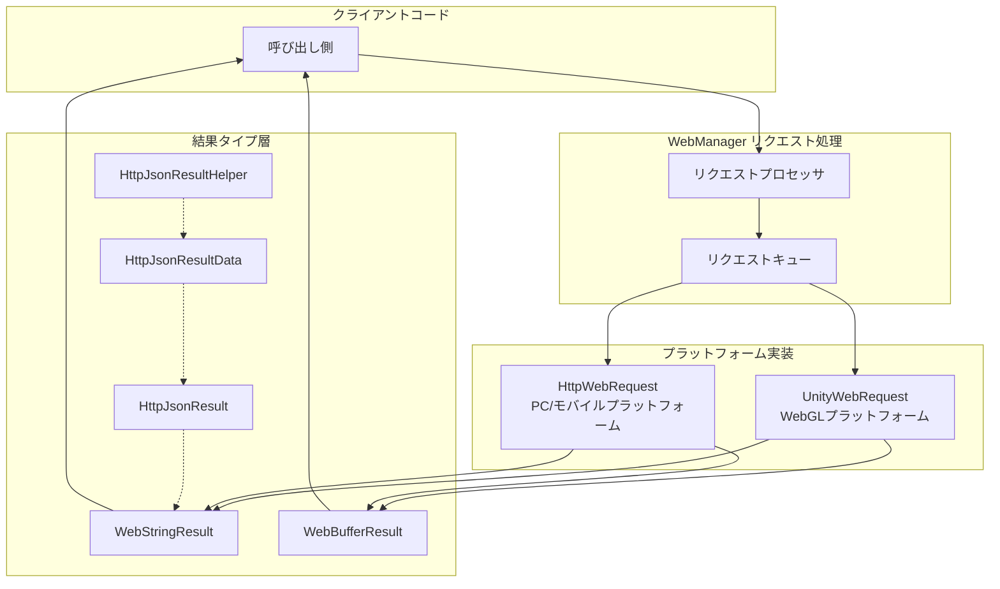

# リクエスト結果タイプ

GameFrameX Web コンポーネントは多様なリクエスト結果タイプを提供し、異なるフォーマットの HTTP レスポンスデータをラップするために使用されます。これらの結果タイプはシンプルで設計され、统一された API 設計パターンを遵循し、開発者がビジネス要件に基づいて適切な戻り値タイプを選択しやすいようになっています。

## 概要

GameFrameX Web コンポーネントでは、すべての HTTP リクエストメソッドが特定の結果タイプを返します。リクエスト方式和データフォーマットの差异に基づいて、開発者は文字列結果、バイト配列結果、または解析された JSON データ構造を取得することを選択できます。

リクエスト結果タイプの設計は以下の原則に従います：
- **単一責任**：各結果タイプは特定のフォーマットのデータのみをラップする責務を負います
- **ユーザーデータ传递**：`UserData` プロパティを通じてリクエストとレスポンスの間でコンテキストデータを传递することをサポート
- **例外処理**：リクエスト失敗時はエラーコードを返す代わりに、例外メカニズムを通じてエラー情報を传递

## アーキテクチャ設計

リクエスト結果タイプは全体アーキテクチャにおいてデータラップ層の役割を果たし、下位層の HTTP レスポンスをビジネス層が直接使用できるオブジェクトに変換します。



### 各コンポーネントの責務

| コンポーネント | 責務 |
|------|------|
| **WebStringResult** | 文字列フォーマットのレスポンスデータをラップ |
| **WebBufferResult** | バイナリバイト配列レスポンスデータをラップ |
| **HttpJsonResult** | 標準 JSON レスポンス構造を定義（Code/Message/Data） |
| **HttpJsonResultData<T>** | ジェネリック結果ラッパー、成功フラグ付き |
| **HttpJsonResultHelper** | JSON 文字列から結果オブジェクトへの変換メソッドを提供 |

## コア結果タイプ

### WebStringResult - 文字列結果

`WebStringResult` は文字列コンテンツを返す HTTP レスポンスのラップに使用されます。プレーンテキスト、HTML または非構造化テキストデータのシーンの処理に適しています。

```csharp
namespace GameFrameX.Web.Runtime
{
    [UnityEngine.Scripting.Preserve]
    public sealed class WebStringResult
    {
        [UnityEngine.Scripting.Preserve]
        public WebStringResult(object userData, string result)
        {
            UserData = userData;
            Result = result;
        }

        /// <summary>
        /// リクエストが返す文字列結果を取得
        /// </summary>
        public string Result { get; }

        /// <summary>
        /// ユーザーがカスタムデータを送信の取得、リクエスト時に渡されたデータはそのままで返されます
        /// </summary>
        public object UserData { get; }

        public override string ToString()
        {
            return $"[Result]:{Result}";
        }
    }
}
```

> Source: [WebStringResult.cs](https://github.com/GameFrameX/com.gameframex.unity.web/blob/main/Runtime/Web/WebStringResult.cs#L1-L40)

**プロパティ説明：**

| プロパティ | タイプ | 説明 |
|------|------|------|
| `Result` | string | HTTP レスポンスが返す文字列コンテンツ |
| `UserData` | object | リクエスト发起時に渡されたカスタムデータ、コールバックでリクエストコンテキストを識別に使用 |

### WebBufferResult - バイナリ結果

`WebBufferResult` はバイト配列を返す HTTP レスポンスのラップに使用されます。バイナリデータの処理（画像、ファイル、Protocol Buffers 等）に適しています。

```csharp
namespace GameFrameX.Web.Runtime
{
    public sealed class WebBufferResult
    {
        public WebBufferResult(object userData, byte[] result)
        {
            UserData = userData;
            Result = result;
        }

        /// <summary>
        /// リクエスト結果
        /// </summary>
        public byte[] Result { get; }

        /// <summary>
        /// ユーザーがカスタムデータ
        /// </summary>
        public object UserData { get; }
    }
}
```

> Source: [WebBufferResult.cs](https://github.com/GameFrameX/com.gameframex.unity.web/blob/main/Runtime/Web/WebBufferResult.cs#L1-L21)

**プロパティ説明：**

| プロパティ | タイプ | 説明 |
|------|------|------|
| `Result` | byte[] | HTTP レスポンスが返すバイト配列、ファイルダウンロード、画像ロード等のシーンに使用可能 |
| `UserData` | object | リクエスト发起時に渡されたカスタムデータ |

### HttpJsonResult - JSON レスポンス構造

`HttpJsonResult` は標準 JSON レスポンス構造を定義し、サーバー側の統一戻り値形式を解析する必要があるシーンに適しています。多くのバックエンド API は `{ "code": 0, "message": "success", "data": {...} }` のような統一 JSON フォーマットを返します。

```csharp
using Newtonsoft.Json;

namespace GameFrameX.Web.Runtime
{
    [UnityEngine.Scripting.Preserve]
    public sealed class HttpJsonResult
    {
        /// <summary>
        /// レスポンスコード 0 は成功
        /// </summary>
        [JsonProperty(PropertyName = "code")]
        public int Code { get; set; }

        /// <summary>
        /// レスポンスメッセージ
        /// </summary>
        [JsonProperty(PropertyName = "message")]
        public string Message { get; set; }

        /// <summary>
        /// レスポンスデータ
        /// </summary>
        [JsonProperty(PropertyName = "data")]
        public string Data { get; set; }

        public override string ToString()
        {
            return JsonConvert.SerializeObject(this);
        }
    }
}
```

> Source: [HttpJsonResult.cs](https://github.com/GameFrameX/com.gameframex.unity.web/blob/main/Runtime/Extensions/HttpJsonResult.cs#L1-L34)

**プロパティ説明：**

| プロパティ | タイプ | JSON フィールド | 説明 |
|------|------|-----------|------|
| `Code` | int | code | レスポンスステータスコード、0 は成功、それ以外の値は異なるエラーを示す |
| `Message` | string | message | レスポンス説明情報、通常はエラーのヒントに使用 |
| `Data` | string | data | レスポンスデータコンテンツ、JSON 文字列フォーマット |

### HttpJsonResultData<T> - ジェネリック結果ラッパー

`HttpJsonResultData<T>` はジェネリック結果タイプであり、`HttpJsonResult` 基础上に成功フラグとタイプライズされたデータプロパティを追加し、強く型付けされた結果データを直接取得しやすくします。

```csharp
namespace GameFrameX.Web.Runtime
{
    public sealed class HttpJsonResultData<T>
    {
        /// <summary>
        /// 成功したかどうか
        /// リクエストが正常に実行されたかどうかを示し、成功は true、失敗は false
        /// </summary>
        public bool IsSuccess { get; set; } = false;

        /// <summary>
        /// レスポンスコード
        /// リクエスト処理結果を 表し、0 は成功、それ以外の値は異なるエラータイプを示します
        /// </summary>
        public int Code { get; set; }

        /// <summary>
        /// データオブジェクト
        /// リクエスト成功時に返されるデータを含み、タイプ T
        /// リクエスト失敗時、デフォルト値または null の可能性があります
        /// </summary>
        public T Data { get; set; }
    }
}
```

> Source: [HttpJsonResultData.cs](https://github.com/GameFrameX/com.gameframex.unity.web/blob/main/Runtime/Extensions/HttpJsonResultData.cs#L1-L29)

**プロパティ説明：**

| プロパティ | タイプ | 説明 |
|------|------|------|
| `IsSuccess` | bool | リクエストが正常に完了したかどうかのフラグ |
| `Code` | int | レスポンスステータスコード、HttpJsonResult.Code と同じ |
| `Data` | T | ジェネリックデータオブジェクト、JSON デシリアライズ済み |

### HttpJsonResultHelper - JSON 解析ヘルパー

`HttpJsonResultHelper` は JSON 文字列を strongly typed `HttpJsonResultData<T>` オブジェクトに変換する拡張メソッドを提供し、原始レスポンスからビジネスオブジェクトへの変換プロセスを簡素化します。

```csharp
using System;
using GameFrameX.Runtime;
using Newtonsoft.Json;

namespace GameFrameX.Web.Runtime
{
    public static class HttpJsonResultHelper
    {
        /// <summary>
        /// JSON 文字列を HttpJsonResultData&lt;T&gt; オブジェクトに変換します。
        /// このメソッドは指定された JSON 文字列をデシリアライズしようとし、HTTP レスポンスのステータスコードに基づいて IsSuccess プロパティを設定します。
        /// レスポンスが成功した場合、Data プロパティにはデシリアライズ後のデータオブジェクトが含まれます。失敗した場合、Data はデフォルト値になります。
        /// </summary>
        /// <typeparam name="T">デシリアライズするオブジェクトタイプ、クラスでパラメータなしのコンストラクタが必要です</typeparam>
        /// <param name="jsonResult">HTTP レスポンスを含む JSON 文字列</param>
        /// <returns>HttpJsonResultData&lt;T&gt; オブジェクト、デシリアライズの 결과를 表します</returns>
        public static HttpJsonResultData<T> ToHttpJsonResultData<T>(this string jsonResult) where T : class, new()
        {
            HttpJsonResultData<T> resultData = new HttpJsonResultData<T>
            {
                IsSuccess = false,
            };
            try
            {
                var httpJsonResult = JsonConvert.DeserializeObject<HttpJsonResult>(jsonResult);
                if (httpJsonResult.Code != 0)
                {
                    resultData.Code = httpJsonResult.Code;
                    return resultData;
                }

                resultData.IsSuccess = true;
                resultData.Data = string.IsNullOrEmpty(httpJsonResult.Data) ? new T() : JsonConvert.DeserializeObject<T>(httpJsonResult.Data);
            }
            catch (Exception e)
            {
                Log.Error(e);
            }

            return resultData;
        }
    }
}
```

> Source: [HttpJsonResultHelper.cs](https://github.com/GameFrameX/com.gameframex.unity.web/blob/main/Runtime/Extensions/HttpJsonResultHelper.cs#L1-L50)

## リクエストフローと結果処理

IWebManager のリクエストメソッドを呼び出すと、リクエストから結果への全体フローは次のとおりです：

```mermaid
sequenceDiagram
    participant Client as クライアントコード
    participant QM as WebManager
    participant Queue as リクエストキュー
    participant Platform as プラットフォーム層<br/>(UnityWebRequest/HttpWebRequest)
    participant Result as 結果タイプ

    Client->>QM: GetToString(url, userData)
    QM->>Queue: Enqueue(WebJsonData)
    Queue->>Platform: Process Request
    
    alt リクエスト成功
        Platform->>Result: new WebStringResult(userData, content)
        Result-->>Client: Task&lt;WebStringResult&gt; 完成
    else リクエスト失敗
        Platform->>Client: SetException(Exception)
    end
```

### 結果タイプ選択ガイド

| シーン | 推奨結果タイプ | 説明 |
|------|-------------|------|
| プレーンテキストレスポンスの取得 | `Task<WebStringResult>` | HTML、プレーンテキスト等の非構造化データに適合 |
| ファイル/画像ダウンロード | `Task<WebBufferResult>` | バイナリデータ処理に適合 |
| 統一 JSON API | `WebStringResult` + `HttpJsonResultHelper` | 標準 JSON レスポンスフォーマットに適合 |
| 強く型付けされた JSON データ | `WebStringResult` + `HttpJsonResultData<T>` | 型安全が必要なシーンに適合 |

## 使用例

### 基本文字列リクエスト

```csharp
using GameFrameX.Web.Runtime;
using GameFrameX.Runtime;
using System.Threading.Tasks;

public async Task<string> GetStringResult()
{
    IWebManager webManager = GameFrameworkEntry.GetModule<IWebManager>();
    
    // GET リクエストを送信
    var result = await webManager.GetToString("https://api.example.com/text");
    
    // 文字列結果を取得
    string content = result.Result;
    
    // リクエスト時に渡されたカスタムデータを取得
    object userData = result.UserData;
    
    return content;
}
```

> Source: [WebManager.cs](https://github.com/GameFrameX/com.gameframex.unity.web/blob/main/Runtime/Web/WebManager.cs#L140-L143)

### バイナリデータリクエスト

```csharp
using GameFrameX.Web.Runtime;
using GameFrameX.Runtime;
using System.Threading.Tasks;

public async Task<byte[]> DownloadFile()
{
    IWebManager webManager = GameFrameworkEntry.GetModule<IWebManager>();
    
    // GET リクエストを送信してバイト配列を取得
    var result = await webManager.GetToBytes("https://api.example.com/file/image.png");
    
    // バイナリデータを取得
    byte[] data = result.Result;
    
    return data;
}
```

> Source: [WebManager.cs](https://github.com/GameFrameX/com.gameframex.unity.web/blob/main/Runtime/Web/WebManager.cs#L152-L155)

### JSON レスポンス解析

```csharp
using GameFrameX.Web.Runtime;
using GameFrameX.Runtime;
using Newtonsoft.Json;
using System.Threading.Tasks;

// レスポンスデータタイプを定義
public class UserInfo
{
    [JsonProperty("id")]
    public int Id { get; set; }
    
    [JsonProperty("name")]
    public string Name { get; set; }
    
    [JsonProperty("email")]
    public string Email { get; set; }
}

public async Task<UserInfo> GetUserInfo()
{
    IWebManager webManager = GameFrameworkEntry.GetModule<IWebManager>();
    
    // 元の JSON 文字列を取得
    var result = await webManager.GetToString("https://api.example.com/user/1");
    string jsonResponse = result.Result;
    
    // ヘルパーを使用して strongly typed 結果に変換
    var jsonResult = jsonResponse.ToHttpJsonResultData<UserInfo>();
    
    // リクエストが成功したかどうか確認
    if (jsonResult.IsSuccess)
    {
        return jsonResult.Data;
    }
    else
    {
        Log.Error($"リクエスト失敗、エラーコード：{jsonResult.Code}");
        return null;
    }
}
```

> Source: [HttpJsonResultHelper.cs](https://github.com/GameFrameX/com.gameframex.unity.web/blob/main/Runtime/Extensions/HttpJsonResultHelper.cs#L20-L48)

### ユーザーデータ付きのりとリクエストトラッキング

```csharp
using GameFrameX.Web.Runtime;
using GameFrameX.Runtime;
using System.Threading.Tasks;
using System.Collections.Generic;

public class RequestContext
{
    public string RequestId { get; set; }
    public string RequestType { get; set; }
}

public async Task TrackRequestWithUserData()
{
    IWebManager webManager = GameFrameworkEntry.GetModule<IWebManager>();
    
    // リクエストコンテキストを作成
    var context = new RequestContext 
    { 
        RequestId = System.Guid.NewGuid().ToString(),
        RequestType = "UserInfo" 
    };
    
    // コンテキストを userData として渡す
    var result = await webManager.GetToString(
        "https://api.example.com/user/1", 
        context  // カスタムデータを渡す
    );
    
    // コールバックでコンテキスト情報を取得
    var returnedContext = result.UserData as RequestContext;
    if (returnedContext != null)
    {
        Log.Info($"リクエスト {returnedContext.RequestId} 完成");
    }
}
```

### エラー処理

リクエスト失敗時、例外は Task の例外メカニズムを通じて传播されます。呼び出し元で try-catch 処理を行う必要があります：

```csharp
using GameFrameX.Web.Runtime;
using GameFrameX.Runtime;
using System;
using System.IO;
using System.Net;
using System.Threading.Tasks;

public async Task<string> SafeRequest(string url)
{
    IWebManager webManager = GameFrameworkEntry.GetModule<IWebManager>();
    
    try
    {
        var result = await webManager.GetToString(url);
        return result.Result;
    }
    catch (WebException ex) when (ex.Status == WebExceptionStatus.Timeout)
    {
        Log.Error($"リクエストタイムアウト：{url} - {ex.Message}");
        throw;
    }
    catch (IOException ex)
    {
        Log.Error($"ネットワーク IO エラー：{url} - {ex.Message}");
        throw;
    }
    catch (Exception ex)
    {
        Log.Error($"リクエスト失敗：{url} - {ex.Message}");
        throw;
    }
}
```

> Source: [WebManager.cs](https://github.com/GameFrameX/com.gameframex.unity.web/blob/main/Runtime/Web/WebManager.cs#L298-L324)

## API リファレンス

### WebStringResult

```csharp
namespace GameFrameX.Web.Runtime
{
    public sealed class WebStringResult
    {
        public WebStringResult(object userData, string result);
        
        // プロパティ
        public string Result { get; }
        public object UserData { get; }
        
        public override string ToString();
    }
}
```

### WebBufferResult

```csharp
namespace GameFrameX.Web.Runtime
{
    public sealed class WebBufferResult
    {
        public WebBufferResult(object userData, byte[] result);
        
        // プロパティ
        public byte[] Result { get; }
        public object UserData { get; }
    }
}
```

### HttpJsonResult

```csharp
namespace GameFrameX.Web.Runtime
{
    public sealed class HttpJsonResult
    {
        [JsonProperty("code")]
        public int Code { get; set; }
        
        [JsonProperty("message")]
        public string Message { get; set; }
        
        [JsonProperty("data")]
        public string Data { get; set; }
    }
}
```

### HttpJsonResultData<T>

```csharp
namespace GameFrameX.Web.Runtime
{
    public sealed class HttpJsonResultData<T>
    {
        public bool IsSuccess { get; set; }
        public int Code { get; set; }
        public T Data { get; set; }
    }
}
```

### HttpJsonResultHelper

```csharp
namespace GameFrameX.Web.Runtime
{
    public static class HttpJsonResultHelper
    {
        public static HttpJsonResultData<T> ToHttpJsonResultData<T>(
            this string jsonResult
        ) where T : class, new();
    }
}
```

## 関連リンク

- [WebManager アーキテクチャ](./05.web-manager) - WebManager の完全なアーキテクチャとリクエスト処理フローを理解
- [IWebManager インターフェース](./04.iwebmanager-interface) - すべての HTTP リクエストメソッドの詳細な API を参照
- [WebComponent コンポーネント](./08.web-component) - WebComponent の便利なラッパーを使用
- [タイムアウト設定](./10.timeout-settings) - リクエストタイムアウト時間の設定
- [ベースデータ設定](./07.base-data) - グローバルリクエストパラメータの設定
