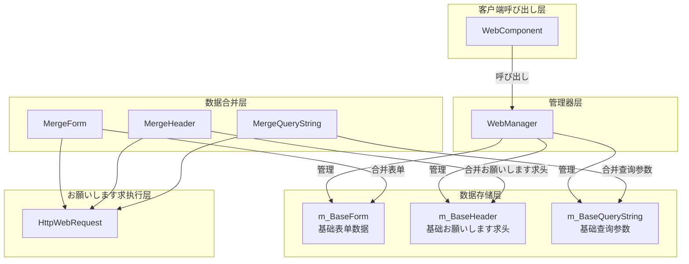
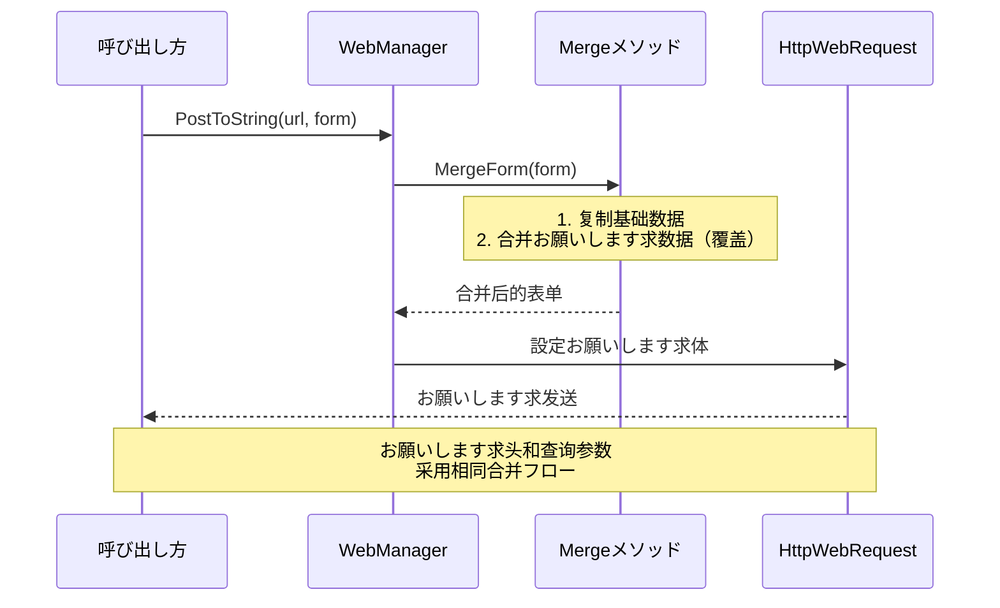
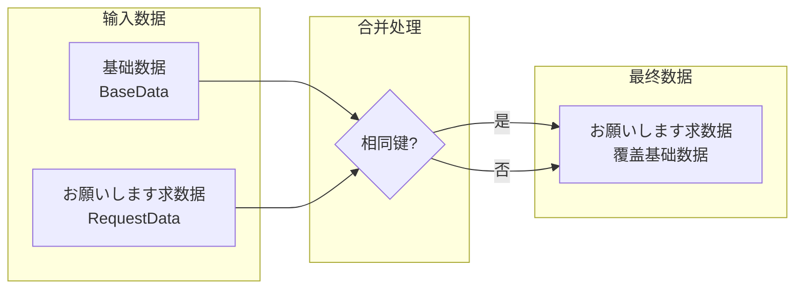

# 基础数据配置

基础数据配置機能允许開発者設定全局通用的お願いします求参数，这些参数会自动附加到所有HTTPお願いします求中，无需在每次お願いします求时重复設定。

## 概要

在使用 WebComponent 进行HTTPお願いします求时，很多シーン下必要为所有お願いします求添加共同的参数，例如：

- **身份验证**：API Token、用户会话ID
- **应用信息**：应用版本、设备平台、渠道标识
- **通用参数**：语言設定、地区编码

基础数据配置正是为解决这一需求而设计。を通じて预先配置基础数据，開発者可能一次性設定这些通用参数，后续的所有お願いします求都会自动包含这些数据，大大简化了代码并减少了重复工作。

### 设计原理

基础数据采用「合并而非替换」的策略：

1. **基础数据**在初期化时設定一次，贯穿整个应用生命周期
2. **お願いします求数据**在每次发起お願いします求时单独指定
3. **合并时**：如果お願いします求数据中包含与基础数据相同的键，お願いします求数据会**覆盖**基础数据
4. 这种设计既保证了基础数据的便利性，又保留了个别お願いします求的灵活性

## 架构

基础数据配置是 WebManager 的コア機能之一，与お願いします求处理フロー紧密集成。



### 各コンポーネント职责

| コンポーネント | 职责 |
|------|------|
| WebComponent | 提供Unityコンポーネントインターフェース，代理IWebManager的呼び出し |
| WebManager | 実装基础数据管理和お願いします求合并逻辑 |
| m_BaseForm | 存储全局表单数据字典 |
| m_BaseHeader | 存储全局お願いします求头字典 |
| m_BaseQueryString | 存储全局查询参数字典 |
| Merge* メソッド | 执行基础数据与お願いします求数据的合并 |

## コア機能

WebManager 提供します三クラス基础数据的管理機能：

### 1. 基础表单数据（Base Form）

基础表单数据会被添加到POSTお願いします求的お願いします求体中，适に使用必要随お願いします求发送的通用业务参数。

```csharp
// 添加基础表单数据
webComponent.AddBaseForm("app_version", "1.0.0");
webComponent.AddBaseForm("platform", "iOS");
webComponent.AddBaseForm("device_id", "ABC123");
```

> Source: [WebManager.cs](https://github.com/GameFrameX/com.gameframex.unity.web/blob/main/Runtime/Web/WebManager.cs#L591-L594)

### 2. 基础お願いします求头数据（Base Header）

基础お願いします求头数据会被添加到所有HTTPお願いします求的お願いします求头中，常に使用身份验证和内容协商。

```csharp
// 添加基础お願いします求头数据
webComponent.AddBaseHeader("Authorization", "Bearer token123");
webComponent.AddBaseHeader("Accept", "application/json");
webComponent.AddBaseHeader("X-Request-ID", Guid.NewGuid().ToString());
```

> Source: [WebManager.cs](https://github.com/GameFrameX/com.gameframex.unity.web/blob/main/Runtime/Web/WebManager.cs#L621-L624)

### 3. 基础查询参数数据（Base Query String）

基础查询参数会被附加到お願いします求URL后面，适に使用API版本、语言設定等常见参数。

```csharp
// 添加基础查询参数数据
webComponent.AddBaseQueryString("v", "2");
webComponent.AddBaseQueryString("lang", "zh-CN");
webComponent.AddBaseQueryString("timestamp", DateTimeOffset.Now.ToUnixTimeSeconds().ToString());
```

> Source: [WebManager.cs](https://github.com/GameFrameX/com.gameframex.unity.web/blob/main/Runtime/Web/WebManager.cs#L651-L654)

### 数据管理メソッド

每クラス基础数据都提供三种管理メソッド：

| メソッド | 機能 | 説明 |
|------|------|------|
| Add* | 添加数据 | 键存在时覆盖，不存在时新增 |
| Remove* | 移除数据 | 指定的键不存在时静默忽略 |
| Clear* | 清空数据 | 一次性清除该クラス型所有基础数据 |

```csharp
// 移除单个基础数据
webComponent.RemoveBaseForm("device_id");

// 清空所有基础表单数据
webComponent.ClearBaseForm();

// 清空所有基础お願いします求头
webComponent.ClearBaseHeader();

// 清空所有基础查询参数
webComponent.ClearBaseQueryString();
```

> Source: [IWebManager.cs](https://github.com/GameFrameX/com.gameframex.unity.web/blob/main/Runtime/Web/IWebManager.cs#L147-L198)

## 数据合并フロー

当发起HTTPお願いします求时，基础数据会与お願いします求参数自动合并。理解合并机制有助于更好地使用该機能。



### 合并优先级



**合并规则**：
- 如果お願いします求数据中包含某个键，其值会**覆盖**基础数据中相同键的值
- 如果お願いします求数据中不包含某个键，则使用基础数据中的值
- 基础数据本身不会被修改

### 合并実装示例

```csharp
/// <summary>
/// 合并表单数据
/// </summary>
private Dictionary<string, object> MergeForm(Dictionary<string, object> form)
{
    if (m_BaseForm.Count == 0)
    {
        return form;
    }

    // 复制基础数据
    var result = new Dictionary<string, object>(m_BaseForm);

    // 覆盖/添加外部数据
    if (form != null)
    {
        foreach (var kv in form)
        {
            result[kv.Key] = kv.Value;
        }
    }

    return result;
}
```

> Source: [WebManager.cs](https://github.com/GameFrameX/com.gameframex.unity.web/blob/main/Runtime/Web/WebManager.cs#L685-L705)

## 使用シーン示例

### シーン一：应用启动时初期化基础数据

在ゲーム或应用启动时配置全局参数：

```csharp
public class GameLauncher : MonoBehaviour
{
    private WebComponent _webComponent;

    private void Start()
    {
        _webComponent = GetComponent<WebComponent>();
        
        // 配置基础查询参数
        _webComponent.AddBaseQueryString("v", "2.0.0");
        _webComponent.AddBaseQueryString("platform", Application.platform.ToString());
        
        // 配置基础お願いします求头
        _webComponent.AddBaseHeader("Authorization", $"Bearer {GetAuthToken()}");
        
        // 配置基础表单数据
        _webComponent.AddBaseForm("app_id", GetAppId());
    }
    
    private string GetAuthToken() { /* 取得Token */ return "token"; }
    private string GetAppId() { /* 取得AppID */ return "app123"; }
}
```

### シーン二：APIお願いします求时自动携带基础数据

配置完成后，后续お願いします求无需再手动添加这些参数：

```csharp
// 后续お願いします求会自动携带之前設定的基础数据
// 最终お願いします求: POST /api/user/info?v=2.0.0&platform=iOS 
//           Header: Authorization: Bearer token123
//           Body: {app_id: "app123", name: "test"}
var result = await _webComponent.PostToString(
    "https://api.example.com/api/user/info",
    new Dictionary<string, object> { { "name", "test" } }
);
```

### シーン三：临时覆盖基础数据

在某些お願いします求中必要使用不同值时，直接在お願いします求中指定即可：

```csharp
// 即使基础数据中設定了 v=2.0.0，此お願いします求仍使用 v=3.0.0
var result = await _webComponent.PostToString(
    "https://api.example.com/api/v3/feature",
    new Dictionary<string, object> { { "name", "test" } },
    new Dictionary<string, string> { { "v", "3.0.0" } } // 覆盖基础查询参数
);
```

### シーン四：用户登录后更新Token

用户登录成功后更新认证信息：

```csharp
public async Task OnUserLogin(string newToken)
{
    // 移除旧Token
    _webComponent.RemoveBaseHeader("Authorization");
    
    // 添加新Token
    _webComponent.AddBaseHeader("Authorization", $"Bearer {newToken}");
}
```

### シーン五：切换API环境

在开发/生产环境间切换时：

```csharp
public void SwitchEnvironment(bool isProduction)
{
    string baseUrl = isProduction 
        ? "https://api.production.com" 
        : "https://api.dev.com";
    
    // 清空并重新設定基础查询参数
    _webComponent.ClearBaseQueryString();
    _webComponent.AddBaseQueryString("env", isProduction ? "prod" : "dev");
    _webComponent.AddBaseQueryString("debug", isProduction ? "false" : "true");
}
```

## API 参考

### IWebManager インターフェースメソッド

以下メソッド定义在 `IWebManager` インターフェース中，由 `WebManager` クラス実装：

#### 表单数据管理

| メソッド | 説明 |
|------|------|
| `AddBaseForm(string key, object value)` | 添加基础表单数据 |
| `RemoveBaseForm(string key)` | 移除指定的基础表单数据 |
| `ClearBaseForm()` | 清空所有基础表单数据 |

#### お願いします求头管理

| メソッド | 説明 |
|------|------|
| `AddBaseHeader(string key, string value)` | 添加基础お願いします求头数据 |
| `RemoveBaseHeader(string key)` | 移除指定的基础お願いします求头数据 |
| `ClearBaseHeader()` | 清空所有基础お願いします求头数据 |

#### 查询参数管理

| メソッド | 説明 |
|------|------|
| `AddBaseQueryString(string key, string value)` | 添加基础查询参数数据 |
| `RemoveBaseQueryString(string key)` | 移除指定的基础查询参数数据 |
| `ClearBaseQueryString()` | 清空所有基础查询参数数据 |

> 完整的 IWebManager インターフェース定义お願いします参见 [API 参考 - IWebManager インターフェース](./04.iwebmanager-interface)。

### WebComponent 代理メソッド

`WebComponent` を継承 `GameFrameworkComponent`，内部持有 `IWebManager` インスタンス，并代理所有基础数据管理メソッド的呼び出し。使用方法与直接呼び出し `IWebManager` 完全相同。

> WebComponent 的完整説明お願いします参见 [API 参考 - WebComponent コンポーネント](./08.web-component)。

## 関連リンク

- [超时配置](./10.timeout-settings) - 配置お願いします求超时时间
- [IWebManager インターフェース](./04.iwebmanager-interface) - Web管理器的完整インターフェース定义
- [WebComponent コンポーネント](./08.web-component) - Unityコンポーネント使用説明
- [お願いします求结果クラス型](./06.result-types) - 了解お願いします求返回的结果クラス型
