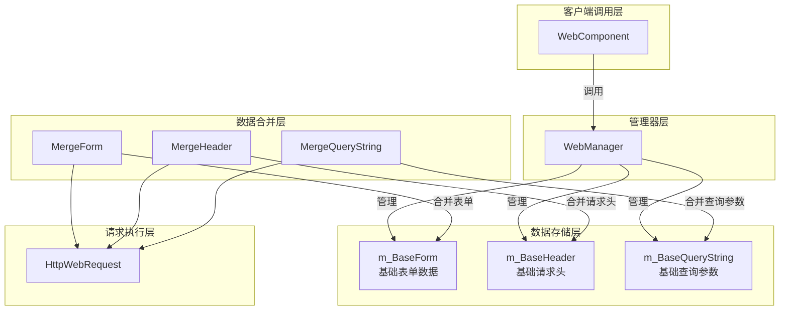
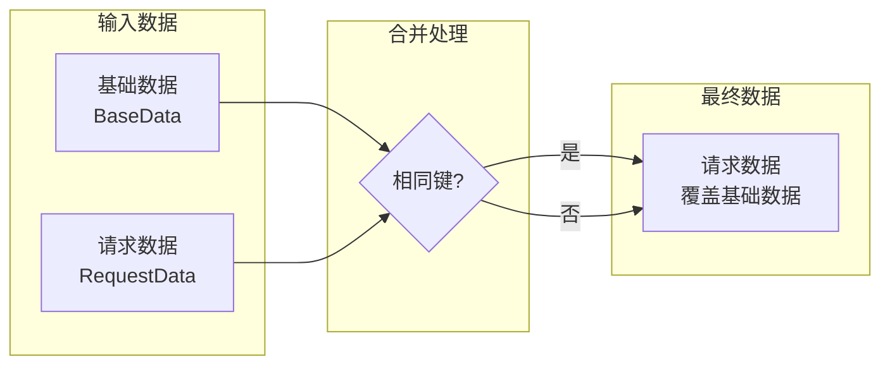

# 基本数据設定

基本数据設定機能允许開発者設定全局汎用的请求パラメータ，这些パラメータ会自动附加到所有HTTP请求中，无需在每次请求时重复設定。

## 概要

在使用 WebComponent 进行HTTP请求时，很多シーン下〜する必要があります为所有请求追加共同的パラメータ，例えば：

- **身份検証**：API Token、ユーザー会话ID
- **应用情報**：应用バージョン、设备プラットフォーム、渠道标识
- **汎用パラメータ**：语言設定、地区编码

基本数据設定正是为解决这一需求而設計。通过预先設定基本数据，開発者〜できます一次性設定这些汎用パラメータ，后续的所有请求都会自动パッケージ含这些数据，大大簡素化了コード并减少了重复工作。

### 設計原理

基本数据采用「合并而非置換」的策略：

1. **基本数据**在初期化时設定一次，贯穿整个应用ライフサイクル
2. **请求数据**在每次发起请求时单独指定
3. **合并时**：もし请求数据中パッケージ含与基本数据相同的键，请求数据会**覆盖**基本数据
4. 这种設計既保证了基本数据的便利性，又保留了个别请求的柔軟性

## アーキテクチャ

基本数据設定是 WebManager 的コア機能之一，与请求処理フロー紧密集成。



### 各コンポーネント职责

| コンポーネント | 职责 |
|------|------|
| WebComponent | 提供Unityコンポーネントインターフェース，代理IWebManager的呼び出し |
| WebManager | 実装基本数据管理和请求合并逻辑 |
| m_BaseForm | 存储全局表单数据字典 |
| m_BaseHeader | 存储全局请求头字典 |
| m_BaseQueryString | 存储全局查询パラメータ字典 |
| Merge* メソッド | 执行基本数据与请求数据的合并 |

## コア機能

WebManager 提供します三类基本数据的管理機能：

### 1. 基本表单数据（Base Form）

基本表单数据会被追加到POST请求的请求体中，適しています〜する必要があります随请求发送的汎用业务パラメータ。

```csharp
// 添加基础表单数据
webComponent.AddBaseForm("app_version", "1.0.0");
webComponent.AddBaseForm("platform", "iOS");
webComponent.AddBaseForm("device_id", "ABC123");
```

> Source: [WebManager.cs](https://github.com/GameFrameX/com.gameframex.unity.web/blob/main/Runtime/Web/WebManager.cs#L591-L594)

### 2. 基本请求头数据（Base Header）

基本请求头数据会被追加到所有HTTP请求的请求头中，常用于身份検証和内容协商。

```csharp
// 添加基础请求头数据
webComponent.AddBaseHeader("Authorization", "Bearer token123");
webComponent.AddBaseHeader("Accept", "application/json");
webComponent.AddBaseHeader("X-Request-ID", Guid.NewGuid().ToString());
```

> Source: [WebManager.cs](https://github.com/GameFrameX/com.gameframex.unity.web/blob/main/Runtime/Web/WebManager.cs#L621-L624)

### 3. 基本查询パラメータ数据（Base Query String）

基本查询パラメータ会被附加到请求URL后面，適していますAPIバージョン、语言設定等常见パラメータ。

```csharp
// 添加基础查询参数数据
webComponent.AddBaseQueryString("v", "2");
webComponent.AddBaseQueryString("lang", "zh-CN");
webComponent.AddBaseQueryString("timestamp", DateTimeOffset.Now.ToUnixTimeSeconds().ToString());
```

> Source: [WebManager.cs](https://github.com/GameFrameX/com.gameframex.unity.web/blob/main/Runtime/Web/WebManager.cs#L651-L654)

### 数据管理メソッド

每类基本数据都提供三种管理メソッド：

| メソッド | 機能 | 説明 |
|------|------|------|
| Add* | 追加数据 | 键存在时覆盖，不存在时新增 |
| Remove* | 移除数据 | 指定的键不存在时静默忽略 |
| Clear* | 清空数据 | 一次性清除该タイプ所有基本数据 |

```csharp
// 移除单个基础数据
webComponent.RemoveBaseForm("device_id");

// 清空所有基础表单数据
webComponent.ClearBaseForm();

// 清空所有基础请求头
webComponent.ClearBaseHeader();

// 清空所有基础查询参数
webComponent.ClearBaseQueryString();
```

> Source: [IWebManager.cs](https://github.com/GameFrameX/com.gameframex.unity.web/blob/main/Runtime/Web/IWebManager.cs#L147-L198)

## 数据合并フロー

当发起HTTP请求时，基本数据会与请求パラメータ自动合并。理解合并机制有助于更好地使用この機能。


### 合并优先级



**合并规则**：
- もし请求数据中パッケージ含某个键，其值会**覆盖**基本数据中相同键的值
- もし请求数据中不パッケージ含某个键，则使用基本数据中的值
- 基本数据本身不会被変更

### 合并実装例

```csharp
/// <summary>
/// 合并表单数据
/// </summary>
private Dictionary<string, object> MergeForm(Dictionary<string, object> form)
{
    if (m_BaseForm.Count == 0)
    {
        return form;
    }

    // 复制基础数据
    var result = new Dictionary<string, object>(m_BaseForm);

    // 覆盖/添加外部数据
    if (form != null)
    {
        foreach (var kv in form)
        {
            result[kv.Key] = kv.Value;
        }
    }

    return result;
}
```

> Source: [WebManager.cs](https://github.com/GameFrameX/com.gameframex.unity.web/blob/main/Runtime/Web/WebManager.cs#L685-L705)

## 使用シーン例

### シーン一：应用启动时初期化基本数据

在游戏或应用启动时設定全局パラメータ：

```csharp
public class GameLauncher : MonoBehaviour
{
    private WebComponent _webComponent;

    private void Start()
    {
        _webComponent = GetComponent<WebComponent>();
        
        // 配置基础查询参数
        _webComponent.AddBaseQueryString("v", "2.0.0");
        _webComponent.AddBaseQueryString("platform", Application.platform.ToString());
        
        // 配置基础请求头
        _webComponent.AddBaseHeader("Authorization", $"Bearer {GetAuthToken()}");
        
        // 配置基础表单数据
        _webComponent.AddBaseForm("app_id", GetAppId());
    }
    
    private string GetAuthToken() { /* 获取Token */ return "token"; }
    private string GetAppId() { /* 获取AppID */ return "app123"; }
}
```

### シーン二：API请求时自动携带基本数据

設定完成后，后续请求无需再手动追加这些パラメータ：

```csharp
// 后续请求会自动携带之前设置的基础数据
// 最终请求: POST /api/user/info?v=2.0.0&platform=iOS 
//           Header: Authorization: Bearer token123
//           Body: {app_id: "app123", name: "test"}
var result = await _webComponent.PostToString(
    "https://api.example.com/api/user/info",
    new Dictionary<string, object> { { "name", "test" } }
);
```

### シーン三：临时覆盖基本数据

在某些请求中〜する必要があります使用不同值时，直接在请求中指定つまり可：

```csharp
// 即使基础数据中设置了 v=2.0.0，此请求仍使用 v=3.0.0
var result = await _webComponent.PostToString(
    "https://api.example.com/api/v3/feature",
    new Dictionary<string, object> { { "name", "test" } },
    new Dictionary<string, string> { { "v", "3.0.0" } } // 覆盖基础查询参数
);
```

### シーン四：ユーザー登录后アップデートToken

ユーザー登录成功后アップデート认证情報：

```csharp
public async Task OnUserLogin(string newToken)
{
    // 移除旧Token
    _webComponent.RemoveBaseHeader("Authorization");
    
    // 添加新Token
    _webComponent.AddBaseHeader("Authorization", $"Bearer {newToken}");
}
```

### シーン五：切换API環境

在开发/本番環境间切换时：

```csharp
public void SwitchEnvironment(bool isProduction)
{
    string baseUrl = isProduction 
        ? "https://api.production.com" 
        : "https://api.dev.com";
    
    // 清空并重新设置基础查询参数
    _webComponent.ClearBaseQueryString();
    _webComponent.AddBaseQueryString("env", isProduction ? "prod" : "dev");
    _webComponent.AddBaseQueryString("debug", isProduction ? "false" : "true");
}
```

## API リファレンス

### IWebManager インターフェースメソッド

以下メソッド定義在 `IWebManager` インターフェース中，由 `WebManager` 类実装：

#### 表单数据管理

| メソッド | 説明 |
|------|------|
| `AddBaseForm(string key, object value)` | 追加基本表单数据 |
| `RemoveBaseForm(string key)` | 移除指定的基本表单数据 |
| `ClearBaseForm()` | 清空所有基本表单数据 |

#### 请求头管理

| メソッド | 説明 |
|------|------|
| `AddBaseHeader(string key, string value)` | 追加基本请求头数据 |
| `RemoveBaseHeader(string key)` | 移除指定的基本请求头数据 |
| `ClearBaseHeader()` | 清空所有基本请求头数据 |

#### 查询パラメータ管理

| メソッド | 説明 |
|------|------|
| `AddBaseQueryString(string key, string value)` | 追加基本查询パラメータ数据 |
| `RemoveBaseQueryString(string key)` | 移除指定的基本查询パラメータ数据 |
| `ClearBaseQueryString()` | 清空所有基本查询パラメータ数据 |

> 完全な的 IWebManager インターフェース定義请参见 [API リファレンス - IWebManager インターフェース](./04.iwebmanager-interface)。

### WebComponent 代理メソッド

`WebComponent` 継承自 `GameFrameworkComponent`，内部持有 `IWebManager` インスタンス，并代理所有基本数据管理メソッド的呼び出し。使用方法与直接呼び出し `IWebManager` 完全相同。

> WebComponent 的完全な説明请参见 [API リファレンス - WebComponent コンポーネント](./08.web-component)。

## 関連リンク

- [超时設定](./10.timeout-settings) - 設定请求超时时间
- [IWebManager インターフェース](./04.iwebmanager-interface) - Webマネージャー的完全なインターフェース定義
- [WebComponent コンポーネント](./08.web-component) - Unityコンポーネント使用説明
- [请求結果タイプ](./06.result-types) - 理解する请求返す的結果タイプ
