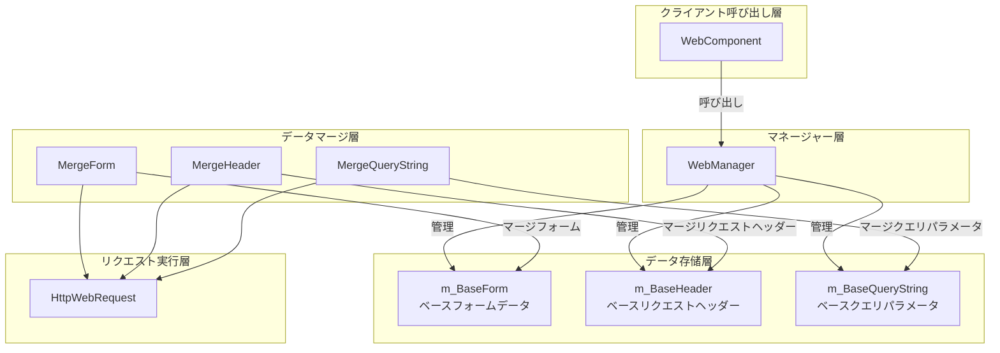
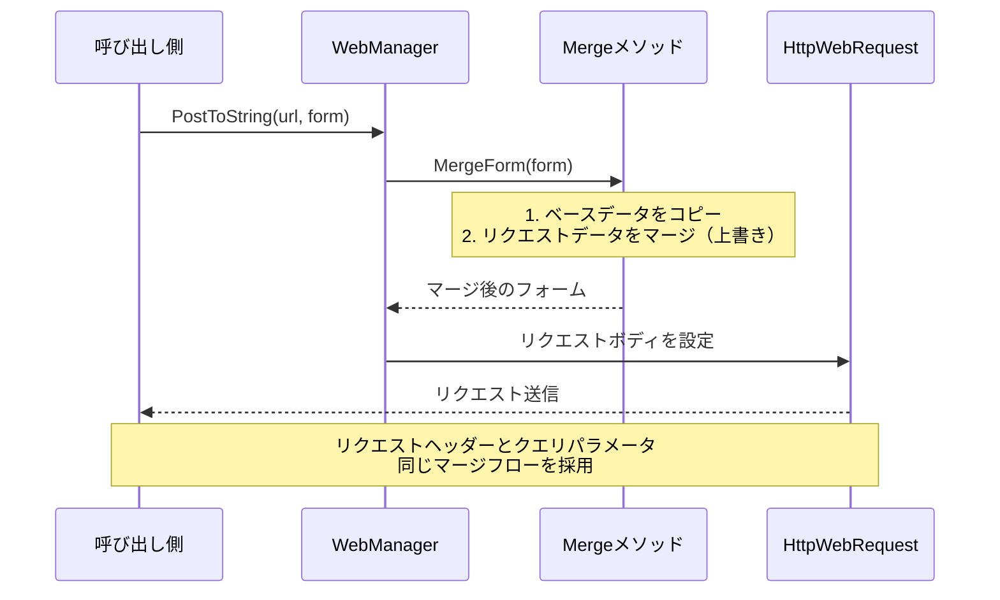
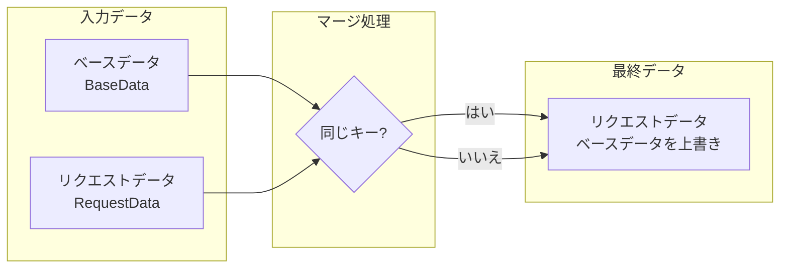

# ベースデータ設定

ベースデータ設定機能を使用すると、開発者はグローバル通用的リクエストパラメータを設定でき、これらのパラメータはすべての HTTP リクエストに自動的に附加され、每次リクエスト時に繰り返し設定する必要がなくなります。

## 概要

WebComponent で HTTP リクエストを行う际、多くのシーンではすべてのリクエストに共通のパラメータを追加する必要があります。例えば：

- **身份認証**：API Token、ユーザーセッションID
- **アプリ情報**：アプリバージョン、デバイスプラットフォーム、チャネル識別子
- **通用パラメータ**：言語設定、地域コード

ベースデータ設定はこの需求を解決するために設計されています。事前にベースデータを設定することで、開発者はこれらの共通パラメータを一度に設定でき、以降のリクエストはすべて自動的にこれらのデータを含み、コードを大幅に簡素化し、繰り返し作業を軽減します。

### 設計原理

ベースデータは「マージ而非置換」の策略を採用しています：

1. **ベースデータ**は初期化時に一度設定し、アプリケーション全体のライフサイクルを通じで維持
2. **リクエストデータ**は每次リクエスト发起時に個別に指定
3. **マージ時**：リクエストデータにベースデータと同じキーが含まれている場合、リクエストデータがベースデータを**上書き**
4. この設計はベースデータの利便性を保証的同时、個別リクエストの柔軟性も維持

## アーキテクチャ

ベースデータ設定は WebManager のコア機能の1つであり、リクエスト処理フローと密接に統合されています。



### 各コンポーネントの責務

| コンポーネント | 責務 |
|------|------|
| WebComponent | Unity コンポーネントインターフェースを提供し、IWebManager の呼び出しを代理 |
| WebManager | ベースデータ管理とリクエストマージロジックを実装 |
| m_BaseForm | グローバルフォームデータ辞書を存储 |
| m_BaseHeader | グローバルリクエストヘッダー辞書を存储 |
| m_BaseQueryString | グローバルクエリ参数字典を存储 |
| Merge* メソッド | ベースデータとリクエストデータのマージを実行 |

## コア機能

WebManager は3クラスのベースデータ管理機能を提供します：

### 1. ベースフォームデータ（Base Form）

ベースフォームデータは POST リクエストのリクエストボディに追加され、リクエストと一緒に送信する必要がある共通業務パラメータに適しています。

```csharp
// ベースフォームデータを追加
webComponent.AddBaseForm("app_version", "1.0.0");
webComponent.AddBaseForm("platform", "iOS");
webComponent.AddBaseForm("device_id", "ABC123");
```

> Source: [WebManager.cs](https://github.com/GameFrameX/com.gameframex.unity.web/blob/main/Runtime/Web/WebManager.cs#L591-L594)

### 2. ベースリクエストヘッダーデータ（Base Header）

ベースリクエストヘッダーデータはすべての HTTP リクエストのリクエストヘッダーに追加され、身份認証とコンテンツネゴシエーションに常 استخدامها。

```csharp
// ベースリクエストヘッダーデータを追加
webComponent.AddBaseHeader("Authorization", "Bearer token123");
webComponent.AddBaseHeader("Accept", "application/json");
webComponent.AddBaseHeader("X-Request-ID", Guid.NewGuid().ToString());
```

> Source: [WebManager.cs](https://github.com/GameFrameX/com.gameframex.unity.web/blob/main/Runtime/Web/WebManager.cs#L621-L624)

### 3. ベースクエリパラメータデータ（Base Query String）

ベースクエリパラメータはリクエスト URL の後ろに附加され、API バージョン、言語設定等の共通パラメータに適しています。

```csharp
// ベースクエリパラメータデータを追加
webComponent.AddBaseQueryString("v", "2");
webComponent.AddBaseQueryString("lang", "ja-JP");
webComponent.AddBaseQueryString("timestamp", DateTimeOffset.Now.ToUnixTimeSeconds().ToString());
```

> Source: [WebManager.cs](https://github.com/GameFrameX/com.gameframex.unity.web/blob/main/Runtime/Web/WebManager.cs#L651-L654)

### データ管理メソッド

各クラスのベースデータには3種類の管理メソッドがあります：

| メソッド | 機能 | 説明 |
|------|------|------|
| Add* | データを追加 | キーが存在する場合は上書き、存在しない場合は新規追加 |
| Remove* | データを移除 | 指定のキーが存在しない場合は暗黙的に無視 |
| Clear* | データを空にする | そのタイプのすべてのベースデータを一度清除 |

```csharp
// 单个ベースデータを移除
webComponent.RemoveBaseForm("device_id");

// すべてのベースフォームデータを空にする
webComponent.ClearBaseForm();

// すべてのベースリクエストヘッダーを空にする
webComponent.ClearBaseHeader();

// すべてのベースクエリパラメータを空にする
webComponent.ClearBaseQueryString();
```

> Source: [IWebManager.cs](https://github.com/GameFrameX/com.gameframex.unity.web/blob/main/Runtime/Web/IWebManager.cs#L147-L198)

## データマージフロー

HTTP リクエスト发起時に、ベースデータはリクエストパラメータと自動的にマージされます。マージメカニズムを理解することがこの功能を更好地使用することに役立ちます。



### マージ優先順位



**マージルール**：
- リクエストデータに特定のキーが含まれている場合、その値はベースデータの同じキーの値を**上書き**
- リクエストデータに特定のキーが含まれていない場合は、ベースデータの値を使用
- ベースデータ自体は変更されません

### マージ実装示例

```csharp
/// <summary>
/// フォームデータをマージ
/// </summary>
private Dictionary<string, object> MergeForm(Dictionary<string, object> form)
{
    if (m_BaseForm.Count == 0)
    {
        return form;
    }

    // ベースデータをコピー
    var result = new Dictionary<string, object>(m_BaseForm);

    // 外部データを上書き/追加
    if (form != null)
    {
        foreach (var kv in form)
        {
            result[kv.Key] = kv.Value;
        }
    }

    return result;
}
```

> Source: [WebManager.cs](https://github.com/GameFrameX/com.gameframex.unity.web/blob/main/Runtime/Web/WebManager.cs#L685-L705)

## 使用シーン示例

### シーン一：アプリ起動時にベースデータを初期化

ゲームまたはアプリの起動時にグローバルパラメータを設定：

```csharp
public class GameLauncher : MonoBehaviour
{
    private WebComponent _webComponent;

    private void Start()
    {
        _webComponent = GetComponent<WebComponent>();
        
        // ベースクエリパラメータを設定
        _webComponent.AddBaseQueryString("v", "2.0.0");
        _webComponent.AddBaseQueryString("platform", Application.platform.ToString());
        
        // ベースリクエストヘッダーを設定
        _webComponent.AddBaseHeader("Authorization", $"Bearer {GetAuthToken()}");
        
        // ベースフォームデータを設定
        _webComponent.AddBaseForm("app_id", GetAppId());
    }
    
    private string GetAuthToken() { /* Token を取得 */ return "token"; }
    private string GetAppId() { /* AppID を取得 */ return "app123"; }
}
```

### シーン二：API リクエスト時に自動的にベースデータを携带

設定完了後、以降のリクエストはこれらのパラメータを再度手動で追加する必要がありません：

```csharp
// 以前に設定したベースデータを自動的に携带
// 最終リクエスト: POST /api/user/info?v=2.0.0&platform=iOS 
//           Header: Authorization: Bearer token123
//           Body: {app_id: "app123", name: "test"}
var result = await _webComponent.PostToString(
    "https://api.example.com/api/user/info",
    new Dictionary<string, object> { { "name", "test" } }
);
```

### シーン三：ベースデータを一時的に上書き

特定のリクエストで異なる値を使用する必要がある場合、リクエスト内で直接指定すれば OK：

```csharp
// ベースデータで v=2.0.0 を設定中でも、このリクエストでは v=3.0.0 を使用
var result = await _webComponent.PostToString(
    "https://api.example.com/api/v3/feature",
    new Dictionary<string, object> { { "name", "test" } },
    new Dictionary<string, string> { { "v", "3.0.0" } } // ベースクエリパラメータを上書き
);
```

### シーン四：ユーザーログイン後に Token を更新

ユーザーのログイン成功後に認証情報を更新：

```csharp
public async Task OnUserLogin(string newToken)
{
    // 古い Token を移除
    _webComponent.RemoveBaseHeader("Authorization");
    
    // 新しい Token を追加
    _webComponent.AddBaseHeader("Authorization", $"Bearer {newToken}");
}
```

### シーン五：API 環境の切り替え

開発/本番環境間で切换える場合：

```csharp
public void SwitchEnvironment(bool isProduction)
{
    string baseUrl = isProduction 
        ? "https://api.production.com" 
        : "https://api.dev.com";
    
    // 空にしてから再度ベースクエリパラメータを設定
    _webComponent.ClearBaseQueryString();
    _webComponent.AddBaseQueryString("env", isProduction ? "prod" : "dev");
    _webComponent.AddBaseQueryString("debug", isProduction ? "false" : "true");
}
```

## API リファレンス

### IWebManager ادث募集资金

以下のメソッドは `IWebManager` インターフェースで定義され、`WebManager` クラスが実装：

#### フォームデータ管理

| メソッド | 説明 |
|------|------|
| `AddBaseForm(string key, object value)` | ベースフォームデータを追加 |
| `RemoveBaseForm(string key)` | 指定のベースフォームデータを移除 |
| `ClearBaseForm()` | すべてのベースフォームデータをクリア |

#### リクエストヘッダー管理

| メソッド | 説明 |
|------|------|
| `AddBaseHeader(string key, string value)` | ベースリクエストヘッダーデータを追加 |
| `RemoveBaseHeader(string key)` | 指定のベースリクエストヘッダーデータを移除 |
| `ClearBaseHeader()` | すべてのベースリクエストヘッダーデータをクリア |

#### クエリパラメータ管理

| メソッド | 説明 |
|------|------|
| `AddBaseQueryString(string key, string value)` | ベースクエリパラメータデータを追加 |
| `RemoveBaseQueryString(string key)` | 指定のベースクエリパラメータデータを移除 |
| `ClearBaseQueryString()` | すべてのベースクエリパラメータデータをクリア |

> 完全な IWebManager インターフェース定義については [API リファレンス - IWebManager インターフェース](./04.iwebmanager-interface) を参照してください。

### WebComponent 代理メソッド

`WebComponent` は `GameFrameworkComponent` を継承し、内部で `IWebManager` インスタンスを保持し、すべてのベースデータ管理メソッドの呼び出しを代理します。使用方法は直接 `IWebManager` を呼び出すのと完全に同じです。

> WebComponent の詳細な説明については [API リファレンス - WebComponent コンポーネント](./08.web-component) を参照してください。

## 関連リンク

- [タイムアウト設定](./10.timeout-settings) - リクエストタイムアウト時間の設定
- [IWebManager インターフェース](./04.iwebmanager-interface) - Web マネージャーの完全なインターフェース定義
- [WebComponent コンポーネント](./08.web-component) - Unity コンポーネント使用説明
- [リクエスト結果タイプ](./06.result-types) - リクエストが返す結果タイプを確認
