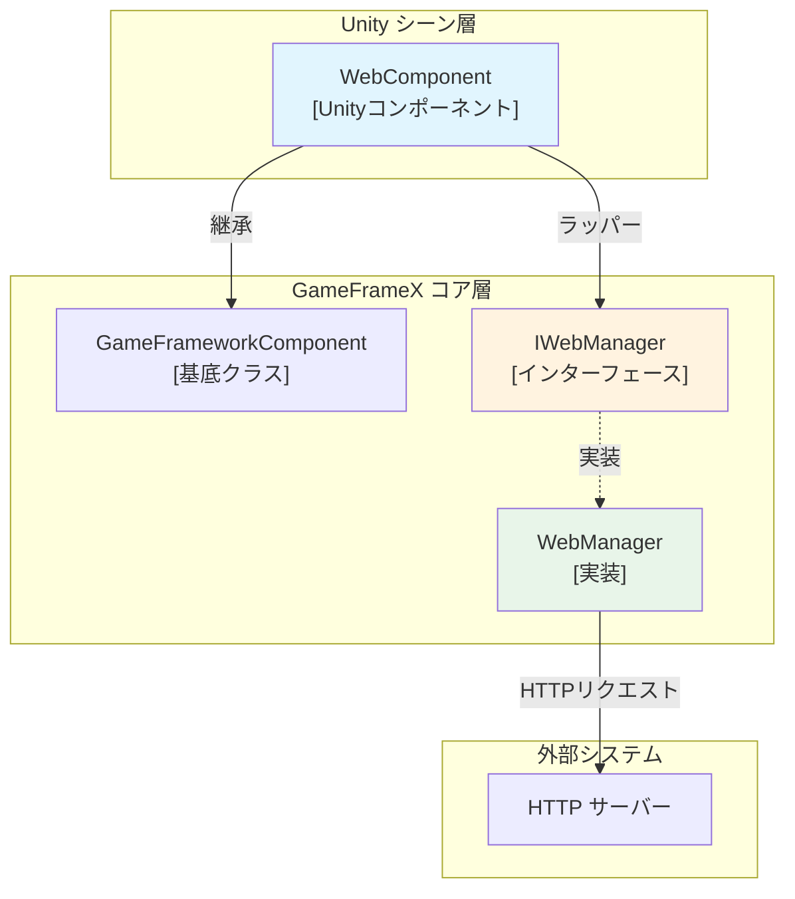
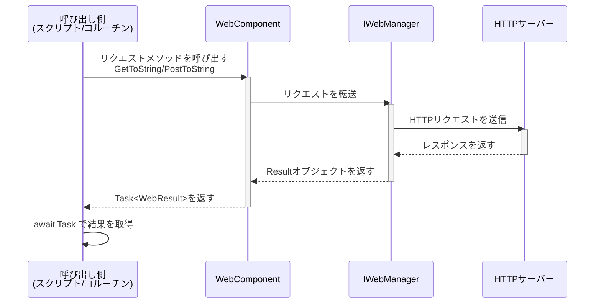
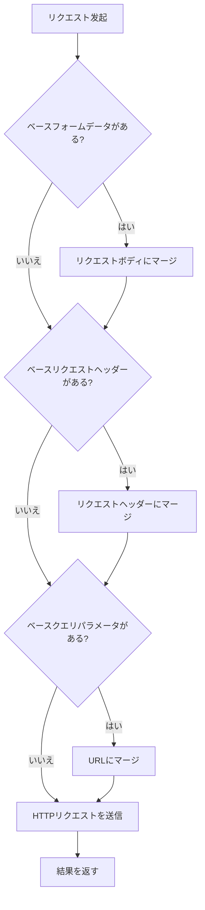

# WebComponent コンポーネント

WebComponent は GameFrameX フレームワークが提供する Unity コンポーネントであり、Unity ゲームで HTTP ネットワークリクエスト操作を簡素化するために使用されます。このコンポーネントは IWebManager インターフェースをラップし、Unity に 친しみやすい非同期リクエストメソッドを提供します。

## 概要

WebComponent は `GameFrameworkComponent` を継承する Unity コンポーネントであり、Unity シーンで HTTP ネットワークリクエスト機能を提供하도록設計されています。このコンポーネントを通じて、開発者は簡単に GET と POST リクエストを送信し、文字列またはバイト配列フォーマットのレスポンス結果を取得できます。

**主な特性：**
- GET と POST リクエストをサポート
- 文字列とバイト配列の2種類のレスポンスフォーマットをサポート
- クエリパラメータ、リクエストヘッダー、フォームデータの設定をサポート
- タイムアウト制御メカニズムを提供
- ベースデータ設定をサポートし、すべてのリクエストに共通パラメータを追加可能

## アーキテクチャ



**アーキテクチャ説明：**
- **WebComponent**：Unity レベルのコンポーネント、GameObject にアタッチして使用、シンプルな API を提供
- **IWebManager**：ネットワークリクエスト機能を定義するインターフェース
- **WebManager**：IWebManager の具体的な実装、実際の HTTP 通信を処理

## コア機能

### HTTP リクエストメソッド

WebComponent は豊富な HTTP リクエストメソッドを提供し、GET と POST の2種類のリクエストタイプを網羅：

#### GET リクエスト

```csharp
// 基礎 GET リクエスト - 文字列を返す
Task<WebStringResult> GetToString(string url, object userData = null)

// クエリパラメータ付き GET リクエスト - 文字列を返す
Task<WebStringResult> GetToString(string url, Dictionary<string, string> queryString, object userData = null)

// クエリパラメータとリクエストヘッダー付き GET リクエスト - 文字列を返す
Task<WebStringResult> GetToString(string url, Dictionary<string, string> queryString, Dictionary<string, string> header, object userData = null)

// 基礎 GET リクエスト - バイト配列を返す
Task<WebBufferResult> GetToBytes(string url, object userData = null)

// クエリパラメータ付き GET リクエスト - バイト配列を返す
Task<WebBufferResult> GetToBytes(string url, Dictionary<string, string> queryString, object userData = null)

// クエリパラメータとリクエストヘッダー付き GET リクエスト - バイト配列を返す
Task<WebBufferResult> GetToBytes(string url, Dictionary<string, string> queryString, Dictionary<string, string> header, object userData = null)
```

#### POST リクエスト

```csharp
// 基礎 POST リクエスト - 文字列を返す
Task<WebStringResult> PostToString(string url, Dictionary<string, object> from = null, object userData = null)

// クエリパラメータ付き POST リクエスト - 文字列を返す
Task<WebStringResult> PostToString(string url, Dictionary<string, object> from, Dictionary<string, string> queryString, object userData = null)

// クエリパラメータとリクエストヘッダー付き POST リクエスト - 文字列を返す
Task<WebStringResult> PostToString(string url, Dictionary<string, object> from, Dictionary<string, string> queryString, Dictionary<string, string> header, object userData = null)

// 基礎 POST リクエスト - バイト配列を返す
Task<WebBufferResult> PostToBytes(string url, Dictionary<string, object> from, object userData = null)

// クエリパラメータ付き POST リクエスト - バイト配列を返す
Task<WebBufferResult> PostToBytes(string url, Dictionary<string, object> from, Dictionary<string, string> queryString, object userData = null)

// クエリパラメータとリクエストヘッダー付き POST リクエスト - バイト配列を返す
Task<WebBufferResult> PostToBytes(string url, Dictionary<string, object> from, Dictionary<string, string> queryString, Dictionary<string, string> header, object userData = null)

// バイト配列データを送信する POST リクエスト - バイト配列を返す
Task<WebBufferResult> PostToBytes(string url, byte[] fromData, Dictionary<string, string> queryString, Dictionary<string, string> header, object userData = null)
```

### ベースデータ設定

WebComponent はベースデータの設定をサポートしており、これらのデータはすべてのリクエストに自動的に追加され、認証情報、バージョン番号等を一律携带する必要があるシーンに適しています：

```csharp
// フォームデータ管理
void AddBaseForm(string key, object value)
void RemoveBaseForm(string key)
void ClearBaseForm()

// リクエストヘッダー管理
void AddBaseHeader(string key, string value)
void RemoveBaseHeader(string key)
void ClearBaseHeader()

// クエリパラメータ管理
void AddBaseQueryString(string key, string value)
void RemoveBaseQueryString(string key)
void ClearBaseQueryString()
```

### タイムアウト設定

```csharp
// タイムアウト時間を取得または設定
public float Timeout
{
    get { return m_WebManager.Timeout; }
    set { m_WebManager.Timeout = m_Timeout = value; }
}
```

> Source: [WebComponent.cs](https://github.com/GameFrameX/com.gameframex.unity.web/blob/main/Runtime/Web/WebComponent.cs#L59-L70)

## コアフロー

### リクエスト処理フロー



### ベースデータ適用フロー



## 使用例

### 基礎 GET リクエスト

```csharp
using UnityEngine;
using GameFrameX.Web.Runtime;

public class ExampleScript : MonoBehaviour
{
    private WebComponent webComponent;

    private void Start()
    {
        // WebComponent コンポーネントを取得
        webComponent = GetComponent<WebComponent>();
        
        // シンプルな GET リクエストを送信
        _ = GetExample();
    }

    private async void GetExample()
    {
        var result = await webComponent.GetToString("https://api.example.com/data");
        if (!string.IsNullOrEmpty(result.Result))
        {
            Debug.Log($"GET リクエスト成功: {result.Result}");
        }
    }
}
```

> Source: [WebComponent.cs](https://github.com/GameFrameX/com.gameframex.unity.web/blob/main/Runtime/Web/WebComponent.cs#L98-L101)

### パラメータ付き GET リクエスト

```csharp
// クエリパラメータ付き GET リクエスト
private async void GetWithQueryParams()
{
    var queryParams = new Dictionary<string, string>
    {
        { "page", "1" },
        { "limit", "10" }
    };
    
    var result = await webComponent.GetToString(
        "https://api.example.com/users", 
        queryParams
    );
}

// クエリパラメータとカスタムリクエストヘッダー付き
private async void GetWithHeaders()
{
    var queryParams = new Dictionary<string, string> { { "id", "123" } };
    var headers = new Dictionary<string, string>
    {
        { "Authorization", "Bearer token123" },
        { "Accept", "application/json" }
    };
    
    var result = await webComponent.GetToString(
        "https://api.example.com/protected",
        queryParams,
        headers
    );
}
```

> Source: [WebComponent.cs](https://github.com/GameFrameX/com.gameframex.unity.web/blob/main/Runtime/Web/WebComponent.cs#L110-L126)

### POST リクエスト示例

```csharp
// POST リクエストを送信してフォームデータを提交
private async void PostExample()
{
    var formData = new Dictionary<string, object>
    {
        { "username", "testuser" },
        { "password", "password123" }
    };
    
    var result = await webComponent.PostToString(
        "https://api.example.com/login",
        formData
    );
    
    Debug.Log($"POST レスポンス: {result.Result}");
}

// 完全なパラメータ付き POST リクエスト
private async void PostWithFullParams()
{
    var formData = new Dictionary<string, object>
    {
        { "title", "Hello World" },
        { "content", "This is a post content" }
    };
    
    var queryParams = new Dictionary<string, string>
    {
        { "format", "json" }
    };
    
    var headers = new Dictionary<string, string>
    {
        { "Content-Type", "application/x-www-form-urlencoded" }
    };
    
    var result = await webComponent.PostToString(
        "https://api.example.com/posts",
        formData,
        queryParams,
        headers
    );
}
```

> Source: [WebComponent.cs](https://github.com/GameFrameX/com.gameframex.unity.web/blob/main/Runtime/Web/WebComponent.cs#L175-L205)

### ベースデータ設定の使用

```csharp
// Start でベースデータを設定
private void Start()
{
    // ベースリクエストヘッダーを追加（認証情報等）
    webComponent.AddBaseHeader("Authorization", "Bearer your-token");
    webComponent.AddBaseHeader("App-Version", "1.0.0");
    
    // ベースクエリパラメータを追加
    webComponent.AddBaseQueryString("platform", "android");
    webComponent.AddBaseQueryString("language", "ja-JP");
}

// 以降のリクエストは自動的にこれらのベースデータを携带
private void MakeRequest()
{
    // このリクエストは自動的に含まれる:
    // - Authorization: Bearer your-token
    // - App-Version: 1.0.0
    // - platform: android
    // - language: ja-JP
    webComponent.GetToString("https://api.example.com/data");
}

// ベースデータをクリア
private void OnDestroy()
{
    webComponent.ClearBaseHeader();
    webComponent.ClearBaseQueryString();
}
```

> Source: [WebComponent.cs](https://github.com/GameFrameX/com.gameframex.unity.web/blob/main/Runtime/Web/WebComponent.cs#L262-L341)

### バイナリデータをダウンロード

```csharp
// 画像或其他バイナリデータをダウンロード
private async void DownloadImage()
{
    var result = await webComponent.GetToBytes("https://example.com/image.png");
    
    if (result.Result != null && result.Result.Length > 0)
    {
        // Texture2D を作成
        Texture2D texture = new Texture2D(2, 2);
        texture.LoadImage(result.Result);
        
        // Sprite に適用
        Sprite sprite = Sprite.Create(
            texture, 
            new Rect(0, 0, texture.width, texture.height), 
            Vector2.one * 0.5f
        );
        
        Debug.Log($"画像ダウンロード成功: {texture.width}x{texture.height}");
    }
}
```

> Source: [WebComponent.cs](https://github.com/GameFrameX/com.gameframex.unity.web/blob/main/Runtime/Web/WebComponent.cs#L136-L139)

## コンポーネント設定

### Unity エディターに追加

1. Unity シーンで空の GameObject を作成するか、ネットワーク機能を追加する必要がある GameObject を選択
2. **Component → GameFrameX → Web** メニュー項目を選択
3. WebComponent コンポーネントが選択した GameObject に追加される

### Inspector 設定

Inspector パネルで以下のプロパティを設定できます：

| プロパティ | タイプ | デフォルト値 | 説明 |
|------|------|--------|------|
| Timeout | float | 5.0 | リクエストタイムアウト時間、单位は秒 |

```csharp
// Inspector でのタイムアウト設定範囲は 0-120 秒
// 実行時に変更可能
webComponent.Timeout = 10f;
```

> Source: [WebComponentInspector.cs](https://github.com/GameFrameX/com.gameframex.unity.web/blob/main/Editor/Inspector/WebComponentInspector.cs#L23-L34)

## API リファレンス

### プロパティ

#### `Timeout`

```csharp
public float Timeout { get; set; }
```

リクエストタイムアウト時間を取得または設定します。リクエストがこの時間を超えて完了しない場合、自動的に终止されます。

**デフォルト値：** 5.0 秒

**範囲：** 0 - 120 秒

### メソッド

#### GET リクエストメソッド

##### `GetToString(url, userData)`

```csharp
Task<WebStringResult> GetToString(string url, object userData = null)
```

GET リクエストを送信し、文字列結果を返します。

**パラメータ：**
- `url` (string): リクエストアドレス
- `userData` (object, 任意): ユーザーカスタムデータ、結果にそのままず返されます

**返り値：** `Task<WebStringResult>` - 文字列結果を含む非同期タスク

---

##### `GetToString(url, queryString, userData)`

```csharp
Task<WebStringResult> GetToString(string url, Dictionary<string, string> queryString, object userData = null)
```

クエリパラメータ付き GET リクエストを送信し、文字列結果を返します。

**パラメータ：**
- `url` (string): リクエストアドレス
- `queryString` (Dictionary<string, string>): URL クエリ参数字典
- `userData` (object, 任意): ユーザーカスタムデータ

**返り値：** `Task<WebStringResult>` - 文字列結果を含む非同期タスク

---

##### `GetToString(url, queryString, header, userData)`

```csharp
Task<WebStringResult> GetToString(string url, Dictionary<string, string> queryString, Dictionary<string, string> header, object userData = null)
```

クエリパラメータとリクエストヘッダー付き GET リクエストを送信し、文字列結果を返します。

**パラメータ：**
- `url` (string): リクエストアドレス
- `queryString` (Dictionary<string, string>): URL クエリ参数字典
- `header` (Dictionary<string, string>): HTTP リクエストヘッダー辞書
- `userData` (object, 任意): ユーザーカスタムデータ

**返り値：** `Task<WebStringResult>` - 文字列結果を含む非同期タスク

---

##### `GetToBytes(url, userData)`

```csharp
Task<WebBufferResult> GetToBytes(string url, object userData = null)
```

GET リクエストを送信し、バイト配列結果を返します。バイナリデータのダウンロードに適しています。

**パラメータ：**
- `url` (string): リクエストアドレス
- `userData` (object, 任意): ユーザーカスタムデータ

**返り値：** `Task<WebBufferResult>` - バイト配列を含む非同期タスク

---

#### POST リクエストメソッド

##### `PostToString(url, from, userData)`

```csharp
Task<WebStringResult> PostToString(string url, Dictionary<string, object> from = null, object userData = null)
```

POST リクエストを送信し、文字列結果を返します。

**パラメータ：**
- `url` (string): リクエストアドレス
- `from` (Dictionary<string, object>, 任意): フォームデータ辞書
- `userData` (object, 任意): ユーザーカスタムデータ

**返り値：** `Task<WebStringResult>` - 文字列結果を含む非同期タスク

---

##### `PostToString(url, from, queryString, header, userData)`

```csharp
Task<WebStringResult> PostToString(string url, Dictionary<string, object> from, Dictionary<string, string> queryString, Dictionary<string, string> header, object userData = null)
```

クエリパラメータとリクエストヘッダー付き POST リクエストを送信し、文字列結果を返します。

**パラメータ：**
- `url` (string): リクエストアドレス
- `from` (Dictionary<string, object>): フォームデータ辞書
- `queryString` (Dictionary<string, string>): URL クエリ参数字典
- `header` (Dictionary<string, string>): HTTP リクエストヘッダー辞書
- `userData` (object, 任意): ユーザーカスタムデータ

**返り値：** `Task<WebStringResult>` - 文字列結果を含む非同期タスク

---

##### `PostToBytes(url, from, userData)`

```csharp
Task<WebBufferResult> PostToBytes(string url, Dictionary<string, object> from, object userData = null)
```

POST リクエストを送信し、バイト配列結果を返します。

**パラメータ：**
- `url` (string): リクエストアドレス
- `from` (Dictionary<string, object>): フォームデータ辞書
- `userData` (object, 任意): ユーザーカスタムデータ

**返り値：** `Task<WebBufferResult>` - バイト配列を含む非同期タスク

---

##### `PostToBytes(url, fromData, queryString, header, userData)`

```csharp
Task<WebBufferResult> PostToBytes(string url, byte[] fromData, Dictionary<string, string> queryString, Dictionary<string, string> header, object userData = null)
```

バイト配列 POST リクエストを送信し、バイト配列結果を返します。ファイルアップロード等のシーンに適しています。

**パラメータ：**
- `url` (string): リクエストアドレス
- `fromData` (byte[]): 送信するバイト配列データ
- `queryString` (Dictionary<string, string>): URL クエリ参数字典
- `header` (Dictionary<string, string>): HTTP リクエストヘッダー辞書
- `userData` (object, 任意): ユーザーカスタムデータ

**返り値：** `Task<WebBufferResult>` - バイト配列を含む非同期タスク

---

#### ベースデータ管理メソッド

##### `AddBaseForm(key, value)`

```csharp
void AddBaseForm(string key, object value)
```

ベースフォームデータを追加します。このデータはすべての POST リクエストのフォームに追加されます。

**パラメータ：**
- `key` (string): フォームキー
- `value` (object): フォーム値

---

##### `RemoveBaseForm(key)`

```csharp
void RemoveBaseForm(string key)
```

指定のベースフォームデータを移除します。

**パラメータ：**
- `key` (string): フォームキー

---

##### `ClearBaseForm()`

```csharp
void ClearBaseForm()
```

すべてのベースフォームデータをクリアします。

---

##### `AddBaseHeader(key, value)`

```csharp
void AddBaseHeader(string key, string value)
```

ベースリクエストヘッダーを追加します。このリクエストヘッダーはすべてのリクエストに追加されます。

**パラメータ：**
- `key` (string): リクエストヘッダーキー
- `value` (string): リクエストヘッダー値

---

##### `RemoveBaseHeader(key)`

```csharp
void RemoveBaseHeader(string key)
```

指定のベースリクエストヘッダーを移除します。

**パラメータ：**
- `key` (string): リクエストヘッダーキー

---

##### `ClearBaseHeader()`

```csharp
void ClearBaseHeader()
```

すべてのベースリクエストヘッダーをクリアします。

---

##### `AddBaseQueryString(key, value)`

```csharp
void AddBaseQueryString(string key, string value)
```

ベースクエリパラメータを追加します。このパラメータはすべてのリクエストの URL の後ろに附加されます。

**パラメータ：**
- `key` (string): クエリパラメータキー
- `value` (string): クエリパラメータ値

---

##### `RemoveBaseQueryString(key)`

```csharp
void RemoveBaseQueryString(string key)
```

指定のベースクエリパラメータを移除します。

**パラメータ：**
- `key` (string): クエリパラメータキー

---

##### `ClearBaseQueryString()`

```csharp
void ClearBaseQueryString()
```

すべてのベースクエリパラメータをクリアします。

---

## リクエスト結果タイプ

### WebStringResult

HTTP リクエストが返す文字列データをラップするために使用します。

```csharp
public sealed class WebStringResult
{
    // リクエストが返す文字列結果
    public string Result { get; }
    
    // ユーザーがカスタムデータ、リクエスト時に渡されたデータはそのままで返されます
    public object UserData { get; }
}
```

> Source: [WebStringResult.cs](https://github.com/GameFrameX/com.gameframex.unity.web/blob/main/Runtime/Web/WebStringResult.cs#L1-L40)

### WebBufferResult

HTTP リクエストが返すバイト配列データをラップするために使用します。バイナリデータ（画像、ファイル等）に適しています。

```csharp
public sealed class WebBufferResult
{
    // リクエスト結果（バイト配列）
    public byte[] Result { get; }
    
    // ユーザーがカスタムデータ
    public object UserData { get; }
}
```

> Source: [WebBufferResult.cs](https://github.com/GameFrameX/com.gameframex.unity.web/blob/main/Runtime/Web/WebBufferResult.cs#L1-L21)

## よくある質問

### 1. リクエストタイムアウトを処理方法は？

`Timeout` プロパティを設定することでタイムアウト時間を調整できます：

```csharp
webComponent.Timeout = 30f; // 30 秒タイムアウトに設定
```

### 2. カスタムデータを传递方法は？

すべてのリクエストメソッドは `userData` パラメータをサポートしています。このパラメータは結果にそのままず返され、非同期コールバックでリクエストを識別することに適しています：

```csharp
var result = await webComponent.GetToString(url, "myRequest");
Debug.Log(result.UserData); // 出力: myRequest
```

### 3. 認証情報を追加する方法は？

ベースリクエストヘッダー功能を使用できます：

```csharp
webComponent.AddBaseHeader("Authorization", "Bearer your-token");
```

## 関連リンク

- [IWebManager インターフェース](./04.iwebmanager-interface) - ネットワークリクエストマネージャーのインターフェース定義
- [WebManager アーキテクチャ](./05.web-manager) - WebManager 内部アーキテクチャ説明
- [リクエスト結果タイプ](./06.result-types) - 詳細な結果タイプ説明
- [タイムアウト設定](./10.timeout-settings) - タイムアウト設定の詳細説明
- [ベースデータ設定](./07.base-data) - ベースデータ設定説明
