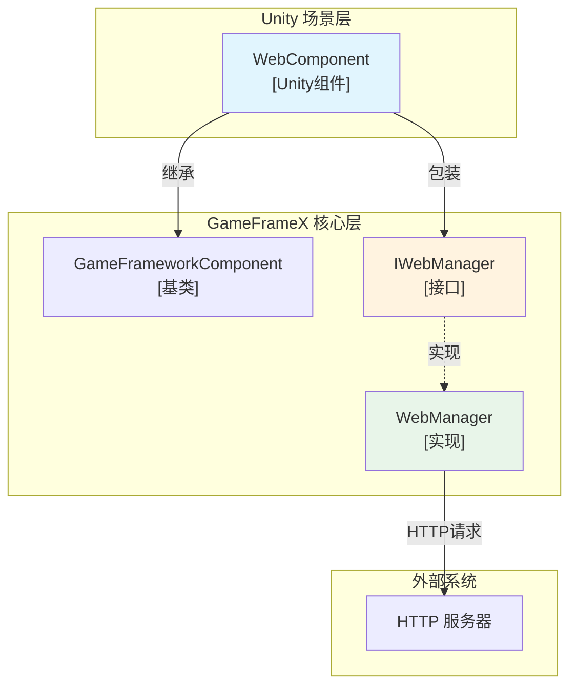
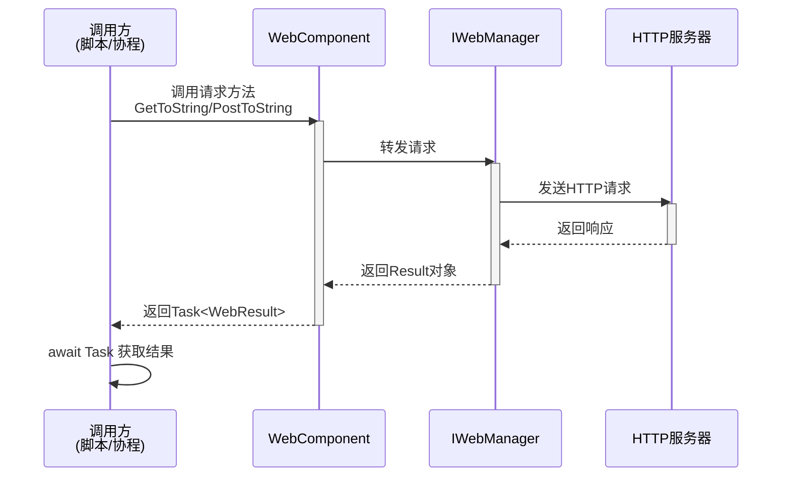
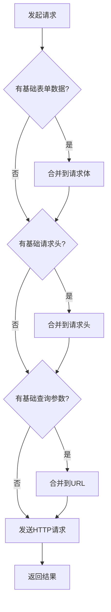

# WebComponent コンポーネント

WebComponent 是 GameFrameX フレームワーク提供的 Unity コンポーネント，用于在 Unity 游戏中簡素化 HTTP 网络请求操作。该コンポーネントカプセル化了 IWebManager インターフェース，提供面向 Unity 使いやすい的异步请求メソッド。

## 概要

WebComponent は継承自 GameFrameworkComponent 的 Unity コンポーネント，設計用于在 Unity シーン中提供 HTTP 网络请求機能。通过该コンポーネント，開発者〜できます方便地发送 GET 和 POST 请求，并取得字符串或字节数组フォーマット的响应結果。

**主な特性：**
- サポート GET 和 POST 请求
- サポート返す字符串和字节数组两种响应フォーマット
- サポート查询パラメータ、请求头和表单数据的設定
- 提供超时控制机制
- サポート基本数据設定，可为所有请求追加汎用パラメータ

## Architecture



**アーキテクチャ説明：**
- **WebComponent**: Unity 层面的コンポーネント，挂在 GameObject 上使用，提供シンプル的 API
- **IWebManager**: 定義网络请求機能的インターフェース
- **WebManager**: IWebManager 的具体実装，処理实际的 HTTP 通信

## コア機能

### HTTP 请求メソッド

WebComponent 提供します丰富的 HTTP 请求メソッド，涵盖 GET 和 POST 两种请求タイプ：

#### GET 请求

```csharp
// 基础 GET 请求 - 返回字符串
Task<WebStringResult> GetToString(string url, object userData = null)

// 带查询参数的 GET 请求 - 返回字符串
Task<WebStringResult> GetToString(string url, Dictionary<string, string> queryString, object userData = null)

// 带查询参数和请求头的 GET 请求 - 返回字符串
Task<WebStringResult> GetToString(string url, Dictionary<string, string> queryString, Dictionary<string, string> header, object userData = null)

// 基础 GET 请求 - 返回字节数组
Task<WebBufferResult> GetToBytes(string url, object userData = null)

// 带查询参数的 GET 请求 - 返回字节数组
Task<WebBufferResult> GetToBytes(string url, Dictionary<string, string> queryString, object userData = null)

// 带查询参数和请求头的 GET 请求 - 返回字节数组
Task<WebBufferResult> GetToBytes(string url, Dictionary<string, string> queryString, Dictionary<string, string> header, object userData = null)
```

#### POST 请求

```csharp
// 基础 POST 请求 - 返回字符串
Task<WebStringResult> PostToString(string url, Dictionary<string, object> from = null, object userData = null)

// 带查询参数的 POST 请求 - 返回字符串
Task<WebStringResult> PostToString(string url, Dictionary<string, object> from, Dictionary<string, string> queryString, object userData = null)

// 带查询参数和请求头的 POST 请求 - 返回字符串
Task<WebStringResult> PostToString(string url, Dictionary<string, object> from, Dictionary<string, string> queryString, Dictionary<string, string> header, object userData = null)

// 基础 POST 请求 - 返回字节数组
Task<WebBufferResult> PostToBytes(string url, Dictionary<string, object> from, object userData = null)

// 带查询参数的 POST 请求 - 返回字节数组
Task<WebBufferResult> PostToBytes(string url, Dictionary<string, object> from, Dictionary<string, string> queryString, object userData = null)

// 带查询参数和请求头的 POST 请求 - 返回字节数组
Task<WebBufferResult> PostToBytes(string url, Dictionary<string, object> from, Dictionary<string, string> queryString, Dictionary<string, string> header, object userData = null)

// 发送字节数组数据的 POST 请求 - 返回字节数组
Task<WebBufferResult> PostToBytes(string url, byte[] fromData, Dictionary<string, string> queryString, Dictionary<string, string> header, object userData = null)
```

### 基本数据設定

WebComponent サポート設定基本数据，这些数据会自动追加到所有请求中，適しています〜する必要があります統一された携带认证情報、バージョン号等シーン：

```csharp
// 表单数据管理
void AddBaseForm(string key, object value)
void RemoveBaseForm(string key)
void ClearBaseForm()

// 请求头管理
void AddBaseHeader(string key, string value)
void RemoveBaseHeader(string key)
void ClearBaseHeader()

// 查询参数管理
void AddBaseQueryString(string key, string value)
void RemoveBaseQueryString(string key)
void ClearBaseQueryString()
```

### 超时設定

```csharp
// 获取或设置超时时间
public float Timeout
{
    get { return m_WebManager.Timeout; }
    set { m_WebManager.Timeout = m_Timeout = value; }
}
```

> Source: [WebComponent.cs](https://github.com/GameFrameX/com.gameframex.unity.web/blob/main/Runtime/Web/WebComponent.cs#L59-L70)

## Core Flow

### 请求処理フロー



### 基本数据应用フロー



## 使用例

### 基本 GET 请求

```csharp
using UnityEngine;
using GameFrameX.Web.Runtime;

public class ExampleScript : MonoBehaviour
{
    private WebComponent webComponent;

    private void Start()
    {
        // 获取 WebComponent 组件
        webComponent = GetComponent<WebComponent>();
        
        // 发送简单的 GET 请求
        _ = GetExample();
    }

    private async void GetExample()
    {
        var result = await webComponent.GetToString("https://api.example.com/data");
        if (!string.IsNullOrEmpty(result.Result))
        {
            Debug.Log($"GET 请求成功: {result.Result}");
        }
    }
}
```

> Source: [WebComponent.cs](https://github.com/GameFrameX/com.gameframex.unity.web/blob/main/Runtime/Web/WebComponent.cs#L98-L101)

### 带パラメータ的 GET 请求

```csharp
// 带查询参数的 GET 请求
private async void GetWithQueryParams()
{
    var queryParams = new Dictionary<string, string>
    {
        { "page", "1" },
        { "limit", "10" }
    };
    
    var result = await webComponent.GetToString(
        "https://api.example.com/users", 
        queryParams
    );
}

// 带查询参数和自定义请求头
private async void GetWithHeaders()
{
    var queryParams = new Dictionary<string, string> { { "id", "123" } };
    var headers = new Dictionary<string, string>
    {
        { "Authorization", "Bearer token123" },
        { "Accept", "application/json" }
    };
    
    var result = await webComponent.GetToString(
        "https://api.example.com/protected",
        queryParams,
        headers
    );
}
```

> Source: [WebComponent.cs](https://github.com/GameFrameX/com.gameframex.unity.web/blob/main/Runtime/Web/WebComponent.cs#L110-L126)

### POST 请求例

```csharp
// 发送 POST 请求提交表单数据
private async void PostExample()
{
    var formData = new Dictionary<string, object>
    {
        { "username", "testuser" },
        { "password", "password123" }
    };
    
    var result = await webComponent.PostToString(
        "https://api.example.com/login",
        formData
    );
    
    Debug.Log($"POST 响应: {result.Result}");
}

// 带完整参数的 POST 请求
private async void PostWithFullParams()
{
    var formData = new Dictionary<string, object>
    {
        { "title", "Hello World" },
        { "content", "This is a post content" }
    };
    
    var queryParams = new Dictionary<string, string>
    {
        { "format", "json" }
    };
    
    var headers = new Dictionary<string, string>
    {
        { "Content-Type", "application/x-www-form-urlencoded" }
    };
    
    var result = await webComponent.PostToString(
        "https://api.example.com/posts",
        formData,
        queryParams,
        headers
    );
}
```

> Source: [WebComponent.cs](https://github.com/GameFrameX/com.gameframex.unity.web/blob/main/Runtime/Web/WebComponent.cs#L175-L205)

### 使用基本数据設定

```csharp
// 在 Start 中配置基础数据
private void Start()
{
    // 添加基础请求头（如认证信息）
    webComponent.AddBaseHeader("Authorization", "Bearer your-token");
    webComponent.AddBaseHeader("App-Version", "1.0.0");
    
    // 添加基础查询参数
    webComponent.AddBaseQueryString("platform", "android");
    webComponent.AddBaseQueryString("language", "zh-CN");
}

// 后续请求会自动携带这些基础数据
private void MakeRequest()
{
    // 这个请求会自动包含:
    // - Authorization: Bearer your-token
    // - App-Version: 1.0.0
    // - platform: android
    // - language: zh-CN
    webComponent.GetToString("https://api.example.com/data");
}

// 清理基础数据
private void OnDestroy()
{
    webComponent.ClearBaseHeader();
    webComponent.ClearBaseQueryString();
}
```

> Source: [WebComponent.cs](https://github.com/GameFrameX/com.gameframex.unity.web/blob/main/Runtime/Web/WebComponent.cs#L262-L341)

### 下载二进制数据

```csharp
// 下载图片或其他二进制数据
private async void DownloadImage()
{
    var result = await webComponent.GetToBytes("https://example.com/image.png");
    
    if (result.Result != null && result.Result.Length > 0)
    {
        // 创建 Texture2D
        Texture2D texture = new Texture2D(2, 2);
        texture.LoadImage(result.Result);
        
        // 应用到 Sprite
        Sprite sprite = Sprite.Create(
            texture, 
            new Rect(0, 0, texture.width, texture.height), 
            Vector2.one * 0.5f
        );
        
        Debug.Log($"图片下载成功: {texture.width}x{texture.height}");
    }
}
```

> Source: [WebComponent.cs](https://github.com/GameFrameX/com.gameframex.unity.web/blob/main/Runtime/Web/WebComponent.cs#L136-L139)

## コンポーネント設定

### 在 Unity エディタ中追加

1. 在 Unity シーン中作成一个空 GameObject 或选择〜する必要があります追加网络機能的 GameObject
2. 选择 **Component → GameFrameX → Web** メニュー项
3. WebComponent コンポーネント将被追加到选中的 GameObject 上

### Inspector 設定

在 Inspector パネル中〜できます設定以下プロパティ：

| プロパティ | タイプ | デフォルト值 | 説明 |
|------|------|--------|------|
| Timeout | float | 5.0 | 请求超时时间，单位为秒 |

```csharp
// Inspector 中的超时设置范围为 0-120 秒
// 在运行时修改
webComponent.Timeout = 10f;
```

> Source: [WebComponentInspector.cs](https://github.com/GameFrameX/com.gameframex.unity.web/blob/main/Editor/Inspector/WebComponentInspector.cs#L23-L34)

## API リファレンス

### プロパティ

#### `Timeout`

```csharp
public float Timeout { get; set; }
```

取得或設定请求超时时间。当请求超过此时间未完成时会自动终止。

**デフォルト值：** 5.0 秒

**范围：** 0 - 120 秒

### メソッド

#### GET 请求メソッド

##### `GetToString(url, userData)`

```csharp
Task<WebStringResult> GetToString(string url, object userData = null)
```

发送 GET 请求，返す字符串結果。

**パラメータ：**
- `url` (string): 请求地址
- `userData` (object, 可选): ユーザー自定義数据，会在結果中原样返す

**返す：** `Task<WebStringResult>` - パッケージ含字符串結果的异步任务

---

##### `GetToString(url, queryString, userData)`

```csharp
Task<WebStringResult> GetToString(string url, Dictionary<string, string> queryString, object userData = null)
```

发送带查询パラメータ的 GET 请求，返す字符串結果。

**パラメータ：**
- `url` (string): 请求地址
- `queryString` (Dictionary<string, string>): URL 查询パラメータ字典
- `userData` (object, 可选): ユーザー自定義数据

**返す：** `Task<WebStringResult>` - パッケージ含字符串結果的异步任务

---

##### `GetToString(url, queryString, header, userData)`

```csharp
Task<WebStringResult> GetToString(string url, Dictionary<string, string> queryString, Dictionary<string, string> header, object userData = null)
```

发送带查询パラメータ和请求头的 GET 请求，返す字符串結果。

**パラメータ：**
- `url` (string): 请求地址
- `queryString` (Dictionary<string, string>): URL 查询パラメータ字典
- `header` (Dictionary<string, string>): HTTP 请求头字典
- `userData` (object, 可选): ユーザー自定義数据

**返す：** `Task<WebStringResult>` - パッケージ含字符串結果的异步任务

---

##### `GetToBytes(url, userData)`

```csharp
Task<WebBufferResult> GetToBytes(string url, object userData = null)
```

发送 GET 请求，返す字节数组結果。適しています下载二进制数据。

**パラメータ：**
- `url` (string): 请求地址
- `userData` (object, 可选): ユーザー自定義数据

**返す：** `Task<WebBufferResult>` - パッケージ含字节数组的异步任务

---

#### POST 请求メソッド

##### `PostToString(url, from, userData)`

```csharp
Task<WebStringResult> PostToString(string url, Dictionary<string, object> from = null, object userData = null)
```

发送 POST 请求，返す字符串結果。

**パラメータ：**
- `url` (string): 请求地址
- `from` (Dictionary<string, object>, 可选): 表单数据字典
- `userData` (object, 可选): ユーザー自定義数据

**返す：** `Task<WebStringResult>` - パッケージ含字符串結果的异步任务

---

##### `PostToString(url, from, queryString, header, userData)`

```csharp
Task<WebStringResult> PostToString(string url, Dictionary<string, object> from, Dictionary<string, string> queryString, Dictionary<string, string> header, object userData = null)
```

发送带查询パラメータ和请求头的 POST 请求，返す字符串結果。

**パラメータ：**
- `url` (string): 请求地址
- `from` (Dictionary<string, object>): 表单数据字典
- `queryString` (Dictionary<string, string>): URL 查询パラメータ字典
- `header` (Dictionary<string, string>): HTTP 请求头字典
- `userData` (object, 可选): ユーザー自定義数据

**返す：** `Task<WebStringResult>` - パッケージ含字符串結果的异步任务

---

##### `PostToBytes(url, from, userData)`

```csharp
Task<WebBufferResult> PostToBytes(string url, Dictionary<string, object> from, object userData = null)
```

发送 POST 请求，返す字节数组結果。

**パラメータ：**
- `url` (string): 请求地址
- `from` (Dictionary<string, object>): 表单数据字典
- `userData` (object, 可选): ユーザー自定義数据

**返す：** `Task<WebBufferResult>` - パッケージ含字节数组的异步任务

---

##### `PostToBytes(url, fromData, queryString, header, userData)`

```csharp
Task<WebBufferResult> PostToBytes(string url, byte[] fromData, Dictionary<string, string> queryString, Dictionary<string, string> header, object userData = null)
```

发送字节数组 POST 请求，返す字节数组結果。適していますファイル上传等シーン。

**パラメータ：**
- `url` (string): 请求地址
- `fromData` (byte[]): 要发送的字节数组数据
- `queryString` (Dictionary<string, string>): URL 查询パラメータ字典
- `header` (Dictionary<string, string>): HTTP 请求头字典
- `userData` (object, 可选): ユーザー自定義数据

**返す：** `Task<WebBufferResult>` - パッケージ含字节数组的异步任务

---

#### 基本数据管理メソッド

##### `AddBaseForm(key, value)`

```csharp
void AddBaseForm(string key, object value)
```

追加基本表单数据，该数据会被追加到所有 POST 请求的表单中。

**パラメータ：**
- `key` (string): 表单键
- `value` (object): 表单值

---

##### `RemoveBaseForm(key)`

```csharp
void RemoveBaseForm(string key)
```

移除指定的基本表单数据。

**パラメータ：**
- `key` (string): 表单键

---

##### `ClearBaseForm()`

```csharp
void ClearBaseForm()
```

清空所有基本表单数据。

---

##### `AddBaseHeader(key, value)`

```csharp
void AddBaseHeader(string key, string value)
```

追加基本请求头，该请求头会被追加到所有请求中。

**パラメータ：**
- `key` (string): 请求头键
- `value` (string): 请求头值

---

##### `RemoveBaseHeader(key)`

```csharp
void RemoveBaseHeader(string key)
```

移除指定的基本请求头。

**パラメータ：**
- `key` (string): 请求头键

---

##### `ClearBaseHeader()`

```csharp
void ClearBaseHeader()
```

清空所有基本请求头。

---

##### `AddBaseQueryString(key, value)`

```csharp
void AddBaseQueryString(string key, string value)
```

追加基本查询パラメータ，该パラメータ会被附加到所有请求的 URL 后面。

**パラメータ：**
- `key` (string): 查询パラメータ键
- `value` (string): 查询パラメータ值

---

##### `RemoveBaseQueryString(key)`

```csharp
void RemoveBaseQueryString(string key)
```

移除指定的基本查询パラメータ。

**パラメータ：**
- `key` (string): 查询パラメータ键

---

##### `ClearBaseQueryString()`

```csharp
void ClearBaseQueryString()
```

清空所有基本查询パラメータ。

---

## 请求結果タイプ

### WebStringResult

用于カプセル化 HTTP 请求返す的字符串数据。

```csharp
public sealed class WebStringResult
{
    // 请求返回的字符串结果
    public string Result { get; }
    
    // 用户自定义数据，在请求时传入的数据会原样返回
    public object UserData { get; }
}
```

> Source: [WebStringResult.cs](https://github.com/GameFrameX/com.gameframex.unity.web/blob/main/Runtime/Web/WebStringResult.cs#L1-L40)

### WebBufferResult

用于カプセル化 HTTP 请求返す的字节数组数据，適しています二进制数据如图片、ファイル等。

```csharp
public sealed class WebBufferResult
{
    // 请求结果（字节数组）
    public byte[] Result { get; }
    
    // 用户自定义数据
    public object UserData { get; }
}
```

> Source: [WebBufferResult.cs](https://github.com/GameFrameX/com.gameframex.unity.web/blob/main/Runtime/Web/WebBufferResult.cs#L1-L21)

## よくある問題

### 1. 如何処理请求超时？

〜できます通过設定 `Timeout` プロパティ来调整超时时间：

```csharp
webComponent.Timeout = 30f; // 设置 30 秒超时
```

### 2. 如何传递自定義数据？

所有请求メソッド都サポート `userData` パラメータ，该パラメータ会在結果中原样返す，適しています在异步コールバック中识别请求：

```csharp
var result = await webComponent.GetToString(url, "myRequest");
Debug.Log(result.UserData); // 输出: myRequest
```

### 3. 如何追加认证情報？

〜できます使用基本请求头機能：

```csharp
webComponent.AddBaseHeader("Authorization", "Bearer your-token");
```

## 関連リンク

- [IWebManager インターフェース](./04.iwebmanager-interface) - 网络请求マネージャー的インターフェース定義
- [WebManager アーキテクチャ](./05.web-manager) - WebManager 内部アーキテクチャ説明
- [请求結果タイプ](./06.result-types) - 詳細的結果タイプ説明
- [超时設定](./10.timeout-settings) - 超时設定詳細説明
- [基本数据設定](./07.base-data) - 基本数据設定説明
