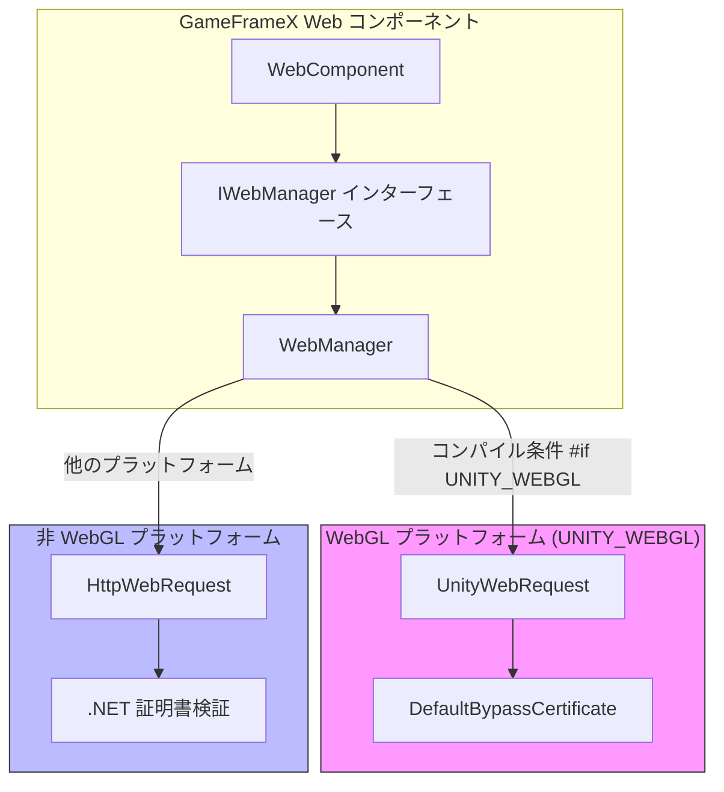
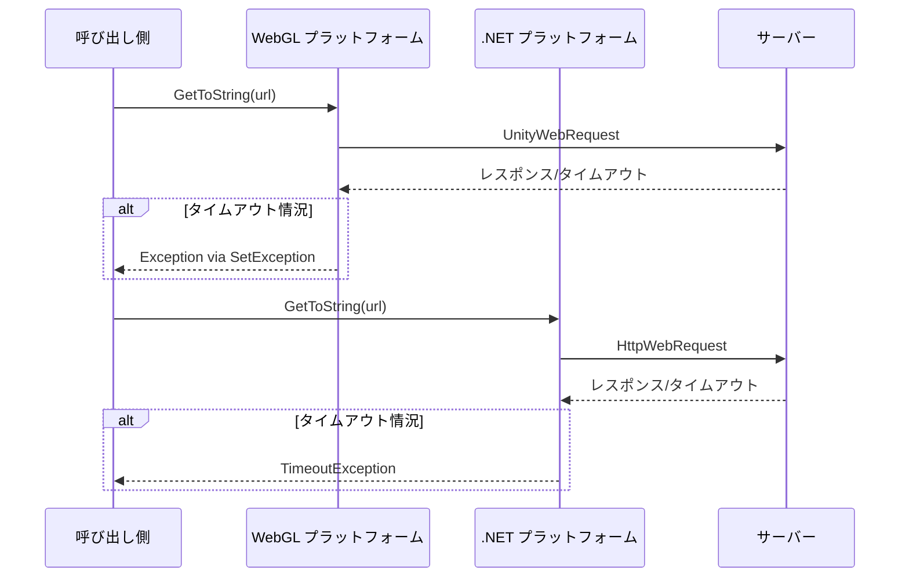

# プラットフォーム差異説明

本ドキュメントでは、GameFrameX Web コンポーネントの異なる Unity プラットフォームでの実装差異を詳しく説明します。開発者が各プラットフォームの特性を理解し、コンポーネントを正しく使用できるように支援します。

## 概要

GameFrameX Web コンポーネントは3大プラットフォームカテゴリをサポート：

- **WebGL プラットフォーム**：ブラウザ環境でリリースされる WebGL ビルドに適しています
- **非 WebGL プラットフォーム**：PC（Windows、Mac、Linux）、iOS、Android 等のネイティブプラットフォームを含む

この2つのプラットフォームはネットワークリクエスト実装メカニズムにおいて本質的な差異があり、主に 다음과 같습니다：

| 特性 | WebGL プラットフォーム | 非 WebGL プラットフォーム |
|------|------------|---------------|
| ネットワークライブラリ | UnityWebRequest | System.Net.HttpWebRequest |
| 非同期モード | コールバック式（Callback） | 非同期待機（async/await） |
| マルチスレッドサポート | サポート外 | サポート |
| 証明書処理 | カスタム CertificateHandler | .NET 標準証明書検証 |

## アーキテクチャ差異



### 設計意図

プラグインは条件付きコンパイル（`#if UNITY_WEBGL`）を採用してプラットフォーム差異を実装しており、この設計により следующие 利点がもたらされます：

1. **統一インターフェース**：上位呼び出しコードは下位層の実装詳細を気にする必要がありません
2. **パフォーマンス最適化**：各プラットフォームが最も適したネットワークライブラリを使用できます
3. **機能の一貫性**：実装は異なりますが、外部に提供する API は完全に一致

## コア実装差異

### リクエスト送信方法

**WebGL プラットフォームの実装：**

WebGL プラットフォームでは、リクエストは `UnityWebRequest` を通じて送信され、イベントコールバックを使用して完了通知を処理します。

```csharp
// Source: Runtime/Web/WebManager.cs#L213-L258
#if UNITY_WEBGL
UnityWebRequest unityWebRequest;
if (webJsonData.IsGet)
{
    unityWebRequest = UnityWebRequest.Get(webJsonData.URL);
}
else
{
    unityWebRequest = UnityWebRequest.Post(webJsonData.URL, string.Empty);
}

unityWebRequest.certificateHandler = new DefaultBypassCertificate();
unityWebRequest.timeout = (int)RequestTimeout.TotalSeconds;
// ... リクエストヘッダーとリクエストボディを設定

var asyncOperation = unityWebRequest.SendWebRequest();
asyncOperation.completed += (asyncOperation2) =>
{
    m_SendingNormalList.Remove(webJsonData);
    if (unityWebRequest.isNetworkError || unityWebRequest.isHttpError || unityWebRequest.error != null)
    {
        webJsonData.UniTaskCompletionStringSource.TrySetException(new Exception(unityWebRequest.error));
        return;
    }
    webJsonData.UniTaskCompletionStringSource.SetResult(new WebStringResult(webJsonData.UserData, unityWebRequest.downloadHandler.text));
};
#endif
```

**非 WebGL プラットフォームの実装：**

非 WebGL プラットフォームでは、リクエストは `HttpWebRequest` を通じて送信され、本当の非同期待await をサポートします。

```csharp
// Source: Runtime/Web/WebManager.cs#L260-L328
#else
try
{
    HttpWebRequest request = WebRequest.CreateHttp(webJsonData.URL);
    request.Method = webJsonData.IsGet ? WebRequestMethods.Http.Get : WebRequestMethods.Http.Post;
    request.Timeout = (int)RequestTimeout.TotalMilliseconds;
    // ... リクエストヘッダーとリクエストボディを設定

    using (HttpWebResponse response = (HttpWebResponse)await request.GetResponseAsync())
    {
        using (StreamReader reader = new StreamReader(response.GetResponseStream()))
        {
            string content = await reader.ReadToEndAsync();
            webJsonData.UniTaskCompletionStringSource.SetResult(new WebStringResult(webJsonData.UserData, content));
        }
    }
}
catch (WebException e)
{
    if (e.Status == WebExceptionStatus.Timeout)
    {
        webJsonData.UniTaskCompletionStringSource.SetException(new TimeoutException(e.Message));
        return;
    }
    webJsonData.UniTaskCompletionStringSource.SetException(e);
}
finally
{
    m_SendingNormalList.Remove(webJsonData);
}
#endif
```

### 証明書処理差異

**WebGL プラットフォーム：**

WebGL プラットフォームはカスタム証明書プロセッサを使用して証明書検証をバイパスします。これは開発デバッグと自己署名証明書環境に非常に便利です。

```csharp
// Source: Runtime/Web/DefaultBypassCertificate.cs
public sealed class DefaultBypassCertificate : CertificateHandler
{
    protected override bool ValidateCertificate(byte[] certificateData)
    {
        return true;
    }
}
```

> Source: [DefaultBypassCertificate.cs](https://github.com/GameFrameX/com.gameframex.unity.web/blob/main/Runtime/Web/DefaultBypassCertificate.cs#L41-L44)

WebGL プラットフォームではリクエスト作成時にこの証明書プロセッサを適用します：

```csharp
// Source: Runtime/Web/WebManager.cs#L224
unityWebRequest.certificateHandler = new DefaultBypassCertificate();
```

**非 WebGL プラットフォーム：**

非 WebGL プラットフォームは .NET 標準証明書検証メカニズムを使用し、本番環境でより安全な HTTPS 保護を提供します。

### タイムアウト処理差異



2つのプラットフォームのタイムアウト例外の処理方法は略有異なります：

- **WebGL**：`unityWebRequest.error` を検出することでタイムアウトその他のエラーを判断
- **非 WebGL**：`WebExceptionStatus.Timeout` 例外を捕获し、`TimeoutException` に変換

## 各プラットフォーム使用時の注意事項

### WebGL プラットフォーム

1. **シングルスレッド制限**：WebGL はマルチスレッドをサポートせず、すべてのネットワークリクエストはメインスレッドでコールバックを通じて処理されます
2. **クロスドメインリクエスト（CORS）**：ブラウザ環境は同一生成ポリシーを強制執行し、サーバーが正しく CORS ヘッダーを設定していることを確認
3. **HTTPS 証明書**：デフォルトの証明書バイパスプロセッサを使用し、本番環境では替换を検討する必要あり
4. **非同期モード**：インターフェースは `Task` を返しますが、内部実装はコールバック式

### 非 WebGL プラットフォーム（PC/iOS/Android）

1. **本当の非同期サポート**：.NET の `async/await` モードを使用し、本当のノンブロッキングを実現
2. **標準証明書検証**：システムデフォルトの証明書検証メカニズムを使用し、より安全で信頼性强い
3. **タイムアウト精度**：ミリ秒レベルのタイムアウト制御を使用
4. **接続プール管理**：`MaxConnectionPerServer` で同時接続数を制御

## プラットフォーム検出と条件付きコンパイル

開発中にプラットフォームに基づいて異なるロジックを実行する必要がある場合、以下の方</minimax:tool_call> を使用できます：

```csharp
#if UNITY_WEBGL
    // WebGL プラットフォーム固有コード
    Debug.Log("Running on WebGL platform");
#else
    // 他のプラットフォームコード
    Debug.Log("Running on native platform");
#endif
```

### スクリプト定義シンボル

プラグインはデバッグ用の2つのスクリプト定義シンボルを提供します：

| シンボル | 説明 |
|------|------|
| `ENABLE_GAMEFRAMEX_WEB_SEND_LOG` | リクエスト送信ログを有効化 |
| `ENABLE_GAMEFRAMEX_WEB_RECEIVE_LOG` | レスポンス受信ログを有効化 |

> Source: [WebLogScriptingDefineSymbols.cs](https://github.com/GameFrameX/com.gameframex.unity.web/blob/main/Editor/WebLogScriptingDefineSymbols.cs#L42-L43)

Unity メニュー `GameFrameX/Scripting Define Symbols` を通じてこれらのログをすばやくオン/オフできます。

## 一般的なプラットフォーム問題

### WebGL プラットフォーム CORS エラー

**問題**：ブラウザコンソールに "Access to fetch ... has been blocked by CORS policy" と表示される

**解決策**：
1. サーバーが正しく CORS レスポンスヘッダーを設定していることを確認：
   ```
   Access-Control-Allow-Origin: *
   Access-Control-Allow-Methods: GET, POST, OPTIONS
   Access-Control-Allow-Headers: Content-Type, Authorization
   ```
2. サーバーは OPTIONS プリフライトリクエストを処理する必要がある

### タイムアウト設定が無効

**問題**：設定したタイムアウト時間が WebGL プラットフォームでは無効に見える

**原因分析**：
- WebGL プラットフォームの `UnityWebRequest.timeout` プロパティは整数秒で設定
- 非 WebGL プラットフォームはミリ秒レベルの精度を使用

**推奨**：WebGL プラットフォームではより長いタイムアウト時間を使用（10 秒以上推奨）

### HTTPS 証明書警告

**問題**：WebGL プラットフォームで HTTPS アドレスをリクエストすると証明書警告が表示される

**原因**：デフォルトの証明書バイパスプロセッサが使用されている

**解決策**：本番環境では実際の証明書検証を行うカスタム `CertificateHandler` を実装することを推奨

## 関連リンク

- [プラグイン紹介](./01.overview)
- [基本使用法](./03.getting-started)
- [WebComponent コンポーネント](./08.web-component)
- [IWebManager インターフェース](./04.iwebmanager-interface)
- [タイムアウト設定](./10.timeout-settings)
- [よくある質問](./11.troubleshooting)
