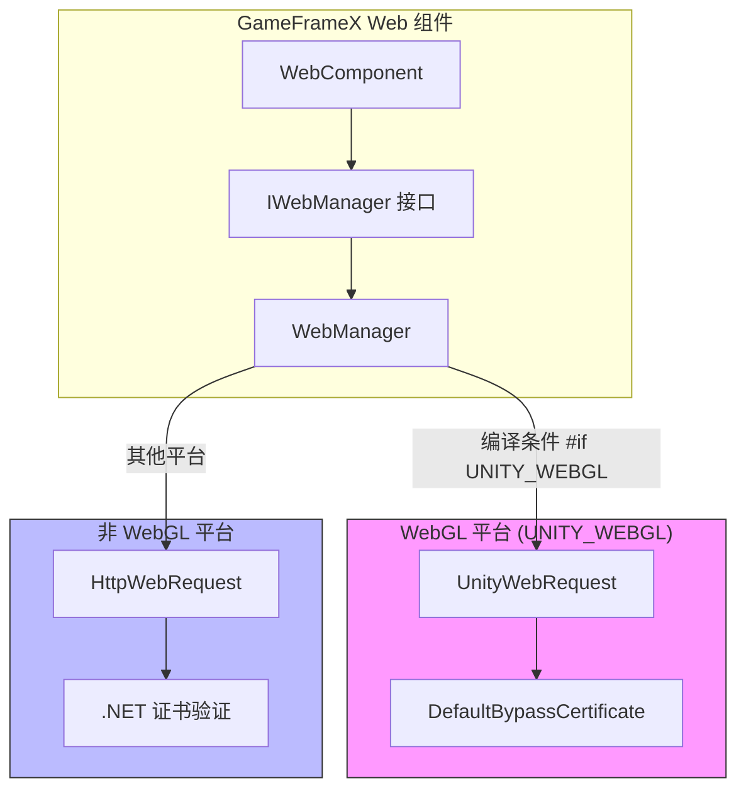
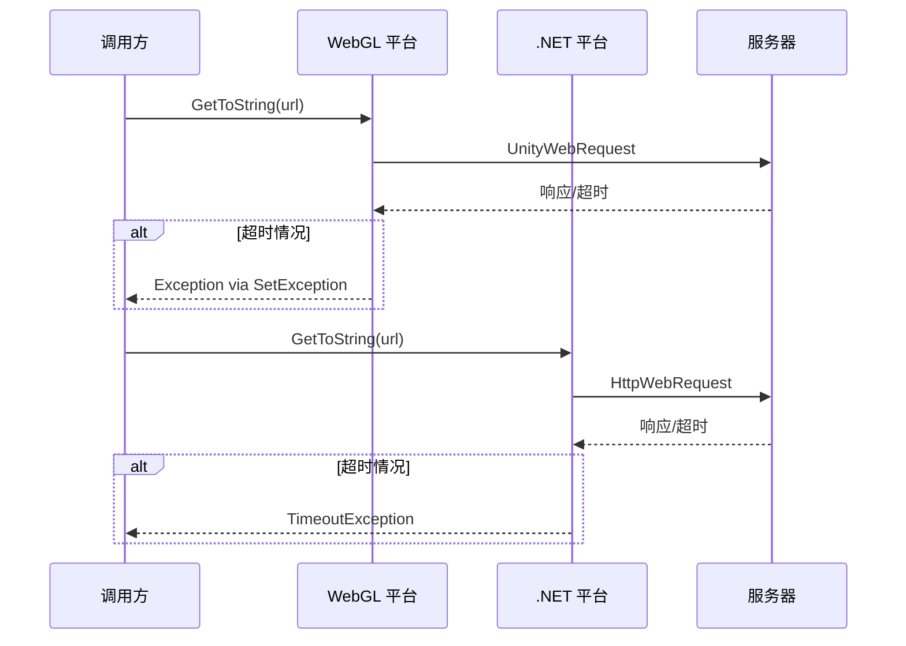

# プラットフォーム差异説明

このドキュメント詳細介绍 GameFrameX Web コンポーネント在不同 Unity プラットフォーム上的実装差异，帮助開発者理解各プラットフォーム的特点并正确使用コンポーネント。

## 概要

GameFrameX Web コンポーネントサポート三大プラットフォーム类别：

- **WebGL プラットフォーム**：適しています浏览器環境リリース的 WebGL ビルド
- **非 WebGL プラットフォーム**：含みます PC（Windows、Mac、Linux）、iOS、Android 等原生プラットフォーム

这两种プラットフォーム在网络请求実装机制上存在本质差异，主な体现在：

| 特性 | WebGL プラットフォーム | 非 WebGL プラットフォーム |
|------|------------|---------------|
| 网络库 | UnityWebRequest | System.Net.HttpWebRequest |
| 异步モード | コールバック式（Callback） | 异步等待（async/await） |
| 多线程サポート | 不サポート | サポート |
| 证书処理 | 自定義 CertificateHandler | .NET 標準证书検証 |

## アーキテクチャ差异



### 設計意图

プラグイン采用条件コンパイル（`#if UNITY_WEBGL`）実装プラットフォーム差异，这种設計带来了以下优势：

1. **統一されたインターフェース**：上层呼び出しコード无需关心底层実装细节
2. **性能最適化**：每个プラットフォーム都能使用最适合的网络库
3. **機能一致**：尽管実装不同，对外提供的 API 完全一致

## コア実装差异

### 请求发送方法

**WebGL プラットフォーム実装：**

在 WebGL プラットフォーム上，请求通过 `UnityWebRequest` 发送，使用イベントコールバック処理完成通知。

```csharp
// Source: Runtime/Web/WebManager.cs#L213-L258
#if UNITY_WEBGL
UnityWebRequest unityWebRequest;
if (webJsonData.IsGet)
{
    unityWebRequest = UnityWebRequest.Get(webJsonData.URL);
}
else
{
    unityWebRequest = UnityWebRequest.Post(webJsonData.URL, string.Empty);
}

unityWebRequest.certificateHandler = new DefaultBypassCertificate();
unityWebRequest.timeout = (int)RequestTimeout.TotalSeconds;
// ... 设置请求头和请求体

var asyncOperation = unityWebRequest.SendWebRequest();
asyncOperation.completed += (asyncOperation2) =>
{
    m_SendingNormalList.Remove(webJsonData);
    if (unityWebRequest.isNetworkError || unityWebRequest.isHttpError || unityWebRequest.error != null)
    {
        webJsonData.UniTaskCompletionStringSource.TrySetException(new Exception(unityWebRequest.error));
        return;
    }
    webJsonData.UniTaskCompletionStringSource.SetResult(new WebStringResult(webJsonData.UserData, unityWebRequest.downloadHandler.text));
};
#endif
```

**非 WebGL プラットフォーム実装：**

在非 WebGL プラットフォーム上，请求通过 `HttpWebRequest` 发送，サポート真正的异步等待。

```csharp
// Source: Runtime/Web/WebManager.cs#L260-L328
#else
try
{
    HttpWebRequest request = WebRequest.CreateHttp(webJsonData.URL);
    request.Method = webJsonData.IsGet ? WebRequestMethods.Http.Get : WebRequestMethods.Http.Post;
    request.Timeout = (int)RequestTimeout.TotalMilliseconds;
    // ... 设置请求头和请求体

    using (HttpWebResponse response = (HttpWebResponse)await request.GetResponseAsync())
    {
        using (StreamReader reader = new StreamReader(response.GetResponseStream()))
        {
            string content = await reader.ReadToEndAsync();
            webJsonData.UniTaskCompletionStringSource.SetResult(new WebStringResult(webJsonData.UserData, content));
        }
    }
}
catch (WebException e)
{
    if (e.Status == WebExceptionStatus.Timeout)
    {
        webJsonData.UniTaskCompletionStringSource.SetException(new TimeoutException(e.Message));
        return;
    }
    webJsonData.UniTaskCompletionStringSource.SetException(e);
}
finally
{
    m_SendingNormalList.Remove(webJsonData);
}
#endif
```

### 证书処理差异

**WebGL プラットフォーム：**

WebGL プラットフォーム使用自定義的证书処理器来绕过证书検証，这对于开发デバッグ和自签名证书環境非常有用。

```csharp
// Source: Runtime/Web/DefaultBypassCertificate.cs
public sealed class DefaultBypassCertificate : CertificateHandler
{
    protected override bool ValidateCertificate(byte[] certificateData)
    {
        return true;
    }
}
```

> Source: [DefaultBypassCertificate.cs](https://github.com/GameFrameX/com.gameframex.unity.web/blob/main/Runtime/Web/DefaultBypassCertificate.cs#L41-L44)

WebGL プラットフォーム在作成请求时应用此证书処理器：

```csharp
// Source: Runtime/Web/WebManager.cs#L224
unityWebRequest.certificateHandler = new DefaultBypassCertificate();
```

**非 WebGL プラットフォーム：**

非 WebGL プラットフォーム使用 .NET 標準证书検証机制，在本番環境中提供更安全的 HTTPS 保护。

### 超时処理差异



两个プラットフォーム对超时例外的処理方法略有不同：

- **WebGL**：通过检测 `unityWebRequest.error` 判断超时和其他エラー
- **非 WebGL**：通过捕获 `WebExceptionStatus.Timeout` 例外并转换为 `TimeoutException`

## 各プラットフォーム使用注意事项

### WebGL プラットフォーム

1. **单线程限制**：WebGL 不サポート多线程，所有网络请求都在主线程通过コールバック処理
2. **跨域请求（CORS）**：浏览器環境强制执行同源策略，確認してください服务器正确設定 CORS 头
3. **HTTPS 证书**：使用デフォルト的证书绕过処理器，本番環境需考虑置換
4. **异步モード**：虽然インターフェース返す `Task`，但内部実装是コールバック式的

### 非 WebGL プラットフォーム（PC/iOS/Android）

1. **真异步サポート**：使用 .NET 的 `async/await` モード，真正実装非阻塞
2. **標準证书検証**：使用系统デフォルト的证书検証机制，更安全可靠
3. **超时精度**：使用毫秒级超时控制
4. **连接池管理**：通过 `MaxConnectionPerServer` 設定控制并发连接数

## プラットフォーム检测与条件コンパイル

在开发过程中，もし〜する必要があります根据プラットフォーム执行不同逻辑，〜できます使用以下方法：

```csharp
#if UNITY_WEBGL
    // WebGL 平台特定代码
    Debug.Log("Running on WebGL platform");
#else
    // 其他平台代码
    Debug.Log("Running on native platform");
#endif
```

### 脚本定義符号

プラグイン提供します两个用于デバッグ的脚本定義符号：

| 符号 | 説明 |
|------|------|
| `ENABLE_GAMEFRAMEX_WEB_SEND_LOG` | 启用请求发送ログ |
| `ENABLE_GAMEFRAMEX_WEB_RECEIVE_LOG` | 启用响应受信ログ |

> Source: [WebLogScriptingDefineSymbols.cs](https://github.com/GameFrameX/com.gameframex.unity.web/blob/main/Editor/WebLogScriptingDefineSymbols.cs#L42-L43)

〜できます通过 Unity メニュー `GameFrameX/Scripting Define Symbols` 快速开关这些ログ。

## 常见プラットフォーム問題

### WebGL プラットフォーム CORS エラー

**問題**：浏览器控制台显示 "Access to fetch ... has been blocked by CORS policy"

**解決策**：
1. 確認してください服务器正确設定 CORS 响应头：
   ```
   Access-Control-Allow-Origin: *
   Access-Control-Allow-Methods: GET, POST, OPTIONS
   Access-Control-Allow-Headers: Content-Type, Authorization
   ```
2. 服务器〜する必要があります処理 OPTIONS 预检请求

### 超时設定不生效

**問題**：設定的超时时间在 WebGL プラットフォーム似乎无效

**原因分析**：
- WebGL プラットフォーム的 `UnityWebRequest.timeout` プロパティ設定的是整秒数
- 非 WebGL プラットフォーム使用毫秒级精度

**お勧め**：在 WebGL プラットフォーム使用较长超时时间（お勧め 10 秒以上）

### HTTPS 证书警告

**問題**：WebGL プラットフォーム请求 HTTPS 地址时出现证书警告

**原因**：使用了デフォルト的证书绕过処理器

**解決策**：本番環境お勧め実装自定義 `CertificateHandler` 进行实际证书検証

## 関連リンク

- [プラグイン介绍](./01.overview)
- [基本用法](./03.getting-started)
- [WebComponent コンポーネント](./08.web-component)
- [IWebManager インターフェース](./04.iwebmanager-interface)
- [超时設定](./10.timeout-settings)
- [常见問題](./11.troubleshooting)
