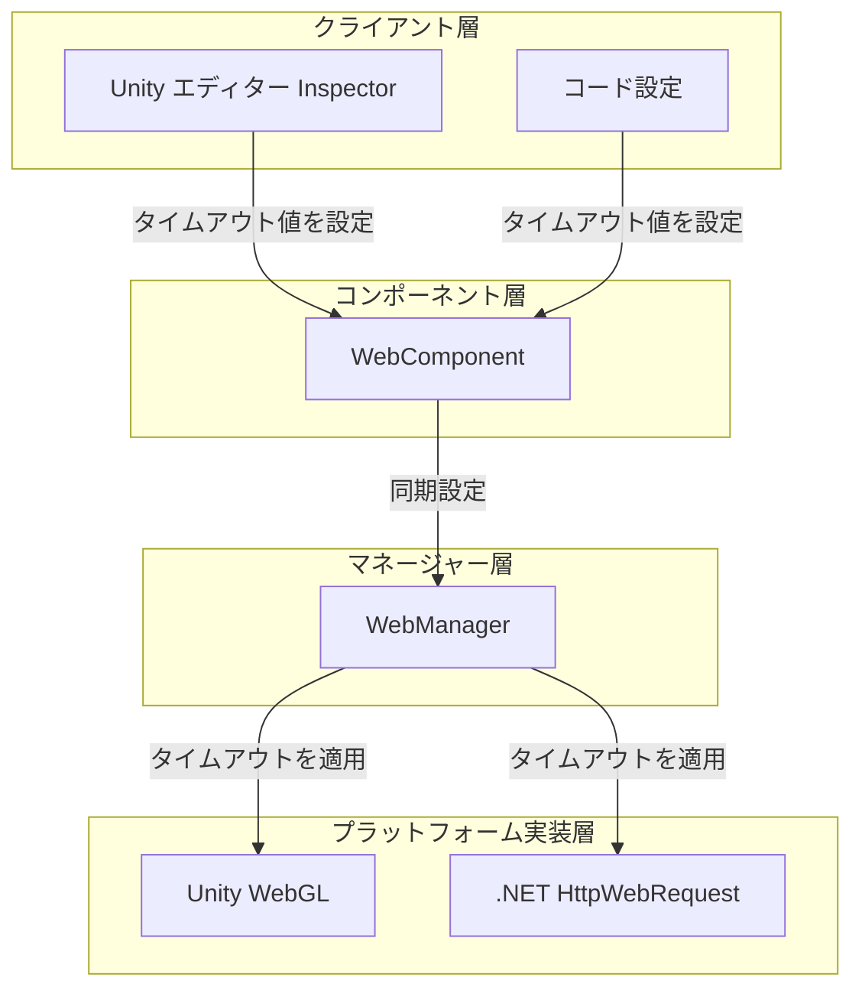
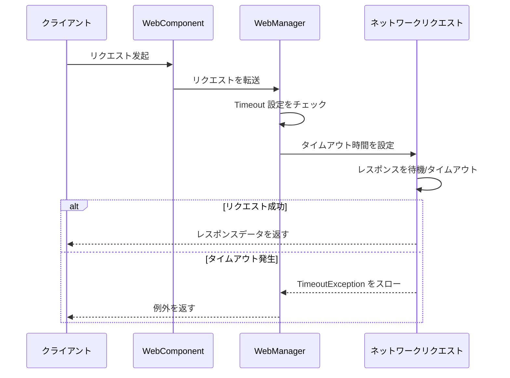

# タイムアウト設定

HTTP リクエストのタイムアウト時間を設定し、ネットワークリクエストの最大待機時間を制御します。

## 概要

タイムアウト設定は Web リクエストモジュールの重要な组成部分であり、ネットワークリクエストが無限に待機することを防止するために使用されます。リクエストが指定時間を超えて完了しない場合、システムは自動的にリクエストを终止し、`TimeoutException` 例外をスローします。

タイムアウト設定は統一の時間単位（秒）を采用し、内部で異なるプラットフォームに基づいて自動的に соответствующий フォーマットに変換されます：
- Unity WebGL：整数秒に変換
- .NET プラットフォーム：整数ミリ秒に変換

### タイムアウト設定のコア役割

1. **無限待機の防止**：サーバーが応答しない場合、クライアントの永久ブロックを回避
2. **ユーザーエクスペリエンスの向上**：早期失敗メカニズムによりユーザーが他の操作を行えるように
3. **リソース保護**：ネットワーク接続その他のリソースを適時に解放

## アーキテクチャ設計



### 各層の責務

| 层级 | コンポーネント | 責務 |
|------|------|------|
| クライアント層 | Inspector / Code | タイムアウト設定の UI とコードインターフェースを提供 |
| コンポーネント層 | WebComponent | Timeout プロパティを公開し、マネージャーに同期設定 |
| マネージャー層 | WebManager | タイムアウト値を存储し、RequestTimeout を計算 |
| プラットフォーム実装層 | UnityWebRequest / HttpWebRequest | ネットワークリクエストに実際にタイムアウトを適用 |

## 設定方法

### Unity Inspector を通じて設定

Unity シーンに WebComponent を追加した後、Inspector パネルでスライダーを通じてタイムアウト時間を設定できます。

> Source: [WebComponentInspector.cs](https://github.com/GameFrameX/com.gameframex.unity.web/blob/main/Editor/Inspector/WebComponentInspector.cs#L22-L34)

```csharp
float timeout = EditorGUILayout.Slider("Timeout", m_Timeout.floatValue, 0f, 120f);
if (timeout != m_Timeout.floatValue)
{
    if (EditorApplication.isPlaying)
    {
        t.Timeout = timeout;
    }
    else
    {
        m_Timeout.floatValue = timeout;
    }
}
```

Inspector 設定の特点：
- 範囲：0 から 120 秒
- 実行時動的変更をサポート
- プレビューモードでの変更はシリアル化フィールドに保存

### コードを通じて設定

#### WebComponent で設定

> Source: [WebComponent.cs](https://github.com/GameFrameX/com.gameframex.unity.web/blob/main/Runtime/Web/WebComponent.cs#L59-L70)

```csharp
[SerializeField] [Tooltip("タイムアウト時間.単位：秒")]
private float m_Timeout = 5f;

public float Timeout
{
    get { return m_WebManager.Timeout; }
    set { m_WebManager.Timeout = m_Timeout = value; }
}
```

使用示例：

```csharp
// WebComponent コンポーネントを取得
var webComponent = GetComponent<WebComponent>();
// タイムアウトを 10 秒に設定
webComponent.Timeout = 10f;
```

#### WebManager で直接設定

> Source: [WebManager.cs](https://github.com/GameFrameX/com.gameframex.unity.web/blob/main/Runtime/Web/WebManager.cs#L55-L66)

```csharp
public float Timeout
{
    get { return m_Timeout; }
    set
    {
        m_Timeout = value;
        RequestTimeout = TimeSpan.FromSeconds(value);
    }
}
```

使用示例：

```csharp
// GameFrameworkEntry を通じて WebManager を取得
var webManager = GameFrameworkEntry.GetModule<IWebManager>();
// タイムアウトを 10 秒に設定
webManager.Timeout = 10f;
```

## タイムアウト処理メカニズム

### リクエスト処理フロー



### タイムアウト例外処理

#### .NET プラットフォーム

> Source: [WebManager.cs](https://github.com/GameFrameX/com.gameframex.unity.web/blob/main/Runtime/Web/WebManager.cs#L298-L305)

```csharp
catch (WebException e)
{
    // タイムアウト例外を捕获
    if (e.Status == WebExceptionStatus.Timeout)
    {
        webJsonData.UniTaskCompletionStringSource.SetException(new TimeoutException(e.Message));
        return;
    }
    // 他の例外を処理...
}
```

#### Unity WebGL プラットフォーム

Unity WebGL プラットフォームは `UnityWebRequest.isNetworkError` プロパティを通じてタイムアウトを判断：

```csharp
if (unityWebRequest.isNetworkError || unityWebRequest.isHttpError || unityWebRequest.error != null)
{
    // タイムアウトもネットワークエラーに分類される
    webJsonData.UniTaskCompletionStringSource.TrySetException(new Exception(unityWebRequest.error));
    return;
}
```

### タイムアウト例外捕获示例

```csharp
try
{
    var result = await webComponent.GetToString("https://api.example.com/data");
    Debug.Log($"リクエスト成功: {result.Text}");
}
catch (TimeoutException ex)
{
    Debug.LogError($"リクエストタイムアウト: {ex.Message}");
    // ここにリトライロジックを追加可能
}
catch (Exception ex)
{
    Debug.LogError($"リクエスト失敗: {ex.Message}");
}
```

## 設定オプション

| オプション | タイプ | デフォルト値 | 説明 |
|------|------|--------|------|
| `Timeout` | float | 5f | タイムアウト時間，单位は秒。0 に設定するとタイムアウトなし（システムデフォルト値を使用） |
| `RequestTimeout` | TimeSpan | 00:00:05 | 内部使用的 TimeSpan 形式のタイムアウト時間 |

### タイムアウト時間の推奨

| シーン | 推奨タイムアウト時間 | 説明 |
|------|-------------|------|
| 一般的な REST API | 10-30 秒 | ネットワーク遅延とサーバー処理時間を考慮 |
| ファイルアップロード/ダウンロード | 60-120 秒 | 大容量ファイルはより長い時間がかかる |
| リアルタイム通信 | 5-10 秒 | 素早い応答が必要 |
| ローカルデバッグ | 5 秒 | 早期失敗、早期リトライ |

### 異なるタイムアウト値の影響

```mermaid
flowchart TD
    Start[タイムアウト値を設定] --> Check{タイムアウト値のサイズ?}

    Check -->|短すぎる (<3s)| TooShort[次が発生する可能性あり:<br/>- 正常リクエストが誤って终止<br/>- モバイルネットワークリクエスト失敗率が高い]
    Check -->|適切 (5-30s)| Optimal[最適なバランス:<br/>- 十分な応答時間を付与<br/>- 過度の待機の不會]
    Check -->|長すぎる (>60s)| TooLong[次が発生する可能性あり:<br/>- ユーザーエクスペリエンス低下<br/>- リソース占有増加<br/>- 問題の発見が困難]

    TooShort --> End1[調整を推奨]
    Optimal --> End2[使用を推奨]
    TooLong --> End3[調整を推奨]
```

## プラットフォーム差異

### Unity WebGL

```csharp
// タイムアウトを整数秒に設定
unityWebRequest.timeout = (int)RequestTimeout.TotalSeconds;
```

特点：
- タイムアウト値は整数である必要がある
- 最小値は 1 秒
- 値が 0 の場合は Unity デフォルトタイムアウトを使用

### .NET プラットフォーム

```csharp
// タイムアウトを整数ミリ秒に設定
request.Timeout = (int)RequestTimeout.TotalMilliseconds;
```

特点：
- タイムアウト値はミリ秒为单位
- 最小値は 1 ミリ秒だが、500 ミリ秒以上は推奨

## ベストプラクティス

### 1. 適切なタイムアウト時間を設定

実際のビジネスシーンとネットワーク環境に基づいて適切なタイムアウト時間を設定：

```csharp
// 環境に基づいてタイムアウトを調整
#if UNITY_ANDROID
// モバイルネットワーク環境ではタイムアウト稍長
webComponent.Timeout = 30f;
#else
// WiFi 環境では短いタイムアウトを使用可能
webComponent.Timeout = 10f;
#endif
```

### 2. リトライメカニズムの実装

タイムアウトに合わせてリクエストリトライを実装：

```csharp
private async Task<WebStringResult> RequestWithRetry(string url, int maxRetries = 3)
{
    for (int i = 0; i < maxRetries; i++)
    {
        try
        {
            return await webComponent.GetToString(url);
        }
        catch (TimeoutException)
        {
            if (i == maxRetries - 1) throw;
            Debug.LogWarning($"リクエストタイムアウト、リトライ中 ({i + 1}/{maxRetries})...");
            await Task.Delay(1000 * (i + 1)); // 指数バックオフ
        }
    }
    throw new Exception("リトライ回数を使い果たしました");
}
```

### 3. 実行時動的調整

実行時に必要に応じてタイムアウトを調整可能：

```csharp
// 特定のリクエストに対してタイムアウトを調整
var originalTimeout = webComponent.Timeout;
try
{
    // 大容量ファイルダウンロードにはより長いタイムアウトが必要
    webComponent.Timeout = 120f;
    var result = await webComponent.GetToBytes("https://example.com/largefile.zip");
}
finally
{
    // 元のタイムアウトを復元
    webComponent.Timeout = originalTimeout;
}
```

## 関連リンク

- [WebComponent コンポーネント](./08.web-component)
- [IWebManager インターフェース](./04.iwebmanager-interface)
- [WebManager アーキテクチャ](./05.web-manager)
- [ベースデータ設定](./07.base-data)
- [プラットフォーム差異説明](./09.platform-differences)
