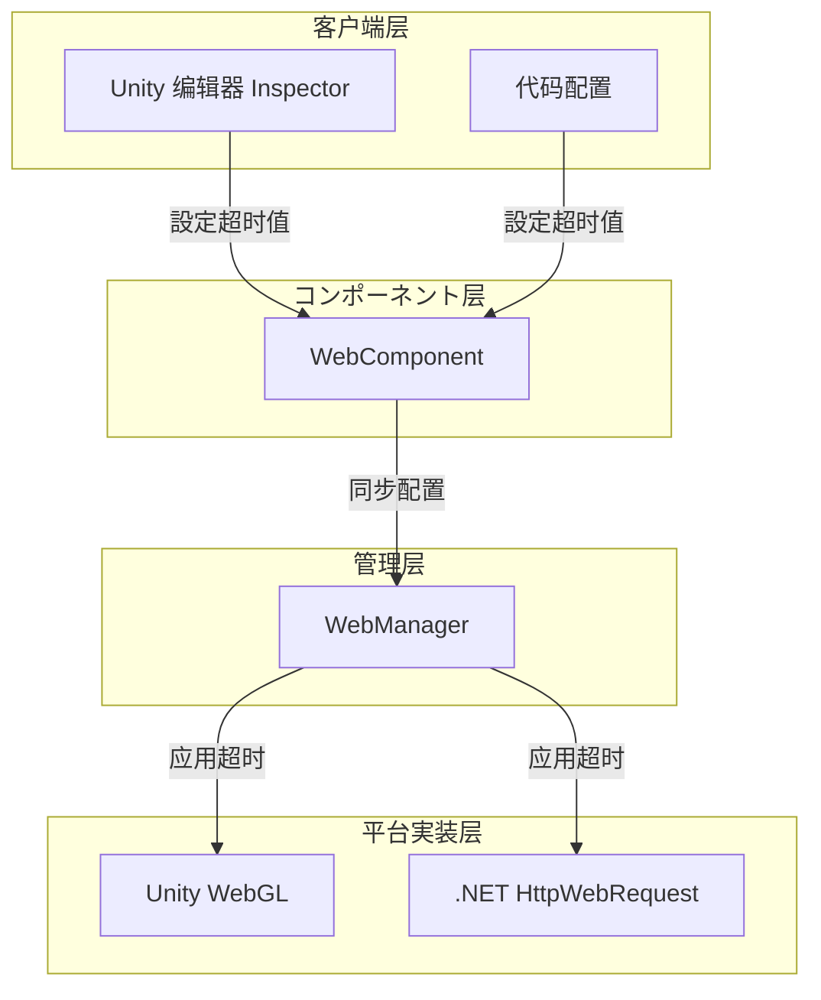
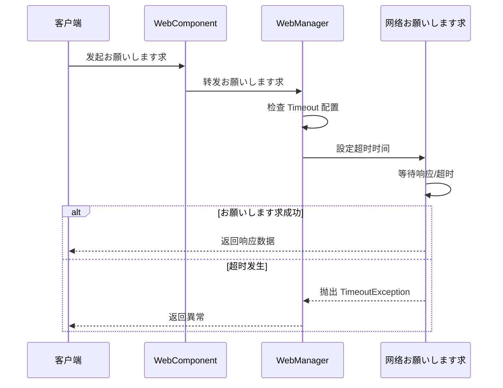

# 超时配置

配置 HTTP お願いします求的超时时间，控制网络お願いします求的最大等待时长。

## 概要

超时配置是 Web お願いします求模块的重要组成部分，に使用防止网络お願いします求无限期等待。当お願いします求超过指定时间未完成时，系统会自动终止お願いします求并抛出 `TimeoutException` 異常。

超时配置采用统一的时间单位（秒），在内部に基づいて不同平台自动转换为相应的格式：
- Unity WebGL：转换为整数秒
- .NET 平台：转换为整数毫秒

### 超时配置的コア作用

1. **防止无限等待**：当服务器无响应时，避免客户端永久阻塞
2. **提升用户体验**：快速失败机制允许用户进行其他操作
3. **リソース保护**：及时释放网络连接和其他リソース

## アーキテクチャ設計



### 各层职责

| 层级 | コンポーネント | 职责 |
|------|------|------|
| 客户端层 | Inspector / Code | 提供超时配置的 UI 和代码インターフェース |
| コンポーネント层 | WebComponent | 暴露 Timeout プロパティ，同步配置到管理器 |
| 管理层 | WebManager | 存储超时值，计算 RequestTimeout |
| 平台実装层 | UnityWebRequest / HttpWebRequest | 实际应用超时到网络お願いします求 |

## 設定方法

### を通じて Unity Inspector 配置

在 Unity シーン中添加 WebComponent 后，可能在 Inspector 面板中を通じて滑块設定超时时间。

> Source: [WebComponentInspector.cs](https://github.com/GameFrameX/com.gameframex.unity.web/blob/main/Editor/Inspector/WebComponentInspector.cs#L22-L34)

```csharp
float timeout = EditorGUILayout.Slider("Timeout", m_Timeout.floatValue, 0f, 120f);
if (timeout != m_Timeout.floatValue)
{
    if (EditorApplication.isPlaying)
    {
        t.Timeout = timeout;
    }
    else
    {
        m_Timeout.floatValue = timeout;
    }
}
```

Inspector 配置特点：
- 范围：0 到 120 秒
- サポート运行时动态修改
- 预览模式下修改会保存到序列化字段

### を通じて代码配置

#### 在 WebComponent 上配置

> Source: [WebComponent.cs](https://github.com/GameFrameX/com.gameframex.unity.web/blob/main/Runtime/Web/WebComponent.cs#L59-L70)

```csharp
[SerializeField] [Tooltip("超时时间.单位：秒")]
private float m_Timeout = 5f;

public float Timeout
{
    get { return m_WebManager.Timeout; }
    set { m_WebManager.Timeout = m_Timeout = value; }
}
```

使用示例：

```csharp
// 取得 WebComponent コンポーネント
var webComponent = GetComponent<WebComponent>();
// 設定超时为 10 秒
webComponent.Timeout = 10f;
```

#### 在 WebManager 上直接配置

> Source: [WebManager.cs](https://github.com/GameFrameX/com.gameframex.unity.web/blob/main/Runtime/Web/WebManager.cs#L55-L66)

```csharp
public float Timeout
{
    get { return m_Timeout; }
    set
    {
        m_Timeout = value;
        RequestTimeout = TimeSpan.FromSeconds(value);
    }
}
```

使用示例：

```csharp
// を通じて GameFrameworkEntry 取得 WebManager
var webManager = GameFrameworkEntry.GetModule<IWebManager>();
// 設定超时为 10 秒
webManager.Timeout = 10f;
```

## 超时处理机制

### お願いします求处理フロー



### 超时異常处理

#### .NET 平台

> Source: [WebManager.cs](https://github.com/GameFrameX/com.gameframex.unity.web/blob/main/Runtime/Web/WebManager.cs#L298-L305)

```csharp
catch (WebException e)
{
    // 捕获超时異常
    if (e.Status == WebExceptionStatus.Timeout)
    {
        webJsonData.UniTaskCompletionStringSource.SetException(new TimeoutException(e.Message));
        return;
    }
    // 处理其他異常...
}
```

#### Unity WebGL 平台

Unity WebGL 平台を通じて `UnityWebRequest.isNetworkError` プロパティ判断超时：

```csharp
if (unityWebRequest.isNetworkError || unityWebRequest.isHttpError || unityWebRequest.error != null)
{
    // 超时也会被归クラス为网络错误
    webJsonData.UniTaskCompletionStringSource.TrySetException(new Exception(unityWebRequest.error));
    return;
}
```

### 超时異常捕获示例

```csharp
try
{
    var result = await webComponent.GetToString("https://api.example.com/data");
    Debug.Log($"お願いします求成功: {result.Text}");
}
catch (TimeoutException ex)
{
    Debug.LogError($"お願いします求超时: {ex.Message}");
    // 可能在这里进行重试逻辑
}
catch (Exception ex)
{
    Debug.LogError($"お願いします求失败: {ex.Message}");
}
```

## 設定选项

| 选项 | クラス型 | 默认值 | 説明 |
|------|------|--------|------|
| `Timeout` | float | 5f | 超时时间，单位为秒。設定为 0 表示不超时（使用系统默认值） |
| `RequestTimeout` | TimeSpan | 00:00:05 | 内部使用的 TimeSpan 格式超时时间 |

### 超时时间建议

| シーン | 推荐超时时间 | 説明 |
|------|-------------|------|
| 常规 REST API | 10-30 秒 | 考虑网络延迟和服务器处理时间 |
| ファイル上传/ダウンロード | 60-120 秒 | 大ファイル必要更长的时间 |
| 实时通信 | 5-10 秒 | 必要快速响应 |
| 本地调试 | 5 秒 | 快速失败，快速重试 |

### 不同超时值的影响

```mermaid
flowchart TD
    Start[設定超时值] --> Check{超时值大小?}

    Check -->|过短 (<3s)| TooShort[可能导致:<br/>- 正常お願いします求被误终止<br/>- 移动网络お願いします求失败率高]
    Check -->|适中 (5-30s)| Optimal[最佳平衡:<br/>- 给予足够响应时间<br/>- 不会过度等待]
    Check -->|过长 (>60s)| TooLong[可能导致:<br/>- 用户体验下降<br/>- リソース占用增加<br/>- 难以发现问题]

    TooShort --> End1[建议调整]
    Optimal --> End2[推荐使用]
    TooLong --> End3[建议调整]
```

## 平台差异

### Unity WebGL

```csharp
// 超时設定为整数秒
unityWebRequest.timeout = (int)RequestTimeout.TotalSeconds;
```

特点：
- 超时值必須是整数
- 最小值为 1 秒
- 值为 0 表示使用 Unity 默认超时

### .NET 平台

```csharp
// 超时設定为整数毫秒
request.Timeout = (int)RequestTimeout.TotalMilliseconds;
```

特点：
- 超时值以毫秒为单位
- 最小值为 1 毫秒，但建议不低于 500 毫秒

## 最佳实践

### 1. 合理設定超时时间

に基づいて实际业务シーン和网络环境設定合适的超时时间：

```csharp
// に基づいて环境调整超时
#if UNITY_ANDROID
// 移动网络环境，超时稍长
webComponent.Timeout = 30f;
#else
// WiFi 环境，可能使用较短超时
webComponent.Timeout = 10f;
#endif
```

### 2. 実装重试机制

配合超时実装お願いします求重试：

```csharp
private async Task<WebStringResult> RequestWithRetry(string url, int maxRetries = 3)
{
    for (int i = 0; i < maxRetries; i++)
    {
        try
        {
            return await webComponent.GetToString(url);
        }
        catch (TimeoutException)
        {
            if (i == maxRetries - 1) throw;
            Debug.LogWarning($"お願いします求超时，正在重试 ({i + 1}/{maxRetries})...");
            await Task.Delay(1000 * (i + 1)); // 指数退避
        }
    }
    throw new Exception("重试次数耗尽");
}
```

### 3. 运行时动态调整

可能在运行时に基づいて必要调整超时：

```csharp
// 针对特定お願いします求调整超时
var originalTimeout = webComponent.Timeout;
try
{
    // 大ファイルダウンロード必要更长超时
    webComponent.Timeout = 120f;
    var result = await webComponent.GetToBytes("https://example.com/largefile.zip");
}
finally
{
    // 恢复原始超时
    webComponent.Timeout = originalTimeout;
}
```

## 関連リンク

- [WebComponent コンポーネント](./08.web-component)
- [IWebManager インターフェース](./04.iwebmanager-interface)
- [WebManager 架构](./05.web-manager)
- [基础数据配置](./07.base-data)
- [平台差异説明](./09.platform-differences)
