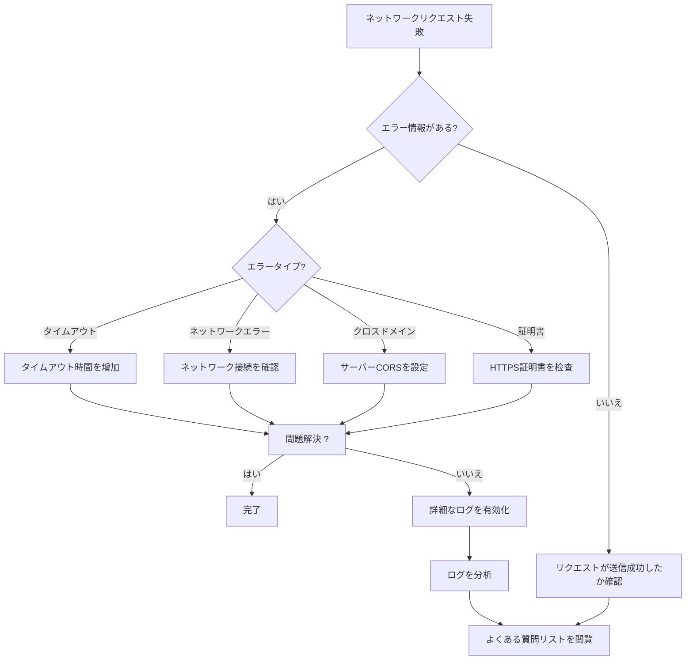

# よくある質問

本ドキュメントでは、GameFrameX Unity Web プラグインの使用過程で発生する一般的な問題、原因分析と対応する解決策を汇总します。

## 概要

GameFrameX Web コンポーネントは高性能な Unity HTTP ネットワークリクエストライブラリであり、GET、POST リクエストをサポートし、文字列、JSON、バイナリデータ等多种なフォーマットを扱うことができます。実際の使用過程で、開発者は часто 一些问题に出会いますが、本ドキュメントはこれらの問題を迅速に特定して解決するのを支援します。

## よくある質問リスト

### 1. WebGL プラットフォームリクエスト失敗

**問題の説明**：
WebGL プラットフォームでネットワークリクエストを送信する際、リクエストが応答しないか、直接エラーがスローされます。

**考えられる原因**：
- WebGL プラットフォームにはクロスドメイン制限が存在
- サーバーが正しく CORS ヘッダー情報を設定していない
- WebGL はマルチスレッドをサポートせず、すべてのリクエストがメインスレッドで処理

**解決策**：

1. **サーバーが CORS を設定していることを確認**
   サーバーは以下の CORS レスポンスヘッダーを返す必要があります：
   ```http
   Access-Control-Allow-Origin: *
   Access-Control-Allow-Methods: GET, POST, OPTIONS
   Access-Control-Allow-Headers: Content-Type, Authorization
   ```

2. **OPTIONS プリフライトリクエストを処理**
   非シンプルリクエスト（カスタムヘッダー付き、または Content-Type が application/x-www-form-urlencoded でない場合）、サーバーは OPTIONS プリフライトリクエストをサポートする必要があります。

3. **非同期待awaitを使用し、ブロッキング呼び出しを避ける**
   WebGL はマルチスレッドをサポートしないため、`.Wait()` または `.Result` のブロッキング呼び出しではなく、`await` の非同期待awaitを使用することを推奨：

   ```csharp
   // ✅ 推奨：非同期待await
   private async void Start()
   {
       var webManager = GameFrameworkEntry.GetModule<IWebManager>();
       var result = await webManager.GetToString("https://api.example.com/data");
       Debug.Log(result.Result);
   }
   
   // ❌ 避ける：ブロッキング呼び出し（WebGL で固まる）
   private void Start()
   {
       var webManager = GameFrameworkEntry.GetModule<IWebManager>();
       var result = webManager.GetToString("https://api.example.com/data").Result; // デッドロック発生
   }
   ```

---

### 2. リクエストタイムアウト

**問題の説明**：
ネットワークリクエストが長時間応答せず、最終的にタイムアウト例外がスローされます。

**考えられる原因**：
- ネットワーク接続が不安定、またはネットワークに到達不能
- サーバーの応答が遅い
- タイムアウト時間が短すぎ

**解決策**：

1. **タイムアウト時間を調整**
   
   ```csharp
   // 方法一：WebComponent コンポーネントを通じてタイムアウトを設定
   var webComponent = gameObject.GetOrAddComponent<WebComponent>();
   webComponent.Timeout = 60f; // 60 秒に設定
   
   // 方法二：IWebManager インターフェースを通じてタイムアウトを設定
   var webManager = GameFrameworkEntry.GetModule<IWebManager>();
   webManager.Timeout = 60f; // 60 秒に設定
   ```

   > Source: [WebComponent.cs](https://github.com/GameFrameX/com.gameframex.unity.web/blob/main/Runtime/Web/WebComponent.cs#L66-L70)

2. **リトライメカニズムを実装**
   
   ```csharp
   public async Task<T> RetryRequest<T>(Func<Task<T>> requestFunc, int maxRetries = 3)
   {
       for (int i = 0; i < maxRetries; i++)
       {
           try
           {
               return await requestFunc();
           }
           catch (TimeoutException)
           {
               if (i == maxRetries - 1) throw;
               await Task.Delay(1000 * (i + 1)); // 指数バックオフ
           }
       }
       throw new Exception("リトライ回数を使い果たしました");
   }
   ```

3. **詳細なログを有効にしてトラブルシューティング**
   ログを有効にすることで、タイムアウト原因の特定に役立ちます：

   - Unity メニューで **GameFrameX → Scripting Define Symbols → Enable Web Send Logs** を選択して送信ログを有効化
   - **GameFrameX → Scripting Define Symbols → Enable Web Receive Logs** を選択して受信ログを有効化

---

### 3. HTTPS 証明書検証失敗

**問題の説明**：
モバイルデバイスで HTTPS リクエストを送信すると、証明書検証失敗エラーが発生します。

**考えられる原因**：
- デバイスの時間が不正确
- サーバーの証明書が期限切れまたは無効
- 自己署名証明書
- 証明書チェーンが不完全

**解決策**：

1. **デフォルトの証明書バイパスを使用（開発テストのみに使用）**
   
   プラグインには証明書検証をバイパスするための `DefaultBypassCertificate` クラスが組み込まれています：
   
   ```csharp
   // プラグインは自動的に処理するため、手動設定は不要
   unityWebRequest.certificateHandler = new DefaultBypassCertificate();
   ```
   
   > Source: [WebManager.cs](https://github.com/GameFrameX/com.gameframex.unity.web/blob/main/Runtime/Web/WebManager.cs#L224)

2. **本番環境の推奨事項**
   - サーバーが信頼できる CA が発行した有効な証明書を使用することを確保
   - モバイルデバイスの時間が正しく設定されていることを確保
   - 正式リリース時に証明書バイパスコードを移除

---

### 4. リクエストキュー阻塞

**問題の説明**：
複数のリクエストを送信後、一部のリクエストが常に待機ステータスにあり、長時間応答がありません。

**考えられる原因**：
- 同時接続数制限（`MaxConnectionPerServer` のデフォルト値は 8）
- リクエストキューがいっぱい
-前面的リクエストが阻塞

**解決策**：

1. **同時接続数を調整**
   
   ```csharp
   var webManager = GameFrameworkEntry.GetModule<IWebManager>();
   // 16個の同時接続に設定
   ((WebManager)webManager).MaxConnectionPerServer = 16;
   ```
   
   > Source: [WebManager.cs](https://github.com/GameFrameX/com.gameframex.unity.web/blob/main/Runtime/Web/WebManager.cs#L71)

2. **リクエストを合理的に設計**
   - 高優先度と低優先度リクエストを区別
   - 大容量ファイルのダウンロードは单独の接続を使用
   - バッチリクエストは分割して送信

---

### 5. ベースデータが有効にならない

**問題の説明**：
`AddBaseForm`、`AddBaseHeader` 等のメソッドで設定したベースデータが、実際のリクエストに含まれていません。

**考えられる原因**：
- ベースデータがリクエスト送信前に正しく追加されていない
- 追加後にクリアされた
- マージロジックの問題

**解決策**：

1. **リクエスト前にベースデータを追加することを確保**
   
   ```csharp
   var webManager = GameFrameworkEntry.GetModule<IWebManager>();
   
   // ベースリクエストヘッダーを追加（每次リクエストが自動的に含まれる）
   webManager.AddBaseHeader("Authorization", "Bearer your-token");
   webManager.AddBaseHeader("X-App-Version", "1.0.0");
   
   // ベースフォームデータを追加
   webManager.AddBaseForm("platform", "android");
   webManager.AddBaseForm("deviceId", SystemInfo.deviceUniqueIdentifier);
   
   // ベースクエリパラメータを追加
   webManager.AddBaseQueryString("lang", "ja-JP");
   
   // リクエストを送信
   var result = await webManager.GetToString("https://api.example.com/data");
   ```
   
   > Source: [IWebManager.cs](https://github.com/GameFrameX/com.gameframex.unity.web/blob/main/Runtime/Web/IWebManager.cs#L147-L198)

2. **データが誤ってクリアされていないか確認**
   
   以下のメソッドを呼び出していないことを確認：
   - `ClearBaseForm()` - ベースフォームをクリア
   - `ClearBaseHeader()` - ベースリクエストヘッダーをクリア
   - `ClearBaseQueryString()` - ベースクエリパラメータをクリア

---

### 6. 返された結果の解析エラー

**問題の説明**：
リクエストは正常に返されましたが、レスポンスデータの解析時に例外が発生しました。

**考えられる原因**：
- レスポンスデータ形式が予想と一致しない
- JSON シリアライズ/デシリアライズに失敗
- データが空または null

**解決策**：

1. **返された結果を正しく処理**
   
   ```csharp
   var webManager = GameFrameworkEntry.GetModule<IWebManager>();
   var result = await webManager.GetToString("https://api.example.com/data");
   
   // エラーがあるかどうか確認
   if (result != null && !string.IsNullOrEmpty(result.Result))
   {
       try
       {
           var data = JsonUtility.FromJson<MyDataClass>(result.Result);
           Debug.Log($"解析成功: {data.name}");
       }
       catch (Exception e)
       {
           Debug.LogError($"JSON解析失敗: {e.Message}");
       }
   }
   else
   {
       Debug.LogWarning("レスポンスデータが空");
   }
   ```
   
   > Source: [WebStringResult.cs](https://github.com/GameFrameX/com.gameframex.unity.web/blob/main/Runtime/Web/WebStringResult.cs#L15-L38)

2. **バイト配列を使用してバイナリデータを受信**
   
   ```csharp
   var bufferResult = await webManager.GetToBytes("https://api.example.com/file");
   if (bufferResult != null && bufferResult.Result != null)
   {
       byte[] data = bufferResult.Result;
       Debug.Log($"受信データサイズ: {data.Length} bytes");
   }
   ```
   
   > Source: [WebBufferResult.cs](https://github.com/GameFrameX/com.gameframex.unity.web/blob/main/Runtime/Web/WebBufferResult.cs#L1-L20)

---

### 7. プラットフォーム差異による動作不一貫

**問題の説明**：
同一个リクエストが Editor/PC では正常に動作しますが、WebGL またはモバイルプラットフォームでは失敗します。

**考えられる原因**：
- 異なるプラットフォームが異なるネットワークライブラリを使用
- WebGL は `UnityWebRequest` を使用し、他のプラットフォームは `HttpWebRequest` を使用
- プラットフォーム固有の機能制限

**解決策**：

1. **プラットフォーム差異を理解**
   
   ```csharp
   // WebGL プラットフォームでは UnityWebRequest を使用
   #if UNITY_WEBGL
       UnityWebRequest unityWebRequest;
       // WebGL 固有の実装
   #else
       // 他のプラットフォームでは HttpWebRequest を使用
       HttpWebRequest request = WebRequest.CreateHttp(url);
   #endif
   ```
   
   > Source: [WebManager.cs](https://github.com/GameFrameX/com.gameframex.unity.web/blob/main/Runtime/Web/WebManager.cs#L213-L329)

2. **条件付きコンパイルを使用してプラットフォーム固有コードを処理**
   
   ```csharp
   public async Task<string> GetDataAsync(string url)
   {
       try
       {
           return await webManager.GetToString(url);
       }
       catch (Exception e)
       {
   #if UNITY_WEBGL
           // WebGL 固有のエラー処理
           Debug.LogError($"WebGL エラー: {e.Message}");
   #else
           // 他のプラットフォームのエラー処理
           Debug.LogError($"ネットワークエラー: {e.Message}");
   #endif
           throw;
       }
   }
   ```

---

### 8. デバッグテクニック

**問題の説明**：
ネットワークリクエストの問題を排查する必要があるが、詳細情報を取得する方法がわかりません。

**解決策**：

1. **詳細なログを有効化**
   
   Unity エディターで：
   - メニュー：**GameFrameX → Scripting Define Symbols → Enable Web Send Logs**
   - メニュー：**GameFrameX → Scripting Define Symbols → Enable Web Receive Logs**

   ログマクロ定義：
   ```csharp
   // 送信ログ
   #if ENABLE_GAMEFRAMEX_WEB_SEND_LOG
       Log.Debug($"Web Request: {webJsonData.URL} \n Header: {...}");
   #endif
   
   // 受信ログ
   #if ENABLE_GAMEFRAMEX_WEB_RECEIVE_LOG
       Log.Debug($"Web Response: {webJsonData.URL} \n Content: {...}");
   #endif
   ```
   
   > Source: [WebLogScriptingDefineSymbols.cs](https://github.com/GameFrameX/com.gameframex.unity.web/blob/main/Editor/WebLogScriptingDefineSymbols.cs#L42-L79)

2. **Player Settings でデバッグを有効化**
   - **Edit → Project Settings → Player** を開く
   - **Development Build** にチェック
   - **Script Debugging** にチェック

3. **Unity Profiler でネットワークを監視**
   - **Window → Analysis → Profiler** を開く
   - **Network** パネルを追加してネットワークリクエストを監視

---

### 9. リクエストが返す例外タイプ

**問題の説明**：
リクエストが失敗したときにスローされる例外タイプの詳細がわかりません。

**解決策**：

プラグインは異なるエラー状況に基づいて以下の例外をスローします：

| 例外タイプ | トリガー条件 | 処理建議 |
|---------|---------|---------|
| `TimeoutException` | リクエストタイムアウト | タイムアウト時間を増やすかネットワークを確認 |
| `WebException` | ネットワークエラー | ネットワーク接続とサーバー STATUS を確認 |
| `IOException` | I/O エラー | データ読み書きの問題を確認 |
| `Exception` | その他のエラー | 具体的なエラー情報を確認 |

```csharp
try
{
    var result = await webManager.GetToString(url);
}
catch (TimeoutException ex)
{
    Debug.LogError($"リクエストタイムアウト: {ex.Message}");
}
catch (WebException ex)
{
    Debug.LogError($"ネットワークエラー: {ex.Message}, ステータス: {ex.Status}");
}
catch (IOException ex)
{
    Debug.LogError($"IOエラー: {ex.Message}");
}
catch (Exception ex)
{
    Debug.LogError($"不明なエラー: {ex.Message}");
}
```
> Source: [WebManager.cs](https://github.com/GameFrameX/com.gameframex.unity.web/blob/main/Runtime/Web/WebManager.cs#L298-L324)

---

## 診断フロー図



---

## 関連リンク

- [プラグイン紹介](./01.overview)
- [インストール方法](./02.installation)
- [基本使用法](./03.getting-started)
- [WebComponent の使用](./08.web-component)
- [WebManager アーキテクチャ](./05.web-manager)
- [リクエスト結果タイプ](./06.result-types)
- [IWebManager インターフェース](./04.iwebmanager-interface)
- [WebComponent コンポーネント](./08.web-component)
- [タイムアウト設定](./10.timeout-settings)
- [ベースデータ設定](./07.base-data)
- [プラットフォーム差異説明](./09.platform-differences)
