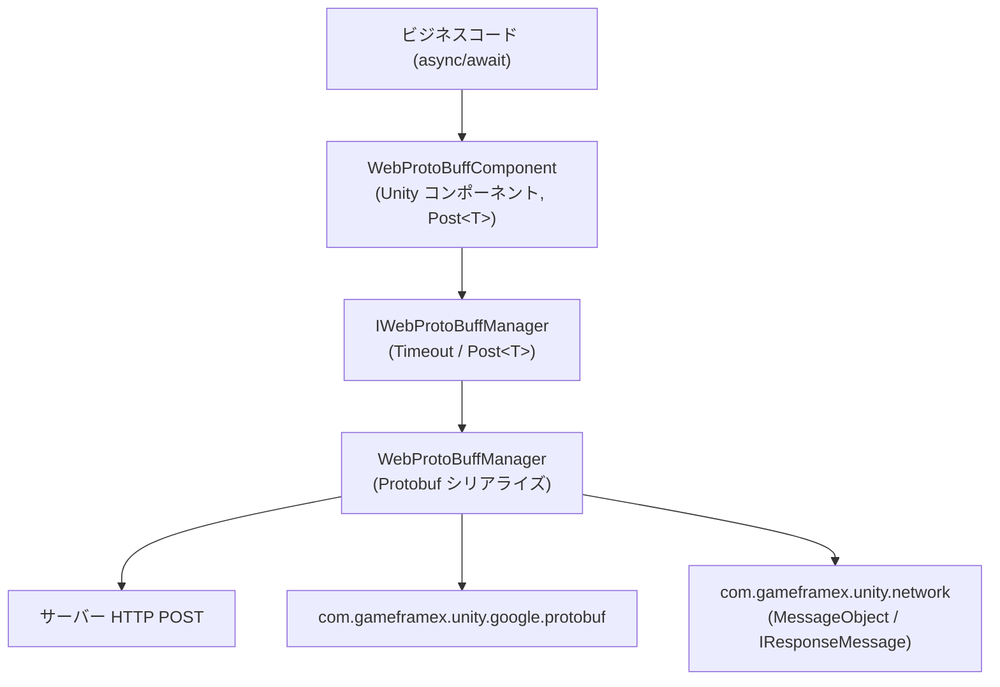

# Web ProtoBuff コンポーネント概要:何ができるか

Web ProtoBuff は GameFrameX の HTTP Protobuf リクエストコンポーネントです。わずか一行の `await` で、Protocol Buffer メッセージを HTTP POST によってサーバーへ送信し、レスポンスを指定した型 `T`(`MessageObject` を継承し `IResponseMessage` を実装)として直接デシリアライズできます。`Task<T>` ベースの非同期 API で、カスタムタイムアウトをサポートし、Unity WebGL およびその他のネイティブプラットフォームに対応しています。

## クイックスタート

1. **パッケージのインストール**。Unity プロジェクトの `Packages/manifest.json` を編集し、`scopedRegistries` を追加して依存関係を宣言します:

   ```json
   {
     "scopedRegistries": [
       {
         "name": "GameFrameX",
         "url": "https://gameframex.upm.alianblank.uk",
         "scopes": [
           "com.gameframex"
         ]
       }
     ],
     "dependencies": {
       "com.gameframex.unity.web.protobuff": "1.1.3"
     }
   }
   ```

   出典:[README.zh-CN.md](https://github.com/GameFrameX/com.gameframex.unity.web.protobuff/blob/main/README.zh-CN.md#L47-L63)

   代わりに Git URL 方式を使用することもできます:`"com.gameframex.unity.web.protobuff": "https://github.com/gameframex/com.gameframex.unity.web.protobuff.git"`、または Package Manager で Git URL 経由で追加することも可能です。

2. **マクロ定義の追加**。Unity の **Player Settings** → **Scripting Define Symbols** に以下を追加します:

   `ENABLE_GAME_FRAME_X_WEB_PROTOBUF_NETWORK`

   このマクロが有効になっていない場合、`Post<T>` 関連の API はプロジェクトにコンパイルされません。

3. **コンポーネントのアタッチと呼び出し**。シーン内の GameFramework オブジェクトに **GameFrameX/Web ProtoBuff** コンポーネント(`WebProtoBuffComponent`、デフォルトのタイムアウトは 5 秒)を追加し、リクエストを送信します:

   ```csharp
   using GameFrameX.Web.ProtoBuff.Runtime;

   // リクエストを送信して結果を待つ
   LoginResponse response = await WebComponent.Post<LoginResponse>(url, request);
   ```

   出典:[README.zh-CN.md](https://github.com/GameFrameX/com.gameframex.unity.web.protobuff/blob/main/README.zh-CN.md#L108-L113)

## コア API

コンポーネントが公開するリクエストのエントリーポイントとマネージャーインターフェースは以下の通りです:

```csharp
public Task<T> Post<T>(string url, GameFrameX.Network.Runtime.MessageObject message)
    where T : GameFrameX.Network.Runtime.MessageObject, GameFrameX.Network.Runtime.IResponseMessage
```

出典:[WebProtoBuffComponent.cs](https://github.com/GameFrameX/com.gameframex.unity.web.protobuff/blob/main/Runtime/Web/WebProtoBuffComponent.cs#L105-L108)

| 名称 | シグネチャ/型 | 説明 |
|------|-----------|------|
| `Post<T>` | `Task<T> Post<T>(string url, MessageObject message)` | Protobuf POST リクエストを送信し、レスポンスを `T` として解析します。`T` は `MessageObject` を継承し、かつ `IResponseMessage` を実装する必要があります。`ENABLE_GAME_FRAME_X_WEB_PROTOBUF_NETWORK` マクロが有効な場合のみ利用可能です |
| `Timeout` | `float { get; set; }` | POST リクエストのタイムアウト時間(秒)。デフォルトは 5 秒で、Inspector で設定可能です |
| `WebProtoBuffComponent` | Unity コンポーネント | コンポーネントメニューは `GameFrameX/Web ProtoBuff`。同一オブジェクトには 1 つのみアタッチ可能で、`GameFrameXWebProtoBuffCroppingHelper` が必要です |
| `IWebProtoBuffManager` | インターフェース | マネージャーインターフェース。`WebProtoBuffComponent` の内部で `GameFrameworkEntry.GetModule<IWebProtoBuffManager>()` を通じて実装を取得します |

出典:[IWebProtoBuffManager.cs](https://github.com/GameFrameX/com.gameframex.unity.web.protobuff/blob/main/Runtime/Web/IWebProtoBuffManager.cs#L9-L29)

実行時には 2 つのパッケージに依存しており、インストール時に UPM が自動的に解決します:

| 依存パッケージ | バージョン |
|--------|------|
| `com.gameframex.unity.network` | 2.6.10 |
| `com.gameframex.unity.google.protobuf` | 3.4.2 |

出典:[package.json](https://github.com/GameFrameX/com.gameframex.unity.web.protobuff/blob/main/package.json#L25-L26)

## 仕組みの概要

呼び出しチェーンはシンプルです:コンポーネントの `Post<T>` を呼び出すと、コンポーネントがリクエストをマネージャーに渡し、マネージャーが Protobuf のシリアライズ/デシリアライズと HTTP 送信を担当します。



## よくあるエラー

- **`Post<T>` が存在しない / コンパイルエラー**:Scripting Define Symbols に `ENABLE_GAME_FRAME_X_WEB_PROTOBUF_NETWORK` が追加されていません。この API は `#if ENABLE_GAME_FRAME_X_WEB_PROTOBUF_NETWORK` による条件付きコンパイルで制御されています。
- **ジェネリック制約が満たされない**:`T` は `MessageObject` を継承し、かつ `IResponseMessage` を実装する必要があります。また、リクエストメッセージのパラメーターは `MessageObject` を継承していなければなりません。
- **リクエストが長時間応答せず固まる**:コンポーネントの Inspector でタイムアウト時間(単位：秒、デフォルト 5)を確認するか、`Timeout` プロパティで調整してください。

## 次のステップ

- 公式ドキュメント:https://gameframex.doc.alianblank.com
- リクエストの送信とレスポンス処理に関する具体的な使い方は、本サイトのタスクページを参照してください
- バージョン履歴については [CHANGELOG.md](https://github.com/GameFrameX/com.gameframex.unity.web.protobuff/blob/main/CHANGELOG.md) を参照してください
- 多言語 README:[簡体中文](https://github.com/GameFrameX/com.gameframex.unity.web.protobuff/blob/main/README.zh-CN.md) · [English](https://github.com/GameFrameX/com.gameframex.unity.web.protobuff/blob/main/README.md)