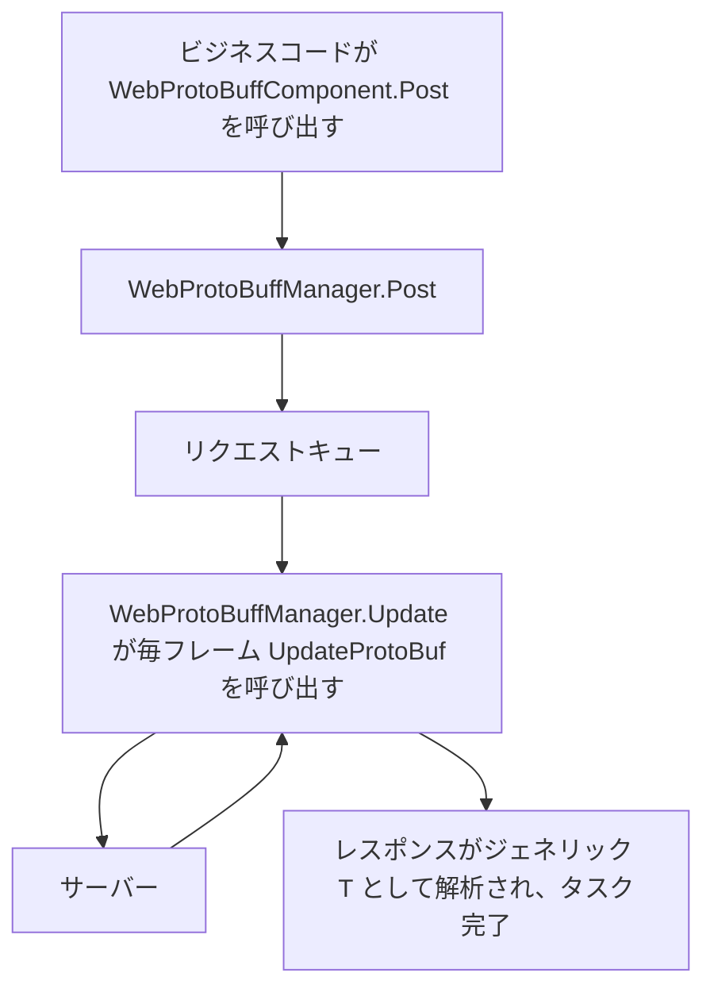

# 動作原理:コンポーネント、マネージャーとリクエストパイプライン

本ページでは、`WebProtoBuffComponent`(Unity コンポーネントのエントリ)と `WebProtoBuffManager`(フレームワークモジュール)がどのように連携して 1 回の Protobuf HTTP リクエストを完了するかを説明します。コンポーネントは `Awake` で `GameFrameworkEntry` から `IWebProtoBuffManager` モジュールを取得してタイムアウト設定を同期し、ビジネスコードが `Post<T>` を呼び出した後はマネージャーがリクエストキューを処理し、毎フレームの `Update` でレスポンスがジェネリック型 `T` として解析されるまでキューを進めます。

## コンポーネントとマネージャー:責務一覧

| 型 | 役割 | 主要メンバー/説明 |
|------|------|---------------|
| `WebProtoBuffComponent` | Unity シーンのエントリコンポーネント(MonoBehaviour) | `Post<T>(url, message)`、`Timeout`;アタッチメニューは `GameFrameX/Web ProtoBuff`、`GameFrameXWebProtoBuffCroppingHelper` に自動依存 |
| `IWebProtoBuffManager` | マネージャーインターフェース | `Task<T> Post<T>(string url, MessageObject message)`(マクロ `ENABLE_GAME_FRAME_X_WEB_PROTOBUF_NETWORK` が必要)、`float Timeout { get; set; }` |
| `WebProtoBuffManager` | フレームワークモジュールの実装(partial クラス) | コンストラクタで `MaxConnectionPerServer = 8`、`Timeout = 5f` を設定；毎フレームの `Update` で `UpdateProtoBuf` を呼び出してリクエストキューを処理；`Shutdown` は `ShutdownProtoBuf` を呼び出し |

`WebProtoBuffManager` は partial クラスであり、`UpdateProtoBuf` / `ShutdownProtoBuf` などの Protobuf 関連の実装は partial ファイル [WebProtoBuffManager.ProtoBuf.cs](https://github.com/GameFrameX/com.gameframex.unity.web.protobuff/blob/main/Runtime/Web/WebProtoBuffManager.ProtoBuf.cs) と [WebProtoBuffManager.WebProtoBuffData.cs](https://github.com/GameFrameX/com.gameframex.unity.web.protobuff/blob/main/Runtime/Web/WebProtoBuffManager.WebProtoBuffData.cs) に分散しています。

## リクエストパイプライン



実行順序に沿った分解：

1. **ビジネス層がコンポーネントを呼び出す**:`WebProtoBuffComponent.Post<T>(url, message)` はパラメータをそのまま `m_WebProtoBuffManager.Post<T>(url, message)` に渡すだけで、コンポーネント自体はネットワーク処理を一切行いません。このメソッドはインターフェースのメソッドと同様、`ENABLE_GAME_FRAME_X_WEB_PROTOBUF_NETWORK` マクロが定義されている場合にのみコンパイルされます。
2. **マネージャーがリクエストを受け取る**:`WebProtoBuffManager` は `IWebProtoBuffManager.Post<T>` を実装します。インターフェースのドキュメントによれば、リクエストのメッセージボディはパラメータ `message` で提供され、レスポンスは指定されたジェネリック型 `T`(制約:`MessageObject` を継承し `IResponseMessage` を実装)として解析されます。
3. **毎フレームでキューを駆動**：フレームワークモジュールの `Update(elapseSeconds, realElapseSeconds)` は `lock (m_StringBuilder)` による保護の下で `UpdateProtoBuf` を呼び出します。コメントではその責務が「リクエスト処理キューの更新」であると明記されています。
4. **タイムアウト制御**:`Timeout`(秒)に値を設定すると `RequestTimeout = TimeSpan.FromSeconds(value)` へ同時に変換され、タイムアウトが即座に有効になります。
5. **終了時のクリーンアップ**:`Shutdown()` は `ShutdownProtoBuf()` を呼び出してリソースをクリーンアップします。

## 初期化とライフサイクル

コンポーネントの `Awake` の主要な動作(ソースコード原文より):

```csharp
protected override void Awake()
{
    ImplementationComponentType = Utility.Assembly.GetType(componentType);
    InterfaceComponentType = typeof(IWebProtoBuffManager);
    base.Awake();
    m_WebProtoBuffManager = GameFrameworkEntry.GetModule<IWebProtoBuffManager>();
    if (m_WebProtoBuffManager == null)
    {
        Log.Fatal("Web manager is invalid.");
        return;
    }

    m_WebProtoBuffManager.Timeout = m_Timeout;
}
```

Source: [WebProtoBuffComponent.cs](https://github.com/GameFrameX/com.gameframex.unity.web.protobuff/blob/main/Runtime/Web/WebProtoBuffComponent.cs#L77-L90)

ポイント:

- マネージャーのインスタンスはコンポーネント自身が new するものではなく、`GameFrameworkEntry.GetModule<IWebProtoBuffManager>()` によって取得されます。取得できない場合は `Log.Fatal("Web manager is invalid.")` を呼び出して即座に返ります。
- Inspector で設定する `m_Timeout`(デフォルト `5f`、Tooltip「タイムアウト時間.単位：秒」)は、`Awake` の最後でマネージャーに同期されます。
- コンポーネントには `[RequireComponent(typeof(GameFrameXWebProtoBuffCroppingHelper))]` が付与されており、アタッチ時にクロッピングヘルパーコンポーネントが自動的に追加されます。また `[DisallowMultipleComponent]` であるため、同一 GameObject には 1 つしか配置できません。

## インターフェース契約早見表

| メンバー | シグネチャ | 説明 |
|------|------|------|
| `Post<T>` | `Task<T> Post<T>(string url, GameFrameX.Network.Runtime.MessageObject message) where T : MessageObject, IResponseMessage` | Protobuf メッセージを送信する POST リクエスト。レスポンスは `T` として解析;`ENABLE_GAME_FRAME_X_WEB_PROTOBUF_NETWORK` マクロ定義時のみ利用可能 |
| `Timeout` | `float Timeout { get; set; }` | POST リクエストのタイムアウト時間(秒)。コンポーネントのデフォルトは `5f` |

インターフェースの原文は [IWebProtoBuffManager.cs](https://github.com/GameFrameX/com.gameframex.unity.web.protobuff/blob/main/Runtime/Web/IWebProtoBuffManager.cs#L9-L29) を参照:

```csharp
public interface IWebProtoBuffManager
{
#if ENABLE_GAME_FRAME_X_WEB_PROTOBUF_NETWORK
    Task<T> Post<T>(string url, GameFrameX.Network.Runtime.MessageObject message) where T : GameFrameX.Network.Runtime.MessageObject, GameFrameX.Network.Runtime.IResponseMessage;
#endif
    float Timeout { get; set; }
}
```

Source: [IWebProtoBuffManager.cs](https://github.com/GameFrameX/com.gameframex.unity.web.protobuff/blob/main/Runtime/Web/IWebProtoBuffManager.cs#L9-L29)

`WebProtoBuffManager` 自身の公開設定項目：

| メンバー | 型/デフォルト値 | 説明 |
|------|-------------|------|
| `MaxConnectionPerServer` | `int`、コンストラクタで `8` に設定 | サーバーごとの最大接続数 |
| `RequestTimeout` | `TimeSpan` | リクエストタイムアウト時間。`Timeout`(秒)から変換される |

```csharp
public WebProtoBuffManager()
{
    MaxConnectionPerServer = 8;
    Timeout = 5f;
}
```

Source: [WebProtoBuffManager.cs](https://github.com/GameFrameX/com.gameframex.unity.web.protobuff/blob/main/Runtime/Web/WebProtoBuffManager.cs#L26-L31)

## 背景

- **コンポーネント/モジュールの分離**:`WebProtoBuffComponent` はパラメータの転送と Inspector のシリアライズ(タイムアウト値)のみを担当し、実際のキュー駆動は `WebProtoBuffManager.Update` で行われます——これこそが、リクエストが Unity のメインループ内でフレームごとに進められる一方で、ビジネス側が受け取るのは `Task<T>` の非同期結果である理由です。
- **URL の組み立て**:`UrlHandler(string url, Dictionary<string, string> queryString)` はクエリパラメータの辞書を URL に連結する役割を担い、キーと値は `Uri.EscapeDataString` でエスケープされます。また、`StringBuilder(256)` を再利用して GC を削減します。
- ソースコード内では `UpdateProtoBuf` / `ShutdownProtoBuf` の partial 実装の詳細は確認できませんでした(読み取り予算の制限、および partial ファイルが未展開のため)。必要な場合は [WebProtoBuffManager.ProtoBuf.cs](https://github.com/GameFrameX/com.gameframex.unity.web.protobuff/blob/main/Runtime/Web/WebProtoBuffManager.ProtoBuf.cs) を直接ご確認ください。

## 関連リンク

- [WebProtoBuffComponent.cs](https://github.com/GameFrameX/com.gameframex.unity.web.protobuff/blob/main/Runtime/Web/WebProtoBuffComponent.cs) — Unity コンポーネントのエントリ。`Awake` での初期化と `Post<T>` の転送
- [IWebProtoBuffManager.cs](https://github.com/GameFrameX/com.gameframex.unity.web.protobuff/blob/main/Runtime/Web/IWebProtoBuffManager.cs) — マネージャーインターフェースの契約
- [WebProtoBuffManager.cs](https://github.com/GameFrameX/com.gameframex.unity.web.protobuff/blob/main/Runtime/Web/WebProtoBuffManager.cs) — マネージャーのメイン partial:タイムアウト、毎フレームの `Update`、URL の正規化
- [WebProtoBuffManager.ProtoBuf.cs](https://github.com/GameFrameX/com.gameframex.unity.web.protobuff/blob/main/Runtime/Web/WebProtoBuffManager.ProtoBuf.cs) — Protobuf リクエストキュー実装の partial
- [WebProtoBuffManager.WebProtoBuffData.cs](https://github.com/GameFrameX/com.gameframex.unity.web.protobuff/blob/main/Runtime/Web/WebProtoBuffManager.WebProtoBuffData.cs) — リクエスト/レスポンスデータ構造の partial
- [GameFrameXWebProtoBuffCroppingHelper.cs](https://github.com/GameFrameX/com.gameframex.unity.web.protobuff/blob/main/Runtime/GameFrameXWebProtoBuffCroppingHelper.cs) — コンポーネントが自動的に依存するクロッピングヘルパークラス
- 公式ドキュメント:https://gameframex.doc.alianblank.com/