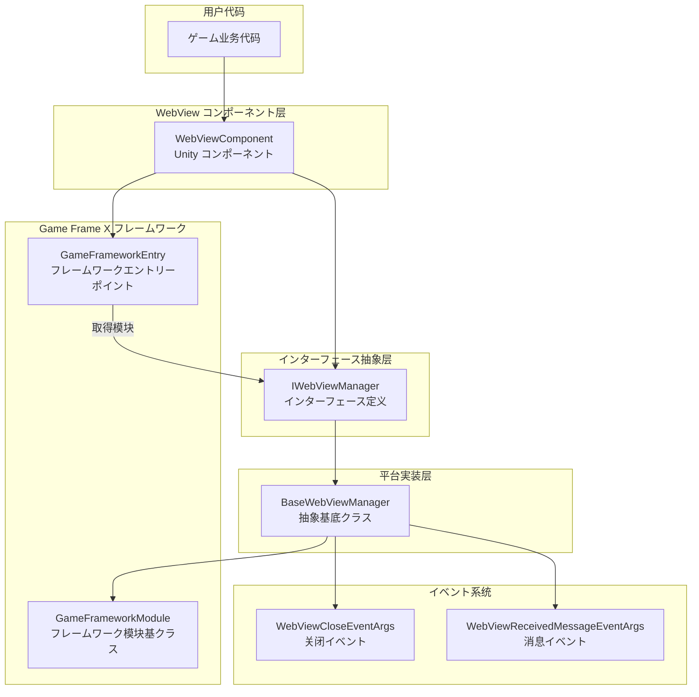
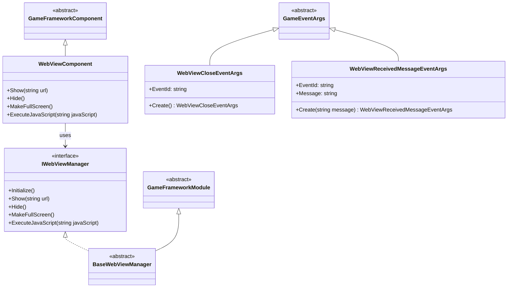
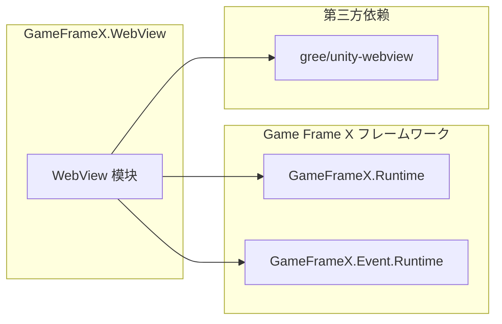

# 概要

`Game Frame X Web View` 是 Game Frame X ゲームフレームワーク的 WebView コンポーネント，为 Unity ゲーム提供嵌入式网页显示機能。该コンポーネント基づく [gree/unity-webview](https://github.com/gree/unity-webview) 进行封装，提供します更简洁的 API 和更便捷的集成方法。

## プロジェクト简介

GameFrameX WebView 是 Game Frame X ゲームフレームワーク生态的一部分，专门に使用解决 Unity ゲーム内嵌入网页内容的需求。を通じて该コンポーネント，開発者可能：

- 在 Unity ゲーム中显示外部网页内容
- 実装 C# 与 JavaScript 的双向通信
- サポート Android 和 iOS 主流移动平台
- 与 Game Frame X フレームワーク其他模块无缝集成

## コア機能

| 機能 | 説明 |
|------|------|
| 网页显示 | 在 Unity シーン中嵌入并显示 Web 页面 |
| JavaScript 交互 | サポート C# 与网页 JavaScript 代码双向呼び出し |
| 全屏显示 | 提供全屏模式サポート |
| 平台适配 | 自动适配 Android 和 iOS 平台 |
| イベント系统 | 提供 WebView 关闭和消息接收イベント |

## 系统架构

### 架构説明

1. **WebViewComponent**: Unity コンポーネント层，提供面向用户的 API。開発者を通じて挂载此コンポーネント到 GameObject 上来使用 WebView 機能。

2. **IWebViewManager**: インターフェース层，定义了 WebView 管理器的标准操作，包括初期化、显示、隐藏、全屏和 JavaScript 执行等メソッド。

3. **BaseWebViewManager**: 抽象基底クラス，を継承 GameFrameworkModule，提供平台関連的具体実装模板。平台実装クラス（如 AndroidWebViewManager、iOSWebViewManager）继承此クラス。

4. **GameFrameworkModule**: Game Frame X フレームワーク的模块基クラス，提供模块生命周期管理和フレームワーク集成能力。

5. **イベント系统**: を通じて GameFrameX 的イベント系统分发 WebView 関連イベント，包括关闭イベント和消息接收イベント。

## 模块设计

## プラットフォーム対応

| 平台 | サポートステータス | 説明 |
|------|----------|------|
| Android | ✅ サポート | を通じて unity-webview Android 插件実装 |
| iOS | ✅ サポート | を通じて unity-webview iOS 插件実装 |
| Windows | ⚠️ 基础サポート | 仅编辑器环境サポート |
| macOS | ⚠️ 基础サポート | 仅编辑器环境サポート |
| WebGL | ❌ 不サポート | WebGL 平台无法嵌套 WebView |

## 依赖关系

に基づいて `package.json` 的配置，本模块依赖以下コンポーネント：

- **GameFrameX.Runtime** (`com.gameframex.unity: 1.0.0`): フレームワークコア运行时
- **GameFrameX.Event.Runtime**: フレームワークイベント系统
- **gree/unity-webview**: 底层 WebView 実装（需单独安装）

## 使用シーン

GameFrameX WebView 适に使用以下シーン：

1. **ゲーム内公告**: 使用 WebView 显示ゲーム公告、活动页面
2. **登录验证**: 集成第三方登录或 SDK 的 Web 页面
3. **商店展示**: 在ゲーム内展示虚拟商品商店
4. **帮助文档**: 显示ゲーム帮助或教程网页
5. **社区機能**: 集成论坛或社区页面
6. **广告展示**: 显示 Web 形式的广告内容

## 関連リンク

- [安装指南](./2-installation) - 详细安装手順
- [快速入门](./3-getting-started) - 快速上手教程
- [API 参考](./4-api-reference) - 完整 API 文档
- [平台配置](./5-platforms) - Android 和 iOS 平台配置
- [イベント系统](./6-events) - イベント系统详解
- [常见问题](./7-troubleshooting) - 常见问题解答
- [Game Frame X 官网](https://gameframex.doc.alianblank.com)
- [gree/unity-webview](https://github.com/gree/unity-webview)
