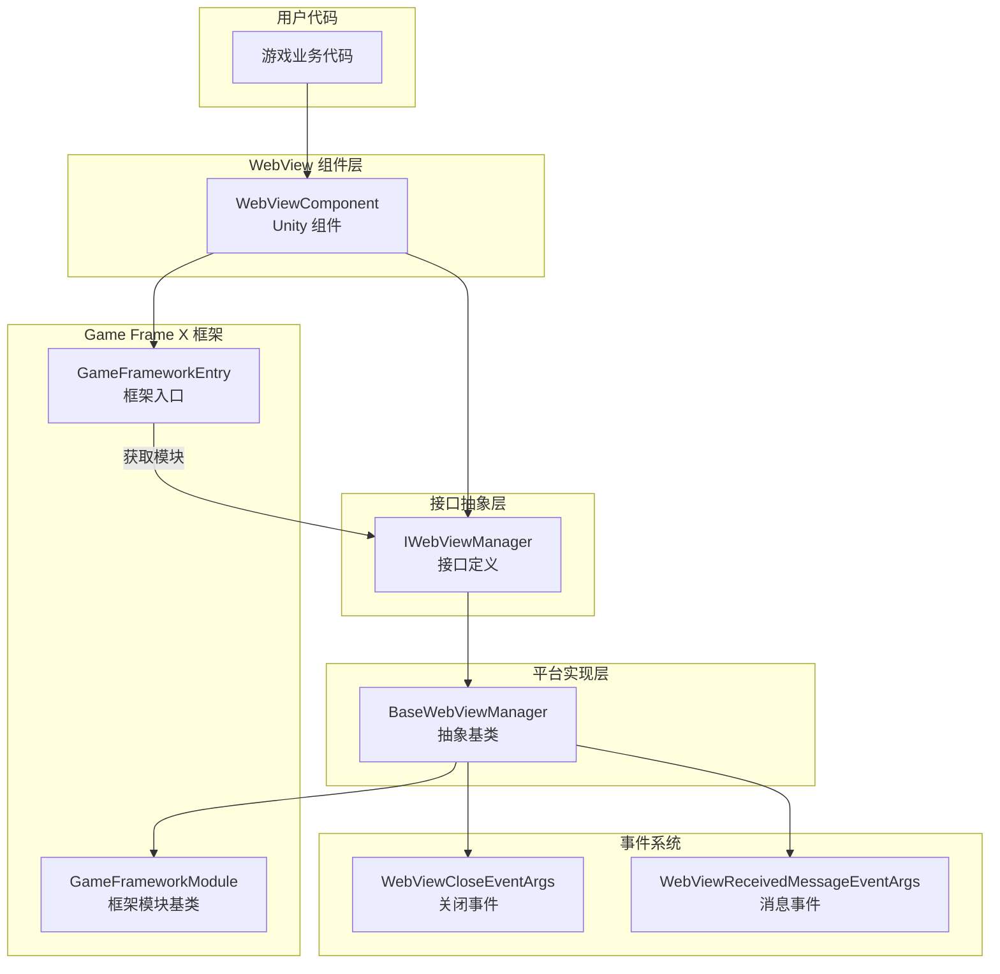
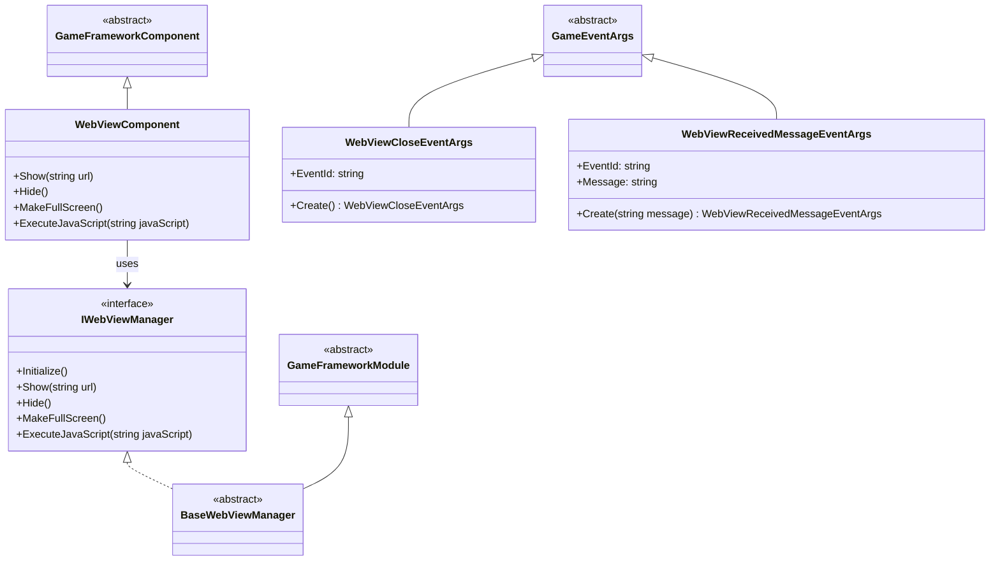
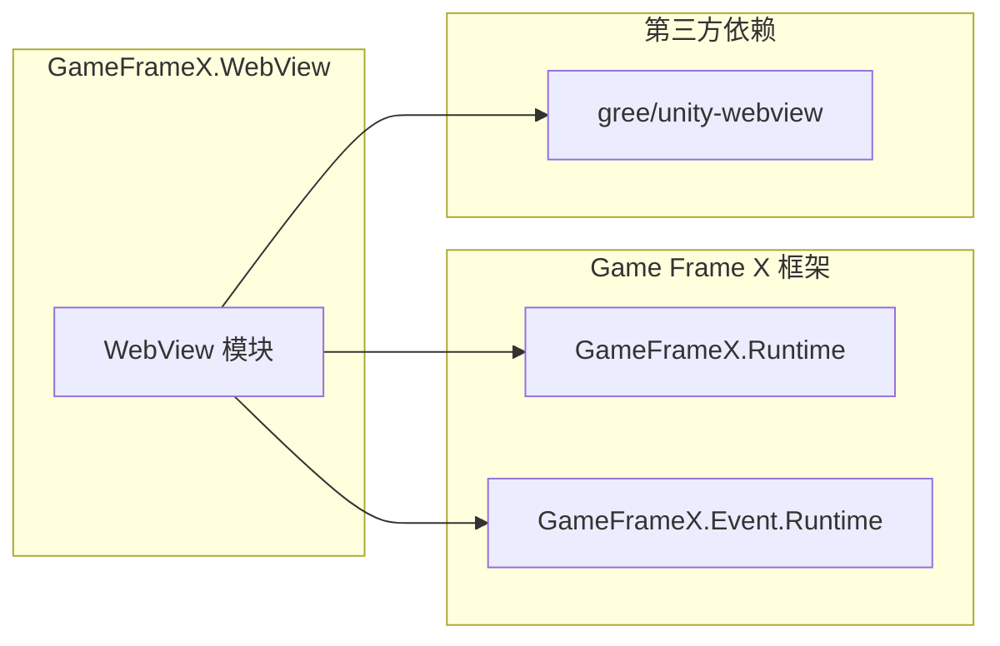

# 概要

`Game Frame X Web View` 是 Game Frame X 游戏フレームワーク的 WebView コンポーネント，为 Unity 游戏提供嵌入式网页显示機能。该コンポーネント基于 [gree/unity-webview](https://github.com/gree/unity-webview) 进行カプセル化，提供します更シンプル的 API 和更便捷的集成方法。

## プロジェクト紹介

GameFrameX WebView 是 Game Frame X 游戏フレームワーク生态的一部分，专门用于解决 Unity 游戏内嵌入网页内容的需求。通过该コンポーネント，開発者〜できます：

- 在 Unity 游戏中显示外部网页内容
- 実装 C# 与 JavaScript 的双向通信
- サポート Android 和 iOS 主流モバイルプラットフォーム
- 与 Game Frame X フレームワーク其他モジュール无缝集成

## コア機能

| 機能 | 説明 |
|------|------|
| 网页显示 | 在 Unity シーン中嵌入并显示 Web 页面 |
| JavaScript 交互 | サポート C# 与网页 JavaScript コード双向呼び出し |
| 全屏显示 | 提供全屏モードサポート |
| プラットフォーム适配 | 自动适配 Android 和 iOS プラットフォーム |
| イベント系统 | 提供 WebView 閉じる和メッセージ受信イベント |

## システムアーキテクチャ

### アーキテクチャ説明

1. **WebViewComponent**: Unity コンポーネント層，提供面向ユーザー的 API。開発者通过挂载此コンポーネント到 GameObject 上来使用 WebView 機能。

2. **IWebViewManager**: インターフェース層，定義了 WebView マネージャー的標準操作，含みます初期化、显示、隐藏、全屏和 JavaScript 执行等メソッド。

3. **BaseWebViewManager**: 抽象基底クラス，継承自 GameFrameworkModule，提供プラットフォーム相关的具体実装模板。プラットフォーム実装类（如 AndroidWebViewManager、iOSWebViewManager）継承此类。

4. **GameFrameworkModule**: Game Frame X フレームワーク的モジュール基底クラス，提供モジュールライフサイクル管理和フレームワーク集成能力。

5. **イベント系统**: 通过 GameFrameX 的イベント系统分发 WebView 相关イベント，含みます閉じるイベント和メッセージ受信イベント。

## モジュール設計

## プラットフォームサポート

| プラットフォーム | サポートステータス | 説明 |
|------|----------|------|
| Android | ✅ サポート | 通过 unity-webview Android プラグイン実装 |
| iOS | ✅ サポート | 通过 unity-webview iOS プラグイン実装 |
| Windows | ⚠️ 基本サポート | 仅エディタ環境サポート |
| macOS | ⚠️ 基本サポート | 仅エディタ環境サポート |
| WebGL | ❌ 不サポート | WebGL プラットフォーム无法嵌套 WebView |

## 依赖关系

根据 `package.json` 的設定，本モジュール依赖以下コンポーネント：

- **GameFrameX.Runtime** (`com.gameframex.unity: 1.0.0`): フレームワークコアランタイム
- **GameFrameX.Event.Runtime**: フレームワークイベント系统
- **gree/unity-webview**: 底层 WebView 実装（需单独インストール）

## 使用シーン

GameFrameX WebView 適しています以下シーン：

1. **游戏内公告**: 使用 WebView 显示游戏公告、活动页面
2. **登录検証**: 集成第3方登录或 SDK 的 Web 页面
3. **商店表示**: 在游戏内表示虚拟商品商店
4. **帮助ドキュメント**: 显示游戏帮助或教程网页
5. **社区機能**: 集成论坛或社区页面
6. **広告表示**: 显示 Web 形式的広告内容

## 関連リンク

- [インストールガイド](./2-installation) - 詳細インストールステップ
- [快速入门](./3-getting-started) - 快速上手教程
- [API リファレンス](./4-api-reference) - 完全な API ドキュメント
- [プラットフォーム設定](./5-platforms) - Android 和 iOS プラットフォーム設定
- [イベント系统](./6-events) - イベント系统详解
- [常见問題](./7-troubleshooting) - 常见問題解答
- [Game Frame X 官网](https://gameframex.doc.alianblank.com)
- [gree/unity-webview](https://github.com/gree/unity-webview)
