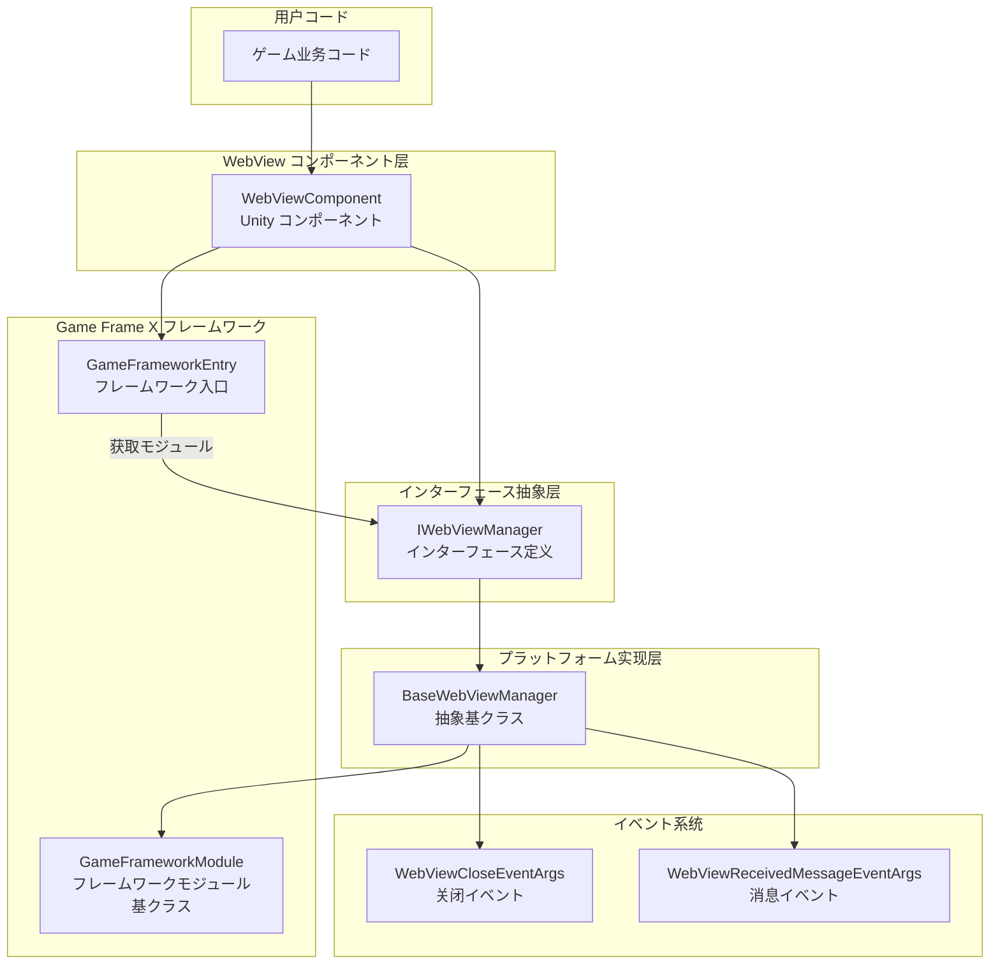
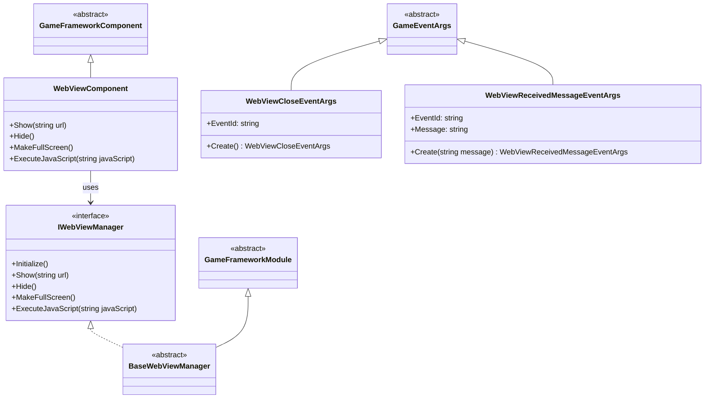
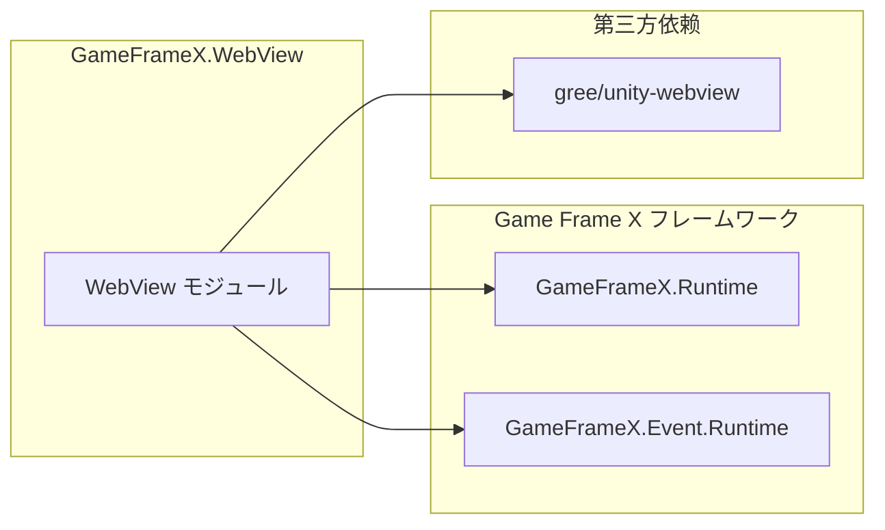

# 

`Game Frame X Web View` は Game Frame X ゲームフレームワークの WebView コンポーネント， Unity ゲーム。コンポーネントにづく [gree/unity-webview](https://github.com/gree/unity-webview) ，たの API との。

## プロジェクト

GameFrameX WebView は Game Frame X ゲームフレームワークの，に Unity ゲームの。をじてコンポーネント，：

- に Unity ゲーム
-  C# と JavaScript の
- サポート Android と iOS プラットフォーム
- と Game Frame X フレームワークモジュール

## コア

|  |  |
|------|------|
|  | に Unity  Web  |
| JavaScript  | サポート C# と JavaScript コードびし |
|  | サポート |
| プラットフォーム |  Android と iOS プラットフォーム |
| イベント |  WebView とイベント |

## アーキテクチャ

### アーキテクチャ

1. **WebViewComponent**: Unity コンポーネント，の API。をじてコンポーネント GameObject  WebView 。

2. **IWebViewManager**: インターフェース，た WebView マネージャーの，、、、と JavaScript メソッド。

3. **BaseWebViewManager**: クラス， GameFrameworkModule，プラットフォームの。プラットフォームクラス（ AndroidWebViewManager、iOSWebViewManager）クラス。

4. **GameFrameworkModule**: Game Frame X フレームワークのモジュールクラス，モジュールとフレームワーク。

5. **イベント**: をじて GameFrameX のイベント WebView イベント，イベントとイベント。

## モジュール

## プラットフォームサポート

| プラットフォーム | サポート |  |
|------|----------|------|
| Android | ✅ サポート | をじて unity-webview Android  |
| iOS | ✅ サポート | をじて unity-webview iOS  |
| Windows | ⚠️ サポート | エディターサポート |
| macOS | ⚠️ サポート | エディターサポート |
| WebGL | ❌ サポート | WebGL プラットフォーム WebView |

## 

 `package.json` の，モジュールコンポーネント：

- **GameFrameX.Runtime** (`com.gameframex.unity: 1.0.0`): フレームワークコア
- **GameFrameX.Event.Runtime**: フレームワークイベント
- **gree/unity-webview**:  WebView （インストール）

## シーン

GameFrameX WebView に：

1. **ゲーム**:  WebView ゲーム、
2. ****:  SDK の Web 
3. ****: にゲーム
4. **ドキュメント**: ゲーム
5. ****: 
6. ****:  Web の

## リンク

- [インストールガイド](./2-installation) - インストールステップ
- [クイックスタート](./3-getting-started) - 
- [API リファレンス](./4-api-reference) -  API ドキュメント
- [プラットフォーム](./5-platforms) - Android と iOS プラットフォーム
- [イベント](./6-events) - イベント
- [よくある](./7-troubleshooting) - よくある
- [Game Frame X サイト](https://gameframex.doc.alianblank.com)
- [gree/unity-webview](https://github.com/gree/unity-webview)
