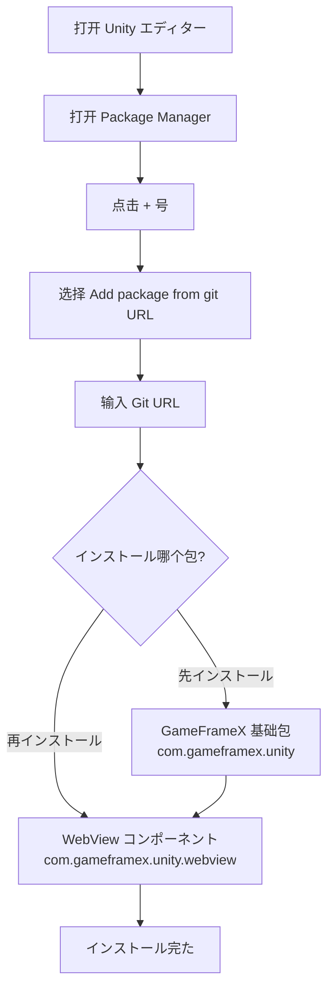

# インストール

GameFrameX WebView コンポーネントのインストールガイド。インストールと WebView 。

## 

GameFrameX WebView は GameFrameX ゲームフレームワークの Web コンポーネント，にづく [gree/unity-webview](https://github.com/gree/unity-webview) ，の API との。コンポーネントに Unity ゲームと Web ，サポートに Android と iOS プラットフォーム。

## 

にインストール WebView コンポーネント，の：

|  | バージョン |  |
|--------|----------|------|
| Unity エディター | 2019.4 | LTS バージョン |
| .NET Framework | 4.6.1 | Unity  |
| GameFrameX  | 1.0.0 | インストール |

## インストールステップ

### ステップ 1：インストール GameFrameX 

にインストール WebView コンポーネント，インストール GameFrameX フレームワーク。は GameFrameX コンポーネントの。

1. に Unity エディター `Package Manager`（：`Window` → `Package Manager`）
2. の `+` ， `Add package from git URL...`
3.  GameFrameX ：

```
https://github.com/GameFrameX/com.gameframex.unity.git
```

4.  `Add` インストールた

### ステップ 2：インストール WebView コンポーネント

GameFrameX インストールた，ステップインストール WebView コンポーネント：

1. に Unity エディター `Package Manager`（：`Window` → `Package Manager`）
2.  `Package` のは `My Packages`  `In Project`
3. の `+` ， `Add package from git URL...`
4.  WebView コンポーネントの Git ：

```
https://github.com/GameFrameX/com.gameframex.unity.webview.git
```

5.  `Add` インストールた



### ステップ 3：インストール

インストールた，ステップ WebView コンポーネントはインストール：

1. に Unity エディター， `GameObject` → `Create Empty` ゲームオブジェクト
2. ゲームオブジェクト，に Inspector  `Add Component` 
3. にコンポーネント `WebView`
4.  `WebView Component` に

```csharp
// 検証方式二：を通じてコード检查
using GameFrameX.WebView.Runtime;
using UnityEngine;

public class WebViewCheck : MonoBehaviour
{
    void Start()
    {
        // 尝试获取 WebView コンポーネント
        var webView = FindObjectOfType<WebViewComponent>();
        if (webView != null)
        {
            Debug.Log("WebView コンポーネントインストール成功！");
        }
    }
}
```

## 

インストールた，WebView コンポーネントにの Unity プロジェクトファイル：

| ディレクトリ/ファイル |  |
|-----------|------|
| `Editor/` | エディターコード，コンポーネント |
| `Runtime/` | コアコード |
| `Runtime/WebViewComponent.cs` | WebView コアコンポーネント |
| `Runtime/IWebViewManager.cs` | WebView マネージャーインターフェース |
| `Runtime/BaseWebViewManager.cs` | WebView マネージャークラス |
| `Runtime/EventArgs/` | イベント |

## プラットフォーム

インストールた，プラットフォーム：

### Android プラットフォーム

WebView コンポーネント Android プラットフォームのサポートの unity-webview 。，，リファレンス [プラットフォーム](./5-platforms) ドキュメント。

### iOS プラットフォーム

iOS プラットフォーム unity-webview 。，リファレンス [プラットフォーム](./5-platforms) ドキュメントの iOS 。

## インストール

###  1： Git URL インストール

**：** Unity バージョンネットワーク

**：**
-  Unity バージョン 2019.4 
- ネットワーク
-  CNPM 

###  2：

**：** GameFrameX インストール

**：**
- インストール `com.gameframex.unity` 
- バージョン 1.0.0 

###  3：コンパイルエラー

**：** 

**：**
-  Unity プロジェクト
- に Package Manager はインストール
-  Console のエラー

## アンロード WebView コンポーネント

アンロード WebView コンポーネント：

1. に Unity エディター `Package Manager`
2. に `Game Frame X Web View`
3. ，に `Remove` 

> **：** アンロードプロジェクト WebView のコード。

## リンク

- [クイックスタート](./3-getting-started) -  WebView コンポーネント
- [API リファレンス](./4-api-reference) - の API ドキュメント
- [イベント](./6-events) - WebView イベント
- [よくある](./7-troubleshooting) - よくあると
- [GameFrameX サイト](https://gameframex.doc.alianblank.com) - フレームワークドキュメント
- [unity-webview リポジトリ](https://github.com/gree/unity-webview) - 
