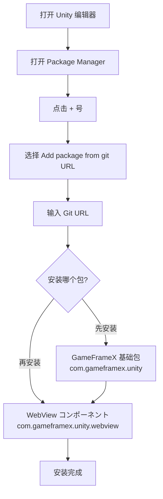

# 安装

GameFrameX WebView コンポーネント的安装指南。本节将详细介绍如何正确安装和配置 WebView 插件。

## 概要

GameFrameX WebView 是 GameFrameX ゲームフレームワーク的 Web 视图コンポーネント，基づく [gree/unity-webview](https://github.com/gree/unity-webview) 进行封装，提供更简洁的 API 和更便捷的集成方法。该コンポーネント允许在 Unity ゲーム中嵌入和显示 Web 内容，サポート在 Android 和 iOS 平台上运行。

## 环境要求

在安装 WebView コンポーネント之前，開発環境が以下の要件を満たしていることを確認してください：

| 要求项 | 最小バージョン | 説明 |
|--------|----------|------|
| Unity 编辑器 | 2019.4 | LTS 版本推荐 |
| .NET Framework | 4.6.1 | Unity 脚本运行时 |
| GameFrameX 基础包 | 1.0.0 | 必須先安装 |

## 安装手順

### 手順 1：安装 GameFrameX 基础包

在安装 WebView コンポーネント之前，必須先安装 GameFrameX 基础フレームワーク包。这是所有 GameFrameX コンポーネント的依赖基础。

1. 在 Unity 编辑器中打开 `Package Manager`（菜单：`Window` → `Package Manager`）
2. 点击左上角的 `+` 号，选择 `Add package from git URL...`
3. 输入 GameFrameX 基础包地址：

```
https://github.com/GameFrameX/com.gameframex.unity.git
```

4. 点击 `Add` 等待安装完成

### 手順 2：安装 WebView コンポーネント

GameFrameX 基础包インストール完了後，按照以下手順安装 WebView コンポーネント：

1. 在 Unity 编辑器中打开 `Package Manager`（菜单：`Window` → `Package Manager`）
2. 确保 `Package` 下拉菜单选择的是 `My Packages` 或 `In Project`
3. 点击左上角的 `+` 号，选择 `Add package from git URL...`
4. 输入 WebView コンポーネント的 Git 地址：

```
https://github.com/GameFrameX/com.gameframex.unity.webview.git
```

5. 点击 `Add` 等待安装完成



### 手順 3：验证安装

インストール完了後，お願いします按照以下手順验证 WebView コンポーネント是否正确安装：

1. 在 Unity 编辑器中，点击菜单 `GameObject` → `Create Empty` 作成一个空ゲーム对象
2. 点击该空ゲーム对象，在 Inspector 面板中点击 `Add Component` 按钮
3. 在コンポーネント搜索框中输入 `WebView`
4. 确认 `WebView Component` 出现在搜索结果中

```csharp
// 验证方法二：を通じて代码检查
using GameFrameX.WebView.Runtime;
using UnityEngine;

public class WebViewCheck : MonoBehaviour
{
    void Start()
    {
        // 尝试取得 WebView コンポーネント
        var webView = FindObjectOfType<WebViewComponent>();
        if (webView != null)
        {
            Debug.Log("WebView コンポーネントインストール成功！");
        }
    }
}
```

## 包结构説明

インストール完了後，WebView コンポーネント会在您的 Unity プロジェクト中作成以下ファイル结构：

| ディレクトリ/ファイル | 説明 |
|-----------|------|
| `Editor/` | 编辑器関連代码，包括コンポーネント检查器 |
| `Runtime/` | ランタイムコアコード |
| `Runtime/WebViewComponent.cs` | WebView コアコンポーネント |
| `Runtime/IWebViewManager.cs` | WebView 管理器インターフェース |
| `Runtime/BaseWebViewManager.cs` | WebView 管理器基クラス |
| `Runtime/EventArgs/` | イベント参数定义 |

## 平台配置

インストール完了後，に基づいて目标平台可能必要进行额外配置：

### Android 平台

WebView コンポーネント对 Android 平台的サポート依赖于底层的 unity-webview 插件。通常情况下无需额外配置，但如果遇到问题，お願いします参考 [平台配置](./5-platforms) 文档。

### iOS 平台

iOS 平台同样依赖于 unity-webview 插件。如需配置，お願いします参考 [平台配置](./5-platforms) 文档中的 iOS 部分。

## 常见安装问题

### 问题 1：无法从 Git URL 安装

**原因：** Unity 版本过低或网络问题

**解決策：**
- 确保 Unity 版本为 2019.4 或更高
- 检查网络连接
- 尝试使用 CNPM 镜像源

### 问题 2：依赖包未找到

**原因：** GameFrameX 基础包未安装

**解決策：**
- 首先安装 `com.gameframex.unity` 基础包
- 确保基础包版本为 1.0.0 或更高

### 问题 3：编译错误

**原因：** 程序集定义引用缺失

**解決策：**
- 重新打开 Unity プロジェクト
- 在 Package Manager 中检查所有依赖包是否正确安装
- 查看 Console 窗口的具体错误信息

## 卸载 WebView コンポーネント

如需卸载 WebView コンポーネント：

1. 在 Unity 编辑器中打开 `Package Manager`
2. 在包列表中找到 `Game Frame X Web View`
3. 点击该包，在右侧面板点击 `Remove` 按钮

> **注意：** 卸载前必ずプロジェクト中没有使用 WebView 機能的代码。

## 関連リンク

- [快速入门](./3-getting-started) - 学习如何使用 WebView コンポーネント
- [API 参考](./4-api-reference) - 完整的 API 文档
- [イベント系统](./6-events) - WebView イベント详解
- [常见问题](./7-troubleshooting) - 常见问题与解決策
- [GameFrameX 官网](https://gameframex.doc.alianblank.com) - フレームワーク文档
- [unity-webview 仓库](https://github.com/gree/unity-webview) - 底层插件
