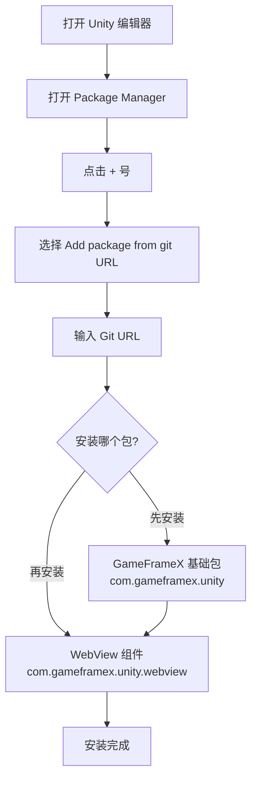

# インストール

GameFrameX WebView コンポーネント的インストールガイド。本节将詳細介绍如何正确インストール和設定 WebView プラグイン。

## 概要

GameFrameX WebView 是 GameFrameX 游戏フレームワーク的 Web 视图コンポーネント，基于 [gree/unity-webview](https://github.com/gree/unity-webview) 进行カプセル化，提供更シンプル的 API 和更便捷的集成方法。该コンポーネント允许在 Unity 游戏中嵌入和显示 Web 内容，サポート在 Android 和 iOS プラットフォーム上运行。

## 環境要件

在インストール WebView コンポーネント之前，请確認してください您的开发環境满足以下要求：

| 要求项 | 最低バージョン | 説明 |
|--------|----------|------|
| Unity エディタ | 2019.4 | LTS バージョン推奨 |
| .NET Framework | 4.6.1 | Unity 脚本ランタイム |
| GameFrameX 基本パッケージ | 1.0.0 | 〜しなければなりません先インストール |

## インストール手順

### ステップ 1：インストール GameFrameX 基本パッケージ

在インストール WebView コンポーネント之前，〜しなければなりません先インストール GameFrameX 基本フレームワークパッケージ。这是所有 GameFrameX コンポーネント的依赖基本。

1. 在 Unity エディタ中打开 `Package Manager`（メニュー：`Window` → `Package Manager`）
2. 点击左上角的 `+` 号，选择 `Add package from git URL...`
3. 输入 GameFrameX 基本パッケージ地址：

```
https://github.com/GameFrameX/com.gameframex.unity.git
```

4. 点击 `Add` 等待インストール完成

### ステップ 2：インストール WebView コンポーネント

GameFrameX 基本パッケージインストール完成后，按照以下ステップインストール WebView コンポーネント：

1. 在 Unity エディタ中打开 `Package Manager`（メニュー：`Window` → `Package Manager`）
2. 確認してください `Package` 下拉メニュー选择的是 `My Packages` 或 `In Project`
3. 点击左上角的 `+` 号，选择 `Add package from git URL...`
4. 输入 WebView コンポーネント的 Git 地址：

```
https://github.com/GameFrameX/com.gameframex.unity.webview.git
```

5. 点击 `Add` 等待インストール完成



### ステップ 3：検証インストール

インストール完成后，请按照以下ステップ検証 WebView コンポーネント是否正确インストール：

1. 在 Unity エディタ中，点击メニュー `GameObject` → `Create Empty` 作成一个空游戏对象
2. 点击该空游戏对象，在 Inspector パネル中点击 `Add Component` ボタン
3. 在コンポーネント検索框中输入 `WebView`
4. 確認 `WebView Component` 出现在検索結果中

```csharp
// 验证方式二：通过代码检查
using GameFrameX.WebView.Runtime;
using UnityEngine;

public class WebViewCheck : MonoBehaviour
{
    void Start()
    {
        // 尝试获取 WebView 组件
        var webView = FindObjectOfType<WebViewComponent>();
        if (webView != null)
        {
            Debug.Log("WebView 组件安装成功！");
        }
    }
}
```

## パッケージ構造の説明

インストール完成后，WebView コンポーネント会在您的 Unity プロジェクト中作成以下ファイル结构：

| ディレクトリ/ファイル | 説明 |
|-----------|------|
| `Editor/` | エディタ相关コード，含みますコンポーネント確認器 |
| `Runtime/` | ランタイムコアコード |
| `Runtime/WebViewComponent.cs` | WebView コアコンポーネント |
| `Runtime/IWebViewManager.cs` | WebView マネージャーインターフェース |
| `Runtime/BaseWebViewManager.cs` | WebView マネージャー基底クラス |
| `Runtime/EventArgs/` | イベントパラメータ定義 |

## プラットフォーム設定

インストール完成后，根据目标プラットフォーム〜の可能性があります〜する必要があります进行额外設定：

### Android プラットフォーム

WebView コンポーネント对 Android プラットフォーム的サポート依赖于底层的 unity-webview プラグイン。通常情况下无需额外設定，但もし遇到問題，请リファレンス [プラットフォーム設定](./5-platforms) ドキュメント。

### iOS プラットフォーム

iOS プラットフォーム同样依赖于 unity-webview プラグイン。如需設定，请リファレンス [プラットフォーム設定](./5-platforms) ドキュメント中的 iOS 部分。

## 常见インストール問題

### 問題 1：无法从 Git URL インストール

**原因：** Unity バージョン过低或网络問題

**解決策：**
- 確認してください Unity バージョン为 2019.4 或更高
- 確認网络连接
- 尝试使用 CNPM 镜像源

### 問題 2：依赖パッケージ未找到

**原因：** GameFrameX 基本パッケージ未インストール

**解決策：**
- まずインストール `com.gameframex.unity` 基本パッケージ
- 確認してください基本パッケージバージョン为 1.0.0 或更高

### 問題 3：コンパイルエラー

**原因：** アセンブリ定義参照缺失

**解決策：**
- 重新打开 Unity プロジェクト
- 在 Package Manager 中確認所有依赖パッケージ是否正确インストール
- 確認 Console ウィンドウ的具体エラー情報

## アンロード WebView コンポーネント

如需アンロード WebView コンポーネント：

1. 在 Unity エディタ中打开 `Package Manager`
2. 在パッケージ列表中找到 `Game Frame X Web View`
3. 点击该パッケージ，在右侧パネル点击 `Remove` ボタン

> **注意：** アンロード前请確認してくださいプロジェクト中没有使用 WebView 機能的コード。

## 関連リンク

- [快速入门](./3-getting-started) - 学习如何使用 WebView コンポーネント
- [API リファレンス](./4-api-reference) - 完全な的 API ドキュメント
- [イベント系统](./6-events) - WebView イベント详解
- [常见問題](./7-troubleshooting) - 常见問題与解決策
- [GameFrameX 官网](https://gameframex.doc.alianblank.com) - フレームワークドキュメント
- [unity-webview リポジトリ](https://github.com/gree/unity-webview) - 底层プラグイン
