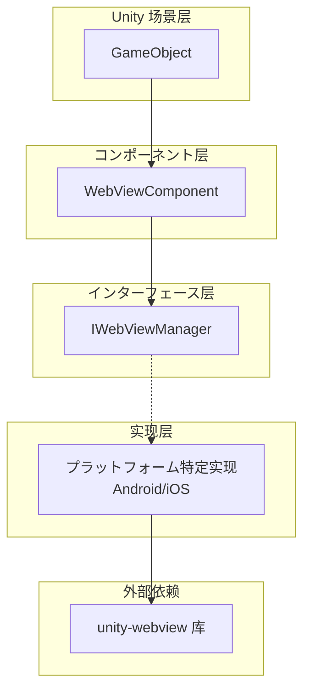
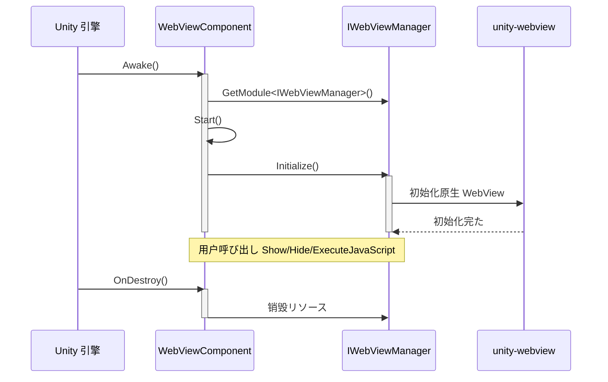

# クイックスタート

ガイド Game Frame X Web View コンポーネント，たに Unity プロジェクトと WebView 。

## 

Game Frame X Web View は [gree/unity-webview](https://github.com/gree/unity-webview) の，たの API との。をじてコンポーネント，に Unity ゲーム Web ， C# と JavaScript の。

## コアコンセプト

に，たコアコンポーネントの：



- **WebViewComponent**: Unity コンポーネント，の GameObject 
- **IWebViewManager**:  WebView のインターフェース
- **プラットフォーム**: プラットフォームの（Android/iOS）

## フロー

### ステップ 1: に WebView コンポーネント

1. に Unity エディター，の
2. の GameObject（ → Create Empty）
3.  GameObject， Inspector の "Add Component"
4.  "WebView" コンポーネント

```csharp
// コンポーネントパス: Game Framework → WebView
// Source: [WebViewComponent.cs](https://github.com/GameFrameX/com.gameframex.unity.webview/blob/main/Runtime/WebViewComponent.cs#L10-L14)
[DisallowMultipleComponent]
[AddComponentMenu("Game Framework/WebView")]
[UnityEngine.Scripting.Preserve]
public partial class WebViewComponent : GameFrameworkComponent
{
```

### ステップ 2: コンポーネント（オプション）

に Inspector ，オプション：

|  | タイプ |  |
|--------|------|------|
| Implementation Component Type | string | プラットフォームの IWebViewManager タイプ |

> ****: デフォルト，フレームワークプラットフォームの，。

### ステップ 3: にコード WebView

はにコード WebViewComponent の：

```csharp
using GameFrameX.WebView.Runtime;
using UnityEngine;

public class Example : MonoBehaviour
{
    private WebViewComponent _webView;

    void Start()
    {
        // 获取 WebViewComponent 实例
        _webView = FindObjectOfType<WebViewComponent>();
        
        if (_webView != null)
        {
            // 显示 WebView 并ロード指定 URL
            _webView.Show("https://gameframex.doc.alianblank.com");
        }
    }
}
```
> Source: [README.md](https://github.com/GameFrameX/com.gameframex.unity.webview/blob/main/README.md#L31-L43)

## 

###  Web 

```csharp
// 显示 WebView 并ロード URL
webView.Show("https://example.com");
```

###  WebView

```csharp
// 隐藏 WebView（不销毁，只は不可见）
webView.Hide();
```

### 

```csharp
// 将 WebView 設定为全屏模式
webView.MakeFullScreen();
```

###  JavaScript

```csharp
// に当前ロードの Web 页面上実行 JavaScript コード
webView.ExecuteJavaScript("document.title = 'Hello from Unity!'");
```

```csharp
// 从 JavaScript 呼び出し C# 后再実行其他 JavaScript
webView.ExecuteJavaScript("Unity.call('messageFromJS');");
```

## シーン

###  1: 

にゲーム（ Google 、Apple ），WebView はの：

```csharp
public class LoginManager : MonoBehaviour
{
    private WebViewComponent _webView;

    void Start()
    {
        _webView = FindObjectOfType<WebViewComponent>();
    }

    public void ShowLogin(string provider)
    {
        // 显示登录页面
        string loginUrl = $"https://example.com/login?provider={provider}";
        _webView.Show(loginUrl);
    }

    public void OnLoginSuccess(string token)
    {
        // 处理登录成功
        Debug.Log($"Login successful, token: {token}");
        
        // 隐藏 WebView
        _webView.Hide();
        
        // ロード用户データ等后续操作...
    }

    public void OnLoginFailed(string error)
    {
        Debug.LogError($"Login failed: {error}");
        _webView.Hide();
    }
}
```

###  2: とプロトコル

ゲーム， WebView  HTML ：

```csharp
public class PrivacyPolicyController : MonoBehaviour
{
    private WebViewComponent _webView;

    void Awake()
    {
        _webView = FindObjectOfType<WebViewComponent>();
    }

    public void ShowPrivacyPolicy()
    {
        // ロードローカル HTML ファイル
        _webView.Show(Application.dataPath + "/PrivacyPolicy.html");
    }

    public void ShowTermsOfService()
    {
        // ロードに线服务条款
        _webView.Show("https://example.com/terms");
    }
}
```

###  3: ゲーム

ゲーム，：

```csharp
public class InGameBrowser : MonoBehaviour
{
    [SerializeField] private WebViewComponent _webView;
    [SerializeField] private string _defaultUrl = "https://gameframex.doc.alianblank.com";

    void Start()
    {
        // 打开ゲーム公式サイト
        _webView.Show(_defaultUrl);
    }

    public void NavigateTo(string url)
    {
        _webView.Show(url);
    }

    public void Refresh()
    {
        // 刷新当前页面
        _webView.ExecuteJavaScript("location.reload();");
    }

    public void CloseBrowser()
    {
        _webView.Hide();
    }

    public void ToggleFullScreen()
    {
        _webView.MakeFullScreen();
    }
}
```

###  4: C# と JavaScript 

```csharp
public class JSBridgeExample : MonoBehaviour
{
    private WebViewComponent _webView;

    void Start()
    {
        _webView = FindObjectOfType<WebViewComponent>();
        
        // 注册 JavaScript 消息回调
        // 注意: 具体回调方式取决于底层 unity-webview 实现
    }

    // 呼び出し JavaScript 获取データ
    public void GetUserData()
    {
        string jsCode = @"
            var userData = {
                name: 'Player1',
                level: 10,
                gold: 1000
            };
            JSON.stringify(userData);
        ";
        _webView.ExecuteJavaScript(jsCode);
    }

    // 向 JavaScript 发送消息
    public void SendMessageToJS(string message)
    {
        _webView.ExecuteJavaScript($"console.log('Unity says: {message}');");
    }
}
```

## 



**：**

1. **Awake()**:  IWebViewManager 
2. **Start()**: びし Initialize()  WebView
3. ****: びし Show/Hide/MakeFullScreen/ExecuteJavaScript
4. **OnDestroy()**: リソース

## プラットフォーム

- **Android**:  AndroidManifest.xml 
- **iOS**:  iOS プラットフォーム

> プラットフォーム [プラットフォーム](./5-platforms) ドキュメント。

## よくある

1. **WebView ？**
   - はた WebViewComponent
   - プラットフォームは

2. **ロード URL？**
   - ネットワークは
   -  URL は

3. **JavaScript ？**
   -  WebView 
   -  JavaScript は

## リンク

- [](./1-overview) - た WebView コンポーネントの
- [インストール](./2-installation) - のインストールガイド
- [API リファレンス](./4-api-reference) - の API ドキュメント
- [プラットフォーム](./5-platforms) - Android と iOS プラットフォーム
- [イベント](./6-events) - たイベント
- [よくある](./7-troubleshooting) - よくあると
