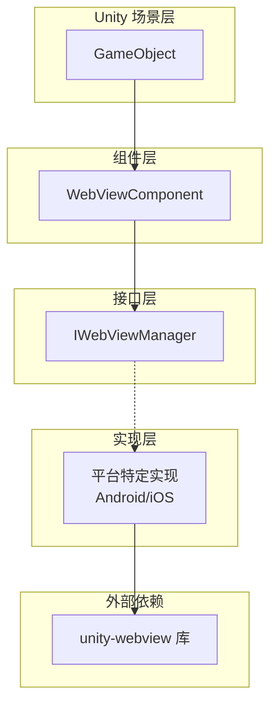
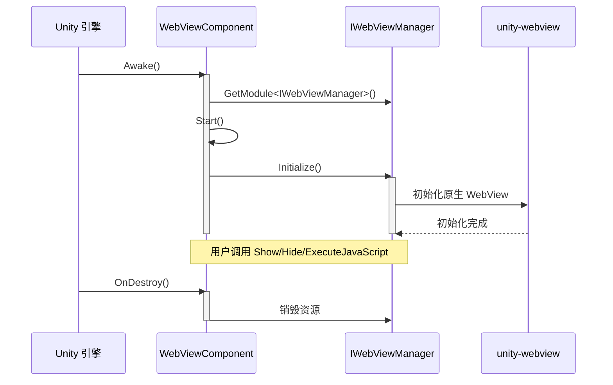

# クイックスタート

本ガイド将帮助您快速上手 Game Frame X Web View コンポーネント，理解する如何在 Unity プロジェクト中集成和使用 WebView 機能。

## 概要

Game Frame X Web View 是对 [gree/unity-webview](https://github.com/gree/unity-webview) 的カプセル化，提供します更シンプル的 API 和更方便的集成方法。通过本コンポーネント，您〜できます在 Unity 游戏中轻松嵌入 Web 页面，并実装 C# 与 JavaScript 的双向通信。

## コアコンセプト

在开始之前，理解する以下コアコンポーネント的角色非常重要な：



- **WebViewComponent**: Unity コンポーネント，〜する必要があります挂载到シーン中的 GameObject 上
- **IWebViewManager**: 定義 WebView 操作的統一されたインターフェース
- **プラットフォーム実装**: 根据运行プラットフォーム自动选择合适的実装（Android/iOS）

## 基本使用フロー

### ステップ 1: 在シーン中追加 WebView コンポーネント

1. 在 Unity エディタ中，打开您的シーン
2. 作成一个新的空 GameObject（右键 → Create Empty）
3. 选中该 GameObject，点击 Inspector パネル的 "Add Component"
4. 検索并追加 "WebView" コンポーネント

```csharp
// 组件路径: Game Framework → WebView
// Source: [WebViewComponent.cs](https://github.com/GameFrameX/com.gameframex.unity.webview/blob/main/Runtime/WebViewComponent.cs#L10-L14)
[DisallowMultipleComponent]
[AddComponentMenu("Game Framework/WebView")]
[UnityEngine.Scripting.Preserve]
public partial class WebViewComponent : GameFrameworkComponent
{
```

### ステップ 2: 設定コンポーネント（可选）

在 Inspector パネル中，您〜できます設定以下オプション：

| 設定项 | タイプ | 説明 |
|--------|------|------|
| Implementation Component Type | string | プラットフォーム特定的 IWebViewManager 実装タイプ |

> **注意**: デフォルト情况下，フレームワーク会自动根据运行プラットフォーム选择合适的実装，无需手动設定。

### ステップ 3: 在コード中取得并使用 WebView

以下是在コード中使用 WebViewComponent 的基本方法：

```csharp
using GameFrameX.WebView.Runtime;
using UnityEngine;

public class Example : MonoBehaviour
{
    private WebViewComponent _webView;

    void Start()
    {
        // 获取 WebViewComponent 实例
        _webView = FindObjectOfType<WebViewComponent>();
        
        if (_webView != null)
        {
            // 显示 WebView 并加载指定 URL
            _webView.Show("https://gameframex.doc.alianblank.com");
        }
    }
}
```
> Source: [README.md](https://github.com/GameFrameX/com.gameframex.unity.webview/blob/main/README.md#L31-L43)

## 常用操作例

### 显示 Web 页面

```csharp
// 显示 WebView 并加载 URL
webView.Show("https://example.com");
```

### 隐藏 WebView

```csharp
// 隐藏 WebView（不销毁，只是不可见）
webView.Hide();
```

### 全屏显示

```csharp
// 将 WebView 设置为全屏模式
webView.MakeFullScreen();
```

### 执行 JavaScript

```csharp
// 在当前加载的 Web 页面上执行 JavaScript 代码
webView.ExecuteJavaScript("document.title = 'Hello from Unity!'");
```

```csharp
// 从 JavaScript 调用 C# 后再执行其他 JavaScript
webView.ExecuteJavaScript("Unity.call('messageFromJS');");
```

## 高级使用シーン

### シーン 1: ユーザー登录界面

在游戏中集成第3方登录（如 Google 登录、Apple 登录）时，WebView 是常用的解決策：

```csharp
public class LoginManager : MonoBehaviour
{
    private WebViewComponent _webView;

    void Start()
    {
        _webView = FindObjectOfType<WebViewComponent>();
    }

    public void ShowLogin(string provider)
    {
        // 显示登录页面
        string loginUrl = $"https://example.com/login?provider={provider}";
        _webView.Show(loginUrl);
    }

    public void OnLoginSuccess(string token)
    {
        // 处理登录成功
        Debug.Log($"Login successful, token: {token}");
        
        // 隐藏 WebView
        _webView.Hide();
        
        // 加载用户数据等后续操作...
    }

    public void OnLoginFailed(string error)
    {
        Debug.LogError($"Login failed: {error}");
        _webView.Hide();
    }
}
```

### シーン 2: 隐私政策与ユーザー协议

游戏上线前〜する必要があります表示隐私政策，使用 WebView 〜できます方便地表示 HTML 内容：

```csharp
public class PrivacyPolicyController : MonoBehaviour
{
    private WebViewComponent _webView;

    void Awake()
    {
        _webView = FindObjectOfType<WebViewComponent>();
    }

    public void ShowPrivacyPolicy()
    {
        // 加载本地 HTML 文件
        _webView.Show(Application.dataPath + "/PrivacyPolicy.html");
    }

    public void ShowTermsOfService()
    {
        // 加载在线服务条款
        _webView.Show("https://example.com/terms");
    }
}
```

### シーン 3: 游戏内浏览器

有些游戏提供内置浏览器機能，让プレイヤー確認攻略或社区：

```csharp
public class InGameBrowser : MonoBehaviour
{
    [SerializeField] private WebViewComponent _webView;
    [SerializeField] private string _defaultUrl = "https://gameframex.doc.alianblank.com";

    void Start()
    {
        // 打开游戏官网
        _webView.Show(_defaultUrl);
    }

    public void NavigateTo(string url)
    {
        _webView.Show(url);
    }

    public void Refresh()
    {
        // 刷新当前页面
        _webView.ExecuteJavaScript("location.reload();");
    }

    public void CloseBrowser()
    {
        _webView.Hide();
    }

    public void ToggleFullScreen()
    {
        _webView.MakeFullScreen();
    }
}
```

### シーン 4: C# 与 JavaScript 双向通信

```csharp
public class JSBridgeExample : MonoBehaviour
{
    private WebViewComponent _webView;

    void Start()
    {
        _webView = FindObjectOfType<WebViewComponent>();
        
        // 注册 JavaScript 消息回调
        // 注意: 具体回调方式取决于底层 unity-webview 实现
    }

    // 调用 JavaScript 获取数据
    public void GetUserData()
    {
        string jsCode = @"
            var userData = {
                name: 'Player1',
                level: 10,
                gold: 1000
            };
            JSON.stringify(userData);
        ";
        _webView.ExecuteJavaScript(jsCode);
    }

    // 向 JavaScript 发送消息
    public void SendMessageToJS(string message)
    {
        _webView.ExecuteJavaScript($"console.log('Unity says: {message}');");
    }
}
```

## ライフサイクル管理



**ライフサイクル説明：**

1. **Awake()**: 取得 IWebViewManager インスタンス
2. **Start()**: 呼び出し Initialize() 初期化 WebView
3. **ユーザー操作**: 呼び出し Show/Hide/MakeFullScreen/ExecuteJavaScript
4. **OnDestroy()**: 破棄时自动解放リソース

## プラットフォーム注意事项

- **Android**: 〜する必要があります設定 AndroidManifest.xml 权限
- **iOS**: 〜する必要があります設定 iOS プラットフォーム設定

> 具体プラットフォーム設定请参照 [プラットフォーム設定](./5-platforms) ドキュメント。

## よくある問題

1. **WebView 不显示？**
   - 確認是否正确追加了 WebViewComponent
   - 確認プラットフォーム実装是否正确設定

2. **无法ロード URL？**
   - 確認网络权限是否設定
   - 確認 URL 是否有效

3. **JavaScript 执行无效？**
   - 確認 WebView 已正确初期化
   - 確認 JavaScript 语法是否正确

## 関連リンク

- [概要](./1-overview) - 理解する更多关于 WebView コンポーネント的整体設計
- [インストール](./2-installation) - 詳細的インストールガイド
- [API リファレンス](./4-api-reference) - 完全な的 API ドキュメント
- [プラットフォーム設定](./5-platforms) - Android 和 iOS プラットフォーム特定設定
- [イベント系统](./6-events) - 理解するイベント机制
- [常见問題](./7-troubleshooting) - 常见問題与解決策
