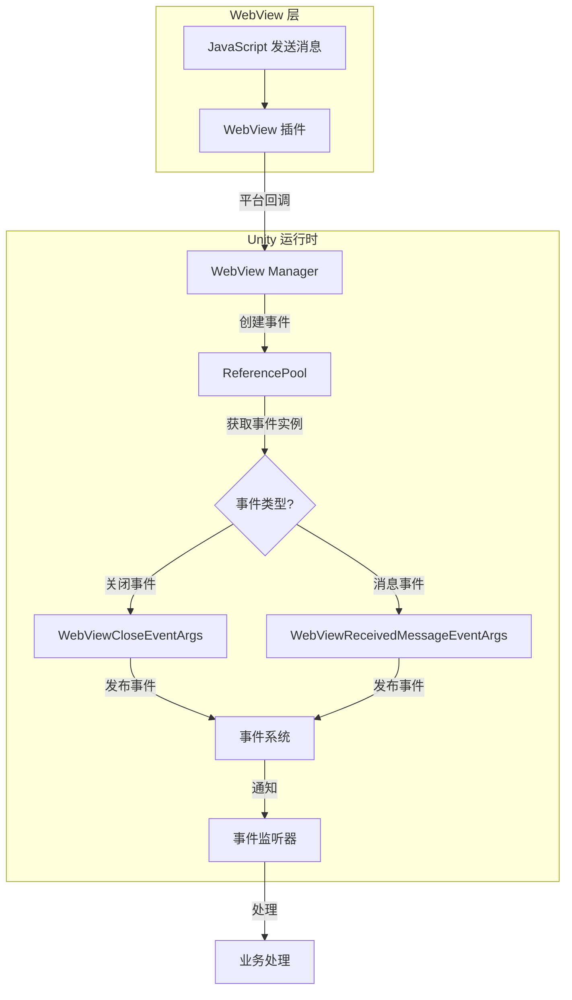

# イベント系统

このドキュメント介绍 GameFrameX WebView コンポーネント的イベント系统，解释イベントタイプ、数据结构および如何在プロジェクト中使用这些イベント。

## 概要

GameFrameX WebView コンポーネント采用イベント驱动アーキテクチャ，通过イベント系统実装 WebView 与 Unity 应用程序之间的通信。该イベント系统基于 GameFrameX コアフレームワーク的 `GameEventArgs` 类ビルド，サポート对象池化以最適化性能。

イベント系统主な提供两类イベント：
- **WebView 閉じるイベント** - 当 WebView 閉じる时トリガー
- **WebView メッセージ受信イベント** - 当从 WebView 收到メッセージ时トリガー

## アーキテクチャ設計

```mermaid
classDiagram
    class GameEventArgs {
        <<abstract>>
        +string Id { get; }
        +void Clear()
    }

    class WebViewCloseEventArgs {
        +static string EventId
        +static WebViewCloseEventArgs Create()
    }

    class WebViewReceivedMessageEventArgs {
        +static string EventId
        +string Message { get; }
        +static WebViewReceivedMessageEventArgs Create(string message)
    }

    class ReferencePool {
        +static T Acquire~T~()
        +static void Release(T instance)
    }

    GameEventArgs <|-- WebViewCloseEventArgs
    GameEventArgs <|-- WebViewReceivedMessageEventArgs
    WebViewCloseEventArgs --> ReferencePool : uses
    WebViewReceivedMessageEventArgs --> ReferencePool : uses
```

### コンポーネント説明

| コンポーネント | 説明 |
|------|------|
| `GameEventArgs` | イベントパラメータ基底クラス，来自 GameFrameX コアランタイム |
| `WebViewCloseEventArgs` | WebView 閉じるイベントパラメータ |
| `WebViewReceivedMessageEventArgs` | WebView メッセージ受信イベントパラメータ |
| `ReferencePool` | 对象池，用于イベント对象的复用 |

## イベントタイプ详解

### WebViewCloseEventArgs

`WebViewCloseEventArgs` 表示 WebView 閉じるイベント，当 WebView ウィンドウ閉じる时トリガー。

```csharp
// Source: Runtime/EventArgs/WebViewCloseEventArgs.cs#L15-L41
public sealed class WebViewCloseEventArgs : GameEventArgs
{
    /// <summary>
    /// WebView消息关闭事件ID
    /// </summary>
    public static readonly string EventId = typeof(WebViewCloseEventArgs).FullName;

    public override void Clear()
    {
    }

    public override string Id
    {
        get { return EventId; }
    }

    /// <summary>
    /// 创建WebView消息关闭事件
    /// </summary>
    /// <returns></returns>
    public static WebViewCloseEventArgs Create()
    {
        var eventArgs = ReferencePool.Acquire<WebViewCloseEventArgs>();
        return eventArgs;
    }
}
```

**特点：**
- 无额外数据载荷
- 使用对象池管理インスタンス，避免频繁 GC

### WebViewReceivedMessageEventArgs

`WebViewReceivedMessageEventArgs` 表示从 WebView 收到的メッセージイベント，当 JavaScript 与 Unity 通信时トリガー。

```csharp
// Source: Runtime/EventArgs/WebViewReceivedMessageEventArgs.cs#L9-L42
public sealed class WebViewReceivedMessageEventArgs : GameEventArgs
{
    /// <summary>
    /// WebView消息接收事件ID
    /// </summary>
    public static readonly string EventId = typeof(WebViewReceivedMessageEventArgs).FullName;

    public override void Clear()
    {
    }

    public override string Id
    {
        get { return EventId; }
    }

    /// <summary>
    /// 创建WebView消息接收事件
    /// </summary>
    /// <param name="message">消息内容</param>
    /// <returns></returns>
    public static WebViewReceivedMessageEventArgs Create(string message)
    {
        var eventArgs = ReferencePool.Acquire<WebViewReceivedMessageEventArgs>();
        eventArgs.Message = message;
        return eventArgs;
    }

    /// <summary>
    /// 事件消息
    /// </summary>
    public string Message { get; private set; }
}
```

**プロパティ説明：**
| プロパティ | タイプ | 説明 |
|------|------|------|
| Message | string | 从 WebView 受信到的メッセージ内容 |

## イベント流转フロー



## 購読与処理イベント

要購読 GameFrameX WebView イベント，您〜する必要があります使用 GameFrameX コアフレームワーク的イベント系统。以下是購読イベント的基本モード：

### 購読 WebView 閉じるイベント

```csharp
// 订阅事件
EventCenter.EventSystem.Subscribe(WebViewCloseEventArgs.EventId, OnWebViewClosed);

// 事件处理方法
private void OnWebViewClosed(object sender, GameEventArgs e)
{
    var args = e as WebViewCloseEventArgs;
    // 处理关闭事件
    Debug.Log("WebView 已关闭");
}

// 取消订阅
EventCenter.EventSystem.Unsubscribe(WebViewCloseEventArgs.EventId, OnWebViewClosed);
```

### 購読 WebView メッセージ受信イベント

```csharp
// 订阅事件
EventCenter.EventSystem.Subscribe(WebViewReceivedMessageEventArgs.EventId, OnMessageReceived);

// 事件处理方法
private void OnMessageReceived(object sender, GameEventArgs e)
{
    var args = e as WebViewReceivedMessageEventArgs;
    if (args != null)
    {
        // 处理接收到的消息
        Debug.Log($"收到 WebView 消息: {args.Message}");
    }
}

// 取消订阅
EventCenter.EventSystem.Unsubscribe(WebViewReceivedMessageEventArgs.EventId, OnMessageReceived);
```

## 对象池机制

GameFrameX WebView イベント系统使用 `ReferencePool` 进行对象池化管理，这是为了最適化性能而設計的：

1. **イベント作成**：通过 `Create()` メソッド从对象池取得インスタンス
2. **イベント処理**：処理完成后，イベントインスタンス会被自动回收
3. **优势**：减少垃圾回收压力，提高游戏性能

```csharp
// 从对象池获取事件实例
var eventArgs = ReferencePool.Acquire<WebViewReceivedMessageEventArgs>();
eventArgs.Message = "Hello Unity";

// 使用后自动回收 - 由事件系统处理
```

## イベント ID 参照

| イベントタイプ | EventId |
|----------|---------|
| WebViewCloseEventArgs | `GameFrameX.WebView.Runtime.WebViewCloseEventArgs` |
| WebViewReceivedMessageEventArgs | `GameFrameX.WebView.Runtime.WebViewReceivedMessageEventArgs` |

## 関連リンク

- [API リファレンス](./4-api-reference) - WebView 完全な API ドキュメント
- [快速入门](./3-getting-started) - WebView 基本使用教程
- [プラットフォーム設定](./5-platforms) - Android 和 iOS プラットフォーム設定
- [GameFrameX コアフレームワーク](https://gameframex.doc.alianblank.com) - イベント系统底层実装
