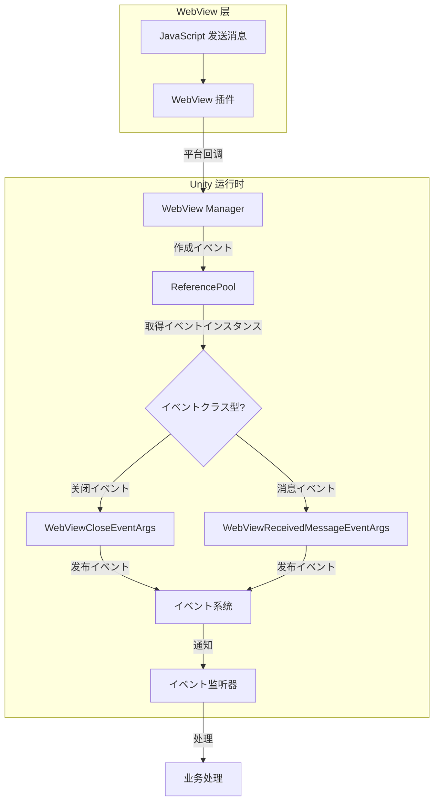

# イベント系统

本文档介绍 GameFrameX WebView コンポーネント的イベント系统，解释イベントクラス型、数据结构以及如何在プロジェクト中使用这些イベント。

## 概要

GameFrameX WebView コンポーネント采用イベント驱动架构，を通じてイベント系统実装 WebView 与 Unity 应用程序之间的通信。该イベント系统基づく GameFrameX コアフレームワーク的 `GameEventArgs` クラス构建，サポートオブジェクトプール化以优化性能。

イベント系统主要提供两クラスイベント：
- **WebView 关闭イベント** - 当 WebView 关闭时触发
- **WebView 消息接收イベント** - 当从 WebView 收到消息时触发

## アーキテクチャ設計

```mermaid
classDiagram
    class GameEventArgs {
        <<abstract>>
        +string Id { get; }
        +void Clear()
    }

    class WebViewCloseEventArgs {
        +static string EventId
        +static WebViewCloseEventArgs Create()
    }

    class WebViewReceivedMessageEventArgs {
        +static string EventId
        +string Message { get; }
        +static WebViewReceivedMessageEventArgs Create(string message)
    }

    class ReferencePool {
        +static T Acquire~T~()
        +static void Release(T instance)
    }

    GameEventArgs <|-- WebViewCloseEventArgs
    GameEventArgs <|-- WebViewReceivedMessageEventArgs
    WebViewCloseEventArgs --> ReferencePool : uses
    WebViewReceivedMessageEventArgs --> ReferencePool : uses
```

### コンポーネント説明

| コンポーネント | 説明 |
|------|------|
| `GameEventArgs` | イベント参数基クラス，来自 GameFrameX コア运行时 |
| `WebViewCloseEventArgs` | WebView 关闭イベント参数 |
| `WebViewReceivedMessageEventArgs` | WebView 消息接收イベント参数 |
| `ReferencePool` | オブジェクトプール，に使用イベント对象的复用 |

## イベントクラス型详解

### WebViewCloseEventArgs

`WebViewCloseEventArgs` 表示 WebView 关闭イベント，当 WebView 窗口关闭时触发。

```csharp
// Source: Runtime/EventArgs/WebViewCloseEventArgs.cs#L15-L41
public sealed class WebViewCloseEventArgs : GameEventArgs
{
    /// <summary>
    /// WebView消息关闭イベントID
    /// </summary>
    public static readonly string EventId = typeof(WebViewCloseEventArgs).FullName;

    public override void Clear()
    {
    }

    public override string Id
    {
        get { return EventId; }
    }

    /// <summary>
    /// 作成WebView消息关闭イベント
    /// </summary>
    /// <returns></returns>
    public static WebViewCloseEventArgs Create()
    {
        var eventArgs = ReferencePool.Acquire<WebViewCloseEventArgs>();
        return eventArgs;
    }
}
```

**特点：**
- 无额外数据载荷
- 使用オブジェクトプール管理インスタンス，避免频繁 GC

### WebViewReceivedMessageEventArgs

`WebViewReceivedMessageEventArgs` 表示从 WebView 收到的消息イベント，当 JavaScript 与 Unity 通信时触发。

```csharp
// Source: Runtime/EventArgs/WebViewReceivedMessageEventArgs.cs#L9-L42
public sealed class WebViewReceivedMessageEventArgs : GameEventArgs
{
    /// <summary>
    /// WebView消息接收イベントID
    /// </summary>
    public static readonly string EventId = typeof(WebViewReceivedMessageEventArgs).FullName;

    public override void Clear()
    {
    }

    public override string Id
    {
        get { return EventId; }
    }

    /// <summary>
    /// 作成WebView消息接收イベント
    /// </summary>
    /// <param name="message">消息内容</param>
    /// <returns></returns>
    public static WebViewReceivedMessageEventArgs Create(string message)
    {
        var eventArgs = ReferencePool.Acquire<WebViewReceivedMessageEventArgs>();
        eventArgs.Message = message;
        return eventArgs;
    }

    /// <summary>
    /// イベント消息
    /// </summary>
    public string Message { get; private set; }
}
```

**プロパティ説明：**
| プロパティ | クラス型 | 説明 |
|------|------|------|
| Message | string | 从 WebView 接收到的消息内容 |

## イベント流转フロー



## 订阅与处理イベント

要订阅 GameFrameX WebView イベント，您必要使用 GameFrameX コアフレームワーク的イベント系统。以下是订阅イベント的基本模式：

### 订阅 WebView 关闭イベント

```csharp
// 订阅イベント
EventCenter.EventSystem.Subscribe(WebViewCloseEventArgs.EventId, OnWebViewClosed);

// イベント处理メソッド
private void OnWebViewClosed(object sender, GameEventArgs e)
{
    var args = e as WebViewCloseEventArgs;
    // 处理关闭イベント
    Debug.Log("WebView 已关闭");
}

// 取消订阅
EventCenter.EventSystem.Unsubscribe(WebViewCloseEventArgs.EventId, OnWebViewClosed);
```

### 订阅 WebView 消息接收イベント

```csharp
// 订阅イベント
EventCenter.EventSystem.Subscribe(WebViewReceivedMessageEventArgs.EventId, OnMessageReceived);

// イベント处理メソッド
private void OnMessageReceived(object sender, GameEventArgs e)
{
    var args = e as WebViewReceivedMessageEventArgs;
    if (args != null)
    {
        // 处理接收到的消息
        Debug.Log($"收到 WebView 消息: {args.Message}");
    }
}

// 取消订阅
EventCenter.EventSystem.Unsubscribe(WebViewReceivedMessageEventArgs.EventId, OnMessageReceived);
```

## オブジェクトプール机制

GameFrameX WebView イベント系统使用 `ReferencePool` 进行オブジェクトプール化管理，这是为了优化性能而设计的：

1. **イベント作成**：を通じて `Create()` メソッド从オブジェクトプール取得インスタンス
2. **イベント处理**：处理完成后，イベントインスタンス会被自动回收
3. **优势**：减少垃圾回收压力，提高ゲーム性能

```csharp
// 从オブジェクトプール取得イベントインスタンス
var eventArgs = ReferencePool.Acquire<WebViewReceivedMessageEventArgs>();
eventArgs.Message = "Hello Unity";

// 使用后自动回收 - 由イベント系统处理
```

## イベント ID 引用

| イベントクラス型 | EventId |
|----------|---------|
| WebViewCloseEventArgs | `GameFrameX.WebView.Runtime.WebViewCloseEventArgs` |
| WebViewReceivedMessageEventArgs | `GameFrameX.WebView.Runtime.WebViewReceivedMessageEventArgs` |

## 関連リンク

- [API 参考](./4-api-reference) - WebView 完整 API 文档
- [快速入门](./3-getting-started) - WebView 基础使用教程
- [平台配置](./5-platforms) - Android 和 iOS 平台配置
- [GameFrameX コアフレームワーク](https://gameframex.doc.alianblank.com) - イベント系统底层実装
