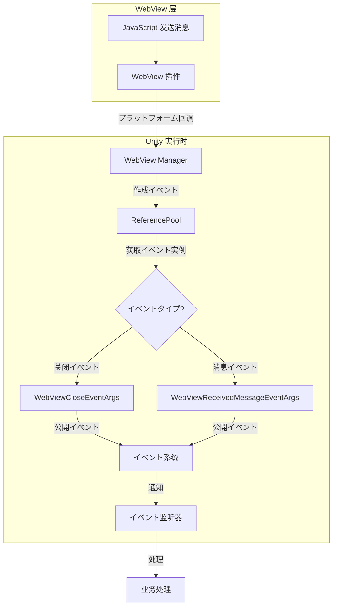

# イベント

ドキュメント GameFrameX WebView コンポーネントのイベント，イベントタイプ、データにプロジェクトイベント。

## 

GameFrameX WebView コンポーネントイベントアーキテクチャ，をじてイベント WebView と Unity の。イベントにづく GameFrameX コアフレームワークの `GameEventArgs` クラスビルド，サポートプール。

イベントクラスイベント：
- **WebView イベント** -  WebView 
- **WebView イベント** -  WebView 

## アーキテクチャ

```mermaid
classDiagram
    class GameEventArgs {
        <<abstract>>
        +string Id { get; }
        +void Clear()
    }

    class WebViewCloseEventArgs {
        +static string EventId
        +static WebViewCloseEventArgs Create()
    }

    class WebViewReceivedMessageEventArgs {
        +static string EventId
        +string Message { get; }
        +static WebViewReceivedMessageEventArgs Create(string message)
    }

    class ReferencePool {
        +static T Acquire~T~()
        +static void Release(T instance)
    }

    GameEventArgs <|-- WebViewCloseEventArgs
    GameEventArgs <|-- WebViewReceivedMessageEventArgs
    WebViewCloseEventArgs --> ReferencePool : uses
    WebViewReceivedMessageEventArgs --> ReferencePool : uses
```

### コンポーネント

| コンポーネント |  |
|------|------|
| `GameEventArgs` | イベントクラス， GameFrameX コア |
| `WebViewCloseEventArgs` | WebView イベント |
| `WebViewReceivedMessageEventArgs` | WebView イベント |
| `ReferencePool` | プール，にイベントの |

## イベントタイプ

### WebViewCloseEventArgs

`WebViewCloseEventArgs`  WebView イベント， WebView 。

```csharp
// Source: Runtime/EventArgs/WebViewCloseEventArgs.cs#L15-L41
public sealed class WebViewCloseEventArgs : GameEventArgs
{
    /// <summary>
    /// WebView消息关闭イベントID
    /// </summary>
    public static readonly string EventId = typeof(WebViewCloseEventArgs).FullName;

    public override void Clear()
    {
    }

    public override string Id
    {
        get { return EventId; }
    }

    /// <summary>
    /// 作成WebView消息关闭イベント
    /// </summary>
    /// <returns></returns>
    public static WebViewCloseEventArgs Create()
    {
        var eventArgs = ReferencePool.Acquire<WebViewCloseEventArgs>();
        return eventArgs;
    }
}
```

**：**
- データ
- プール， GC

### WebViewReceivedMessageEventArgs

`WebViewReceivedMessageEventArgs`  WebView のイベント， JavaScript と Unity 。

```csharp
// Source: Runtime/EventArgs/WebViewReceivedMessageEventArgs.cs#L9-L42
public sealed class WebViewReceivedMessageEventArgs : GameEventArgs
{
    /// <summary>
    /// WebView消息接收イベントID
    /// </summary>
    public static readonly string EventId = typeof(WebViewReceivedMessageEventArgs).FullName;

    public override void Clear()
    {
    }

    public override string Id
    {
        get { return EventId; }
    }

    /// <summary>
    /// 作成WebView消息接收イベント
    /// </summary>
    /// <param name="message">消息内容</param>
    /// <returns></returns>
    public static WebViewReceivedMessageEventArgs Create(string message)
    {
        var eventArgs = ReferencePool.Acquire<WebViewReceivedMessageEventArgs>();
        eventArgs.Message = message;
        return eventArgs;
    }

    /// <summary>
    /// イベント消息
    /// </summary>
    public string Message { get; private set; }
}
```

**プロパティ：**
| プロパティ | タイプ |  |
|------|------|------|
| Message | string |  WebView の |

## イベントフロー



## とイベント

 GameFrameX WebView イベント， GameFrameX コアフレームワークのイベント。はイベントの：

###  WebView イベント

```csharp
// 订阅イベント
EventCenter.EventSystem.Subscribe(WebViewCloseEventArgs.EventId, OnWebViewClosed);

// イベント处理メソッド
private void OnWebViewClosed(object sender, GameEventArgs e)
{
    var args = e as WebViewCloseEventArgs;
    // 处理关闭イベント
    Debug.Log("WebView 已关闭");
}

// 取消订阅
EventCenter.EventSystem.Unsubscribe(WebViewCloseEventArgs.EventId, OnWebViewClosed);
```

###  WebView イベント

```csharp
// 订阅イベント
EventCenter.EventSystem.Subscribe(WebViewReceivedMessageEventArgs.EventId, OnMessageReceived);

// イベント处理メソッド
private void OnMessageReceived(object sender, GameEventArgs e)
{
    var args = e as WebViewReceivedMessageEventArgs;
    if (args != null)
    {
        // 处理接收到の消息
        Debug.Log($"收到 WebView 消息: {args.Message}");
    }
}

// 取消订阅
EventCenter.EventSystem.Unsubscribe(WebViewReceivedMessageEventArgs.EventId, OnMessageReceived);
```

## プール

GameFrameX WebView イベント `ReferencePool` プール，はたの：

1. **イベント**：をじて `Create()` メソッドプール
2. **イベント**：た，イベント
3. ****：，ゲーム

```csharp
// 从对象プール获取イベント实例
var eventArgs = ReferencePool.Acquire<WebViewReceivedMessageEventArgs>();
eventArgs.Message = "Hello Unity";

// 使用后自动回收 - 由イベント系统处理
```

## イベント ID 

| イベントタイプ | EventId |
|----------|---------|
| WebViewCloseEventArgs | `GameFrameX.WebView.Runtime.WebViewCloseEventArgs` |
| WebViewReceivedMessageEventArgs | `GameFrameX.WebView.Runtime.WebViewReceivedMessageEventArgs` |

## リンク

- [API リファレンス](./4-api-reference) - WebView  API ドキュメント
- [クイックスタート](./3-getting-started) - WebView 
- [プラットフォーム](./5-platforms) - Android と iOS プラットフォーム
- [GameFrameX コアフレームワーク](https://gameframex.doc.alianblank.com) - イベント
