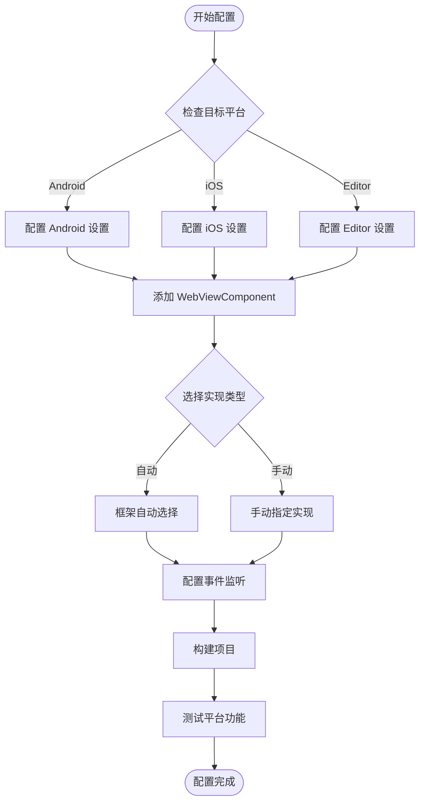

# プラットフォーム設定

このドキュメント介绍 GameFrameX WebView コンポーネント在不同プラットフォーム上的設定メソッド，含みますプラットフォーム选择机制、可用的プラットフォーム実装および設定オプション。

## 概要

GameFrameX WebView コンポーネント采用プラットフォーム无关的アーキテクチャ設計，通过 `IWebViewManager` インターフェース定義統一された的 WebView 操作 API。フレームワーク根据ランタイムプラットフォーム自动选择合适的実装，也サポート手动設定特定プラットフォーム的マネージャー。

### サポート的プラットフォーム

| プラットフォーム | サポートステータス | 説明 |
|------|----------|------|
| Android | ✅ サポート | 基于 gree/unity-webview 的 Android 実装 |
| iOS | ✅ サポート | 基于 gree/unity-webview 的 iOS 実装 |
| WebGL | ⚠️ 有限サポート | WebGL プラットフォーム上的 WebView 機能受限 |
| Windows/Mac Editor | ✅ サポート | エディタ環境下可进行デバッグ |

## アーキテクチャ設計

```mermaid
flowchart TD
    subgraph Client["客户端层"]
        WC[WebViewComponent]
    end

    subgraph Interface["接口层"]
        IWM[IWebViewManager 接口]
    end

    subgraph Abstract["抽象层"]
        BWM[BaseWebViewManager]
    end

    subgraph Implementations["平台实现层"]
        AndroidWM[AndroidWebViewManager]
        iOSWM[iOSWebViewManager]
        EditorWM[EditorWebViewManager]
    end

    subgraph Native["原生层"]
        AndroidNative[Android WebView]
        iOSNative[UIWebView/WKWebView]
    end

    WC --> IWM
    IWM <|.. BWM
    BWM <|-- AndroidWM
    BWM <|-- iOSWM
    BWM <|-- EditorWM
    AndroidWM --> AndroidNative
    iOSWM --> iOSNative
```

### コンポーネント职责

| コンポーネント | 职责 |
|------|------|
| `WebViewComponent` | Unity コンポーネント入口，処理ライフサイクル并转发呼び出し |
| `IWebViewManager` | 定義 WebView 操作的統一されたインターフェース |
| `BaseWebViewManager` | 提供抽象基底クラス，継承 GameFrameworkModule |
| プラットフォーム実装类 | 実装特定プラットフォーム的 WebView 機能 |

## プラットフォーム选择机制

### 自动选择

フレームワーク通过 GameFrameX 的モジュール系统自动选择プラットフォーム実装。当呼び出し `GameFrameworkEntry.GetModule<IWebViewManager>()` 时，フレームワーク会根据当前ランタイムプラットフォーム查找并ロード对应的実装。

```csharp
// Runtime/WebViewComponent.cs
_webViewManager = GameFrameworkEntry.GetModule<IWebViewManager>();
```
> Source: [WebViewComponent.cs](https://github.com/GameFrameX/com.gameframex.unity.webview/blob/main/Runtime/WebViewComponent.cs#L28)

### 手动設定

在某些シーン下，您〜の可能性があります〜する必要があります手动指定特定的プラットフォーム実装。通过 Unity Editor 的 Inspector パネル〜できます設定：

1. 在シーン中作成パッケージ含 `WebViewComponent` 的 GameObject
2. 在 Inspector 中找到 **Implementation Type** 下拉メニュー
3. 选择 desired 的プラットフォーム実装类

```csharp
// WebViewComponent 继承自 GameFrameworkComponent
// componentType 属性存储用户选择的实现类型
ImplementationComponentType = Utility.Assembly.GetType(componentType);
```
> Source: [WebViewComponent.cs](https://github.com/GameFrameX/com.gameframex.unity.webview/blob/main/Runtime/WebViewComponent.cs#L24-L25)

## プラットフォーム特定設定

### Android プラットフォーム設定

Android プラットフォーム使用原生 WebView コンポーネント，〜する必要があります確認してください以下設定：

**AndroidManifest.xml 权限：**
```xml
<!-- 需要添加网络权限 -->
<uses-permission android:name="android.permission.INTERNET" />
```

**gradle 設定：**
```groovy
// 在 PlayerSettings > Publishing Settings > Build
// 确保已包含 unity-webview 的 Android 库
```

### iOS プラットフォーム設定

iOS プラットフォーム使用 `WKWebView`（iOS 13+）或 `UIWebView`（兼容性モード）：

**Info.plist 設定：**
```xml
<!-- 允许加载任意 URL（根据需求配置） -->
<key>NSAppTransportSecurity</key>
<dict>
    <key>NSAllowsArbitraryLoads</key>
    <true/>
</dict>
```

**PlayerSettings 設定：**
- **Resolution and Presentation**: 設定合适的 WebView 渲染モード
- **Other Settings**: 確認してください IL2CPP 和 ABI 設定正确

### エディタデバッグ設定

在 Unity Editor 環境下ランタイム，〜できます使用エディタ专用的 WebView 実装进行デバッグ：

```csharp
// 编辑器实现提供了模拟的 WebView 环境
// 方便在开发阶段进行功能测试
```

## 設定フロー



## イベント系统設定

WebView コンポーネント通过イベント系统通知应用程序各种ステータス变化。不同プラットフォーム的イベント行为一致：

| イベント | 説明 | 适用プラットフォーム |
|------|------|----------|
| `WebViewCloseEventArgs` | WebView 閉じるイベント | 所有プラットフォーム |
| `WebViewReceivedMessageEventArgs` | 收到 JavaScript メッセージ | 所有プラットフォーム |

### イベント設定例

```csharp
using GameFrameX.Event.Runtime;
using GameFrameX.WebView.Runtime;

// 订阅 WebView 关闭事件
EventManager.Register<WebViewCloseEventArgs>(OnWebViewClosed);

// 订阅收到消息事件
EventManager.Register<WebViewReceivedMessageEventArgs>(OnMessageReceived);

private void OnWebViewClosed(object sender, WebViewCloseEventArgs e)
{
    Debug.Log("WebView 已关闭");
}

private void OnMessageReceived(object sender, WebViewReceivedMessageEventArgs e)
{
    Debug.Log($"收到消息: {e.Message}");
}
```
> Source: [WebViewReceivedMessageEventArgs.cs](https://github.com/GameFrameX/com.gameframex.unity.webview/blob/main/Runtime/EventArgs/WebViewReceivedMessageEventArgs.cs#L30-L35)

## API リファレンス

### IWebViewManager インターフェース

所有プラットフォーム実装都遵循統一された的インターフェース规范：

```csharp
public interface IWebViewManager
{
    /// <summary>
    /// 初始化 WebView 管理器
    /// </summary>
    void Initialize();

    /// <summary>
    /// 显示 WebView 并加载指定 URL
    /// </summary>
    /// <param name="url">要加载的网页地址</param>
    void Show(string url);

    /// <summary>
    /// 将 WebView 设置为全屏模式
    /// </summary>
    void MakeFullScreen();

    /// <summary>
    /// 执行 JavaScript 代码
    /// </summary>
    /// <param name="javaScript">要执行的 JavaScript 代码</param>
    void ExecuteJavaScript(string javaScript);

    /// <summary>
    /// 隐藏 WebView
    /// </summary>
    void Hide();
}
```
> Source: [IWebViewManager.cs](https://github.com/GameFrameX/com.gameframex.unity.webview/blob/main/Runtime/IWebViewManager.cs#L12-L40)

### 基本抽象类

```csharp
public abstract partial class BaseWebViewManager : GameFrameworkModule, IWebViewManager
{
    /// <summary>
    /// 初始化
    /// </summary>
    public abstract void Initialize();

    /// <summary>
    /// 显示WebView
    /// </summary>
    /// <param name="url">加载的url</param>
    public abstract void Show(string url);

    /// <summary>
    /// 全屏
    /// </summary>
    public abstract void MakeFullScreen();

    /// <summary>
    /// 执行JavaScript
    /// </summary>
    /// <param name="javaScript">javaScript代码</param>
    public abstract void ExecuteJavaScript(string javaScript);

    /// <summary>
    /// 隐藏
    /// </summary>
    public abstract void Hide();
}
```
> Source: [BaseWebViewManager.cs](https://github.com/GameFrameX/com.gameframex.unity.webview/blob/main/Runtime/BaseWebViewManager.cs#L11-L39)

## よくある問題

### Q: 如何为特定プラットフォーム使用不同的 WebView 実装？

A: 在 Inspector パネル中手动选择実装タイプ，或通过コード在ランタイム动态切换：

```csharp
// 运行时动态设置实现类型
var webView = GetComponent<WebViewComponent>();
// 通过反射或配置系统设置 componentType
```

### Q: WebView 在真机上显示空白怎么办？

A: 確認以下設定：
1. 確認已追加 INTERNET 权限（Android）
2. 確認 Info.plist 中的 App Transport Security 設定
3. 確認してください URL 可公开访问

### Q: 如何在不同プラットフォーム使用不同的 URL？

A: 使用プラットフォーム条件コンパイル或ランタイム检测：

```csharp
#if UNITY_ANDROID
webView.Show("https://android.example.com");
#elif UNITY_IOS
webView.Show("https://ios.example.com");
#else
webView.Show("https://default.example.com");
#endif
```

## 関連リンク

- [概要](./1-overview) - プロジェクト整体介绍
- [快速入门](./3-getting-started) - 快速开始使用
- [API リファレンス](./4-api-reference) - 完全な的 API ドキュメント
- [イベント系统](./6-events) - イベント机制详解
- [常见問題](./7-troubleshooting) - 問題排查ガイド
- [GameFrameX 官网](https://gameframex.doc.alianblank.com)
- [gree/unity-webview](https://github.com/gree/unity-webview) - 原生 WebView プラグイン
