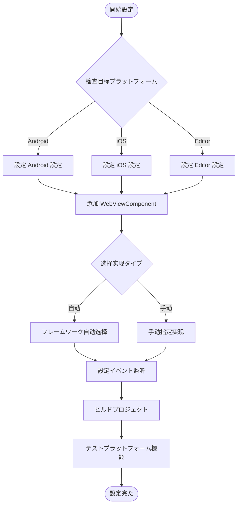

# プラットフォーム

ドキュメント GameFrameX WebView コンポーネントにプラットフォームのメソッド，プラットフォーム、のプラットフォームオプション。

## 

GameFrameX WebView コンポーネントプラットフォームのアーキテクチャ，をじて `IWebViewManager` インターフェースの WebView  API。フレームワークプラットフォームの，サポートプラットフォームのマネージャー。

### サポートのプラットフォーム

| プラットフォーム | サポート |  |
|------|----------|------|
| Android | ✅ サポート | にづく gree/unity-webview の Android  |
| iOS | ✅ サポート | にづく gree/unity-webview の iOS  |
| WebGL | ⚠️ サポート | WebGL プラットフォームの WebView  |
| Windows/Mac Editor | ✅ サポート | エディターデバッグ |

## アーキテクチャ

```mermaid
flowchart TD
    subgraph Client["客户端层"]
        WC[WebViewComponent]
    end

    subgraph Interface["インターフェース层"]
        IWM[IWebViewManager インターフェース]
    end

    subgraph Abstract["抽象层"]
        BWM[BaseWebViewManager]
    end

    subgraph Implementations["プラットフォーム实现层"]
        AndroidWM[AndroidWebViewManager]
        iOSWM[iOSWebViewManager]
        EditorWM[EditorWebViewManager]
    end

    subgraph Native["原生层"]
        AndroidNative[Android WebView]
        iOSNative[UIWebView/WKWebView]
    end

    WC --> IWM
    IWM <|.. BWM
    BWM <|-- AndroidWM
    BWM <|-- iOSWM
    BWM <|-- EditorWM
    AndroidWM --> AndroidNative
    iOSWM --> iOSNative
```

### コンポーネント

| コンポーネント |  |
|------|------|
| `WebViewComponent` | Unity コンポーネント，びし |
| `IWebViewManager` |  WebView のインターフェース |
| `BaseWebViewManager` | クラス， GameFrameworkModule |
| プラットフォームクラス | プラットフォームの WebView  |

## プラットフォーム

### 

フレームワークをじて GameFrameX のモジュールプラットフォーム。びし `GameFrameworkEntry.GetModule<IWebViewManager>()` ，フレームワークプラットフォームロードの。

```csharp
// Runtime/WebViewComponent.cs
_webViewManager = GameFrameworkEntry.GetModule<IWebViewManager>();
```
> Source: [WebViewComponent.cs](https://github.com/GameFrameX/com.gameframex.unity.webview/blob/main/Runtime/WebViewComponent.cs#L28)

### 

に，のプラットフォーム。をじて Unity Editor の Inspector ：

1. にむ `WebViewComponent` の GameObject
2. に Inspector  **Implementation Type** 
3.  desired のプラットフォームクラス

```csharp
// WebViewComponent 继承自 GameFrameworkComponent
// componentType プロパティ存储用户选择の实现タイプ
ImplementationComponentType = Utility.Assembly.GetType(componentType);
```
> Source: [WebViewComponent.cs](https://github.com/GameFrameX/com.gameframex.unity.webview/blob/main/Runtime/WebViewComponent.cs#L24-L25)

## プラットフォーム

### Android プラットフォーム

Android プラットフォーム WebView コンポーネント，：

**AndroidManifest.xml ：**
```xml
<!-- 必要添加ネットワーク权限 -->
<uses-permission android:name="android.permission.INTERNET" />
```

**gradle ：**
```groovy
// に PlayerSettings > Publishing Settings > Build
// 确保已含む unity-webview の Android 库
```

### iOS プラットフォーム

iOS プラットフォーム `WKWebView`（iOS 13+） `UIWebView`（）：

**Info.plist ：**
```xml
<!-- 許可ロード任意 URL（根据需求設定） -->
<key>NSAppTransportSecurity</key>
<dict>
    <key>NSAllowsArbitraryLoads</key>
    <true/>
</dict>
```

**PlayerSettings ：**
- **Resolution and Presentation**: の WebView 
- **Other Settings**:  IL2CPP と ABI 

### エディターデバッグ

に Unity Editor ，エディターの WebView デバッグ：

```csharp
// エディター实现提供た模拟の WebView 环境
// 方便に開発阶段进行機能テスト
```

## フロー



## イベント

WebView コンポーネントをじてイベント。プラットフォームのイベント：

| イベント |  | プラットフォーム |
|------|------|----------|
| `WebViewCloseEventArgs` | WebView イベント | プラットフォーム |
| `WebViewReceivedMessageEventArgs` |  JavaScript  | プラットフォーム |

### イベント

```csharp
using GameFrameX.Event.Runtime;
using GameFrameX.WebView.Runtime;

// 订阅 WebView 关闭イベント
EventManager.Register<WebViewCloseEventArgs>(OnWebViewClosed);

// 订阅收到消息イベント
EventManager.Register<WebViewReceivedMessageEventArgs>(OnMessageReceived);

private void OnWebViewClosed(object sender, WebViewCloseEventArgs e)
{
    Debug.Log("WebView 已关闭");
}

private void OnMessageReceived(object sender, WebViewReceivedMessageEventArgs e)
{
    Debug.Log($"收到消息: {e.Message}");
}
```
> Source: [WebViewReceivedMessageEventArgs.cs](https://github.com/GameFrameX/com.gameframex.unity.webview/blob/main/Runtime/EventArgs/WebViewReceivedMessageEventArgs.cs#L30-L35)

## API リファレンス

### IWebViewManager インターフェース

プラットフォームのインターフェース：

```csharp
public interface IWebViewManager
{
    /// <summary>
    /// 初始化 WebView マネージャー
    /// </summary>
    void Initialize();

    /// <summary>
    /// 显示 WebView 并ロード指定 URL
    /// </summary>
    /// <param name="url">要ロードの网页地址</param>
    void Show(string url);

    /// <summary>
    /// 将 WebView 設定为全屏模式
    /// </summary>
    void MakeFullScreen();

    /// <summary>
    /// 実行 JavaScript コード
    /// </summary>
    /// <param name="javaScript">要実行の JavaScript コード</param>
    void ExecuteJavaScript(string javaScript);

    /// <summary>
    /// 隐藏 WebView
    /// </summary>
    void Hide();
}
```
> Source: [IWebViewManager.cs](https://github.com/GameFrameX/com.gameframex.unity.webview/blob/main/Runtime/IWebViewManager.cs#L12-L40)

### クラス

```csharp
public abstract partial class BaseWebViewManager : GameFrameworkModule, IWebViewManager
{
    /// <summary>
    /// 初始化
    /// </summary>
    public abstract void Initialize();

    /// <summary>
    /// 显示WebView
    /// </summary>
    /// <param name="url">ロードのurl</param>
    public abstract void Show(string url);

    /// <summary>
    /// 全屏
    /// </summary>
    public abstract void MakeFullScreen();

    /// <summary>
    /// 実行JavaScript
    /// </summary>
    /// <param name="javaScript">javaScriptコード</param>
    public abstract void ExecuteJavaScript(string javaScript);

    /// <summary>
    /// 隐藏
    /// </summary>
    public abstract void Hide();
}
```
> Source: [BaseWebViewManager.cs](https://github.com/GameFrameX/com.gameframex.unity.webview/blob/main/Runtime/BaseWebViewManager.cs#L11-L39)

## よくある

### Q: プラットフォームの WebView ？

A: に Inspector タイプ，をじてコードに：

```csharp
// 実行时动态設定实现タイプ
var webView = GetComponent<WebViewComponent>();
// を通じて反射或設定系统設定 componentType
```

### Q: WebView に？

A: ：
1.  INTERNET （Android）
2.  Info.plist の App Transport Security 
3.  URL 

### Q: にプラットフォームの URL？

A: プラットフォームコンパイル：

```csharp
#if UNITY_ANDROID
webView.Show("https://android.example.com");
#elif UNITY_IOS
webView.Show("https://ios.example.com");
#else
webView.Show("https://default.example.com");
#endif
```

## リンク

- [](./1-overview) - プロジェクト
- [クイックスタート](./3-getting-started) - クイックスタート
- [API リファレンス](./4-api-reference) - の API ドキュメント
- [イベント](./6-events) - イベント
- [よくある](./7-troubleshooting) - ガイド
- [GameFrameX サイト](https://gameframex.doc.alianblank.com)
- [gree/unity-webview](https://github.com/gree/unity-webview) -  WebView 
