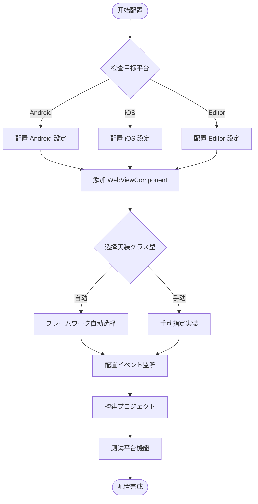

# 平台配置

本文档介绍 GameFrameX WebView コンポーネント在不同平台上的配置メソッド，包括平台选择机制、可用的平台実装以及配置选项。

## 概要

GameFrameX WebView コンポーネント采用平台无关的アーキテクチャ設計，を通じて `IWebViewManager` インターフェース定义统一的 WebView 操作 API。フレームワークに基づいて运行时平台自动选择合适的実装，也サポート手动配置特定平台的管理器。

### サポート的平台

| 平台 | サポートステータス | 説明 |
|------|----------|------|
| Android | ✅ サポート | 基づく gree/unity-webview 的 Android 実装 |
| iOS | ✅ サポート | 基づく gree/unity-webview 的 iOS 実装 |
| WebGL | ⚠️ 有限サポート | WebGL 平台上的 WebView 機能受限 |
| Windows/Mac Editor | ✅ サポート | 编辑器环境下可进行调试 |

## アーキテクチャ設計

```mermaid
flowchart TD
    subgraph Client["客户端层"]
        WC[WebViewComponent]
    end

    subgraph Interface["インターフェース层"]
        IWM[IWebViewManager インターフェース]
    end

    subgraph Abstract["抽象层"]
        BWM[BaseWebViewManager]
    end

    subgraph Implementations["平台実装层"]
        AndroidWM[AndroidWebViewManager]
        iOSWM[iOSWebViewManager]
        EditorWM[EditorWebViewManager]
    end

    subgraph Native["原生层"]
        AndroidNative[Android WebView]
        iOSNative[UIWebView/WKWebView]
    end

    WC --> IWM
    IWM <|.. BWM
    BWM <|-- AndroidWM
    BWM <|-- iOSWM
    BWM <|-- EditorWM
    AndroidWM --> AndroidNative
    iOSWM --> iOSNative
```

### コンポーネント职责

| コンポーネント | 职责 |
|------|------|
| `WebViewComponent` | Unity コンポーネントエントリーポイント，处理生命周期并转发呼び出し |
| `IWebViewManager` | 定义 WebView 操作的统一インターフェース |
| `BaseWebViewManager` | 提供抽象基底クラス，继承 GameFrameworkModule |
| 平台実装クラス | 実装特定平台的 WebView 機能 |

## 平台选择机制

### 自动选择

フレームワークを通じて GameFrameX 的模块系统自动选择平台実装。当呼び出し `GameFrameworkEntry.GetModule<IWebViewManager>()` 时，フレームワーク会に基づいて当前运行时平台查找并加载对应的実装。

```csharp
// Runtime/WebViewComponent.cs
_webViewManager = GameFrameworkEntry.GetModule<IWebViewManager>();
```
> Source: [WebViewComponent.cs](https://github.com/GameFrameX/com.gameframex.unity.webview/blob/main/Runtime/WebViewComponent.cs#L28)

### 手动配置

在某些シーン下，您可能必要手动指定特定的平台実装。を通じて Unity Editor 的 Inspector 面板可能配置：

1. 在シーン中作成包含 `WebViewComponent` 的 GameObject
2. 在 Inspector 中找到 **Implementation Type** 下拉菜单
3. 选择 desired 的平台実装クラス

```csharp
// WebViewComponent を継承 GameFrameworkComponent
// componentType プロパティ存储用户选择的実装クラス型
ImplementationComponentType = Utility.Assembly.GetType(componentType);
```
> Source: [WebViewComponent.cs](https://github.com/GameFrameX/com.gameframex.unity.webview/blob/main/Runtime/WebViewComponent.cs#L24-L25)

## 平台特定配置

### Android 平台配置

Android 平台使用原生 WebView コンポーネント，必要确保以下配置：

**AndroidManifest.xml 权限：**
```xml
<!-- 必要添加网络权限 -->
<uses-permission android:name="android.permission.INTERNET" />
```

**gradle 配置：**
```groovy
// 在 PlayerSettings > Publishing Settings > Build
// 确保已包含 unity-webview 的 Android 库
```

### iOS 平台配置

iOS 平台使用 `WKWebView`（iOS 13+）或 `UIWebView`（兼容性模式）：

**Info.plist 配置：**
```xml
<!-- 允许加载任意 URL（に基づいて需求配置） -->
<key>NSAppTransportSecurity</key>
<dict>
    <key>NSAllowsArbitraryLoads</key>
    <true/>
</dict>
```

**PlayerSettings 配置：**
- **Resolution and Presentation**: 設定合适的 WebView 渲染模式
- **Other Settings**: 确保 IL2CPP 和 ABI 配置正确

### 编辑器调试配置

在 Unity Editor 环境下运行时，可能使用编辑器专用的 WebView 実装进行调试：

```csharp
// 编辑器実装提供します模拟的 WebView 环境
// 方便在开发阶段进行機能测试
```

## 設定フロー



## イベント系统配置

WebView コンポーネントを通じてイベント系统通知应用程序各种ステータス变化。不同平台的イベント行为一致：

| イベント | 説明 | 适用平台 |
|------|------|----------|
| `WebViewCloseEventArgs` | WebView 关闭イベント | 所有平台 |
| `WebViewReceivedMessageEventArgs` | 收到 JavaScript 消息 | 所有平台 |

### イベント配置示例

```csharp
using GameFrameX.Event.Runtime;
using GameFrameX.WebView.Runtime;

// 订阅 WebView 关闭イベント
EventManager.Register<WebViewCloseEventArgs>(OnWebViewClosed);

// 订阅收到消息イベント
EventManager.Register<WebViewReceivedMessageEventArgs>(OnMessageReceived);

private void OnWebViewClosed(object sender, WebViewCloseEventArgs e)
{
    Debug.Log("WebView 已关闭");
}

private void OnMessageReceived(object sender, WebViewReceivedMessageEventArgs e)
{
    Debug.Log($"收到消息: {e.Message}");
}
```
> Source: [WebViewReceivedMessageEventArgs.cs](https://github.com/GameFrameX/com.gameframex.unity.webview/blob/main/Runtime/EventArgs/WebViewReceivedMessageEventArgs.cs#L30-L35)

## API 参考

### IWebViewManager インターフェース

所有平台実装都遵循统一的インターフェース规范：

```csharp
public interface IWebViewManager
{
    /// <summary>
    /// 初期化 WebView 管理器
    /// </summary>
    void Initialize();

    /// <summary>
    /// 显示 WebView 并加载指定 URL
    /// </summary>
    /// <param name="url">要加载的网页地址</param>
    void Show(string url);

    /// <summary>
    /// 将 WebView 設定为全屏模式
    /// </summary>
    void MakeFullScreen();

    /// <summary>
    /// 执行 JavaScript 代码
    /// </summary>
    /// <param name="javaScript">要执行的 JavaScript 代码</param>
    void ExecuteJavaScript(string javaScript);

    /// <summary>
    /// 隐藏 WebView
    /// </summary>
    void Hide();
}
```
> Source: [IWebViewManager.cs](https://github.com/GameFrameX/com.gameframex.unity.webview/blob/main/Runtime/IWebViewManager.cs#L12-L40)

### 基础抽象クラス

```csharp
public abstract partial class BaseWebViewManager : GameFrameworkModule, IWebViewManager
{
    /// <summary>
    /// 初期化
    /// </summary>
    public abstract void Initialize();

    /// <summary>
    /// 显示WebView
    /// </summary>
    /// <param name="url">加载的url</param>
    public abstract void Show(string url);

    /// <summary>
    /// 全屏
    /// </summary>
    public abstract void MakeFullScreen();

    /// <summary>
    /// 执行JavaScript
    /// </summary>
    /// <param name="javaScript">javaScript代码</param>
    public abstract void ExecuteJavaScript(string javaScript);

    /// <summary>
    /// 隐藏
    /// </summary>
    public abstract void Hide();
}
```
> Source: [BaseWebViewManager.cs](https://github.com/GameFrameX/com.gameframex.unity.webview/blob/main/Runtime/BaseWebViewManager.cs#L11-L39)

## よくある質問

### Q: 如何为特定平台使用不同的 WebView 実装？

A: 在 Inspector 面板中手动选择実装クラス型，或を通じて代码在运行时动态切换：

```csharp
// 运行时动态設定実装クラス型
var webView = GetComponent<WebViewComponent>();
// を通じて反射或配置系统設定 componentType
```

### Q: WebView 在真机上显示空白怎么办？

A: 检查以下配置：
1. 确认已添加 INTERNET 权限（Android）
2. 检查 Info.plist 中的 App Transport Security 配置
3. 确保 URL 可公开访问

### Q: 如何在不同平台使用不同的 URL？

A: 使用平台条件编译或运行时检测：

```csharp
#if UNITY_ANDROID
webView.Show("https://android.example.com");
#elif UNITY_IOS
webView.Show("https://ios.example.com");
#else
webView.Show("https://default.example.com");
#endif
```

## 関連リンク

- [概述](./1-overview) - プロジェクト整体介绍
- [快速入门](./3-getting-started) - 快速开始使用
- [API 参考](./4-api-reference) - 完整的 API 文档
- [イベント系统](./6-events) - イベント机制详解
- [常见问题](./7-troubleshooting) - 问题排查指南
- [GameFrameX 官网](https://gameframex.doc.alianblank.com)
- [gree/unity-webview](https://github.com/gree/unity-webview) - 原生 WebView 插件
