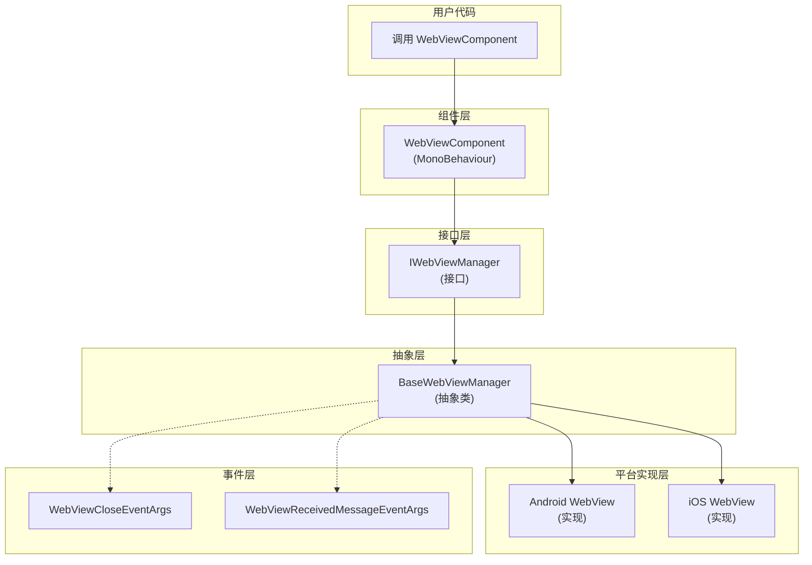

# API リファレンス

このドキュメント詳細介绍 GameFrameX WebView コンポーネント的完全な API インターフェース，含みますインターフェース定義、コンポーネントメソッド、イベントパラメータ等内容。

## 概要

GameFrameX WebView コンポーネント提供します在 Unity 游戏中嵌入和显示 Web 内容的完全な解決策。API 設計遵循 GameFrameX フレームワーク规范，通过インターフェース抽象実装プラットフォーム无关的コア機能，由各プラットフォーム具体実装（基于 gree/unity-webview）提供原生サポート。

主な API 分为以下几个部分：
- **IWebViewManager インターフェース** - 定義 WebView 管理的コア抽象
- **WebViewComponent コンポーネント** - Unity 层面的ユーザー交互入口
- **イベント系统** - WebView ステータス变化的通知机制
- **イベントパラメータ** - イベント携带的数据结构

## アーキテクチャ



### アーキテクチャ説明

1. **ユーザーコード层**：通过 `WebViewComponent` 与系统交互
2. **コンポーネント層**：`WebViewComponent` 継承自 `GameFrameworkComponent`，是 Unity 层面的入口点
3. **インターフェース層**：`IWebViewManager` 定義了統一された的抽象インターフェース
4. **抽象層**：`BaseWebViewManager` 提供します所有実装的公共基底クラス
5. **プラットフォーム実装層**：具体プラットフォーム（Android、iOS）的 WebView 実装

## IWebViewManager インターフェース

`IWebViewManager` 是 WebView 機能的コアインターフェース，定義了所有 WebView 操作的標準抽象。由フレームワーク根据运行プラットフォーム自动选择合适的実装。

> Source: [IWebViewManager.cs](https://github.com/GameFrameX/com.gameframex.unity.webview/blob/main/Runtime/IWebViewManager.cs#L1-L41)

### メソッド列表

| メソッド | 説明 |
|------|------|
| `Initialize()` | 初期化 WebView 系统 |
| `Show(string url)` | 显示 WebView 并ロード指定 URL |
| `MakeFullScreen()` | 将 WebView 設定为全屏モード |
| `ExecuteJavaScript(string javaScript)` | 在 WebView 中执行 JavaScript コード |
| `Hide()` | 隐藏 WebView |

### `Initialize(): void`

初期化 WebView 系统。此メソッド在コンポーネント启动时自动呼び出し，也〜できます手动呼び出し进行重新初期化。

**実装コード：**

```csharp
/// <summary>
/// 初始化
/// </summary>
void Initialize();
```

> Source: [IWebViewManager.cs](https://github.com/GameFrameX/com.gameframex.unity.webview/blob/main/Runtime/IWebViewManager.cs#L14-L17)

---

### `Show(url: string): void`

显示 WebView 并ロード指定的 URL。呼び出し此メソッド后，WebView 将变为可见ステータス并开始ロード网页内容。

**パラメータ：**
- `url` (string): 要ロード的网页 URL地址，サポート http:// 和 https:// 协议

**実装コード：**

```csharp
/// <summary>
/// 显示WebView
/// </summary>
/// <param name="url">加载的url</param>
void Show(string url);
```

> Source: [IWebViewManager.cs](https://github.com/GameFrameX/com.gameframex.unity.webview/blob/main/Runtime/IWebViewManager.cs#L19-L23)

---

### `MakeFullScreen(): void`

将 WebView 設定为全屏モード。在全屏モード下，WebView 将覆盖整个屏幕区域。

**実装コード：**

```csharp
/// <summary>
/// 全屏
/// </summary>
void MakeFullScreen();
```

> Source: [IWebViewManager.cs](https://github.com/GameFrameX/com.gameframex.unity.webview/blob/main/Runtime/IWebViewManager.cs#L25-L28)

---

### `ExecuteJavaScript(javaScript: string): void`

在当前ロード的 Web 页面上执行 JavaScript コード。这使得 Unity 应用〜できます与 Web 页面进行双向通信。

**パラメータ：**
- `javaScript` (string): 要执行的 JavaScript コード字符串

**実装コード：**

```csharp
/// <summary>
/// 执行JavaScript
/// </summary>
/// <param name="javaScript">javaScript代码</param>
void ExecuteJavaScript(string javaScript);
```

> Source: [IWebViewManager.cs](https://github.com/GameFrameX/com.gameframex.unity.webview/blob/main/Runtime/IWebViewManager.cs#L30-L34)

---

### `Hide(): void`

隐藏 WebView。隐藏后 WebView 将不可见但仍然存在于内存中，〜できます随时通过 `Show()` メソッド再次显示。

**実装コード：**

```csharp
/// <summary>
/// 隐藏
/// </summary>
void Hide();
```

> Source: [IWebViewManager.cs](https://github.com/GameFrameX/com.gameframex.unity.webview/blob/main/Runtime/IWebViewManager.cs#L36-L39)

---

## BaseWebViewManager 抽象类

`BaseWebViewManager` 是所有プラットフォーム特定実装的抽象基底クラス，継承自 `GameFrameworkModule` 并実装 `IWebViewManager` インターフェース。

> Source: [BaseWebViewManager.cs](https://github.com/GameFrameX/com.gameframex.unity.webview/blob/main/Runtime/BaseWebViewManager.cs#L1-L40)

### 类定義

```csharp
public abstract partial class BaseWebViewManager : GameFrameworkModule, IWebViewManager
```

> Source: [BaseWebViewManager.cs](https://github.com/GameFrameX/com.gameframex.unity.webview/blob/main/Runtime/BaseWebViewManager.cs#L11)

### 抽象メソッド

所有 `IWebViewManager` インターフェース中的メソッド在 `BaseWebViewManager` 中都被声明为抽象メソッド，由各プラットフォーム実装类具体実装：

| メソッド | 签名 |
|------|------|
| Initialize | `public abstract void Initialize();` |
| Show | `public abstract void Show(string url);` |
| MakeFullScreen | `public abstract void MakeFullScreen();` |
| ExecuteJavaScript | `public abstract void ExecuteJavaScript(string javaScript);` |
| Hide | `public abstract void Hide();` |

> Source: [BaseWebViewManager.cs](https://github.com/GameFrameX/com.gameframex.unity.webview/blob/main/Runtime/BaseWebViewManager.cs#L11-L39)

---

## WebViewComponent コンポーネント

`WebViewComponent` 是ユーザー在 Unity シーン中直接使用的コンポーネント，継承自 `GameFrameworkComponent`。它カプセル化了 `IWebViewManager` 的呼び出し，提供します更使いやすい的 Unity API。

> Source: [WebViewComponent.cs](https://github.com/GameFrameX/com.gameframex.unity.webview/blob/main/Runtime/WebViewComponent.cs#L1-L76)

### コンポーネント特性

```csharp
[DisallowMultipleComponent]
[AddComponentMenu("Game Framework/WebView")]
[UnityEngine.Scripting.Preserve]
public partial class WebViewComponent : GameFrameworkComponent
```

- `DisallowMultipleComponent`：禁止在同一 GameObject 上追加多个インスタンス
- `AddComponentMenu`：在 Unity メニュー中追加快捷作成入口
- `Scripting.Preserve`：確認してくださいコード在リリース时不被混淆

> Source: [WebViewComponent.cs](https://github.com/GameFrameX/com.gameframex.unity.webview/blob/main/Runtime/WebViewComponent.cs#L10-L12)

### ライフサイクルメソッド

#### Awake()

コンポーネント初期化时呼び出し，取得并設定 `IWebViewManager` モジュールインスタンス。

```csharp
protected override void Awake()
{
    ImplementationComponentType = Utility.Assembly.GetType(componentType);
    InterfaceComponentType = typeof(IWebViewManager);
    base.Awake();

    _webViewManager = GameFrameworkEntry.GetModule<IWebViewManager>();
    if (_webViewManager == null)
    {
        Log.Fatal("Web View manager is invalid.");
        return;
    }
}
```

> Source: [WebViewComponent.cs](https://github.com/GameFrameX/com.gameframex.unity.webview/blob/main/Runtime/WebViewComponent.cs#L22-L34)

#### Start()

シーン启动时呼び出し，初期化 WebView 系统。

```csharp
private void Start()
{
    _webViewManager.Initialize();
}
```

> Source: [WebViewComponent.cs](https://github.com/GameFrameX/com.gameframex.unity.webview/blob/main/Runtime/WebViewComponent.cs#L36-L39)

### 公共メソッド

#### `Show(url: string): void`

显示 WebView 并ロード指定 URL。

```csharp
/// <summary>
/// 显示WebView
/// </summary>
/// <param name="url">加载的url</param>
public void Show(string url)
{
    _webViewManager.Show(url);
}
```

> Source: [WebViewComponent.cs](https://github.com/GameFrameX/com.gameframex.unity.webview/blob/main/Runtime/WebViewComponent.cs#L42-L49)

**使用例：**

```csharp
var webView = FindObjectOfType<WebViewComponent>();
webView.Show("https://gameframex.doc.alianblank.com");
```

---

#### `MakeFullScreen(): void`

将 WebView 設定为全屏モード。

```csharp
/// <summary>
/// 全屏
/// </summary>
public void MakeFullScreen()
{
    _webViewManager.MakeFullScreen();
}
```

> Source: [WebViewComponent.cs](https://github.com/GameFrameX/com.gameframex.unity.webview/blob/main/Runtime/WebViewComponent.cs#L51-L57)

**使用例：**

```csharp
var webView = FindObjectOfType<WebViewComponent>();
webView.MakeFullScreen();
```

---

#### `ExecuteJavaScript(javaScript: string): void`

在当前ロード的 Web 页面上执行 JavaScript コード。

```csharp
/// <summary>
/// 执行JavaScript
/// </summary>
/// <param name="javaScript">javaScript代码</param>
public void ExecuteJavaScript(string javaScript)
{
    _webViewManager.ExecuteJavaScript(javaScript);
}
```

> Source: [WebViewComponent.cs](https://github.com/GameFrameX/com.gameframex.unity.webview/blob/main/Runtime/WebViewComponent.cs#L59-L66)

**使用例：**

```csharp
var webView = FindObjectOfType<WebViewComponent>();
// 调用 JavaScript 函数
webView.ExecuteJavaScript("alert('Hello from Unity!')");
// 获取 JavaScript 变量值
webView.ExecuteJavaScript("unityCallback(document.title)");
```

---

#### `Hide(): void`

隐藏 WebView。

```csharp
/// <summary>
/// 隐藏
/// </summary>
public void Hide()
{
    _webViewManager.Hide();
}
```

> Source: [WebViewComponent.cs](https://github.com/GameFrameX/com.gameframex.unity.webview/blob/main/Runtime/WebViewComponent.cs#L68-L74)

**使用例：**

```csharp
var webView = FindObjectOfType<WebViewComponent>();
webView.Hide();
```

---

## イベント系统

GameFrameX WebView コンポーネント提供します完善的イベント系统，用于通知 WebView ステータス变化。

### WebViewCloseEventArgs

当 WebView 閉じる时トリガー的イベントパラメータ。

> Source: [WebViewCloseEventArgs.cs](https://github.com/GameFrameX/com.gameframex.unity.webview/blob/main/Runtime/EventArgs/WebViewCloseEventArgs.cs#L1-L42)

#### プロパティ

| プロパティ | タイプ | 説明 |
|------|------|------|
| EventId | string | イベント唯一标识符：`GameFrameX.WebView.Runtime.WebViewCloseEventArgs` |
| Id | string | 取得イベント标识符（実装 GameEventArgs） |

#### メソッド

| メソッド | 返すタイプ | 説明 |
|------|----------|------|
| Create() | `static WebViewCloseEventArgs` | 从对象池取得或作成新的イベントインスタンス |
| Clear() | `void` | 清理イベント数据（実装 GameEventArgs） |

#### 使用例

```csharp
// 订阅事件
EventComponent eventComponent = GameEntry.GetComponent<EventComponent>();
eventComponent.Subscribe(WebViewCloseEventArgs.EventId, OnWebViewClosed);

// 事件处理方法
private void OnWebViewClosed(object sender, GameEventArgs e)
{
    // WebView 已关闭，进行相应处理
}
```

---

### WebViewReceivedMessageEventArgs

当从 WebView 收到メッセージ时トリガー的イベントパラメータ。此イベント用于実装 Unity 与 Web 页面的双向通信。

> Source: [WebViewReceivedMessageEventArgs.cs](https://github.com/GameFrameX/com.gameframex.unity.webview/blob/main/Runtime/EventArgs/WebViewReceivedMessageEventArgs.cs#L1-L42)

#### プロパティ

| プロパティ | タイプ | 説明 |
|------|------|------|
| EventId | string | イベント唯一标识符：`GameFrameX.WebView.Runtime.WebViewReceivedMessageEventArgs` |
| Message | string | 从 WebView 收到的メッセージ内容 |
| Id | string | 取得イベント标识符（実装 GameEventArgs） |

#### メソッド

| メソッド | 返すタイプ | 説明 |
|------|----------|------|
| Create(string message) | `static WebViewReceivedMessageEventArgs` | 作成带有メッセージ内容的イベントインスタンス |
| Clear() | `void` | 清理イベント数据（実装 GameEventArgs） |

#### 使用例

```csharp
// 订阅事件
EventComponent eventComponent = GameEntry.GetComponent<EventComponent>();
eventComponent.Subscribe(WebViewReceivedMessageEventArgs.EventId, OnMessageReceived);

// 事件处理方法
private void OnMessageReceived(object sender, GameEventArgs e)
{
    var args = e as WebViewReceivedMessageEventArgs;
    Debug.Log($"Received message from WebView: {args.Message}");
}

// 在 JavaScript 端，可以通过以下方式发送消息到 Unity
// unityWebView.postMessage('message from JS');
```

---

## 完全な使用例

以下は完全な的 WebView 使用例，表示了如何初期化、显示、执行 JavaScript および処理イベント：

```csharp
using GameFrameX.WebView.Runtime;
using GameFrameX.Runtime;
using UnityEngine;

public class WebViewExample : MonoBehaviour
{
    private WebViewComponent _webView;

    private void Start()
    {
        // 获取 WebViewComponent 实例
        _webView = FindObjectOfType<WebViewComponent>();
        
        if (_webView != null)
        {
            // 订阅关闭事件
            var eventComponent = GameEntry.GetComponent<EventComponent>();
            eventComponent.Subscribe(WebViewCloseEventArgs.EventId, OnWebViewClosed);
            
            // 订阅消息接收事件
            eventComponent.Subscribe(WebViewReceivedMessageEventArgs.EventId, OnMessageReceived);
        }
    }

    public void ShowWebView()
    {
        // 显示 WebView 并加载 URL
        _webView.Show("https://gameframex.doc.alianblank.com");
    }

    public void MakeWebViewFullScreen()
    {
        // 设置为全屏
        _webView.MakeFullScreen();
    }

    public void ExecuteJs()
    {
        // 执行 JavaScript
        _webView.ExecuteJavaScript("document.title");
    }

    public void HideWebView()
    {
        // 隐藏 WebView
        _webView.Hide();
    }

    private void OnWebViewClosed(object sender, GameEventArgs e)
    {
        Debug.Log("WebView has been closed");
    }

    private void OnMessageReceived(object sender, GameEventArgs e)
    {
        var args = e as WebViewReceivedMessageEventArgs;
        Debug.Log($"Message received: {args.Message}");
    }

    private void OnDestroy()
    {
        // 取消订阅事件
        if (_webView != null)
        {
            var eventComponent = GameEntry.GetComponent<EventComponent>();
            if (eventComponent != null)
            {
                eventComponent.Unsubscribe(WebViewCloseEventArgs.EventId, OnWebViewClosed);
                eventComponent.Unsubscribe(WebViewReceivedMessageEventArgs.EventId, OnMessageReceived);
            }
        }
    }
}
```

> Sources:
> - [WebViewComponent.cs](https://github.com/GameFrameX/com.gameframex.unity.webview/blob/main/Runtime/WebViewComponent.cs#L1-L76)
> - [WebViewCloseEventArgs.cs](https://github.com/GameFrameX/com.gameframex.unity.webview/blob/main/Runtime/EventArgs/WebViewCloseEventArgs.cs#L1-L42)
> - [WebViewReceivedMessageEventArgs.cs](https://github.com/GameFrameX/com.gameframex.unity.webview/blob/main/Runtime/EventArgs/WebViewReceivedMessageEventArgs.cs#L1-L42)

---

## Unity-JavaScript 通信

### 从 Unity 呼び出し JavaScript

使用 `ExecuteJavaScript` メソッド〜できます在 WebView 中执行任意 JavaScript コード：

```csharp
webView.ExecuteJavaScript("alert('Hello from Unity!');");
webView.ExecuteJavaScript("document.getElementById('myButton').click();");
webView.ExecuteJavaScript("JSON.stringify({name: 'test', value: 123});");
```

### 从 JavaScript 呼び出し Unity

WebView サポート从 JavaScript 向 Unity 发送メッセージ。在 HTML 页面中〜できます使用 `unityWebView.postMessage()` メソッド：

```javascript
// 发送消息到 Unity
unityWebView.postMessage('Hello Unity!');

// 发送 JSON 数据
unityWebView.postMessage(JSON.stringify({action: 'update', score: 100}));
```

> 注意：JavaScript 到 Unity 的通信〜する必要があります在プラットフォーム特定的 WebView 実装中启用，詳細情報请リファレンス [プラットフォーム設定](./5-platforms) ドキュメント。

---

## 関連リンク

- [概要](./1-overview) - WebView コンポーネント紹介和機能概要
- [快速入门](./3-getting-started) - 快速开始使用 WebView
- [プラットフォーム設定](./5-platforms) - Android 和 iOS プラットフォーム特定設定
- [イベント系统](./6-events) - 詳細的イベント系统説明
- [常见問題](./7-troubleshooting) - 常见問題排查ガイド
