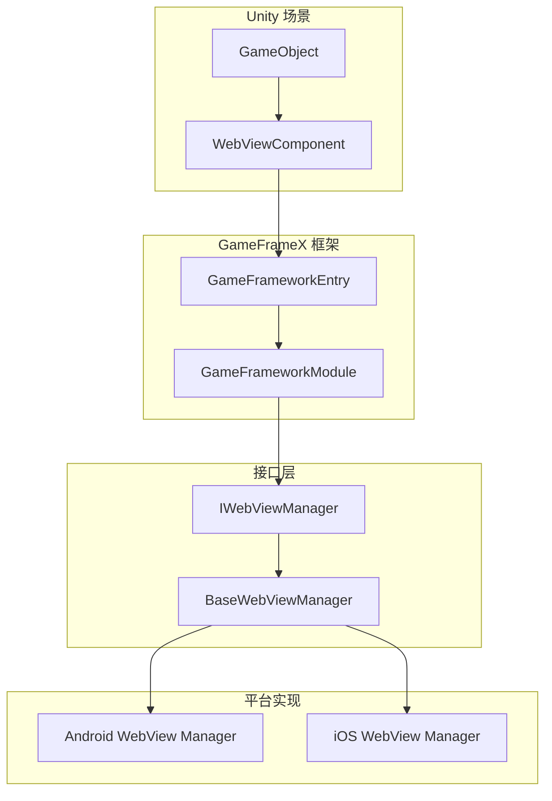
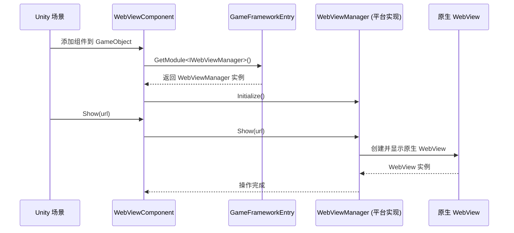

# よくある問題

このドキュメント收集了使用 GameFrameX WebView コンポーネント时〜の可能性があります遇到的常见問題及其解決策。

## Overview

GameFrameX WebView コンポーネントは Unity WebView カプセル化库，基于 [gree/unity-webview](https://github.com/gree/unity-webview) 実装。该コンポーネント采用インターフェース設計モード，通过 `IWebViewManager` インターフェース提供跨プラットフォーム的 WebView 機能。

> **注意**：本パッケージ仅提供 WebView 的インターフェース定義和 Unity コンポーネント，具体的プラットフォーム実装（如 Android/iOS WebView）〜する必要があります额外インストール对应的実装パッケージ。

## よくある問題与解決策

### 問題 1：WebView 不显示

#### 症状
追加 WebViewComponent 到シーン后，呼び出し `Show(url)` メソッド但 WebView 没有显示。

#### 〜の可能性があります原因
1. プラットフォーム実装パッケージ未インストール
2. WebViewManager 未正确初期化
3. URL フォーマット不正确

#### 解決策
```csharp
// 确保正确获取 WebViewComponent 实例
var webView = FindObjectOfType<WebViewComponent>();
if (webView != null)
{
    // 使用有效的 HTTPS URL
    webView.Show("https://gameframex.doc.alianblank.com");
}
else
{
    Debug.LogError("WebViewComponent 未在场景中找到！");
}
```

> Source: [WebViewComponent.cs](https://github.com/GameFrameX/com.gameframex.unity.webview/blob/main/Runtime/WebViewComponent.cs#L36-L49)

---

### 問題 2：Fatal: Web View manager is invalid

#### 症状
ランタイム控制台输出 `Log.Fatal("Web View manager is invalid.")` エラー。

#### 〜の可能性があります原因
1. **コア依赖パッケージ未インストール**：本コンポーネント依赖 `com.gameframex.unity` パッケージ
2. **プラットフォーム実装パッケージ缺失**：没有インストール对应プラットフォーム的 WebView 実装パッケージ
3. **モジュール登録失敗**：WebViewManager モジュール未正确登録到フレームワーク

#### 解決策

1. **インストールコア依赖パッケージ**：
   ```
   通过 Unity Package Manager 添加：https://github.com/gameframex/com.gameframex.unity.git
   ```

2. **インストールプラットフォーム実装パッケージ**：根据目标プラットフォームインストール对应的 WebView 実装パッケージ（もし存在）

3. **確認モジュール登録**：確認してください在游戏启动时正确初期化了 GameFrameX フレームワーク

---

### 問題 3：iOS/Android プラットフォーム WebView 空白

#### 症状
在 iOS 或 Android プラットフォーム上 WebView 显示为空白，页面无法ロード。

#### 〜の可能性があります原因
1. 网络权限未設定
2. HTTPS 证书問題
3. プラットフォーム特定設定缺失

#### 解決策

**对于 iOS**：
- 在 `Info.plist` 中追加网络权限：
```xml
<key>NSAppTransportSecurity</key>
<dict>
    <key>NSAllowsArbitraryLoads</key>
    <true/>
</dict>
```

**对于 Android**：
- 確認してください在 `AndroidManifest.xml` 中追加了 Internet 权限：
```xml
<uses-permission android:name="android.permission.INTERNET" />
```

---

### 問題 4：JavaScript 交互无响应

#### 症状
呼び出し `ExecuteJavaScript()` メソッド后，JavaScript コード没有执行或没有效果。

#### 〜の可能性があります原因
1. WebView 未完全ロード
2. JavaScript コード语法エラー
3. 呼び出し时机过早

#### 解決策
```csharp
// 建议在 WebView 加载完成后再执行 JavaScript
// 可以通过订阅事件来监听加载完成状态
var webView = FindObjectOfType<WebViewComponent>();
webView.Show("https://example.com");

// 延迟执行 JavaScript，确保页面已加载
Invoke(nameof(ExecuteCustomJavaScript), 2.0f);

void ExecuteCustomJavaScript()
{
    webView.ExecuteJavaScript("console.log('Hello from Unity!');");
}
```

> Source: [WebViewComponent.cs](https://github.com/GameFrameX/com.gameframex.unity.webview/blob/main/Runtime/WebViewComponent.cs#L59-L66)

---

### 問題 5：WebView 全屏显例外

#### 症状
呼び出し `MakeFullScreen()` メソッド后，WebView 显示位置或大小不正确。

#### 解決策
```csharp
var webView = FindObjectOfType<WebViewComponent>();
webView.Show("https://example.com");
// 等待页面加载完成后，再设置为全屏
Invoke(nameof(MakeFullScreen), 1.0f);

void MakeFullScreen()
{
    webView.MakeFullScreen();
}
```

> Source: [WebViewComponent.cs](https://github.com/GameFrameX/com.gameframex.unity.webview/blob/main/Runtime/WebViewComponent.cs#L54-L57)

---

### 問題 6：多个 WebView インスタンス冲突

#### 症状
シーン中有多个 WebViewComponent 时，出现显示混乱或イベント错乱。

#### 解決策
- お勧めシーン中只保留一个 WebViewComponent インスタンス
- 使用单例モード管理 WebView：
```csharp
public class WebViewManager : MonoBehaviour
{
    private static WebViewManager _instance;
    public static WebViewManager Instance => _instance;
    
    private WebViewComponent _webView;
    
    private void Awake()
    {
        _instance = this;
        _webView = GetComponent<WebViewComponent>();
    }
    
    public void ShowWebView(string url)
    {
        _webView.Show(url);
    }
}
```

---

### 問題 7：Unity エディタ中无法テスト

#### 症状
在 Unity エディタモード下运行，WebView 不显示或报错。

#### 原因説明
WebView 機能〜する必要があります在真机或对应プラットフォーム的模拟器上テスト，Unity エディタ本身不サポート原生 WebView 显示。

#### 解決策
- 将プロジェクトビルド到目标プラットフォーム（iOS/Android）进行テスト
- 使用プラットフォーム相关的模拟器

---

## 診断ステップ

### 基本診断フロー

```mermaid
flowchart TD
    Start([开始诊断]) --> Step1{控制台有错误?}
    Step1 -->|是| Step2{错误信息为"Web View manager is invalid"?}
    Step1 -->|否| Step3{检查代码调用}
    
    Step2 -->|是| Step4[检查核心依赖包]
    Step2 -->|否| Step5[根据具体错误排查]
    
    Step4 --> Step6{依赖包已安装?}
    Step6 -->|否| Step7[安装 com.gameframex.unity]
    Step6 -->|是| Step8[检查平台实现包]
    
    Step7 --> Step9[重新构建项目]
    Step8 --> Step9
    Step9 --> End1([结束])
    
    Step3 --> Step10{URL 有效?}
    Step10 -->|否| Step11[使用有效 HTTPS URL]
    Step10 -->|是| Step12[检查平台权限配置]
    
    Step5 --> End1
    Step11 --> End1
    Step12 --> End1
```

### デバッグ確認清单

| 確認项 | 操作メソッド |
|--------|----------|
| コアパッケージ依赖 | 確認 Package Manager 中是否インストール `com.gameframex.unity` |
| シーン設定 | 確認 GameObject 上正确追加了 WebViewComponent |
| コード呼び出し | 確認在 Start() 或之后呼び出し Show() メソッド |
| URL 有效性 | 確認使用有效的 HTTPS URL |
| プラットフォーム权限 | 確認各プラットフォーム的权限設定ファイル |
| イベント监听 | 追加イベント监听確認是否有エラーイベントトリガー |

---

## アーキテクチャ説明

### コンポーネント关系



### ワークフロー



---

## 関連リンク

- [概要](./1-overview) - WebView コンポーネント概要与機能介绍
- [インストール](./2-installation) - 詳細インストールガイド
- [快速入门](./3-getting-started) - 快速开始使用 WebView
- [API リファレンス](./4-api-reference) - 完全な的 API メソッド説明
- [プラットフォーム設定](./5-platforms) - 各プラットフォーム特定設定説明
- [イベント系统](./6-events) - WebView イベント系统详解
- [GameFrameX コアフレームワーク](https://github.com/GameFrameX/com.gameframex.unity) - コアフレームワークリポジトリ
- [gree/unity-webview](https://github.com/gree/unity-webview) - 原始 WebView プラグイン
