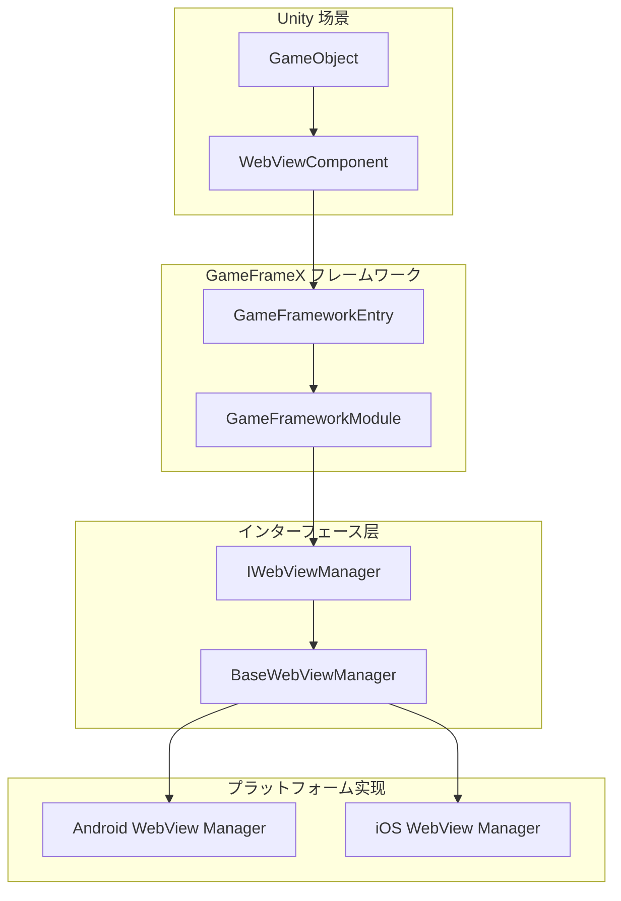
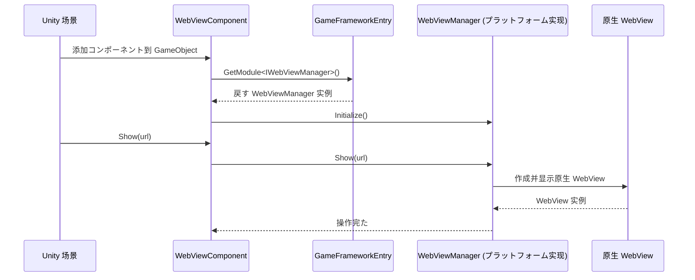

# よくある

ドキュメントた GameFrameX WebView コンポーネントのよくある。

## Overview

GameFrameX WebView コンポーネントは Unity WebView ，にづく [gree/unity-webview](https://github.com/gree/unity-webview) 。コンポーネントインターフェース，をじて `IWebViewManager` インターフェースプラットフォームの WebView 。

> ****： WebView のインターフェースと Unity コンポーネント，のプラットフォーム（ Android/iOS WebView）インストールの。

## よくあると

###  1：WebView 

#### 
 WebViewComponent ，びし `Show(url)` メソッド WebView 。

#### 
1. プラットフォームインストール
2. WebViewManager 
3. URL 

#### 
```csharp
// 确保正确获取 WebViewComponent 实例
var webView = FindObjectOfType<WebViewComponent>();
if (webView != null)
{
    // 使用有效の HTTPS URL
    webView.Show("https://gameframex.doc.alianblank.com");
}
else
{
    Debug.LogError("WebViewComponent 未に场景中找到！");
}
```

> Source: [WebViewComponent.cs](https://github.com/GameFrameX/com.gameframex.unity.webview/blob/main/Runtime/WebViewComponent.cs#L36-L49)

---

###  2：Fatal: Web View manager is invalid

#### 
 `Log.Fatal("Web View manager is invalid.")` エラー。

#### 
1. **コアインストール**：コンポーネント `com.gameframex.unity` 
2. **プラットフォーム**：インストールプラットフォームの WebView 
3. **モジュール**：WebViewManager モジュールフレームワーク

#### 

1. **インストールコア**：
   ```
   を通じて Unity Package Manager 添加：https://github.com/gameframex/com.gameframex.unity.git
   ```

2. **インストールプラットフォーム**：プラットフォームインストールの WebView （に）

3. **モジュール**：にゲームた GameFrameX フレームワーク

---

###  3：iOS/Android プラットフォーム WebView 

#### 
に iOS  Android プラットフォーム WebView ，ロード。

#### 
1. ネットワーク
2. HTTPS 
3. プラットフォーム

#### 

** iOS**：
- に `Info.plist` ネットワーク：
```xml
<key>NSAppTransportSecurity</key>
<dict>
    <key>NSAllowsArbitraryLoads</key>
    <true/>
</dict>
```

** Android**：
- に `AndroidManifest.xml` た Internet ：
```xml
<uses-permission android:name="android.permission.INTERNET" />
```

---

###  4：JavaScript レスポンス

#### 
びし `ExecuteJavaScript()` メソッド，JavaScript コード。

#### 
1. WebView ロード
2. JavaScript コードエラー
3. びし

#### 
```csharp
// 建议に WebView ロード完た后再実行 JavaScript
// 可能を通じて订阅イベント来监听ロード完た状態
var webView = FindObjectOfType<WebViewComponent>();
webView.Show("https://example.com");

// 延迟実行 JavaScript，确保页面已ロード
Invoke(nameof(ExecuteCustomJavaScript), 2.0f);

void ExecuteCustomJavaScript()
{
    webView.ExecuteJavaScript("console.log('Hello from Unity!');");
}
```

> Source: [WebViewComponent.cs](https://github.com/GameFrameX/com.gameframex.unity.webview/blob/main/Runtime/WebViewComponent.cs#L59-L66)

---

###  5：WebView 

#### 
びし `MakeFullScreen()` メソッド，WebView 。

#### 
```csharp
var webView = FindObjectOfType<WebViewComponent>();
webView.Show("https://example.com");
// 等待页面ロード完た后，再設定为全屏
Invoke(nameof(MakeFullScreen), 1.0f);

void MakeFullScreen()
{
    webView.MakeFullScreen();
}
```

> Source: [WebViewComponent.cs](https://github.com/GameFrameX/com.gameframex.unity.webview/blob/main/Runtime/WebViewComponent.cs#L54-L57)

---

###  6： WebView 

#### 
 WebViewComponent ，イベント。

#### 
-  WebViewComponent 
- シングルトン WebView：
```csharp
public class WebViewManager : MonoBehaviour
{
    private static WebViewManager _instance;
    public static WebViewManager Instance => _instance;
    
    private WebViewComponent _webView;
    
    private void Awake()
    {
        _instance = this;
        _webView = GetComponent<WebViewComponent>();
    }
    
    public void ShowWebView(string url)
    {
        _webView.Show(url);
    }
}
```

---

###  7：Unity エディターテスト

#### 
に Unity エディター，WebView 。

#### 
WebView にプラットフォームのテスト，Unity エディターサポート WebView 。

#### 
- プロジェクトビルドプラットフォーム（iOS/Android）テスト
- プラットフォームの

---

## ステップ

### フロー

```mermaid
flowchart TD
    Start([開始诊断]) --> Step1{控制台有エラー?}
    Step1 -->|は| Step2{エラー信息为"Web View manager is invalid"?}
    Step1 -->|否| Step3{检查コード呼び出し}
    
    Step2 -->|は| Step4[检查コア依赖包]
    Step2 -->|否| Step5[根据具体エラー排查]
    
    Step4 --> Step6{依赖包已インストール?}
    Step6 -->|否| Step7[インストール com.gameframex.unity]
    Step6 -->|は| Step8[检查プラットフォーム实现包]
    
    Step7 --> Step9[重新ビルドプロジェクト]
    Step8 --> Step9
    Step9 --> End1([終た])
    
    Step3 --> Step10{URL 有效?}
    Step10 -->|否| Step11[使用有效 HTTPS URL]
    Step10 -->|は| Step12[检查プラットフォーム权限設定]
    
    Step5 --> End1
    Step11 --> End1
    Step12 --> End1
```

### デバッグ

|  | メソッド |
|--------|----------|
| コア |  Package Manager はインストール `com.gameframex.unity` |
|  |  GameObject た WebViewComponent |
| コードびし | に Start() びし Show() メソッド |
| URL  | の HTTPS URL |
| プラットフォーム | プラットフォームのファイル |
| イベント | イベントはエラーイベント |

---

## アーキテクチャ

### コンポーネント



### フロー



---

## リンク

- [](./1-overview) - WebView コンポーネントと
- [インストール](./2-installation) - インストールガイド
- [クイックスタート](./3-getting-started) - クイックスタート WebView
- [API リファレンス](./4-api-reference) - の API メソッド
- [プラットフォーム](./5-platforms) - プラットフォーム
- [イベント](./6-events) - WebView イベント
- [GameFrameX コアフレームワーク](https://github.com/GameFrameX/com.gameframex.unity) - コアフレームワークリポジトリ
- [gree/unity-webview](https://github.com/gree/unity-webview) -  WebView 
